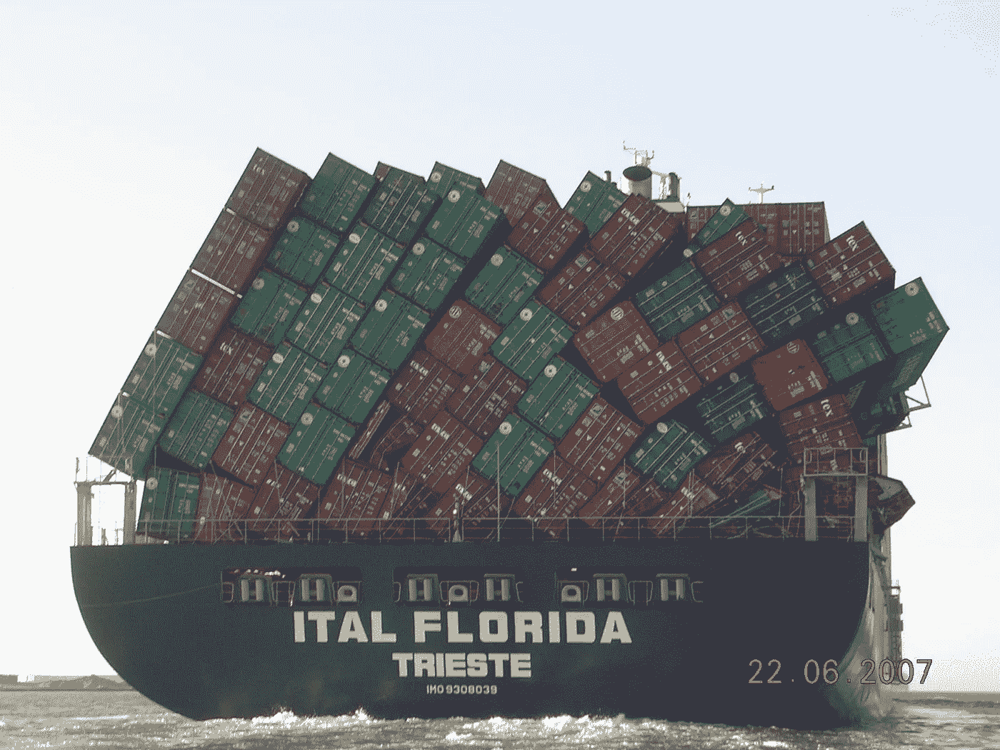

# 不要忽视。dockerignore

> 原文：<https://medium.com/hackernoon/do-not-ignore-dockerignore-47f5fb67b448>

> ***提示:*** *考虑为您正在构建的每个*[*Docker*](https://hackernoon.com/tagged/docker)*映像定义并使用* `*.dockerignore*` *文件。它可以帮助您减少 Docker 图像大小，加速* `*docker build*` *和避免意外的秘密曝光。*



## Docker 构建上下文

`docker build`命令用于构建一个新的 Docker 映像。有一个参数可以传递给`build`命令**构建上下文**。

*那么，什么是 Docker* ***构建上下文*** *？*

首先，请记住，Docker 是一个客户端-服务器应用程序，它由 Docker 客户端和 Docker 服务器(也称为*守护进程*)组成。Docker 客户端命令行工具与 Docker 服务器对话，并要求它做事情。其中之一就是**构建**:构建一个新的 Docker 形象。Docker 服务器可以运行在与客户端、远程机器或虚拟机相同的机器上，也可以是本地的、远程的或者甚至运行在一些云 IaaS 上。

为什么这很重要，Docker ***如何构建上下文*** *与这个事实相关？*

为了创建一个新的 Docker 镜像，Docker 服务器需要一个访问文件，你要从这个文件中创建 Docker 镜像。因此，您需要以某种方式将这些文件发送到 Docker 服务器。这些文件是 Docker **构建上下文**。Docker 客户端将所有**构建上下文**文件打包到`tar`档案中，并将该档案上传到 Docker 服务器。默认情况下，客户端将获取当前工作目录中的所有文件(和文件夹)，并将它们用作**构建上下文**。它还可以接受已经创建的`tar`档案或`git`存储库。在使用`git`存储库的情况下，客户端将把它与子模块克隆到一个临时文件夹中，并从其中创建一个**构建上下文**档案。

# 对 Docker 构建的影响

您看到的运行`docker build`命令的第一个输出行是:

```
Sending build context to Docker daemon 45.3 MB Step 1: FROM ...
```

这应该能把事情说清楚。实际上，**每次**您运行`docker build`命令时，Docker 客户端都会创建一个新的**构建上下文**档案，并将其发送到 Docker 服务器。因此，您总是要支付这笔“税”:创建归档所需的时间、存储和网络流量以及延迟时间。

> ***提示:*******经验法则*** *不会将文件添加到* ***构建上下文*** *中，如果您的 Docker 映像中不需要它们的话。**

# *的。dockerignore 文件*

*`.dockerignore`文件是一个工具，它可以帮助你定义你真正需要的 Docker **构建上下文**。使用这个文件，您可以为文件和文件夹指定**忽略规则**和这些规则的**例外**，这些文件和文件夹不会包含在**构建上下文**中，因此不会打包到档案中并上传到 Docker 服务器。*

# *你为什么要在乎？*

*的确，你为什么要在乎呢？今天的电脑速度很快，网络也相当快(希望如此)，存储也很便宜。所以，这个“税”可能没那么大吧？我会试着说服你，你应该在乎。*

## *原因#1: Docker 图像尺寸*

*最近，[软件开发的世界](https://hackernoon.com/tagged/software-development)正在向*连续交付*、*弹性基础设施*和*微服务架构*转移。*

*这有什么关系？*

*您的系统由多个组件(或*微服务*)组成，每个组件都运行在 Linux 容器中。可能有数十或数百个服务，甚至更多的服务实例。这些服务实例可以彼此独立地构建和部署，这可以针对**每一次代码提交**来完成。不仅如此，*弹性基础设施*意味着可以在系统中添加或删除新的计算节点，并且其微服务可以在节点之间移动，以支持规模或可用性要求。这意味着，您的 Docker 图像将被频繁地构建和传输。*

*当您实践连续交付和微服务架构时，映像大小和映像构建时间**确实很重要**。*

## *原因 2:意外的机密泄露*

*不控制您的**构建上下文**，也会导致您的代码、提交历史和秘密(密钥和凭证)的意外暴露。*

*如果您使用`ADD .`或`COPY .`命令将文件复制到您的 Docker 映像中，您可能会无意中将您的源文件、整个`git`历史(一个`.git`文件夹)、秘密文件(如`.aws`、`.env`、私钥)、缓存和其他文件不仅包括到 Docker **构建上下文**中，还包括到最终的 Docker 映像中。*

*DockerHub 上目前有多个 Docker 图片，这些图片公开了应用程序源代码、密码、密钥和凭证(例如 [Twitter Vine](http://thehackernews.com/2016/07/vine-source-code.html) )。*

## *原因 Docker 构建——缓存失效*

*一种常见的模式是使用如下指令将应用程序的整个代码库注入到映像中:*

```
*COPY . /usr/src/app*
```

*在本例中，我们将整个****构建上下文**复制到图像中。理解这一点也很重要，每个 Dockerfile 命令都会生成一个新层。因此，如果在整个构建上下文中任何包含的文件发生变化，这种变化将使`COPY . /opt/myapp`层的构建缓存无效，并且在下一个构建中将生成一个新的图像层。***

***如果您的工作目录包含频繁更新的文件(日志、测试结果、git 历史、临时缓存文件等等)，您将为每次`docker build`运行重新生成该层。***

# ***`.dockerignore`语法***

***`.dockerignore`文件类似于`gitignore`文件，由`git`工具使用。与`.gitignore`文件类似，它允许您指定 Docker 客户端在生成**构建上下文**时应该忽略的文件和文件夹的模式。虽然用于描述**忽略模式**的`.dockerignore`文件语法与`.gitignore`相似，但并不相同。***

***`.dockerignore`模式匹配语法基于 Go `filepath.Match()`函数，包括一些附加功能。***

***下面是`.dockerignore`的完整语法:***

```
***pattern: { term } term: '*' matches any sequence of non-Separator characters '?' matches any single non-Separator character '[' [ '^' ] { character-range } ']' character class (must be non-empty) c matches character c (c != '*', '?', '\\', '[') '\\' c matches character c character-range: c matches character c (c != '\\', '-', ']') '\\' c matches character c lo '-' hi matches character c for lo <= c <= hi additions: '**' matches any number of directories (including zero) '!' lines starting with ! (exclamation mark) can be used to make exceptions to exclusions '#' lines starting with this character are ignored: use it for comments***
```

*****注意:**使用`!`字符相当棘手。它与带有`!`字符的行之前和之后的模式的组合可用于创建更高级的规则。***

# ***例子***

```
***# ignore .git and .cache folders .git .cache# ignore all *.class files in all folders, including build root **/*.class# ignore all markdown files (md) beside all README*.md other than README-secret.md *.md !README*.md README-secret.md***
```

# ***然后***

***希望这篇文章对你有用。我期待您的评论和任何问题。***

****原载于* [*Codefresh.io 博客*](https://codefresh.io/blog/not-ignore-dockerignore/)***

***[](http://bit.ly/HackernoonFB)******[](https://goo.gl/k7XYbx)******[](https://goo.gl/4ofytp)***

> ***[黑客中午](http://bit.ly/Hackernoon)是黑客如何开始他们的下午。我们是 [@AMI](http://bit.ly/atAMIatAMI) 家庭的一员。我们现在[接受投稿](http://bit.ly/hackernoonsubmission)并乐意[讨论广告&赞助](mailto:partners@amipublications.com)机会。***
> 
> ***如果你喜欢这个故事，我们推荐你阅读我们的[最新科技故事](http://bit.ly/hackernoonlatestt)和[趋势科技故事](https://hackernoon.com/trending)。直到下一次，不要把世界的现实想当然！***

******