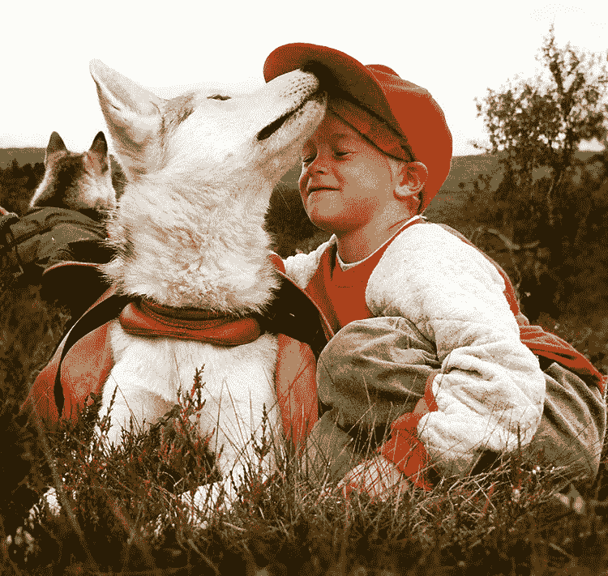
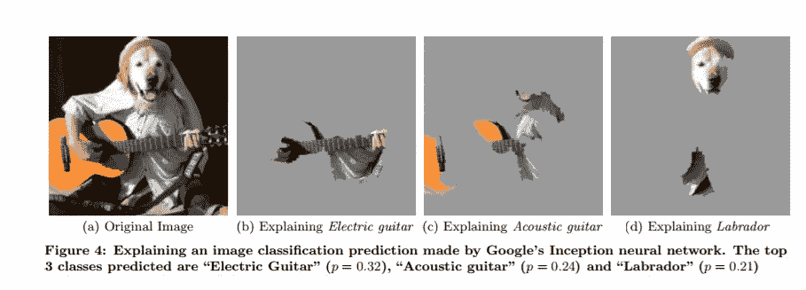
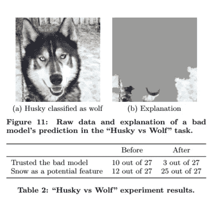
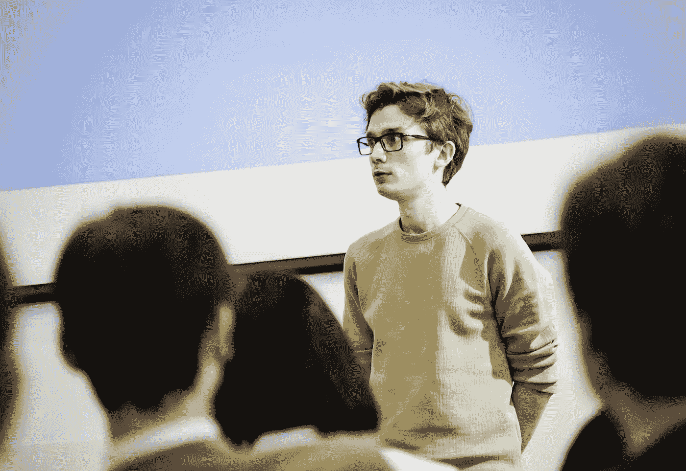
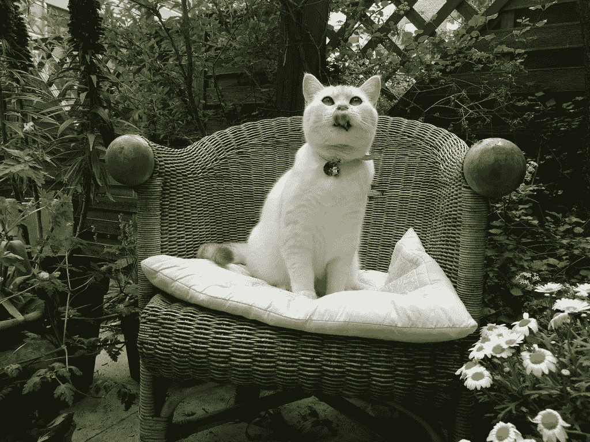

# 狗、狼、数据科学，以及为什么机器必须像人类一样学习

> 原文：<https://medium.com/hackernoon/dogs-wolves-data-science-and-why-machines-must-learn-like-humans-do-41c43bc7f982>

我们生活在一个机器正在学习区分狗和狼的世界。现在，一个机器人知道不要抚摸狼！我们一会儿会回到这个话题。

现在，让我们介绍一下 Evgeniy，他是 [VEON](https://medium.com/veon-careers) 的高级数据科学家。在我们的采访中，我们谈论了很多牛逼的事情(包括狗和狼！).我们开始吧。

# 你拥有莫斯科国立罗蒙诺索夫大学数学建模专业的博士学位。是什么让你进入统计学领域的？

是的，我的论文涉及非负矩阵分解。我猜我对统计学的兴趣源于年轻时开始编程。我一直喜欢分析和创造。

但是我的统计之旅真正开始于和我朋友的一个玩笑。我们都知道统计学是一门超级复杂的学科，所以我们申请只是为了看看会发生什么。我们都被录取了，并决定去做。事实证明我们热爱这片土地。

> 这一切发生的方式很有趣。我真的很喜欢使用统计模型，尤其是涉及真实数据的时候。放学后，当我分析医学和生物学研究的数据时，我意识到这是我的方向。一个简单的笑话最终成为我一生的追求！

# 我们讨论了很多学习、研究和分析。现在人工智能时代已经开始，你有什么见解可以帮助你成功地驾驭这个新世界？

这是一个令人兴奋的世界。像 T2 这样的神经网络无处不在。神经网络被设计成像人脑一样学习，但我们必须小心。**这并不是因为我害怕机器接管这个星球。相反，我们必须确保机器能够正确学习。**

 [## [1602.04938]“我为什么要相信你？”:解释任何分类器的预测

### 摘要:尽管被广泛采用，机器学习模型仍然主要是黑箱。了解原因…

arxiv.org](https://arxiv.org/abs/1602.04938) 

我脑海中经常浮现的一个例子是一个神经网络如何学会区分狗和狼。它没有学习狗和狼的区别，而是学习了它们图片中狼在雪地上，狗在草地上。它学会了通过观察雪和草来区分这两种动物。很明显，网络学习错误。如果狗在雪地上，狼在草地上会怎么样？那就错了。

# 所以你认为必须对这些机器的学习方式给予极大的关注，对吗？

绝对的。这非常重要。我不是说能够区分狗和狼不重要，但是神经网络有能力做非常重要的事情。

 [## Picasso:CNN 的免费开源可视化工具

### 多云，可能有坦克

medium.com](/merantix/picasso-a-free-open-source-visualizer-for-cnns-d8ed3a35cfc5) 

有这样一个例子:一支军队使用神经网络来区分伪装的坦克和平原森林。问题是坦克的照片是在阴天拍摄的，而森林的照片是在晴天拍摄的。神经网络成功通过了所有测试，但它只是区分云和太阳，而不是坦克和森林。它学会了区分两者的错误方法。

By sequentially blocking out parts of the image, we can tell which regions are more important to classification. This image was classified by the [VGG16](http://www.robots.ox.ac.uk/~vgg/research/very_deep/) model, with a 94% classification probability of “tank.” Bright parts of the image correspond to higher probability of the given classification. For instance, **the sky regions are very bright because occluding the sky doesn’t affect the probability of this image being classified as a tank.** And conversely, the tank tread regions are darker because without them, it’s hard to for the model to know if it’s looking at a tank.

在这两个例子中，模型都错误地适应了样本中的隐含偏差——这实际上经常发生(这里是[的另一个例子](https://hackernoon.com/algorithms-arent-racist-your-skin-is-just-too-dark-4ed31a7304b8))。这就是为什么我们理解一个模型如何做决定是很重要的。

**人工智能可以拯救生命，保护环境，全面帮助我们建设更美好的未来。显然，这项技术可能会变得复杂，我们不仅要确保我们用它做的事情有价值，我们还必须谨慎处理它。**

点击了解我们所有的数据科学和工程职位

Meet Evgeniy!

# 你能告诉我们更多关于你大学毕业后的职业道路吗？

现在，我是 VEON 的[高级数据科学家之一，但是这个工作角色，数据科学家，在我开始的时候并不是一个常用的术语。你也可以称我为统计学家。](/veon-careers/meet-anton-a-data-scientist-at-vimpelcom-and-learn-about-the-endless-possibilities-of-data-54fd6a5c9e12)

> “所有数据科学家都遵循一条疯狂的职业道路。这就像一辆酷酷的过山车，穿越各种新领域——比如人工智能(AI)。”

在我的职业生涯中，我为研究机构处理医学研究数据。我为制药公司和连锁超市做过预算优化和时间序列预测。

在 VEON 之前，我在莫斯科为俄罗斯最大的搜索引擎 Yandex 工作。我专门在 Yandex 数据工厂工作，帮助外部客户利用数据取得更多成功。我想 Yandex 是我成为数据科学家的地方。

# 你有丰富的经验。一路走来，你学到了什么？

大学毕业后，我的工作一直是通过收集和分析数字和信息来学习和找到解决方案——这是最主要的一点。

我意识到的最大的事情是数据的力量。例如，在医学中，了解如何利用相关和因果关系的发现可以拯救生命。此外，我应该提到我对[因果图](https://en.wikipedia.org/wiki/Causal_graph)非常感兴趣，现在它在统计学中的应用越来越广泛。随着我们越来越善于发现因果关系，数据只会变得更加强大。

**也许很快成为一名数据科学家会和成为一名技术明星一样酷。我说过我喜欢电子音乐吗？我们来听一听:**

# 是什么让你加入了 VEON？

[VEON 是一家令人兴奋的公司](/veon-careers/why-you-should-join-veon-now-86f426dc2c36)，它正在经历一场令人难以置信的数字化转型。这里的文化允许大量的创造力。还有另外两个主要原因。

> 第一，VEON 坐拥大量数据。我正兴致勃勃地看着这一切。有很多丰富的东西，我学到了很多。我们可以通过多种方式利用这些数据来丰富客户的生活。

Evgeniy’s cat enjoying the garden

二、[阿姆斯特丹](https://www.lonelyplanet.com/the-netherlands/amsterdam)的位置真的很吸引我。这里很美。我喜欢看鸟儿在树上啁啾，我的猫享受花园，还有韦斯特公园的樱花。这座城市也有很好的工作生活平衡，这对我很重要。

[cherry blossoms in Westerpark](https://www.google.ru/maps/@52.3875291,4.8744818,3a,75y,97.83h,91.83t/data=!3m8!1e1!3m6!1s-sF0w4yoKRco%2FVwi637yajBI%2FAAAAAAAAuRc%2FPPg3C-a1dcYMMvBfqjOkrQJYF3wfPElLACLIB!2e4!3e11!6s%2F%2Flh6.googleusercontent.com%2F-sF0w4yoKRco%2FVwi637yajBI%2FAAAAAAAAuRc%2FPPg3C-a1dcYMMvBfqjOkrQJYF3wfPElLACLIB%2Fw203-h100-k-no-pi-14.999992-ya279.5-ro-0-fo100%2F!7i8704!8i4352)

# 我们听说你教了一门课。你能和我们分享一些细节吗？

实际上，我和我以前的同事为 Coursera 做了一个专业。它是关于机器学习和数据分析的，我专门教应用统计学。

我真的为这些课程感到自豪，因为我们超越了基本的东西，所以学生可以在现实世界中实际运用他们所学的东西。例如，我们探索像[多重假设测试](/veon-careers/how-to-work-hard-and-live-wonderfully-958111afb133)这样的高级事物，并使用真实的数据集。

# 工作之外，你都做些什么来获得灵感？

为了个人灵感，我读了很多关于统计学和数据科学的书。我喜欢的一本书是 [*《计算机时代统计推断*](https://web.stanford.edu/~hastie/CASI/) ，这本书向你展示了我们在数据世界的未来和未来。

 [## 计算机时代的统计推断:算法、证据和数据科学

### 21 世纪见证了统计方法在范围和影响上的惊人扩张。…

web.stanford.edu](https://web.stanford.edu/~hastie/CASI/) 

我还读了[罗伯·j·海曼的博客](https://robjhyndman.com/hyndsight/)。Hyndman 为时间序列预测编写了最好的 [R 包](https://robjhyndman.com/software/)，他对预测的建议和意见非常有价值。

我喜欢的另一个博客是弗朗西斯·x·迪堡写的，他是一位因迪堡-马里亚诺测试而闻名的计量经济学家。有时，他会写一些令人震惊的结果，但这些结果并未引起人们的注意(例如，条件均值最小化任何 Bregman 散度的证明，包括不对称的结果——这简直是胡说八道)。

 [## 没有犹豫

### 弗朗西斯·x·迪堡的博客

fxdiebold.blogspot.nl](http://fxdiebold.blogspot.nl/) 

总的来说，我了解统计学、机器学习、数据科学和其他相关学科的最新发展。我从科学期刊和数据科学邮件列表中阅读了许多新文章。

# 狗也喜欢雪

快速提问:你知道狗和狼的[区别](https://pethelpful.com/dogs/Differences-and-Similarities-Between-Dogs-and-Wolves)吗？

**反正你明白了。如果你想学点什么，那就用正确的方法学。机器也应该如此。**

希望叶甫盖尼的采访向你展示了学习和使用你所拥有的数据来达成真正解决方案的重要性，尤其是在这个令人惊叹的数字时代。这样，你将永远知道哪里有阳光，哪里有动物玩耍。