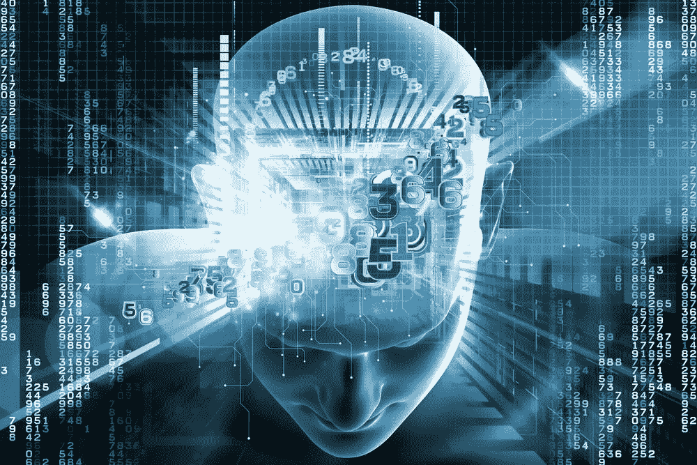

# 机器智能时代的教育和就业不足

> 原文：<https://medium.com/hackernoon/education-and-underemployment-in-the-age-of-machine-intelligence-b76086c577bf>

尽管目前的失业率仅为 5.0%，但许多经济学家承认，实际数字要高得多。事实上，根据[劳动统计局](http://www.macrotrends.net/1377/u6-unemployment-rate)(BLS)[U-6 比率](http://www.bls.gov/lau/stalt.htm) ( *总失业人数，加上所有勉强加入劳动力队伍的人，加上出于经济原因而兼职就业的总人数*)测算的就业不足率为 10%。如果我们把已经完全放弃找工作的人计算在内，这个数字还会更高。

**计算革命与就业不足** 当今美国持续*就业不足*的根本原因是什么？简而言之就是[技术](https://hackernoon.com/tagged/technology)。基于知识的社会正变得高度计算化。农业革命利用家养动物进行田园耕作，工业革命改造机器进行工厂生产，因此今天计算革命正在推动计算机增强机器智能。软件算法、计算机辅助设计、数据分析和机器学习一起开始破坏支撑后工业社会的制度和经济实践。随着这种“[计算知识经济](https://www.youtube.com/watch?v=9G_KhrCQI7U)”的扩展和成熟，它正在促进美国劳动力的深层结构变化。

鉴于美国经济的高生产率，我们有充分的理由为 T2 劳动力的未来担忧。例如，考虑劳动力参与的总体预测。[最近的数据](http://www.nytimes.com/interactive/2015/12/28/opinion/rattner-2015-year-in-charts.html?_r=0)表明，自 2009 年以来，平民劳动力参与率一直在下降。事实上，扣除通货膨胀因素，美国的工资自 20 世纪 70 年代中期以来就没有增长过。当然，技术并不是故事的全部。尽管工资水平保持不变，但过去 30 年创造的大部分财富都集中到了极少数精英手中。更直白地说，经济金字塔顶端的 1%现在拥有全世界一半的家庭财富。

**超越人力资本理论**
针对美国和其他经合组织国家内部日益加剧的不平等现象，总体政策反应一直是关注教育改革。教育被视为发展技术劳动力(人力资本)和扩大经济机会的关键。但是，尽管人力资本理论在短期内为教育改革提供了价值，但从长期来看，它对反思教育制度的价值可能较小。我们目前的人力资本战略没有考虑的关键问题是，技术的指数级进步是否会促进更新和更具创新性的劳动形式，或者只是完全包含人类劳动。正如像雷·库兹韦尔这样的思想家所说，机器智能最终可能会完全超越人类的认知能力。

展望未来，计算机和数字媒体的使用和应用似乎正在成为 21 世纪领先职业的基础。这为重大的长期创新留下了空间。事实上，尽管计算机擅长许多逻辑功能，但在需要灵活性和判断力的任务上，它们远不如人类高效或有效——至少目前如此。换句话说，即使计算机自动化了日常工作，它们也扩大了需要创造力、解决问题和社会协作的工作机会。

**为机器时代改造教育**
那么教育在机器智能时代的作用是什么？即使粗略地分析一下美国的教育改革，也可以发现，面对系统性的经济和社会变革，人们对改革教育体系深感忧虑。例如，我们已经痛苦地认识到，我们当前的教育体系不足以缓解我们可能很快面临的劳动力错位的规模。在我看来，当今美国教育改革最明显的问题是在一个需要风险和实验的时代错误地关注动员测量和一致性系统。潜在的问题是，“工厂学校”是从为不同时代设计的旧机构演变而来的。

超越工业时代的官僚体系，学生必须更好地准备利用自主创造力解决现实世界的问题。除了基本的算术和识字能力，建立在网络合作、数字流利性和创业创新基础上的高级能力现在是经济流动性的基础。换句话说，今天真正的挑战是改变构成学校教育的制度和教学结构。教育政策现在必须适应高度破坏性的计算经济的需求，而不是根据大众工业社会的需求来设计教育改革。

创造力、企业家精神和增强智能
正如我在最近的一本书《创意经济中的教育*中所说，事实是，将一套固定的基础知识和实践从专家转移到业余爱好者手中，正变得与一个日益受到创造力和创新驱动的社会相矛盾。如果现有文化体系内的能力是工业教育的目标，那么文化生产和文化体系的创造性转化应该是机器智能时代教育的目标。与社会再生产工厂不同，我们现在需要的是创新孵化器，它们建立在快速发展的增强智能实验之上。*

*正如许多教育决策者已经知道的那样，我们正处于一个转折点，计算正在将教育从一个“僵化的信息传输”系统转变为一个连接机器学习、企业协作和多媒体资源的交互式生态系统。在正规教育继续专注于灌输基本技能的地方，先进的计算技术现在需要善于创造性应用新知识的企业家。这包括将现实世界的问题解决作为“[知识构建](http://www.knowledge-building.org/)的更大连续体的一部分*

*事实上，这种教育变革的范围需要政府的大力领导，以及市场的大胆尝试。正如当前的[国家教育技术计划](http://tech.ed.gov/files/2015/12/NETP16.pdf)所解释的，教育的未来需要更加关注游戏和沉浸式模拟。简而言之，如果我们真的想改革美国的教育体系，以减少就业不足和扩大创业能力，那么我们需要制定教育政策，努力弥合人类和机器的智能。*

*   *这篇文章最初发表在布鲁金斯学会。*

******

> *[黑客中午](http://bit.ly/Hackernoon)是黑客如何开始他们的下午。我们是 [@AMI](http://bit.ly/atAMIatAMI) 家庭的一员。我们现在[接受投稿](http://bit.ly/hackernoonsubmission)，并乐意[讨论广告&赞助](mailto:partners@amipublications.com)机会。*
> 
> *如果你喜欢这个故事，我们推荐你阅读我们的[最新科技故事](http://bit.ly/hackernoonlatestt)和[趋势科技故事](https://hackernoon.com/trending)。直到下一次，不要把世界的现实想当然！*

**