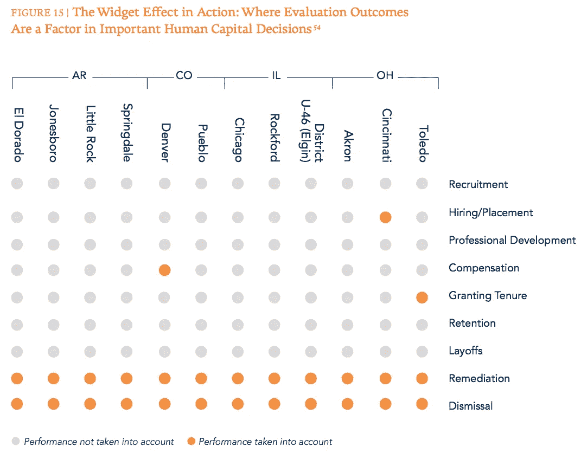

# 有效反馈

> 原文：<https://medium.com/hackernoon/effective-feedback-73bb0ea32874>

本周三大收获:

1.  达成交易时要小心。如果你说“是的，好吧，如果你完成了讲义，我会给你一些胶带来固定你的鞋带”，然后你忘了拿胶带，准备好愤怒吧。
2.  中学生精力充沛。如果你不提供引导这种能量的方法，你最终至少会弄翻一张桌子。
3.  比报复心强或过于活跃的八年级学生更可怕的是你自己无意识的偏见。单纯根据手头的信息来诊断学生缺乏参与是很困难的；基于偏见这样做要容易得多。

在我的上一篇文章中，我关注的是教师培训和发展。总的来说，我认为获得反馈是其中很重要的一部分。但是我意识到我的收件箱里有一封积满灰尘的邮件，里面装满了课堂观察的反馈。虽然我确实读了这封邮件，但我并没有对大部分反馈采取行动。这很奇怪，考虑到我的冒险经历朵拉试图理解如何提高 T2 的学习能力。但这归结为一个主要原因:反馈太普通了，我感觉不到有用或可行，也就是说，建议我采用技巧[“不要谈论”](https://tlaconline.com/training/view/1489)，而没有解决一个非常现实的可能性，即如果我在全班同学全神贯注之前停止讲话，我可能永远不会再讲话了。反馈需要比这更个性化。

在实际的教师-学校环境中，进行反馈对话存在固有的困难。在任何经理和员工的讨论中都有一种阻碍有效沟通的权力动态。老师们可能会在拒绝反馈或主动提出新的学习方法时感到威胁。管理人员可能会对挑战他们的权威和教师之间来之不易的一致感到威胁。

正如卡内基基金会的一项研究所描述的，还有很多其他的问题:

*   反馈很少给出，而且仅仅基于一天中的一小部分。这给老师施加了不适当的“执行”压力，不具有代表性。(经合组织的这项研究凸显了各国之间的反馈是多么的少。)
*   围绕反馈目的的期望不明确。目的是审判我吗？真的是为了帮助我成为更好的老师吗？如果我不同意你的评估，会有什么后果？
*   值得注意的是，在这项研究中，很少有教师能够回忆起一个具体的反馈来帮助他们提高。

其中有一些其实相对容易解决。华盛顿特区的一所学校致力于定期(而非偶尔)反馈，并在这里记录了结果。所使用的方法在反击上述一些问题时是一致的。课堂观察从一年 20 次增加到 40 次。观察者和老师都带着共同制定的目标和成长领域进行观察。反馈的结构包括要考虑的开放式问题和下节课要实施的可管理的具体建议。到年底，该校将标准化考试的熟练程度从 28%增长到 60%归功于这些变化。

如果你真的想增加反馈——我们可以听听比尔·盖茨的话，在每个教室里安装摄像头。(我的意思是，明确地说，我并不完全支持这一点——仅仅因为它对中国有效，并不意味着它对所有人都有效。)

但总的来说，我认为我们可以达成一致，如果你打算尝试使用反馈来促进职业发展，那么以支持和一致的方式这样做可能更好。更有争议的问题是如何向 T2 提供有用的反馈。在 2009 年[对 4 个州 12 个区的 15000 名教师进行的一项研究中:](https://tntp.org/assets/documents/TheWidgetEffect_2nd_ed.pdf)

*   一半的学区使用二元评级系统来评估教师:满意或不满意。我相当确定我在幼儿园的成绩比这更微妙。
*   4 名教师中有 3 名接受了评估，但没有收到关于有待改进领域的具体反馈。更令人担忧的是，43%的教师在最初四年的教学中没有收到关于改进领域的具体反馈。
*   在那些确定了发展领域的人中，不到一半的人接受了可行的后续改进措施。想象一下像“你需要在课堂上发挥更大的权威”这样的反馈，而没有任何这样做的步骤。

当然，管理人员可能选择私下进行发展讨论，以维持一种支持性的文化——然而，几乎一半接受调查的教师没有参与任何类型的与管理人员关于发展或反馈的谈话。因此，只有大约 40%的教师认为反馈有助于他们提高，这并不奇怪。

所有这一切中真正有趣的部分是，在公司中创新“绩效评估”实际上已经在科技界得到了相当多的行动。试试在 TechCrunch 上搜索一下，你就会明白我的意思了。 [Zugata](https://www.zugata.com/) 、[reflective](https://www.reflektive.com/)、 [Impraise](https://www.impraise.com/) 都是试图解决有效绩效反馈的相同问题的平台。更大的公司不断迭代改进他们的内部绩效评估系统，让他们不那么讨厌。然而，edu 的绩效评估似乎远远落后于企业背景下的基准水平。大多数评论都是在纸上完成的，几乎没有逐年记录，几乎没有实时反馈机制，评论中的细微差别非常低。那么，为什么不把企业界使用的工具应用到学校呢？

嗯，有几个原因可以解释为什么有上百万个用于师生交流的应用程序，但我只能找到一个[专门用于教师评估和反馈。谈到评估，有三个主要角色:教师、行政人员和州政府。提高学生成绩似乎应该是一个容易实现的目标——但这其中还有更多微妙之处。想象一下，一个学生在新的一年开始时数学成绩很低，对学校的态度很糟糕，然后在新的一年结束时行为问题较少，数学成绩也同样很低。](http://whetstoneeducation.com)

典型的评估会把这个学生的进步视为等同于一个学生在一年结束时没有任何变化。但是老师们知道成长不仅仅是数学考试中的一个数字。所以学生的进步不是那么容易衡量的，我认为这就是为什么许多系统用二元来评估老师，超过 90%的老师得到“满意”的评级。这是让各方都满意的最简单的解决方案。教师可以专注于教学，急于留住教师的行政人员不会冒险闹事，而州政府可以满足看起来处于控制中的需要。这意味着评估在大多数时候都是敷衍了事——我们实际上可以看到:

只有当涉及到停职或解雇时，评估才变得相关，因为解雇需要教学质量差的证据。特别要注意的是，在“职业发展”、“保留”和“任期”这几行中，绩效根本没有被考虑在内。这意味着评估会带来严重的负面影响(甚至比在公司环境中更严重)。由于现在的评估是如此的积极，任何改变都有可能导致教师获得更低的评分——这使得进步变得困难。

相比之下，在公司工作场所的绩效评估中表现出色会带来奖金和晋升，而且影响也更容易衡量。不过，我不认为差异如此之大，以至于类似的工具不能通过正确的细微差别进行扩展。我的意思是，至少，我们能得到一些基本的数字化反馈吗？我不是指填写一个 Word 文档，然后保存到标准的 Google Drive 或服务器文件夹中。也许这里有更多我没有得到的，所以希望通过本周与实际管理员的聊天来获得一些见解。