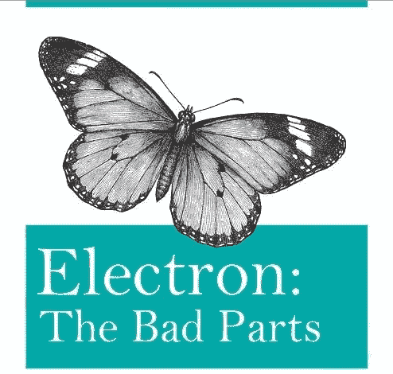
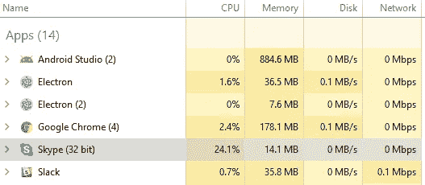
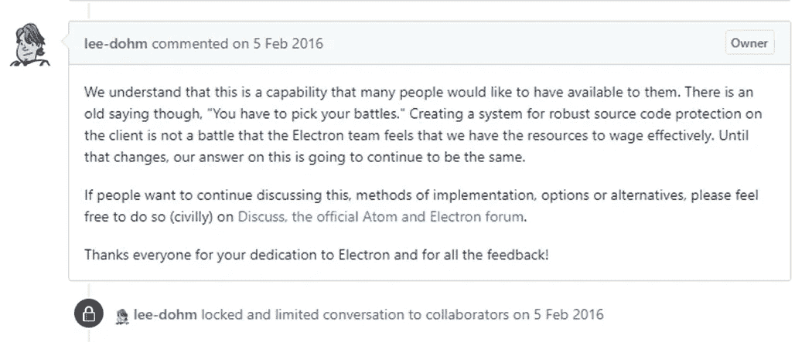

# 🦋电子:坏的部分

> 原文：<https://medium.com/hackernoon/electron-the-bad-parts-2b710c491547>

大多数跨平台编程语言和框架包含好的和坏的部分。电子可能有更多的好处——但在其闪亮的外表下也隐藏着一些黑暗的秘密。



虽然对 Electron 的第一印象可能是它解决了与跨平台开发相关的所有问题，但现实是许多东西不能开箱即用，而且它们可能不能。我花了相当长的时间来理解这一点，甚至花了更多的时间，直到我有了所有的 DIY 解决方案，为用户提供正确的安装程序，更新，反馈机制等东西。


This list of features on the Electron webpage is setting high expectations

我是一个电子迷，我认为下面的列表对刚接触这个话题的人会很有帮助。但是评估不同堆栈并希望避免“意外”的项目经理也应该从中受益。这个列表列出了开始时不完全清楚的事情。在做出决定和长期承诺之前，值得花一些额外时间进行评估的事情。

# 安装人员

一旦编码结束，发布计划开始，第一个艰难的决定就是等待。可以使用电子文档中描述的安装和更新机制，也可以使用最好的构建工具之一(电子构建工具)推荐的安装和更新机制。


[官方电子文档](https://electron.atom.io/docs/api/auto-updater/)建议松鼠(Windows 和 Mac)安装程序和内置自动更新程序。一个开源的[发布服务器(“Nuts”)](https://github.com/GitbookIO/nuts)是可用的，它处理更新和发布的服务器端管理。

另一个选择是[电子制造商自己的更新机制](https://www.electron.build/auto-update)“电子更新器”。它基于已建立的 NSIS 安装程序(Windows)和普通的旧 mac 包。电子构建器使用这种方法作为所有生成的安装程序的默认设置。

> [“坦白地说，考虑到电子项目仍然推荐 Squirrel 用于 Windows，默认切换到 NSIS 似乎是一个非常激烈的举动。”](https://github.com/electron-userland/electron-builder/issues/837)

电子工程和电子建造工程在哪个解决方案更好的问题上分歧很大。这导致了一个棘手的情况，开发人员必须在一个官方解决方案(许多人认为它复杂且不够灵活)和一个具有内置工具支持的简单而强大的解决方案之间做出决定。就个人而言，我认为如果你真的打算向全世界数百万人提供你的软件安装，而你不知道从哪里开始，那么 electronic-builder 是一个福音。它可以为你节省几周甚至几个月的开发时间，我认为它是生态系统的重要组成部分。

以下是电子建造商/电子更新商文件中的一系列优点，在选择一个解决方案之前应该考虑这些优点:

*   它不需要专门的发布服务器。
*   不仅在 macOS 上，也在 Windows 上进行代码签名验证。
*   电子建设者生产和出版所有需要的元数据文件和文物。
*   所有平台都支持下载进度，包括 macOS。
*   [分阶段推出](https://www.electron.build/auto-update#staged-rollouts)支持所有平台，包括 macOS。
*   实际上，macOS 内部使用的是内置自动更新程序。
*   开箱即用支持不同的提供商(GitHub、Bintray、亚马逊 S3、通用 HTTP(s)服务器)。
*   你只需要两行代码就能让它工作。

# 持续集成(CI)和多平台构建

不要把电子和预装的“Java 虚拟机”混为一谈。你将不得不使(建立，签署，分发)你的应用程序跨平台。它不会“自动”跨平台。


[From the electron-builder documentation](https://www.electron.build/multi-platform-build)

这可能相当令人困惑和震惊，但是便宜和容易的多平台构建是一个神话。几乎具有讽刺意味的是，人们经常会发现“仅用于 Mac”或“仅用于 Windows”的“跨平台”电子应用程序。原因并不是为多个平台编写代码很复杂(Electron 处理得非常好，文档也很清楚)。原因很简单，许多开发人员没有足够的预算或获得其他硬件来进行测试和构建。更糟糕的是:如果你打算成为一名“合法开发者”，你的应用需要被签名，并且它可能有一个或多个本地依赖项。

在这些情况下，推荐的解决方案是为不同的 CI 提供者获取帐户:一个用于 Mac(和 Linux ),一个用于 Windows。为什么？因为苹果官方禁止使用他们的操作系统

*   在非 OS X 系统上的虚拟机中
*   在非苹果硬件上

结果是，如果你的应用程序是闭源的，那么为两个操作系统构建它的成本将是原来的两倍。如果金钱和复杂的构建系统不是问题，你仍然会遇到应用程序只能在多个系统上测试和构建的问题。目前还不能发货。例如，使用扩展验证(EV)代码签名证书对您的应用程序进行远程签名，对于所有现有的 CI 工具来说几乎是不可能的，因为您的证书绑定到了一个不能/不应该被转移的物理硬件令牌。

# 大小

每个应用程序都有自己的 Chromium 版本(2000 万 LOC，大约 30MB[打包的] Web 运行时),这是最受批评的方面之一。有趣的事实:如果你今天决定从头开始构建你自己的简化竞争对手版本，你可能需要[5099 年来构建](https://www.openhub.net/p/chrome/estimated_cost)。一些人试图[让电子节食](/dailyjs/put-your-electron-app-on-a-diet-with-electrino-c7ffdf1d6297)，批评者说它创造了一种在操作系统之上安装完整操作系统的感觉。每次都是。



not an issue

虽然许多人认为 Chromium 会大幅降低性能或“消耗宝贵的内存”,但我在实践中没有遇到过这种情况，也没有听到过成千上万测试用户的负面反馈。我想如果你习惯了 Chrome 浏览器在后台运行，这不是一个大问题。但是事情是这样的:

不只是装置捆绑铬。**每一次更新**也带有铬、Node 和所有其他电子元件，除非更新被设计为 delta 或 differential update。

# 增量更新

每个经历过 Windows 更新的人都知道更新很糟糕！但是他们不需要。更新可以引入很酷的新东西，不必中断工作流程，它们可以在后台发生，而不是阻止你的机器一个小时——我正在看着你微软。这🔑是“德尔塔更新”。不要卸载并重新安装所有的东西，只需要增量更新相关的部分。


The challenge: how to switch versions without the user noticing it (inspired by [Developing an Electron Edge](https://www.amazon.com/Developing-Electron-Edge-edge-Book-ebook/dp/B01G7TTKSK))

想象一下这个博客中的例子[:一个班级的学生正在试用一个软件，并且更新了 70MB。30 个人启动他们的电脑，得到一个更新。他们同时下载更新，产生 2.1GB。现在，将此与在后台处理的增量更新进行比较，增量更新的大小仅为 100KB，将最初的 2.1GB 减少到 3MB 总量。这将缩短每个学生等待更新写入磁盘、在下载后向系统注册的时间；它可以减轻服务器的负荷，节省带宽，节省成本，让学生和老师开心。](https://arcath.net/2016/11/squirrel-release-server/)

理论上，Squirrel 支持增量更新。截至上周，NSIS 的电子建造商也为此提供了一个测试版解决方案。然而，我不会说他们中的任何一个是现成的。

我正在开发的一个应用程序——[Autobeat Player](http://www.autobeatplayer.com/)——使用它自己的“delta”更新机制来更新**整个应用程序**。关键是:没有外部模块和库的整个应用程序只有大约 750KB(！)大小。每当我提到这一点，反应是无价的。考虑到应用程序的功能丰富性和复杂性，大多数人无法相信它的小尺寸。我将如何描述新一代的(电子)桌面应用程序，一个完整的桌面应用程序只有一张图片那么大。我们在 Autobeat 中实现更新的方式是直接的，没有火箭科学。

所有可以远程视为静态的东西都不是应用映像的一部分:jQuery、Font Awesome、Bootstrap 或所有其他前端库和任何节点模块**都不是应用**本身的一部分。

如果去掉不经常改变的东西，比如这些库，只更新应用程序逻辑部分——你实际上正在做的东西——大小减少 99.9%是完全可能的。但是，它需要定制的更新逻辑。没有可用的标准解决方案。好处:在 Autobeat 的情况下，我们可以整体更新应用程序，只要外部依赖关系不变(这种情况很少发生)。更新需要 1-2 秒钟，而且经常被忽视。这就像更新一个网站——刷新后看起来不一样了。无需担心增量计算错误或部件不能按预期一起工作。偶尔，我们会添加更多的依赖项，并且必须进行“完整的”31MB 更新。但是我们在这里做了一个长期的赌注，假设这些间隔变得越来越长，而我们的常规发布周期可以短到几个小时。每天，我们都在学习如何利用适用于网络的东西，以及如何将它们带到桌面上来更有效地发布。

# 安全性

如上所述的应用程序逻辑和库之间的分离打开了另一个非常强大的特性:它可能允许发布第二个应用程序，该应用程序共享相同的现有核心库，并且不需要安装另一个 Chromium 捆绑包，也不需要签署和分发新的安装程序。它创建了一个像超级浏览器一样的环境，支持 jQuery，Vue，Font Awesome，Polymer 和所有其他框架以及所有相关的开箱即用的节点模块，并最小化了应用程序的大小。想一想。

在最近的测试中，我们的团队成功推出了其他包装现有网站的“即时应用”(<1MB) in a distributed, P2P fashion in a fraction of a second. In the same way one would start apps on a Chromecast powered TV, it is also possible to remotely load apps on other machines. When I realized that we had just launched a fully featured desktop software from a web server running on a smartphone it partly felt like creating the next generation of decentralised apps and partly like the next generation of viruses.

In the same way that browsers are able to load any website, Electron potentially can load as many apps as it wants without the need to re-install the runtime over and over again. And the more the line between Web and desktop gets blurred, the more challenges we face as users to protect our machines and data.

Electron can also load websites just like any other browser. There are even tools like the extremely popular [nativefier](https://github.com/jiahaog/nativefier) )。这些“本地网站应用程序”可能会激活网络摄像头或麦克风，访问文件系统，根据需要创建、删除、加密内容，或者将内容发送到服务器——大多数时候这都是有意为之。最终，托管服务器成为一个巨大僵尸网络的命令和控制服务器。

> [**“一旦你获得了第一个百万用户，你的自动更新器基本上就是一个拥有百万节点的僵尸网络。**权力越大，责任越大。](https://blog.dcpos.ch/how-to-make-your-electron-app-sexy)

电子提供了许多保护机制:沙盒模型可以被激活，节点集成可以被关闭，预加载脚本和网络视图创建具有不同权限的本地环境...然而，我担心的是，这些桌面 web 应用程序的发展和分发速度比我们的旧安全模型更快。在一个网站可以在沙盒之外作为成熟的应用程序运行的世界里，像安装程序签名和可信机构这样的事情正在变得毫无意义。


“every time you download express, you favorite this exact tweet from Hot Pockets” — [satire by Jordan Scales](/friendship-dot-js/i-peeked-into-my-node-modules-directory-and-you-wont-believe-what-happened-next-b89f63d21558)

最近，我参加了一个来自一家资金雄厚的初创公司的讲座，该公司扫描和分析 npm 模块的漏洞，以便在开发人员集成它们之前警告他们。当我问他们是否会考虑桌面环境中的 npm 模块安全性时，回答是他们还没有考虑过，而且没有优先考虑。但是我们引用并安装在用户机器上的每个模块都有它自己的依赖项，我们最终会将用户的信任和权限分享给我们失去跟踪甚至经常不知道的模块。在一个像最近的 WannaCry 勒索软件这样的单一网络攻击可以产生高达 40 亿美元的财务影响的时代，我们正面临着全新的挑战。[当你读到流行的模块每次被](/friendship-dot-js/i-peeked-into-my-node-modules-directory-and-you-wont-believe-what-happened-next-b89f63d21558)安装后都会在后台转发热门口袋广告时，这变得尤其令人担忧。

# 代码保护

同样，我们想要保护用户，我们也可能想要保护我们自己和我们公司的工作。电子应用程序通常在 asar 容器文件中分发。从安装及其包含的 asar 文件中检索普通源代码非常简单:

`asar extract app.asar secret_source_code`

默认情况下，文件不会被混淆、加密或保护，这意味着想要修改应用程序的人几乎可以收到存储库的工作副本。这使得电子非常不适合商业解决方案。

[官方电子声明是这样写的](https://github.com/electron/electron/issues/3041):



这个想法是，任何种类的内置保护都可以被绕过(这是真的)，只会从更重要的领域窃取资源(这是真的)。

我们的产品使用了一些混淆和加密技术，绝对不像你的以太币那样敏感。但是许多人都在为保护而努力，因此这里有一个在打包期间实现源代码加密的简单示例:

```
const crypto = require('crypto')
var password = new Buffer(‘my secret password’);
function transform(filename) {
 return crypto.createCipher(‘aes-256-cbc’, password);
}
asar.createPackageWithOptions(src, dest, { transform: transform }..)
```

Asar 的 transform 选项允许指定在将文件打包到 asar 容器中时应用的流转换器。然而，在某些时候，你将不得不解密你的文件，这是它变得非常棘手。此外，如果你的静态密码泄露，你不会赢得任何东西。还有其他选择，如创建 V8 快照或使用 C++二进制文件，人们肯定可以随心所欲地让它成为他们的“战斗”。这里的要点是，电子几乎不提供任何保护，你在安全方面投入的每一分钟都有可能为黑客创造 5 分钟的时间。

# 更大的

如果你自己有一个电子应用程序，你喜欢这篇文章，想获得另一个视角，或者如果你认为有些东西被遗漏了，以错误的方式呈现或不准确，请留下评论，鼓掌或联系我。

为了让这篇文章“简短”，我正在考虑汇编更多更详细的材料。其他主题可能是崩溃报告、主流程逻辑和呈现器流程逻辑的分离、分析、安装程序分发、活动跟踪以及通过通知重新吸引用户。如果您对更多信息感兴趣，请告诉我:

表格链接:[https://goo.gl/forms/cnXgxM8fmg60f4lX2](https://goo.gl/forms/cnXgxM8fmg60f4lX2)

# 链接

好电子总览指南:【https://blog.dcpos.ch/how-to-make-your-electron-app-sexy 

电子建造商:【https://github.com/electron-userland/electron-builder】T4

官方更新文档:[https://electron.atom.io/docs/api/auto-updater/](https://electron.atom.io/docs/api/auto-updater/)

电子更新器:[https://www.electron.build/auto-update](https://www.electron.build/auto-update)

松鼠向 NSIS 迁徙:[https://github . com/electron-userland/electron-builder/issues/837](https://github.com/electron-userland/electron-builder/issues/837)

多平台构建:[https://www.electron.build/multi-platform-build](https://www.electron.build/multi-platform-build)

电子生成器增量更新支持:[https://github . com/electron-userland/electron-builder/issues/1523](https://github.com/electron-userland/electron-builder/issues/1523)

源代码保护:[https://github.com/electron/electron/issues/3041](https://github.com/electron/electron/issues/3041)