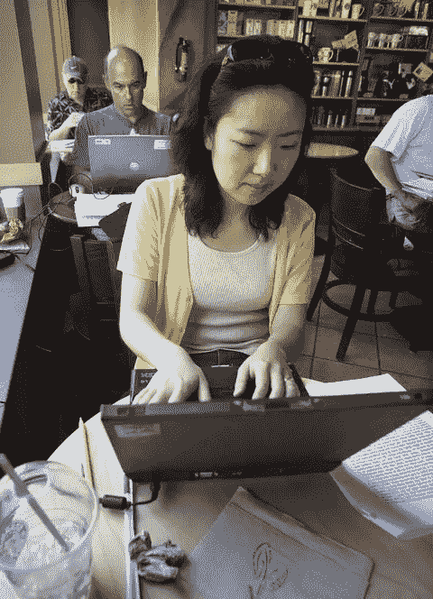

# 企业家黑客:这个 12 人的远程团队创造了 1 亿美元

> 原文：<https://medium.com/hackernoon/entrepreneur-hack-this-remote-team-of-12-generated-100m-72570c08fcb2>

这篇文章的一个版本曾出现在《福布斯》杂志上。

去年，当我在《华尔街日报》上发表 [**这个远程工作实验失败并成功**](http://johngreathouse.com/this-remote-working-experiment-failed-and-succeeded-at-the-same-time/) 的时候，我不知道它会引起这么多社交媒体的关注。鉴于 TimeHop 的失败实验，当我了解到一个由十几个远程企业家组成的团队破解了典型的公司结构并创建了一家收入近 1 亿美元的公司时，我特别感兴趣。

创建一个有效的远程团队通常很困难，尤其是对于一家[初创企业](https://hackernoon.com/tagged/startup)，因为核心业务问题定义不清，节奏混乱。因此，尽管创办一家远程工作架构的公司很有吸引力，但随着公司规模扩大到创始团队之外，保持分散的方法往往是一个挑战。

***起作用的两个虚拟组织***

为了收集实际的远程团队建设建议，我找到了两家已经这样做的公司: [TaxJar](http://www.taxjar.com/) 和 [FastSpring](http://www.fastspring.com/) 。两家公司的成功证明，即使在初创公司早期混乱的日子里，协调和激励不同的团队成员也是可能的。

**TaxJar**

一些公司允许员工每周远程工作一天或临时工作。相比之下，自动进行在线销售税计算、报告和备案的 SaaS 解决方案 TaxJar 是一家完全虚拟的公司。尽管公司有充满活力的合作文化，但没有两个员工在同一个屋檐下工作。*(注:我是通过*[*Rincon Venture Partners*](http://www.rinconvp.com/)*投资 TaxJar 的。)*

我请 TaxJar 的联合创始人兼首席执行官 Mark Faggiano 列出了他的分散式企业蓬勃发展的五个原因。

1.  “我们的团队有每日站立练习，因此我们可以轻松跟踪我们正在进行的工作，并克服任何障碍。我们还每周召开一次全公司会议，这样我们就可以跟踪公司的进展，并在团队之间进行协作。”
2.  “我们一年两次召开团队会议，我们都聚集在一个地方计划优先事项和社交活动。”
3.  “我们每天都用 Flowdock 聊天。我们有不同的工作渠道，但我们也像任何办公室饮水机一样谈论有趣的事情。像任何球队一样，我们也有自己的内部笑话。由于我们在网上聊天，我们的内部笑话包括模因和专门创建的表情符号。”
4.  “我们的团队生产，所以我们不一定要在正常工作时间工作。我们的团队有灵活的时间表，允许他们在傍晚与孩子们共度时光，并在一个完美的粉末日去滑雪。底线是 TaxJar 团队很开心——因为我们很开心，所以我们的工作效率非常高。”
5.  “我们意识到远程工作并不适合所有人。因此，在招聘过程中，我们会寻找申请人以下能力的证据:独立工作，通过聊天和电子邮件有效沟通，以及合作的意愿和能力，尽管无法走到大厅，也无法将自己停在同胞的办公室里。”

**快速弹簧**

FastSpring 的联合创始人兼前首席执行官丹·恩格尔是一位非常成功的连续[企业家](https://hackernoon.com/tagged/entrepreneur)。丹现在是移动客户体验优化平台 Mobilizer 的制造商 [Mobile1st](https://mobile1st.com/) 的首席执行官。

在他职业生涯的早期，Dan 被证明是我的 GoToMeeting 业务开发团队(已被 Citrix 收购)中一个有价值的贡献者。然后，他加入了 Picasa，并在谷歌收购 Picasa 的过程中发挥了重要作用。然后，他创办了几家成功的公司，包括 FastSpring，一家为 3000 多家软件公司提供外包电子商务服务的公司。

Dan 与我在加州大学圣巴巴拉分校的学生分享了他的创业见解，包括他建立虚拟组织的方式。以下四分钟的摘录强调了他对创建有效的远程工作环境的看法。你可以在这里观看丹的整个演讲。

[https://www.youtube.com/watch?v=cDN8cIrOUJs](https://www.youtube.com/watch?v=cDN8cIrOUJs)

正如 Dan 所指出的，“如今，FastSpring 的业务超过了 1 亿美元，比我们只有 12 个人的时候少不了多少。我们只用了大约 3 万美元。没有风险投资。”

从一开始，丹和他的联合创始人(他们都在美国四个不同的州，都很偏远)就专注于建立最佳团队来应对他们所面临的特定类型的机会，而不是建立一个可以放在一个屋檐下的最佳团队。根据 Dan 的说法，“就人员而言，我们的方法是找到最优秀的人，最适合这些职位的人，而不是碰巧在同一个邮政编码的最优秀的人。”Dan 后来指出，“这实际上对我们来说是一个巨大的优势。我们给我们的员工很大的灵活性……那些表现出他们能够完成工作的人，我们不去管他们。他们可以按照自己的方式工作。”

这种优势明显的一个方面是客户服务。“我们的竞争对手有客户服务，你可以得到自动回复。而在 FastSpring，我们在周六晚上 11:00 回应。圣诞节，全天。我不需要要求任何人在那些时间工作，只是他们关心。我们雇佣了那种把笔记本电脑放在床上睡觉的人，所以对他们来说，这就像是‘好吧，反正我在查邮件。’"

FastSpring 被收购时，整个团队由 22 人组成，其中，“……我们有 3 人在圣巴巴拉，其他人通常在家工作，有些人在其他国家工作。”与 TaxJar 一年两次的团队会议不同，Dan 指出，FastSpring 的四位联合创始人“……经历了三年的时间……我们甚至没有见过面，一次也没有聚在一起。我们会通过电子邮件交流……偶尔，如果有重要的事情，我们会通个电话。”

这样的组织结构和沟通方式对许多公司来说并不适用，但在 FastSpring 的案例中，所有的联合创始人都是前任首席执行官。Per Dan，“……所以我们知道我们在做什么，我们的分工非常明确。我不需要知道他们在自己的区域做什么，因为他们知道自己在做什么。”

尽管这种结构对丹和他的团队来说工作得很好，但他确实注意到它并非没有缺陷。特别是，公司的虚拟性质阻碍了筹集资金并最终出售业务的尝试。用丹的话来说，“……我们确实遇到了潜在的合作伙伴和买家，他们会说，‘哦，我真的不喜欢公司这么分散。’你的公司越大，争论就越激烈，因为你有更大的公司(想要购买或合作)，他们想要稳定并从一个地方控制事情。"

*在这里关注约翰面向初创企业的 Twitter feed:*[***@ johngreathouse***](https://twitter.com/#!/johngreathouse)*。*
[**免费订阅每周 JohnGreathouse.com 文章**](http://feeds.feedburner.com/johngreathouse)

图片来源:约翰·齐奇/彭博新闻。

> [黑客中午](http://bit.ly/Hackernoon)是黑客如何开始他们的下午。我们是阿妹家庭的一员。我们现在[接受投稿](http://bit.ly/hackernoonsubmission)并乐意[讨论广告&赞助](mailto:partners@amipublications.com)机会。
> 
> 如果你喜欢这个故事，我们推荐你阅读我们的[最新科技故事](http://bit.ly/hackernoonlatestt)和[趋势科技故事](https://hackernoon.com/trending)。直到下一次，不要把世界的现实想当然！

