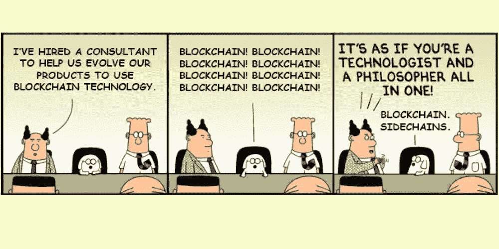

# 身份政治:以太坊如何从假新闻中拯救我们

> 原文：<https://medium.com/hackernoon/ethereum-blockchain-identity-7378f0a8de4>

在你阅读这一段之前，花点时间想想你将如何定义**数字身份**。仅仅是访问权限的聚合吗？它代表了你在现实世界中的多少身份？应该代表多少*？*

克里斯蒂安·伦德奎斯特是[区块链](https://hackernoon.com/tagged/blockchain)咨询公司，[的工程师，他从较高的层面将](https://www.youtube.com/watch?v=QpaTOvAhLR4) it 定义为“映射到物理实体的数字对象”由于缺乏一个普遍接受的定义，我将带着对这个概念的理解继续前进。但是，当然，这只是代表了数字身份应该是什么，而不一定是什么。

在我们使用的大多数 web 应用程序中，我们的帐户根本不需要与任何物理事物相对应——任何人、一组人或程序都可以对它们做任何他们想做的事情，只要他们能提供密码。密码是大多数人的私人数据和互联网其他部分之间的唯一屏障，这是一个巨大的问题。密码保护一直都不可靠，最近，它成了黑客需要克服的一个微不足道的障碍，尽管所有流行的指导方针都是为了让它们变得更复杂。其他方法——例如双因素认证——也有不足之处。

在 2017 年，这些方法不足以提供任何真正的安全。那么，我们怎么可能期望这些易于创建、易于访问且完全易受攻击的账户会映射到具有任何可靠性水平的离散物理实体呢？

也许没有一个普遍接受的数字身份定义的原因很简单:我们从一开始就没有任何实际的概念。当然，你的浏览历史和所有这些账户——你的数字自我的微小片段——被串在十几个公司服务器农场的巨大文件夹中，但我们无法访问它们。这意味着我们也不能使用它们来验证合成图像，这实际上可能是一种真正的数字身份，以任何可用的方式。

验证是建立可信身份的根本挑战，无论是数字身份还是其他身份。任何时候，当你需要证明你的身份属性时——例如，如果你为了买一些啤酒而声称自己超过 21 岁——你应该得到的第一反应是“好吧，谁说的？”然后你可以提供你的驾照作为证明，因为如果驾照通过了安全检查并注明了你的年龄，“挑战者”可以合理地相信你的说法。如果我们能创造一些像驾照一样的数字对象，并配有安全措施、权威和普遍接受，这不是很好吗？

*A young man proves he’s old enough to purchase alcohol in this flawless example of the effectiveness of modern authentication*

答案当然是区块链科技。这并不意味着对区块链的全面概述，但是如果您对它们不熟悉，这里是您在本文上下文中需要知道的一切:区块链是一个大的数据分类帐(以称为“块”的块收集)，任何人都可以下载。一旦它被同步，你可以贡献给它，并将其与其他人的链副本进行比较，以验证其内容。基于一些非常酷的算法，这个用户网络可以[就链中的有效行为达成共识](https://keepingstock.net/explaining-blockchain-how-proof-of-work-enables-trustless-consensus-2abed27f0845)，并阻止无效行为。

加密货币就是这样加强稀缺性的——换句话说，它们确保你不能花同样的一美元两次，并且供应是有限的——它的使用已经扩展到包括可执行代码(即“智能合约”)。当一份合同被部署到[以太坊](https://hackernoon.com/tagged/ethereum)区块链时，它的用户知道它将由参与的每一方以同样的方式执行:这意味着你可以信任网络和代码，所以你不必担心你是否可以信任你正在与之互动的人(就像传统的法律合同抵消了非数字业务关系中的信任)。

换句话说，智能合同可以是一个像驾照一样的数字对象:如果一个有效的来源在一份可信的合同中证明了你的年龄，店员现在就有证据证明你已经到了喝酒的年龄，然后最终会卖给你你从四段前就一直想买的 Smirnoff 冰。

区块链上基于智能合约的身份可以验证几乎任何东西——你是一个真实的人而不是机器人，你与特定脸书账户的关联，你的信用评分——你可以有选择地证明任何与上下文相关的属性。事实上，你甚至不需要向任何人透露其中的任何一点:以太坊已经开始[验证**零知识证明**，这是](https://cointelegraph.com/news/ethereum-upgrade-byzantium-is-live-verifies-first-zk-snark-proof)[疯狂的数学运算](https://www.youtube.com/watch?v=0Sy6nb72gCk)，可以令人满意地证明你知道(或数字拥有)一个东西，而无需实际透露那个东西。

尽管一些批评者称之为遥不可及，但进展仍在继续:例如， [uPort](https://www.uport.me/) (一个建立在以太坊上的项目)已经成功地建立了一个可用的 alpha 和一个有才华的开发者团队，至少有一个[市政府](https://www.coindesk.com/swiss-city-verify-id-ethereum/)已经开始利用这项技术来管理其人口的合法身份。对区块链隐私的担忧——由链上数据的公共性质引发——未能解释以太坊零知识证明的能力。

任何前沿领域都存在怀疑，但不可避免的事实是，我们迫切需要一种新的方法来管理在线身份。最危险的前进道路是我们现在被困的道路。

如果 Twitter 强迫其用户证明他们是人，特朗普会有多少粉丝？[2016 年五分之一的](http://www.motherjones.com/politics/2017/10/twitter-bots-distorted-the-2016-election-including-many-controlled-by-russia/)选举相关推文来自虚假账号，至少[13000 个机器人](https://www.buzzfeed.com/jamesball/a-suspected-network-of-13000-twitter-bots-pumped-out-pro?utm_term=.owZaMkzW5#.oebXe0R4q)在力推英国退出欧盟后突然消失。然而，这个问题存在的时间比这更长:多年来，[独裁政权](https://advox.globalvoices.org/2015/08/04/hackingteam-leaks-ecuador-is-spending-millions-on-malware-pro-government-trolls/)一直在使用机器人发送他们的人民赖以组织的标签，或者歪曲他们的支持和传播宣传，或者产生病毒式的分裂内容，意在[破坏民众的稳定](https://www.youtube.com/watch?v=Gt5-QOv3Z_M)。甚至早在 2012 年美国大选中，纽特·金里奇 92%的追随者都是机器人。

这些机器人网络被巧妙地设计成将他们的假新闻推给那些转发假新闻的人，并向任何可能试图验证其经常疯狂的声明的人掩盖真实的真相。它们也变得越来越大、越来越好、越来越便宜，今天对全世界每个人的自由和能动性构成了迫在眉睫的实质性威胁。人们谈论这个问题就像这是不可能的:我们如何在一个社交媒体平台上过滤所有的新闻？我们怎么可能对每一个帖子进行事实核查？

*Artist’s rendering of a bot network spreading fake news*

但是，如果我们可以要求用户在给他们一个帐号之前证明他们是人类，我们就不需要这么做了。突然，有了一个真正的数字声誉的概念，当然，这些虚假的叙述一开始就不太可能流行起来。这只是一个来自高中的奇怪的家伙发布了关于 PizzaGate 的帖子，没有带着假证件的听起来花哨的陌生人的支持，未经过滤的故事现在在每个人看来都像疯了一样。

这只是一个强大的数字身份机制带来的众多影响之一:也许我们可以开始为全球[11 亿](https://www.ndtv.com/world-news/more-than-1-1-billion-invisible-people-lack-identification-1765594)没有任何*形式的可验证身份的人做点什么，这可以帮助他们获得医疗保健和教育，同时保护他们免受他们现在面临的强迫劳动和人口贩运。或者我们可以避免下一次 Equifax 级别的数据泄露，因为我们不再需要那些庞大的黑客诱饵库。*

如果你在想，“这个家伙只是被区块链的炒作迷住了”，你并没有完全错。但我要提醒你，我从未声称一个纯粹的自我主权模式是对抗这些问题所必需的。我所讨论的与我们一直以来验证身份的方式非常相似:通过提供相互信任的第三方的证明。我们需要做的就是让当前的系统变得更好，这是一种避免虚假证明并提供可信证明的方法，而区块链恰好是一种被设计用来做这件事的工具[。无论你是否同意我的炒作，我们至少可以同意，数字身份的问题可以真正受益于一种新的方法。](/@jonchoi/ethereum-casper-101-7a851a4f1eb0)

说真的，有什么比区块链更新鲜？