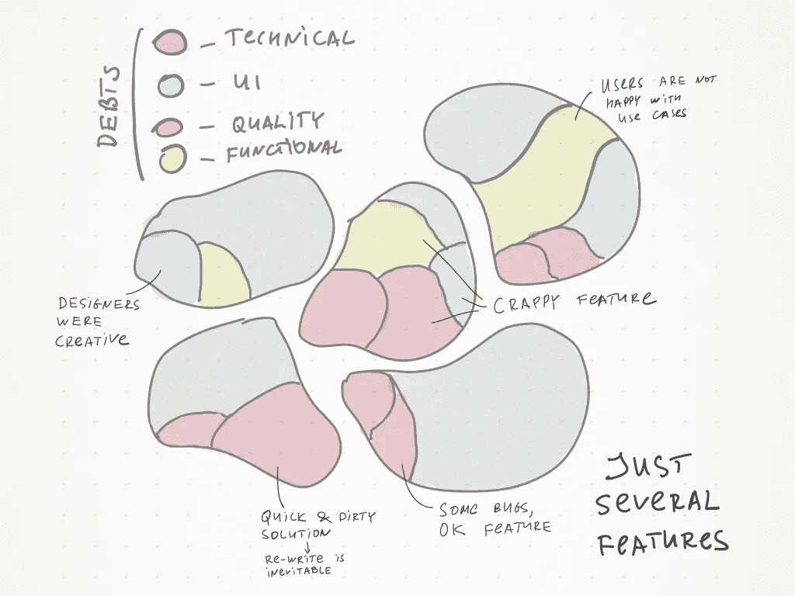
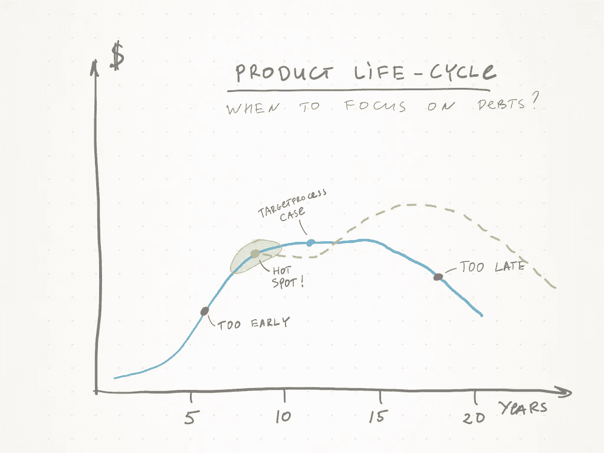

# 每个特性都被认为是有害的:软件开发中的债务

> 原文：<https://medium.com/hackernoon/every-feature-considered-harmful-debts-in-software-development-2a922d846151>

我们倾向于相信每一个新特性都是对产品有益的、有价值的补充。通常，很难*不*实现一个特性，尤其是当你每周都不断听到新特性的好主意时。

问题是*每一个新功能都会增加债务或者为未来债务创造一个占位符*。你交付了越来越多的功能，积累了越来越多的债务。大多数人不知道如何处理债务。我不知道。每个人都知道技术债务，但是在软件开发中很少有更多类型的债务:

*   **功能性债务**。用户的需求是变化的，但系统强迫他们遵循旧的流程，而没有覆盖新的案例。
*   **UI 债务**。随着时间的推移，用户界面会失去一致性和连贯性，使得系统更难学习和理解
*   **质量债务**。错误被忽略，系统表现出不可预测的行为，经历错误，崩溃
*   **技术债务**。架构和代码质量减缓了开发。

产品中的任何新功能都可能成为所有这些债务的来源。

*   **功能**:功能解决一些问题。问题的定义在未来可能会稍有变化，所以特性功能必须适应。*例子*:所有的团队都是以小时来估算工作，但是后来以抽象点来估算变得流行起来。这种新的需求要求对产品进行修改，以支持点作为评估单位。
*   UI:一个新的特性经常会引入新的模式和新的 UI 元素。*示例*:设计者决定为某些功能添加新类型的查找字段。这种查找只在一个地方使用，使得整个 UI 不太一致。
*   质量:一个新的特性几乎不可避免地会增加新的缺陷。在复杂的系统中，错误可能会影响许多其他功能。*示例:*实时更新功能会影响系统的许多方面。意想不到的地方的 bug 也会随之而来。
*   技术:一个新特性的技术实现几乎总是不理想。它可能导致现有系统的修改不是最佳的，并且在最坏的情况下，副作用可能是严重的。*示例:*在时间的压力下，您通过混搭实现了一个快速的 UI 扩展解决方案。它确实提供了很大的灵活性，但是非常脆弱。HTML 或 CSS 中的任何变化都会破坏一些扩展。随着时间的推移，许多混搭被创建，这种机制的改变将是困难的。

下图显示了产品的几个特征。每个功能都会增加一些债务。实际上，添加一个当前和未来债务为零的特性是极其困难的。

Several Features with various level of debt.

每个特性都需要维护:功能、UI、质量、技术、文档、本地化。如果一个产品有 100 个特性会怎么样？1000 呢？你的软件[已经可以阅读电子邮件](http://www.catb.org/~esr/jargon/html/Z/Zawinskis-Law.html)了吗？

# 新功能与债务支付

什么时候应该添加一个新特性，什么时候应该偿还一些债务？让我们检查产品生命周期。想象一下，你正在经营一家非常年轻的初创公司。这个阶段你不在乎债务。你关心市场扩张、新功能和增长。现在想象一下产品快死了，再去关注债务已经来不及了，结束了。

Product life-cycle and debt. When to focus on debts?

似乎关注债务的正确时间是当一个产品已经证明了它在市场上的成功，并且即将进入“成熟”阶段的时候。对于一个典型的 SaaS B2B 产品，这可能是 4-8 年后。上表对我们的 SaaS 产品 [Targetprocess](http://www.targetprocess.com/) 有效。在我看来，我们开始关注债务大约晚了 2-3 年。我们终于开始走下坡路了，但还需要一些时间来重振发展。

理想情况下，你的一部分资源应该一直用于偿还债务，但 6-8 年后，设立一个“*债务偿还年*”或其他什么也不失为一个好主意。在这一点上，开发速度由于技术问题而降低:UI 一致性下降，许多功能过时，bug 和性能问题困扰客户。

此外，你已经积累了足够的客户反馈，现在更好地了解你的领域。你犯的错误和新的机会变得更加清晰。你需要一次彻底的清理，为强大的推力准备一个发射台。

放慢速度并清理产品中的混乱是极其困难的。你总是害怕失去市场份额和功能优势。我这里不想走极端，只是想让你从负债的角度去思考你添加的每一个新功能。

# 怎么办？

有几个明显的后果。

*   **构建小型系统**。如果你需要一个大系统，构建几个小的可组合系统。
*   **特征少- >债务少**。有人要求新功能？默认答案是“否”。
*   **模块化是可取的**，因为你可以重写模块来偿还债务和减少副作用。这意味着，在债务水平与非模块化系统相同的情况下，您可以在模块化系统中拥有更多功能。
*   **删除很少使用的功能**。当您删除一个功能时，您会删除所有相关的债务。

我想用一句[引言](http://harmful.cat-v.org/cat-v/unix_prog_design.pdf)来结束我的帖子:

> UNIX 不需要的一点是更多的特性。它之所以成功，部分原因是因为它有一些很好的想法，这些想法能够很好地协同工作。仅仅增加功能并不能让用户做事情更容易，只会让手册更厚。在正确的地方使用正确的解决方案总是比随意的黑客攻击更有效。罗布·派克和布莱恩·w·克尼根