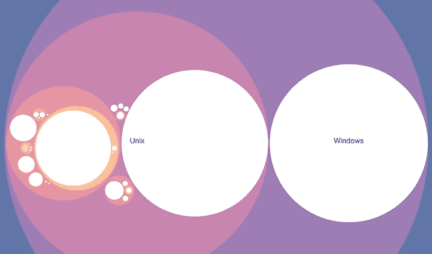
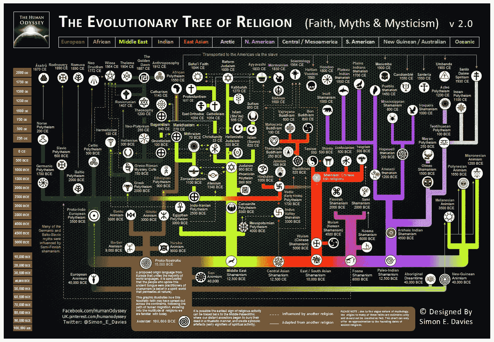
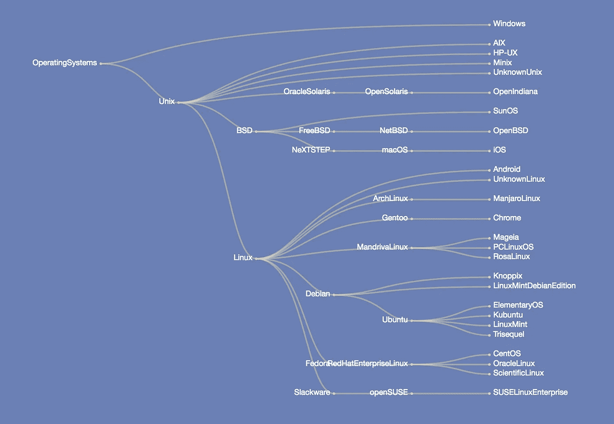
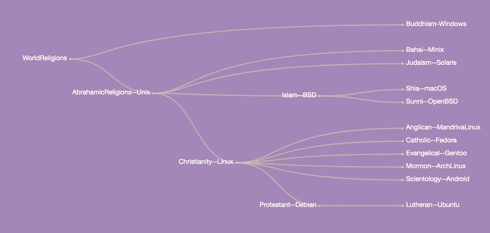

# web 服务器操作系统的发展

> 原文：<https://medium.com/hackernoon/evolution-of-web-server-operating-systems-ba1cf1c1e3d8>

有没有想过为什么我们选择某些操作系统来运行我们的网络服务器？

也许你开始读这个故事是因为你认为它是关于客户端操作系统的，比如你的台式机或笔记本电脑。那是完全不同的一团蜡。我说的是用来运行网站和商业网络应用的操作系统。这些通常是大规模的服务器和大型机，就像运行谷歌或亚马逊的服务器和大型机，但它们也可以用来部署你的个人网页或支持你的副业项目。

## web 服务器操作系统的沿袭

今天的 web 服务器操作系统由 Windows 和 Unix 或类 Unix 操作系统主导。市场上还有许多其他参与者，但大部分份额都落入了少数人手中。那是怎么发生的？

Web server operating systems by market share

故事和[世界宗教的演变](https://www.youtube.com/watch?v=AvFl6UBZLv4)一样。

外部力量塑造了人民的需求和要求，导致新的思想领袖出现。有时新的系统是从相同的原始内核中培育出来的，有时全新的代码库被开发出来。新系统的支持者有时直言不讳，固执己见，或富有魅力。有些人的受欢迎并不总是基于优点和原则，而是时代的反映。

Web server operating system lineage

想象一下 **Unix** 可以被比作亚伯拉罕宗教的一个分支，它产生了犹太教、伊斯兰教和基督教。基于比较的标准:市场份额、社区参与、共享原则、可负担性、总体定型等，类比看起来会有所不同。

思考各种可能性，并想出你自己的学习操作系统关系的记忆方法是很有趣的。

Comparison of operating systems to world religions

**犹太教:** Sun Microsystems 用一个被称为 **Solaris** 的闭源 Unix [操作系统](https://hackernoon.com/tagged/operating system)取代了 **SunOS** ，以可扩展性和创新性著称。Sun 最终将代码库开源为 **Open Solaris** 。然而，当 Sun 后来被 Oracle 收购时，该计划被关闭，导致社区派生出许多开源变体，其中之一是 **OpenIndiana** 。

**Islam:**Berkeley Software Distribution(**BSD**)是 Unix 的衍生品，NeXT 的 **NeXTSTEP** 操作系统就是基于 Unix。当苹果收购 NeXT 时，他们看到了创始人史蒂夫·乔布斯的回归，并将他们的内部操作系统换成了 Mac OS X，后来更名为 OS X，现在叫做 Mac OS。现代 MAC 是 Unix 的曾孙！

**基督教:** [Linux](https://hackernoon.com/tagged/linux) 是最知名和最多产的类 Unix 系统之一。Linus Torvalds 开发了 Linux，因为他对修改和再分发的限制感到沮丧，所以他决定开始一个新的免费操作系统内核。更准确地说，Linux 并没有直接继承 Unix，因为它是作为一种替代方案开发的，因此有了“类 Unix”这个限定词。今天， [Linus Torvalds 选择 Fedora](http://www.tuxradar.com/content/interview-linus-torvalds-linux-format-163) 作为他的 Linux 发行版，这是他自己的 Linux 内核的变体。

尽管有很多很酷的变体，为什么 BSD 从来没有像 Linux 那样获得广泛的成功？关于这项技术和社区管理方式有几种观点，但最大的原因之一是加州大学伯克利分校(UC Berkeley)和美国电话电报公司(AT T)陷入了一场关于谁拥有 BSD 代码库的诉讼。结果的不确定性使 BSD 社区瘫痪了几年，与此同时，Linux 的稳定版本出现了。

一些系统的出现并不总是基于性能或能力，而是对外力的反应。

开发人员会为哪个发行版做出更好的选择而争吵不休，但是通常来说，操作系统来自相同的内核，或者至少是相同的思想分支。大多数开发人员在他们的技术信仰上不是一神论者，他们会选择最好的技术来满足他们当时的需求。

## web 服务器操作系统的市场份额

那么，如果你正在寻找一个操作系统，你应该选择什么呢？其他人都在做什么？你不能通过报告的收入来判断市场份额，因为许多流行的选项都是免费的。如果有多个或不完整的安装，下载是不精确的。对使用各种操作系统的网站的调查可能会有偏差。

对于 web 服务器操作系统来说，很难确定市场份额。就像其他软件和技术一样，为您的特定用例权衡利弊。有来自创造者或社区的持续支持吗，系统是否有良好的文档记录，你的经验水平如何？操作系统是易于定制、价格合理还是开源的？

利用 2017 年 W3Techs 的调查数据，仔细看看[的市场份额。](https://os.meowsergirl.com/)