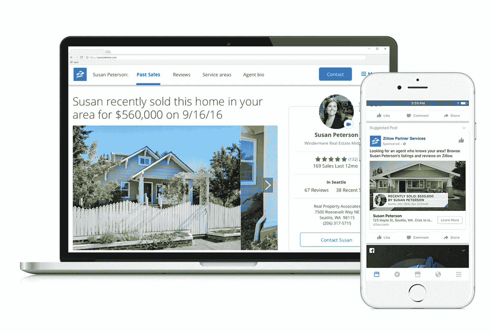

# 脸书是来找齐洛的吗？

> 原文：<https://medium.com/hackernoon/facebook-is-coming-for-zillow-4f06c1d2cf47>

## *评估脸书的住宅房地产战略及其对房地产门户网站的影响。*

*本文由战略顾问、全球房地产技术专家迈克·德尔普雷特(Mike DelPrete)合著。订阅他的房地产快讯* [*这里*](http://www.mikedp.com) *。*

脸书在房地产专业人士的营销组合中一直扮演着配角:从历史上看，代理人在房源门户网站上做广告的可能性是在社交媒体上做广告的两倍。就其本身而言，脸书从未建造过直接迎合房地产消费者和专业人士的建筑。今年早些时候，这种情况发生了变化——标志着对房地产门户网站有重大影响的战略转变。

一个月前，脸书[宣布](https://techcrunch.com/2017/11/09/facebook-expands-its-marketplace-section-with-housing-rentals/)对 Facebook Marketplace 上的“房产租赁”部分进行重大更新，推出了一个新的前端，允许移动用户使用各种新的过滤器搜索租赁:租赁类型、位置、卧室数量、宠物友好度等。

Property Rentals on Facebook Marketplace

与这一产品更新相配套的是与 Zumper 和 Apartment List 的新合作伙伴关系，这是两个最著名的在线租赁平台，每月总共接收数百万独立访客，将直接向脸书提供"[数十万](https://www.inman.com/2017/11/09/facebook-debuts-hundreds-of-thousands-of-rental-listings/)"租赁房源。

这是脸书在三个月内进军住宅房地产的第二个重大举措。九月，房地产动态广告(T17)推出，经纪公司和房地产网站(T18)向脸书用户推广实时房源。

这些特征揭示了脸书的房地产战略，脸书对房地产日益增长的兴趣对门户网站意味着什么？在本文中，我们将进一步了解脸书最近进军住宅房地产的举措，评估其动机和前瞻性路线图，并讨论对现有参与者的影响，尤其是房地产门户网站。

# 脸书和房地产

早在推出物业租赁和动态广告之前，脸书就巩固了其作为租赁经理和房地产代理的重要营销渠道的地位。在租房方面，脸书长期以来一直有像吉普赛房屋(Gypsy Housing)这样的网站，这里是出租房产的个人和小业主以及寻找完美伴侣的租房者发布本地分类帖子的地方。自该产品去年秋季推出以来，个人房东已经能够在 Facebook Marketplace 上发布房源。

但是初步的搜索和缺乏高质量的库存已经阻止了租赁在市场上真正起飞。尽管我们没有来自脸书的精确数据，但非正式住房群体的持续增长强化了这一定性观察。

在销售方面，房地产经纪人利用脸书在 T2 建立当地对他们服务的认知度，或者对他们的房源进行有针对性的促销，利用相对微弱的竞争来获得丰厚的投资回报。当因曼新闻在去年九月调查代理商对脸书的使用情况时，一位代理商指出她曾经[花了](https://www.inman.com/2017/09/05/facebook-ads-real-estate-golden-era/)750 美元在一个列表广告上，产生了六份合同和“数百”条线索。

另一位代理商[报告](https://www.inman.com/2017/09/05/facebook-ads-real-estate-golden-era/)称，他从脸书获得的每条线索的平均成本约为 5 美元，比 Zillow 的平均 100 美元要高——尽管随着更多代理商对广告库存进行竞价，每条线索的成本在过去三年里已经上涨了六倍。总的来说，脸书给代理商带来了很高的投资回报率，但只针对那些愿意手动上传列表、优化广告创意和长期培养潜在客户的人。

即使没有房地产特有的任何功能，脸书也已经在代理人中获得了大量的思想份额，研究公司 Borrell Associates 在 2017 年 9 月的一份报告中指出，代理人“比所有其他形式的数字媒体，包括上市门户网站，更有可能通过社交媒体上的广告。”

# 评估脸书房地产的新特点

改版后的房产租赁部分和动态房地产广告乍一看似乎是简单的优化，但它们的影响将是巨大的。

在租赁方面，产品更新和随之而来的上市合作是游戏规则的改变者。整合现有租房网站的房源——并改善租房者的用户体验——将使租房搜索在脸书变得更加有用，吸引用户，最终鼓励更多房东将房源直接发布到脸书。

脸书并不满足于与 Craigslist 等强大的现有网站在功能上对等，它鼓励房东[发布 360 张照片](https://www.facebook.com/business/help/540144076318090?helpref=faq_content)，以更好地了解房源是什么样的。

脸书专注于租赁是明智的，租赁是进入住宅房地产的理想切入点，因为竞争是分散的:租赁库存没有 MLS 或单一的真实来源。通过房源聚合和用户端的调整来增强其网络效应，脸书有望取代 Craigslist 成为全美最全面的租房信息数据库。

在销售方面，[房地产动态广告](https://developers.facebook.com/docs/marketing-api/dynamic-ads-for-real-estate)的推出使脸书成为房地产经纪人的一个更有力的工具。

Dynamic Ads for Real Estate

到目前为止，代理商只能瞄准广泛的受众，与积极浏览房地产门户网站寻找房屋的用户相比，他们捕捉线索的意图更小。通过允许经纪公司上传实时房源目录，并根据用户过去与特定房源的互动来锁定目标用户，脸书让经纪公司向直接表明对待售房屋感兴趣的用户进行营销，这应该会提高线索质量和投资回报率。

# 脸书的房地产战略:全靠库存

这些新功能有什么共同点？两者都激励房地产库存供应商——出租方的物业经理和房东，出售方的代理商和经纪人——上传更多房源到脸书。

广告平台的基本能力是在正确的时间将正确的产品或服务(在我们的例子中是库存)呈现给正确的消费者(在我们的例子中是交易意图):换句话说，识别消费者的需求并提供相关的解决方案。脸书的各种产品拥有超过 20 亿用户，是少数几个已经掌握了正确消费者的平台之一，其房地产战略的目标是等式的其他部分。

上市库存是脸书获取房地产广告支出市场份额战略的基石。即使脸书对消费者租房或买房的意图了如指掌，它也只有在有“产品”——一个清单——可以展示的情况下，才能将这种意图货币化。

积累更大数量和种类的房地产库存还有另一个主要好处:通过给消费者更多与房地产互动的机会，脸书可以更多地了解他们的偏好和意图，从而更有效地锁定目标。例如，房地产的动态广告已经帮助代理商自动锁定访问过他们网站和浏览过他们房源的消费者。但一个强大的租赁平台让脸书可以在组合中添加另一个强大的目标工具，让他们向那些搜索具有人口统计特征的租赁的人做广告，这些特征也使他们有可能成为买家。

代理人可以选择的目标越精确，脸书就越有理由让经纪商相信，他们应该直接向脸书推荐上市公司。这就是事情变得有趣的时候:如果足够多的代理商在特定市场使用脸书房地产广告，我们甚至可以想象进步的大联盟董事会——他们一直渴望对门户网站施加更多影响——直接向脸书辛迪加房源。

这就提出了一个十亿美元的问题:脸书会尝试与房地产门户网站直接竞争吗？我们认为，脸书不想推出基于地图的房地产搜索，也不想把这个市场变成一个出租和出售房源的收费产品。从短期来看，脸书正集中精力改善面向房地产专业人士的广告产品，并从门户网站获取更高比例的广告支出。

从长远来看，门户网站的情况可能会变得更糟。我们将在下面更详细地讨论这一点，但随着脸书积累更多的库存，并学会如何精确地将这些房源与消费者的需求相匹配，它可能会完全跳过基于地图的搜索，将预设的过滤器和购房者的自然语言查询与精确的算法相结合，以*为*用户匹配最适合他们的房子。

这几年内不会发生，但是库存会使它成为可能——正如我们将在下面讨论的，培养和保护专有库存是门户网站反击的一种方式。

# 对门户网站的影响:广告支出的竞争

从短期到中期来看，脸书此举的主要影响将是房地产代理商对广告费用的竞争加剧。在美国，Zillow 70%的收入来自房地产中介，这一趋势延伸到了每个主要的国际市场。

脸书进入房地产广告领域，代表着对这一溢价支出的明确而直接的竞争。房地产经纪人将有另一个顶级平台来花钱为自己创造额外的品牌，产生线索，或推广他们正在出售的房屋。额外广告支出通常没有上限；代理商想花多少钱就花多少，以推广他们自己或他们的产品。

## Zillow 反应:直接代理

去年 8 月，脸书推出了针对房地产产品的动态广告。两个月后，Zillow 宣布与脸书和“Premier Agent Direct”合作，后者是一款直接向脸书推送广告的广告产品。

Zillow 的反应很直接:此举让它获得了一个席位。鉴于脸书在这一领域的潜在竞争，Zillow 决定保持相关性的最佳方式是拥抱新的脸书广告产品，并将其提供给现有客户。

Zillow’s Premier Agent Direct Product

当时，Zillow 说它“不仅仅是购买广告并转售它们。”事实上，这正是它正在做的事情，但好处是使用 Zillow 的用户数据来提高相关性和针对性。齐洛承担了中间人的角色。代理商可以直接去脸书花他们的广告费，或者他们可以继续和 Zillow 合作，在脸书上曝光。这是一个双赢的局面，Zillow 保持相关性，脸书产生广告收入，代理商通过多种渠道最大化他们的曝光率。

每个选项都有自己的好处。与通过 Zillow 购买联合品牌相比，直接从脸书购买广告给了代理商更多的控制权，并突出了他们的品牌。

For Agents: Buying from Facebook vs. Buying from Zillow

# 脸书-齐洛战争中的关键战线

脸书进入房地产将照亮两个关键战线，脸书与房地产门户网站的竞争将围绕这两个战线。

第一条战线围绕着列表发现过程中的用户体验，即*搜索*与*匹配*。目前消费者在房地产门户网站上的体验主要集中在搜索和浏览上。访问者扫描地图，根据搜索条件进行过滤，并浏览特色列表。这相当于翻阅一本精美的杂志，或者浏览报纸的分类版面。

脸书的本质适合匹配的体验。房地产清单将根据脸书对消费者的了解来定位(就像它已经定位广告一样)。大多数脸书用户不会搜索房地产；他们将看到展示给他们的房地产。

第二条战线围绕着库存:全市场与部分市场。房地产门户网站保持着它们作为最佳找房地点的声誉，因为它们拥有市场上所有的库存**。当一个消费者在寻找一个新家时，他们想看看所有待售的房产都在哪里。**

另一方面，脸书的市场战略并不基于拥有所有可用的房地产清单。至少在可预见的将来，可用的列表将是那些由它的广告客户上传的。因此，尽管脸书的消费者体验将直接为访客锁定和匹配房源，但它并不代表所有可能出售的房屋市场。

这为房地产门户网站留下了一个竞争的机会。只要门户网站拥有比脸书更多的库存(我们相信在中期内会是这样)，它们对消费者的好处是显而易见的:你是想进入整个市场还是只进入部分市场？

# 房地产门户的战略选择

对于全球的房地产门户网站来说，脸书代表着一个明显而现实的危险。它在这里，它在成长，它要来吃你的午餐。

我们认为应对策略应围绕以下几点:

*   **专注于为代理提供价值。**在整个价值链中提供效用，并提供更完整的解决方案。得到红地毯待遇、免费呼叫中心服务和独特在线工具的代理商不太可能叛变。归根结底，这个游戏是关于提供投资回报的，所以要努力在整个价值链中提供更多的价值。
*   **立足本地，利用你的销售团队**。房地产是全国性的。房地产门户网站拥有在市场中茁壮成长所必需的本地知识、关系和品牌。通过在市场上建立你的本地价值，你可以在一个脸书无法竞争的领域竞争。
*   **销售脸书的广告产品**。采用 Zillow 的策略是有争议的。考虑到脸书已经有一个针对房地产代理商的广告产品，它已经展示了良好的投资回报率，代理商已经在这个平台上花钱了。五年后，这种情况还会继续吗？还是脸书会消失？我们敢打赌，不管有没有房地产门户网站的合作，它都会存在，而且只会变得更大。所以，尽你所能加入进来，利用你当地的优势向你的客户推销脸书的产品。
*   **探索“匹配**”如果当买家体验转向匹配体验时，要有一个匹配买家和房子的产品。如果消费者的偏好发生变化，不要手足无措。
*   **不要在社交上竞争。如果你在考虑如何通过社交产品与脸书竞争，那你真是天真地找错了目标。你最不应该做的事情就是在脸书最强的地方与其竞争。**

# 总结想法

脸书更深入地涉足房地产——包括租赁和待售房源——对代理商和经纪公司来说是一个机遇，对众多门户网站业务来说则是一个威胁。特别是对于房地产门户网站来说，第一战场是代理溢价支出。脸书为代理商提供了一个新的、强有力的选择，让他们可以选择把钱花在哪里。

这种情况给房地产门户网站造成了两难的境地。他们是像 Zillow 所做的那样作为“友敌”与脸书合作，还是不惜一切代价扼杀脸书的势头？

我们相信脸书将继续留在房地产市场，并将继续为代理商提供积极的投资回报。在短期内，房地产门户网站需要采取行动，巩固其作为产生和服务高质量线索的最佳场所的地位。对于门户网站来说，好消息是他们有了一个战斗的机会。