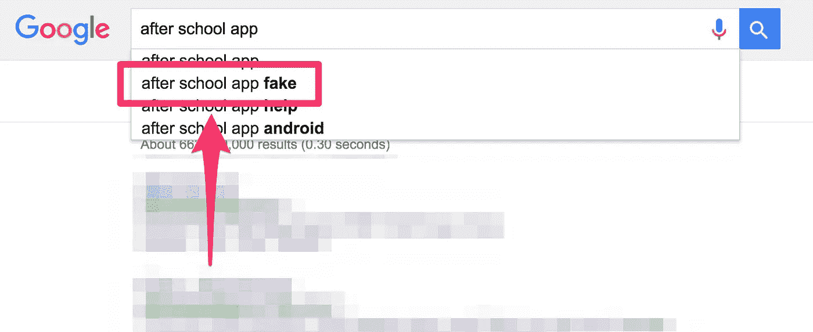
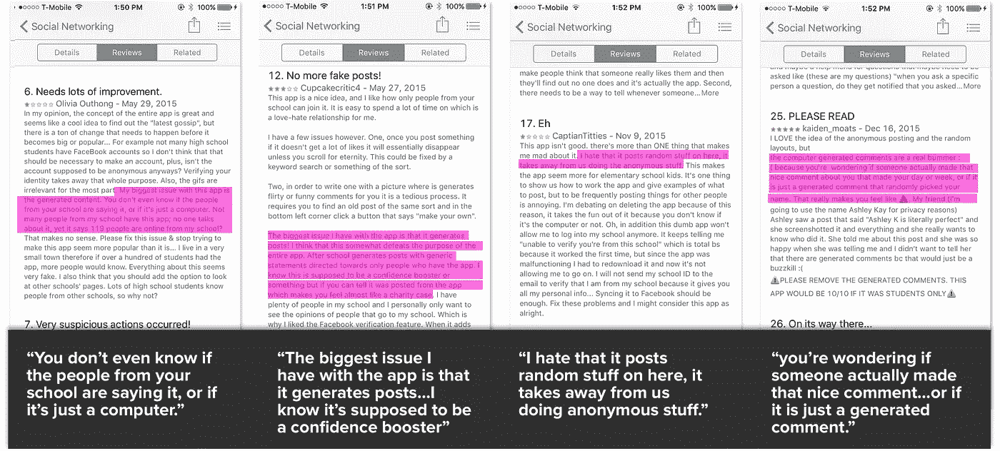
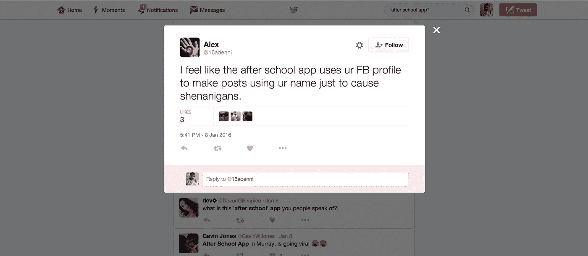
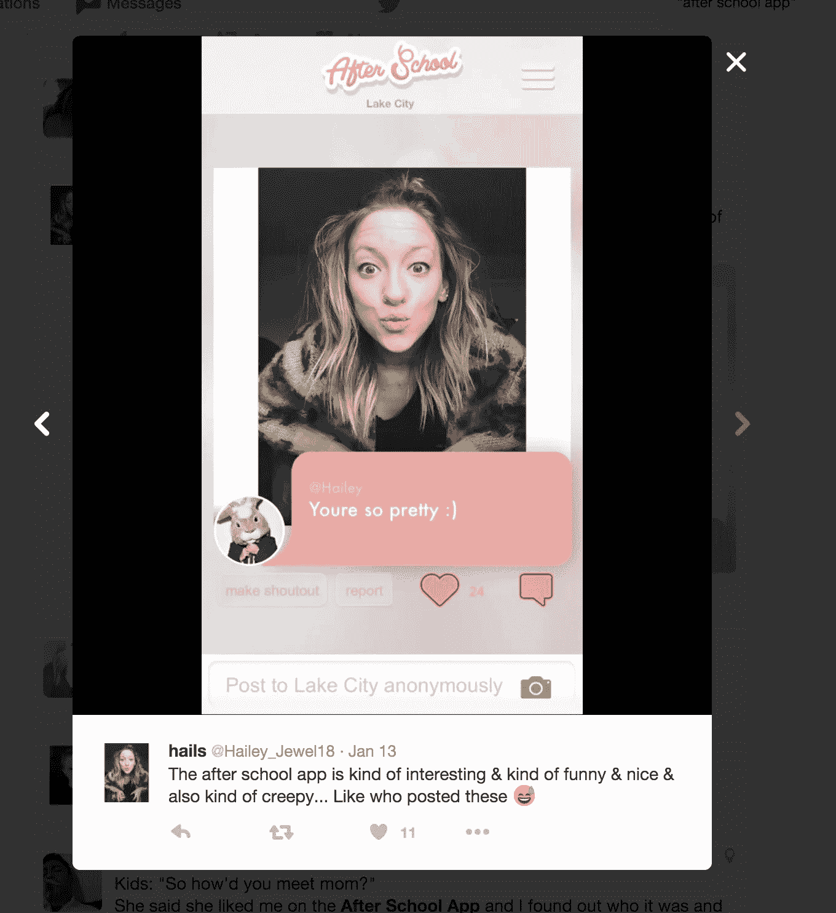
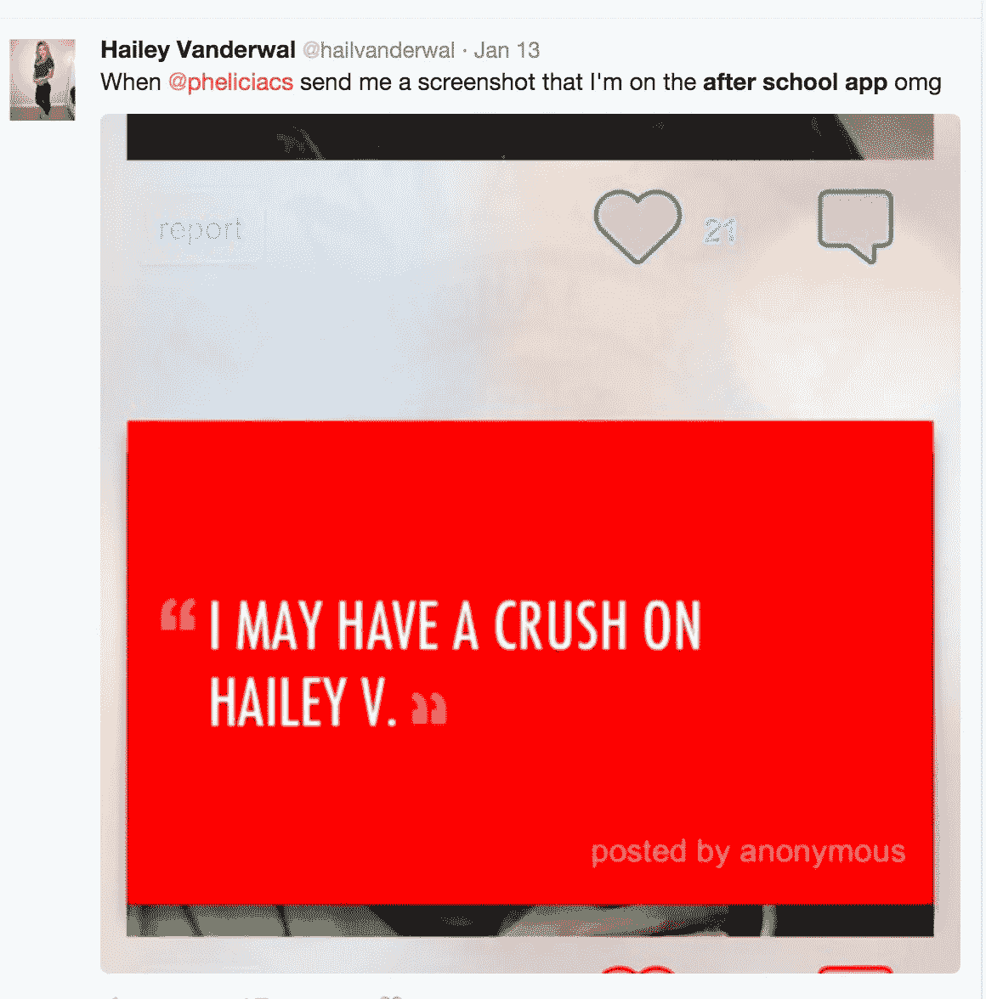
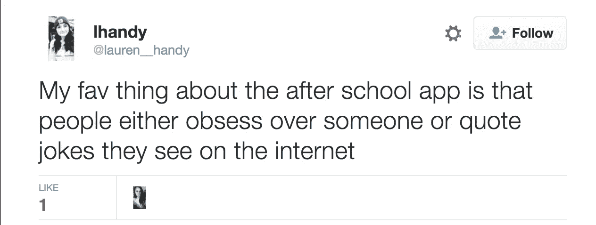

# 假用户和假赞美

> 原文：<https://medium.com/hackernoon/fake-users-and-fake-compliments-5033524c04d8>

## *课后应用和社交媒体的未来*

* * * *在与 After School 的创始人会面后，我在底部更新了这篇文章。*****

一年前，《放学后》[在苹果应用商店被封杀](http://recode.net/2014/12/11/after-school-banned-from-apple-app-store-again/)。[今天，他们宣布筹集了 1640 万美元。](http://recode.net/2016/02/03/anonymous-app-after-school-raises-16-4-million-one-year-after-app-store-ban/)该应用被禁是因为向高中生和中学生推销 Yik-Yak 这样的匿名论坛应用存在明显的危险。什么变了？app 是如何从被踢出局，到拥有百万用户，募集到大量 A 轮的？虽然我不能使用这个应用程序，因为我已经过了高中时代，而且放学后需要[脸书](https://hackernoon.com/tagged/facebook)验证，但我的研究认为，放学后张贴在网上的大多数内容都是计算机生成的，不仅增加了用户数量，而且创造了一个虚假的安全场所，学生可以在那里对自己感觉更好，而不是被匿名可能导致的可怕言论击垮。尽管这可能是短期的利好，但从长远来看，这描绘了一幅技术未来的可怕画面。

## 用户投诉

[谷歌](https://hackernoon.com/tagged/google)自动完成了“放学后是假的”的暗示，互联网上充斥着人们声称该应用在 feed 中发布虚假内容的例子。

**iTunes**

有许多积极的 iTunes 评论，但也有许多抱怨，读起来像下面的评论:

**推特**

在 Twitter 上搜索可以看到同样的抱怨:

虽然 iTunes 上的随机推文和评论算不上科学，但它会变得更好，所以请继续关注我。现在，让我们假设我们相信至少课后的一些内容是公司电脑生成的，而不是用户创造的。

## 他们是怎么做到的？

***他们要求脸书登录***

当我陷入试图了解放学后有什么猫腻的黑洞时，我开始相信该公司可能会使用你的脸书登录信息来了解你在学校上学的脸书朋友的姓名和身份，以便从这些人那里创建虚假内容。就在这个想法之后，我发现了这条推特:

我立即去了课后网站，了解他们说的注册需要脸书登录。毕竟，为什么一个新的社交网络需要使用另一个社交网络的验证呢？几乎所有的新应用都允许脸书和至少一个其他的登录选项。

Your Facebook friends list is required by After School

After School 声称，他们使用你的脸书登录来验证你是正在聊天的学校社区的成员。这是有道理的。当脸书开始的时候，他们想让你用一个 edu 的地址来验证，但是并不是所有的中学都会提供电子邮件地址。使用你的脸书图现在是事实上的方法来验证你的身份。然而，上面的图片清楚地表明，它使用你的脸书朋友信息来验证你的身份。这就是有趣的地方。

## 你还能用朋友数据做什么？

如果我是凯文·贝肯的六个学位，那么我是我高中所有人的一个学位。尤其是在脸书。这意味着，从理论上讲，只有一所高中的少数人登录脸书，就可以为学校的大多数人创建虚假的个人资料。

This person claims to not have the app, yet she has a profile on it.

This individual states that the app says she’s posting to her school’s feed when she is not.

## 他们为什么这么做？

***正面评论感觉比霸道***

如果我们要相信《放学后》上的一些内容和用户是捏造的，我们必须问自己:为什么？为什么一个公司要伪造用户？一个简单的答案是增加数字，但我认为这里的答案可能要复杂得多。

放学后被禁止，因为可怕的威胁欺凌和暴力。今天，它站在屋顶上大声疾呼反对欺凌。虽然活跃的虚假账户可以扩大用户数量，并有助于获得下一轮融资，但理论上它也可以保护年轻学生免受欺凌的威胁。如果每个用户在注册课后活动时都能得到善意的评论，这难道不是一件好事吗？如果我们让我们的思想游荡，并认为它们可能是人工创造的，这仍然是一件好事吗？

That’s a nice comment, does it matter if it’s not from a real person?

Do we just care that her confidence is boosted?

After School is the only anonymous app where I’ve seen this much positivity

How often do you see people refer to others by just their first name and last initial? This is how 100% of people are referred to on After School.

## 费用是多少？

作为人类，我们渴望被认可。我从来没有比高中和中学时弱过；我想这对于大多数人来说都是一样的。如果有同行匿名夸我的 app，我会一直用下去。我相信这就是放学后做的事情。它通过脸书社交图，根据你学校的个人资料创建账户。然后，它接受这些名字，并创建匿名帖子，这些帖子不会欺负人，因此不会引起任何问题。你听说有人暗恋约翰 y，也许你会告诉你的朋友。你登录后，有人匿名说他们在想你，这让你很开心。这是一个匿名的天堂，那里不存在青少年的混乱。这样可以吗？尽管经历了欺凌，我们的目标是成长为一个强大而独特的个体，还是我们宁愿隐藏我们的下一代，不让他们知道残酷的现实？

我把这个留给你:

这不是真实的人匿名谈论的话题:

像往常一样，你可以在 ryan@zeroslant.com 找到我

# **— — — — —更新— — —**

写完这篇文章后，After School 的创始人(迈克尔和科里)联系了我，问我们是否可以见面。有几件事他们觉得我误解了，想为我澄清一下，我概括如下:

## 脸书 API

显然，课后应用团队声称在他们开发之前对脸书 API 进行了更新，因此脸书朋友 API 调用将只返回也使用该应用程序的朋友。

Only friends with the app get returned

## 用户可以谈论不在应用程序上的同学

我关于假冒用户的结论源于一个假设，即用户的朋友是从脸书 API 调用返回的。既然事实并非如此，我们如何解释有些人声称他们放学后有账目，但却从来没有做过？在我与创始人会面期间，他们告诉我一个功能，用户可以讨论他们学校的其他人，而这些人没有帐户。这似乎创造了一个账户的外观，而没有所述个人选择创建一个账户。虽然这是一个与我概述的场景非常不同的场景，但它仍然强调了确实存在一些用户，这些用户实际上并不是下载并注册了该应用程序的人。

## 虚假回应

《放学后》里好像有一个功能，即使是用户“创造”出来的，也能创造出虚假内容的样子。当你去回复某人的帖子时，课后辅导会给你预先写好的回复，只使用积极的语言。创始人声称，这些建议的回应有助于缺乏安全感的人想出一些话来说，但很容易理解为什么它们经常被更大的社区视为虚假内容。

## 这给我们留下了什么？

我认识迈克尔和科里时，他们真的是很好的人。我们开诚布公地讨论了匿名问题，我真的很感激他们主动和我交谈。尽管他们声称我曲解了我文章的某些方面，但一个事实是——在匿名系统中，背后的公司也应该是匿名的。

没有办法证明上面列出的一切完全是欺诈性的，放学后是无辜的任何有问题的行动。可能是他们团队的设计选择导致许多用户声称内容是假的。也可能是课后应用程序上既有虚假的个人资料，也有虚假的内容。我相信课后辅导小组是出于好意的；他们试图为用户建立一个安全的网络空间。然而，他们非常专注于压制负面评论，提升正面评论。他们没有否认这一点。我们仍然面临着这样一种情况，公司决定什么是好的，什么是坏的，让孩子们看。这确实是一个非常有趣和复杂的问题。

许多用户声称整个应用程序都是谎言，然而创始人以最冷静的真诚当着我的面说事实并非如此。随着童年的世界越来越多地转移到网上，我们都需要意识到，我们塑造这种“虚假”现实的方式对未来有着深刻的影响。

> [黑客中午](http://bit.ly/Hackernoon)是黑客如何开始他们的下午。我们是 [@AMI](http://bit.ly/atAMIatAMI) 家庭的一员。我们现在[接受投稿](http://bit.ly/hackernoonsubmission)，并乐意[讨论广告&赞助](mailto:partners@amipublications.com)机会。
> 
> 如果你喜欢这个故事，我们推荐你阅读我们的[最新科技故事](http://bit.ly/hackernoonlatestt)和[趋势科技故事](https://hackernoon.com/trending)。直到下一次，不要把世界的现实想当然！

