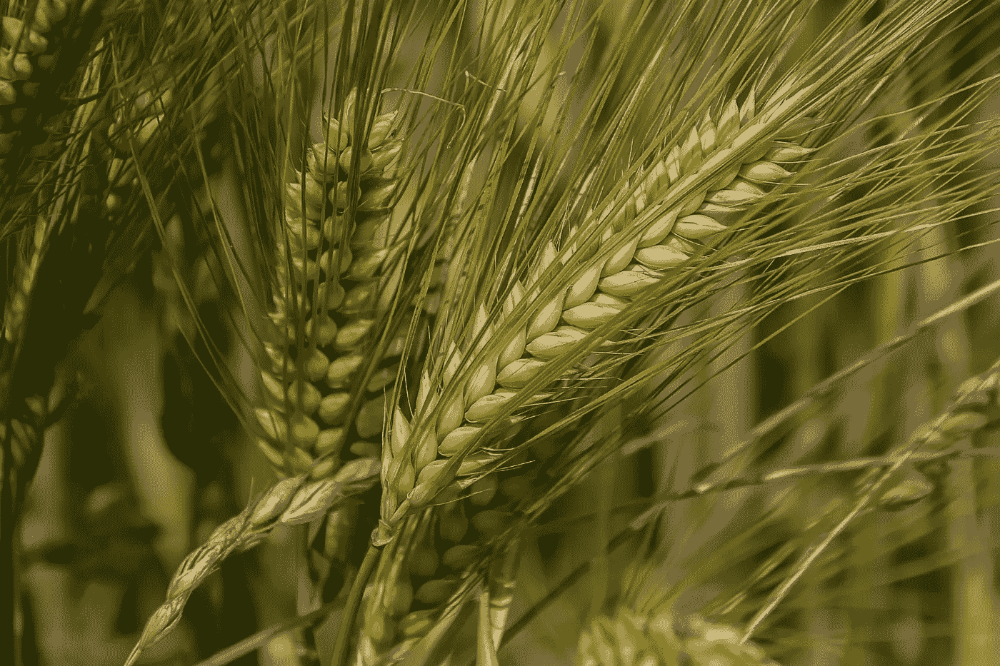
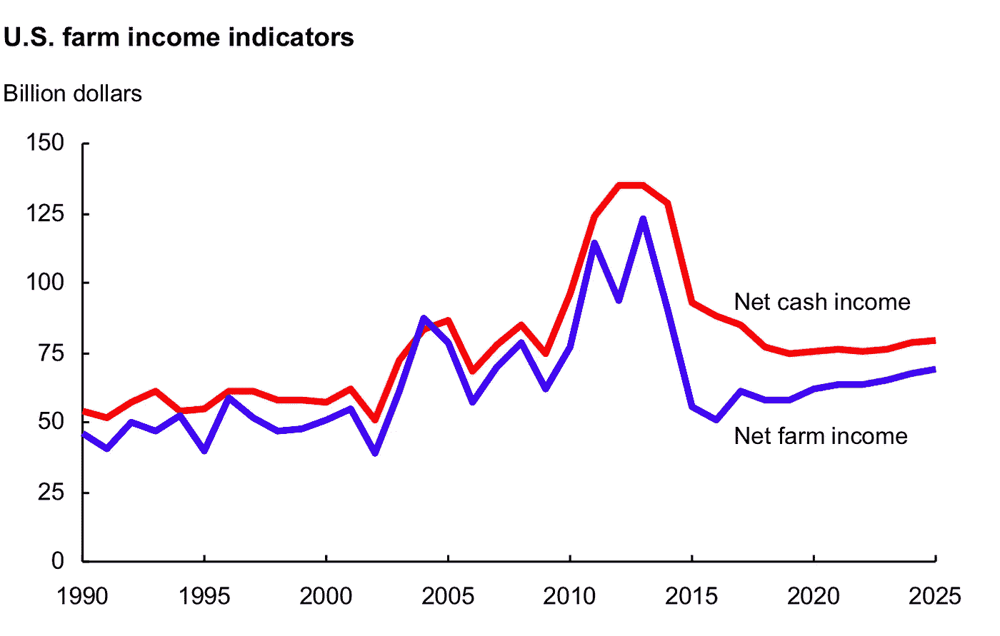
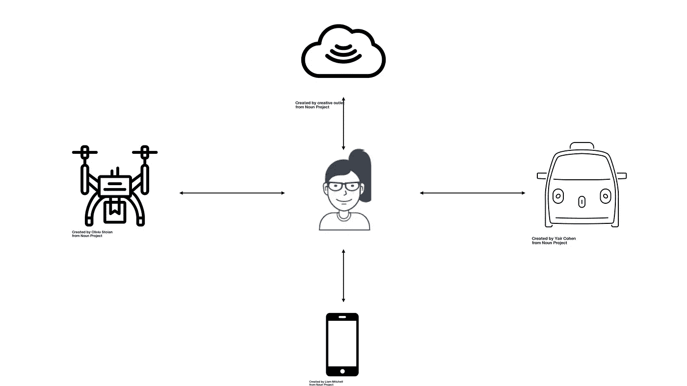
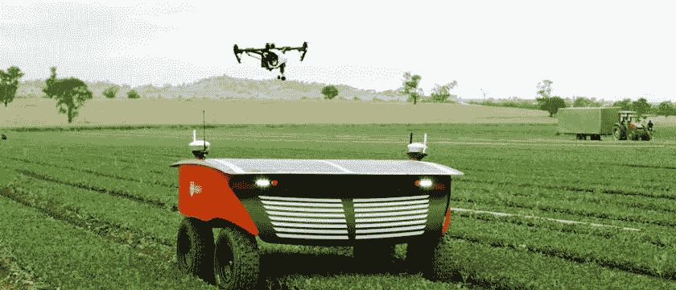
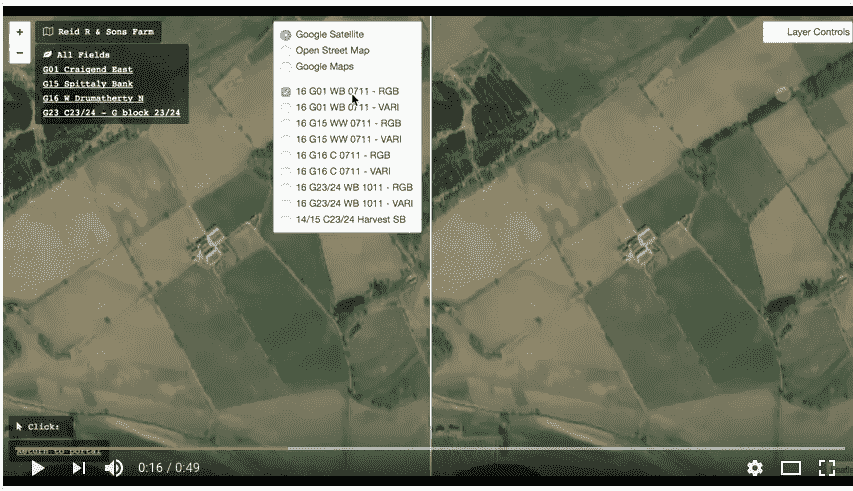

# 农业及其技术未来

> 原文：<https://medium.com/hackernoon/farming-and-its-tech-future-aka-make-farming-great-again-772ba607bfff>

## 又名让农业再次变得伟大。

艾米·A * 24 岁，是一名不折不扣的千禧一代，毕业于爱荷华州坎特里尔社区大学，她是一名农民。是的，你没看错。**她是一个 24 岁的农民，这个国家有 210 万个农场，88%是家庭所有，农民的平均年龄是 58.5 岁**。行业整合表明，在她父亲经营的农场长大的艾米不会成为农民。但她最终进入了*坎特里尔学院*，并意识到技术在其他重资产行业的扩散为她的家庭提供了一个保持农场和土地所有权的机会。

Amy 意识到技术将成为她家庭幸福和生活方式的救世主…

Data and image courtesy of USDA.

## 下降趋势

当几个负面因素汇集在一起时，Amy 的家庭面临的问题达到了顶点，他们几乎没有什么选择:

*   美国平均每年损失 2 万个农场
*   艾米父亲的农场像其他经济作物一样，由于全美经济作物收入下降而亏损。
*   行业整合意味着，为了增加农场的产出和产量，并承受现金收入下降的影响，农民不得不将农场出售给更大的参与者。不得不将农场亏本出售给大规模生产设施的要求，与这个家庭在全国范围内有机食品和农场到市场食品趋势的兴起中看到了越来越多的机会不一致。

*USDA Long-term Cash Income projections 2016*

艾米的父亲是美国 97%经营家庭农场的小农之一，从艾米记事起，他就一直在自己的 5000 英亩土地上劳作。他每 5 年更换一次设备，重型机械的更换周期为 8 年。现金吃紧，别无选择，一些激烈的事情不得不发生…

> 现金农场总收入(GCFI)包括现金收入、农场相关收入和政府农场项目付款。预计 2016 年 GCFI 的收入为 3570 亿美元(经通胀调整的 2009 年美元)，而 2000 年为 2770 亿美元，这一增长主要是由于现金收入的增加。

## 技术融合

那是两年前的事了。现在，Amy 用同样数量的员工经营农场，同时由于设备费用减少了 50%,产量增加了一倍，利润增加了两倍。艾米说服她的家人投资硬件和软件的组合，这种组合被称为精准农业。

虽然这并不新鲜，但[农民已经使用 GPS 土壤和产量测绘工具](https://www.ers.usda.gov/amber-waves/2016/december/precision-agriculture-technologies-and-factors-affecting-their-adoption/)在过去 6 年中提高了产量，并使用可变速率输入应用程序(VRT)在更长时间内提高了种植效率，精准农业方法已经受益于自动驾驶拖拉机、无人机和大数据软件的技术进步。所有这些使得能够从通过嵌入在所述拖拉机和无人机中的传感器收集的数据中获得洞察力。虽然 GIS 是精准农业技术中创收最高的细分市场，但最终为小农带来指数级收益的是第三个要素(*大数据和预测机器学习*)。

A convergence has created a modern day farmer out of Amy.

艾米和数百万美国小农现在生活在一个世界里，无人机可以捕捉(比如说)40 英亩农场的土壤质量信息，并将这些信息实时传递到云中的大数据/机器学习平台。该分析平台实时地将无人机数据与 50 年的天气、产量、作物 DNA 序列和市场价格信息相结合，并确定所需的肥料类型和养分注入。这些信息，包括作为施肥结果的土壤肥力，通过 Amy 的移动电话提供给她，并且她轻击或滑动以启动自动驾驶的肥料分配器到农场的 40 英亩中最需要它的特定区域。甚至在无人机降落在其码头之前，分配就已经开始了。节省产量。收入有保证。

RIPPA (Robot for Intelligent Perception and Precision Application) Image courtesy Engineers Australia

艾米的父亲对新技术带来的好处持怀疑态度。在收成低于预期的年份，小农户的生活可能会天翻地覆，但他已经认识到精准农业带来的价值。该行业从未受益于基于技术见解的解决方案，来帮助农民做出具有农艺精度的实时决策。Amy 在扩充她的团队方面取得了最大的成功；在不增加农场员工数量的情况下，她已经能够将产量预测工作外包给像[笛卡尔实验室](http://www.descarteslabs.com/)这样的公司，该公司使用**机器学习算法，从 4pb 的卫星成像数据中学习，让艾米知道她应该预计整个农场的产量**。这些数据与市场分析相结合，确保了 Amy 永远不会看不到自己的农场在任何时候能赚多少钱。都是实时的。这样做的好处还包括她能够从银行获得贷款，并推迟不必要的资本支出。因此，收入、资金和支出的精确可预测性给她带来了稳定，这是她父亲经营农场时从未有过的；安心。

Image courtesy of Drone Deploy.

## 投资回报问题

关于精准农业设备硬件元素的投资回报率(ROI)仍有疑问，但软件的价值是毋庸置疑的。例如，在使用精准农业设备进行精准除草的情况下，对于小农户来说，仍然很难证明该设备的成本是合理的。自动驾驶脱粒机(下图)将花费农民 100 多万美元，这是一笔难以证明的费用。

Autonomous Concept Thresher by CashIH

为了应对硬件费用的问题，公司正在开发商业模式，在订阅的基础上提供硬件，农民只为软件和分析支付订阅费。这确保了通过大数据软件获得的真实价值不会在最终估算中丢失。这种商业模式将管理设备的工作从 Amy/农民手中拿走，让他们专注于自己的专业领域和他们一直想做的事情；农场。

艾米是虚构的。技术不是。

## 如果你喜欢这篇文章，请点击下面的心。这有助于其他人看到这个故事，也有助于我知道你想看到我写更多(我们都需要一些验证:)。

> [黑客中午](http://bit.ly/Hackernoon)是黑客如何开始他们的下午。我们是 [@AMI](http://bit.ly/atAMIatAMI) 家庭的一员。我们现在[接受投稿](http://bit.ly/hackernoonsubmission)，并乐意[讨论广告&赞助](mailto:partners@amipublications.com)机会。
> 
> 如果你喜欢这个故事，我们推荐你阅读我们的[最新科技故事](http://bit.ly/hackernoonlatestt)和[趋势科技故事](https://hackernoon.com/trending)。直到下一次，不要把世界的现实想当然！

