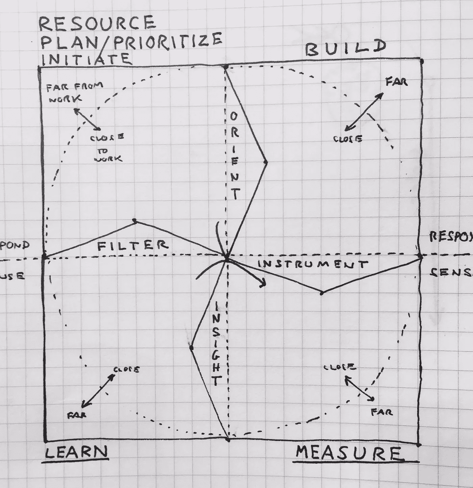
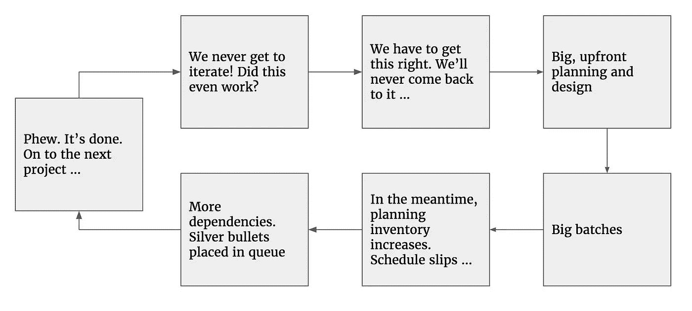
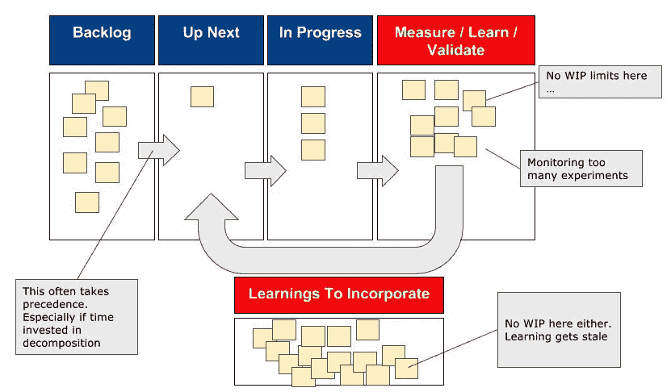
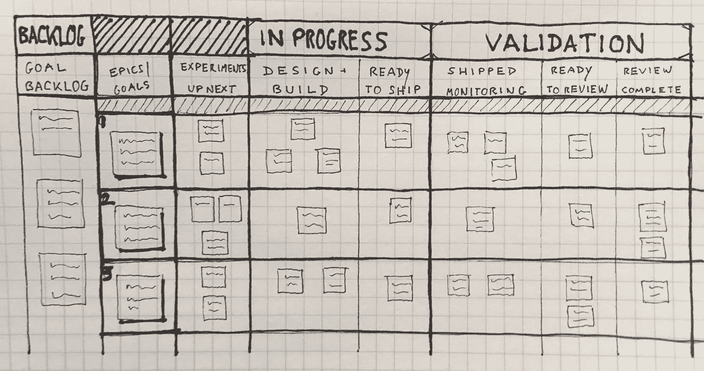

# 反馈循环和“完成”

> 原文：<https://medium.com/hackernoon/feedback-loops-and-done-72d62b410f5c>

一些团队只是假设快速反馈是不可能的。它更像是构建、构建、构建——也许是测量——最终的学习。也许他们交付了一个企业产品，在他们的客户身上“试验”的想法感觉太冒险和昂贵。或者他们缺乏工具、自主性和时间安排的灵活性。最终的结果是，在“项目完成”之后再“等来等去”，感觉效率非常低。因此，现在是下一个“项目”的时候了，业务部门(希望如此)承诺监控工作的影响，并在需要时优先考虑后续工作。

这就是敏捷——即使在交付端完美地实现了——未能解决快速反馈和迭代开发的更大问题的地方。想象一下，如果有人说“现在我们将有一个五个月的冲刺来获得反馈”…团队会退缩！然而，当你将工作推入深渊时，这正是会发生的事情。我们增加了复杂性，却没有验证这种增加的复杂性。是的，从理论上讲，你在每个 sprint 中都传递了面向客户的价值…但是你在每个 sprint 中都得到反馈了吗？

当团队谈论速度时，他们很少谈论学习和/或反馈的速度。如果您将交付周期视为从创意构思到客户“接受订单”(或增加所需价值的工作)的时间，您通常会看到开发的接触时间只是整个周期的一小部分。

假设一个 CEO 在一月份想出了一个银弹，团队在二月和五月之间专注于计划和研究，开发团队在五月和六月之间研究这个想法(同时并行地做其他三件事情)，并在七月一日发布。六个月后，客户的反应不温不火，看起来这项工作没有达到预期目标。就交付时间而言，该功能仍处于待定状态。已经一年零一个月了，还在“进行中”。

由于开发人员的时间理论上是一个限制因素，公司所做的就是努力以最有效的方式在这个宝贵的资源上工作。他们围绕这一点建立激励机制。他们围绕这一点制定部门目标。他们围绕这一点构建复杂的仪表板和项目计划。他们痴迷于相对优先顺序。他们利用不太宝贵的资源来预先准备工作。

如果说[对我的特性工厂帖子](https://hackernoon.com/12-signs-youre-working-in-a-feature-factory-44a5b938d6a2#.mgls9o4es)的反馈教会了我什么，那就是组织以非常深刻和复杂的方式围绕交付(而不是验证)进行优化。这种方法深深植根于公司文化中，包括它如何庆祝和奖励人们。公司实际上是在执行模式下运行，直到事情停止运转、人事变动、重组，这个过程不断重复。

而且不仅仅是个别组织。整个行业的存在都是为了在发货前推销“把事情做好”的方法，并确保团队“做出承诺”。

当然，有一些强大的方法可以在产品开发周期的早期降低风险，而不需要实时推出功能和衡量影响。这篇文章绝不是对那些方法的攻击。尽管如此，很少有计划能在与敌人的第一次接触中存活下来。可能更重要的是，没有反馈，团队就无法进行有意义的迭代，也无法完成任何从“第一次接触”中产生的唾手可得的成果。几个月后，背景发生了变化，研究变得陈旧，重新参与的成本很高。**但是这种方法*感觉*像是给定感知约束的经济最优决策。**

这就是这篇文章的目的…鼓励你质疑你的约束。

*   你对客户反馈的限制是固定的吗？它们没有商量的余地吗？
*   你的竞争对手在同样的限制下运作吗？
*   等待完善你的作品会让你损失多少钱？
*   通过转向新项目，你赚了多少钱？
*   你真的会回过头去结束你工作的影响吗？
*   如果是，你是怎么做的？多久一次？有多严格？
*   如果是的话，你的击球率是多少？在过去的两年里，你做过哪些好的/不好的产品决策？
*   如何加速反馈循环，使得团队基于反馈进行迭代具有经济意义？有办法降低这种风险吗？
*   你如何采取小步骤将组织的关注点从产出转变为结果？什么在起作用？在哪里？]

这是不可能的吗？

> [黑客中午](http://bit.ly/Hackernoon)是黑客如何开始他们的下午。我们是阿妹家庭的一员。我们现在[接受投稿](http://bit.ly/hackernoonsubmission)并乐意[讨论广告&赞助](mailto:partners@amipublications.com)机会。
> 
> 如果你喜欢这个故事，我们推荐你阅读我们的[最新科技故事](http://bit.ly/hackernoonlatestt)和[趋势科技故事](https://hackernoon.com/trending)。直到下一次，不要把世界的现实想当然！

