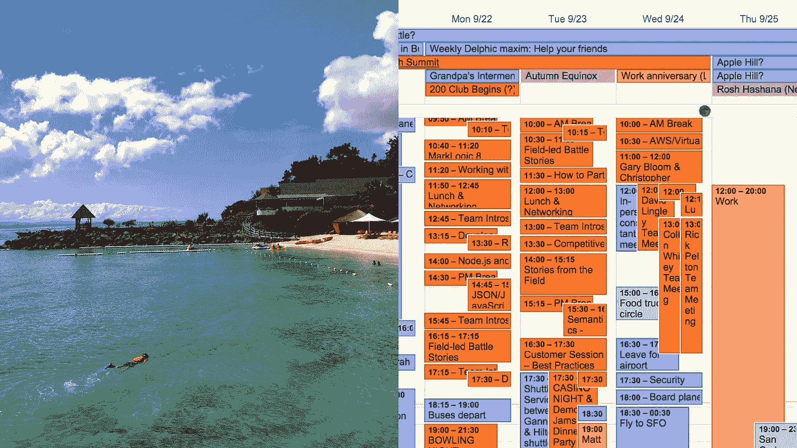

# 在数字时代寻找“工作与生活的平衡”

> 原文：<https://medium.com/hackernoon/finding-work-life-balance-in-a-digital-age-69c8b2a55ef9>

## 现在如何为“工作的未来”做准备

“Calendar” via Google Images

最近我总是听到“工作生活平衡”这个词。

关于幸福和个人成就感的故事无处不在。既然“工作”是我们生活中如此重要的一部分，那么“工作中的快乐”成为讨论的一大部分也就不足为奇了。

数字技术对我们工作体验的影响是人们对“工作与生活的平衡”重新产生兴趣的一个重要原因。毕竟，这些新技术正在重新定义工作(这里我不仅仅指自动化)。这是显而易见的。

但是，将数字技术融入我们“既定的 8 小时工作制”似乎很困难。

# **我们正在失去“平衡”**

在数字时代，我们经常为工作而挣扎。

当然，我们可以远程完成更多的工作，而无需“呆在”办公室，这是一件幸事。给我们一种“尽在掌握”的感觉。

然而，这种感觉往往是虚幻的。当“到家”5 分钟后，我们查看电子邮件，发现有多封新邮件需要我们“立即关注”时，这一点就变得很明显了。至少，这是我们的看法。

日常生活有时会让人觉得有一系列没完没了的问题需要处理。我们的公共(工作)生活和私人(非工作)生活之间曾经存在的相对清晰的界限正在不断被侵蚀。

头条思想？数字技术保证了我们工作时的*和*的灵活性。但相反，他们真正做的是延长“工作日”，并对“多任务”产生了不健康的强调。**

> **科技让我们许多人觉得自己正在“失去控制”。**

**当然，新技术创造了令人兴奋的新机会。但它们也带来了巨大的挑战。鉴于技术发展的速度，这一趋势只会继续下去。**

> ***那么，我们能做些什么来重新发现“工作与生活的平衡”呢？***
> 
> ***今天我们能为“未来的工作”做些什么准备？***

**寻找答案是在数字时代工作的挑战。但是知道该怎么做并不总是很清楚。因此，在寻找可能的解决方案之前，让我们更深入地了解一下当今工作中真正的“问题”。**

# **当我们工作时**

**在“模拟世界”中，工作在很大程度上仍然以“工作场所”为中心。**

**当然，我们可以在家里工作，但是真正的行动你必须在办公室里。我们需要一部办公室电话和传真机来联系同事、客户、供应商和其他业务合作伙伴。面对面的会议通常是达成和完成商业交易所必需的。**

**现在，我们可以远程工作，并且全天候可用。**

**我们可以廉价而方便地访问商业系统和门户网站。通过网络会议工具，我们可以随时与世界上的任何人进行在线会议。这些支持工作的技术人人都可以获得，通常费用很低。**

**数字技术创造了我们认为合适的远程工作机会。他们似乎在我们工作的时候提供了更大的灵活性。**

**但这并不意味着我们已经完全接受了数字时代提供的灵活性。**

**恰恰相反。**

**我们保留了传统的工作日，但是——利用新技术创造的机会——延长了工作日。**

**想想吧。我们仍然倾向于在早上开始我们的“正式”工作，通常是在早上 8 点到 9 点之间。我们将在中午休息一会儿，下午 5 点到 6 点回家。**

**不断增加的高峰时间是保留传统工作模式的一个明显证据。**

**但是工作日并不止于此。晚饭后，我们继续工作，“工作日”变成了“工作夜”。而且，对我们大多数人来说，一起床查看邮件，工作日就开始了。**

**这是数字技术对工作习惯和惯例的真正影响。不是更灵活的工作环境，而是工作日的大幅延长，彻底侵蚀“工作”与“休息”的区分。**

**我们创造了两个可能世界中最糟糕的一个。在这种背景下,“工作-生活”平衡成为我们许多人的问题就不足为奇了。**

# ****T3 我们如何工作****

**数字技术似乎也为我们的工作方式提供了更大的灵活性。新技术带来的生产率提高可以在我们工作生活的方方面面看到。**

**然而，我们经常发现，我们的工作是围绕业务流程构建的，这些业务流程是围绕“8 小时工作日”设计的，不知何故已经成了一成不变的。**

**我们的大部分工作都遵循既定的标准化程序。领导者倾向于通过关注过程来管理，而不是实质性的结果或目标。**

**人们不愿意抓住新技术所带来的不断创新和变革的机会。**

**毫无疑问，依靠过程感觉很舒服。但是，这种工作方式有几个缺点。**

## **过程变得比结果更重要**

**正如[杰夫·贝索斯](https://www.amazon.com/p/feature/z6o9g6sysxur57t)所说:*“过程成为你想要的结果的代理”*。**

**每个人都变得过度谨慎。毕竟，如果你遵循了这个过程，你就不会犯错误。然而，随着时间的推移，“遵循程序”创造了一种过度官僚和低效的文化，这种文化与组织的最初目标脱节。**

## **“土拨鼠日”**

**根深蒂固的流程会导致“土拨鼠日”的局面。对于类似的(甚至不同的)“问题”，我们一直在寻找相同的“解决方案”。这在数字时代的背景下尤其令人担忧，在这个时代，“问题”往往是没有先例的，一切都在不断被打乱。**

**结果是，真正的创新在一个由过程主导的世界里往往不被接受。“新的”和“不同的”受到怀疑，只有在现有程序证明无效时才作为最后手段采用。当然，这通常为时已晚，因为这导致了对创新的不公平指责，而不是创新的延迟。**

## **千禧一代**

**标准化的流程对“新生代人才”没有吸引力。**

**千禧一代倾向于“更扁平的、最佳创意赢得文化”，而不是由资历和“经验”决定的工作流程和实践。这是适得其反的，因为在这个快速变化的世界里，这类人才对于打造成长型企业至关重要。根深蒂固的流程疏远了成功所必需的个人。**

# ****解决办法？更多的自由&责任****

**新技术承诺的灵活性从未到来。**

***【当】**【如何】*我们的工作肯定是在变化的。但不是以有利于幸福和个人实现的方式。我们的工作日变长了，工作内容依然高度标准化。**

> **数字时代需要一种新的工作方式。**

**这听起来很简单，但事实并非如此。我认为，一个好的起点是重新思考我们对自由和控制的理解。**

**我们倾向于认为自由和控制是一种“零和游戏”。我们被控制的越多，我们的自由就越少。相反，当我们受到较少的控制时，我们有更多的自由。有一个权衡迫使我们选择一个(“自由”)或另一个(“控制”)。**

**我在商界随处可见这种想法。它正在推动工作日的延长和对标准化流程的重视。**

**然而，对我来说真正有趣的是，最具创新精神的公司不会这样想。他们明白，更大的“控制”并不一定意味着失去“自由”。**

***“这种关系不太典型。。。我觉得我们拥有的 Riot 越多，他们就越独立。”—* ***网大为——腾讯首席探索官*****

***“我们成长得越大，我们的控制就越松。我们允许不同的团队和领导者以他们自己的方式管理他们的团队。团队领导可以自由制定自己的管理方法，只要他们能够实现目标。”—* ***纳迪姆·马卡里姆——首席执行官&Go-Jek 的创始人*****

**“我们的模式是随着我们的成长增加员工的自由，而不是限制它，以继续吸引和培养创新人才，这样我们就有更好的机会获得持续的成功。”——***网飞介绍其企业文化*****

**这种想法乍一看似乎有点违背直觉，但我认为网大为、纳迪姆·马卡里姆和网飞已经抓住了这一点:**

> **更多的控制意味着更多的自由。更多的控制应该意味着更多的灵活性、独立性和责任。**

**我们必须调整我们的工作方式，以适应数字技术带来的可能性。这意味着拥抱自由和责任。这无疑是企业足够快速创新、避免“落后于形势”的唯一途径。**

**但更重要的是，这是让我们所有人都更快乐、更健康、在工作中更有成就感、更有效率的唯一方法。**

# **如何为“自由和责任的新世界”做好准备？**

> ***怎样才能避免导致孤独和迷失方向的“独立”和“灵活”？***
> 
> **没有“直接”领导的安慰，我们如何处理“自由和责任”？**

**这些问题没有简单的答案。但是这里有一些对我有用的想法:**

## ****# 1——试着找出*何时*、*何处*和*如何*你工作得最好****

**对工作的不满往往与我们不得不做的方式有关，而不是工作的实际内容。我在家工作的效果最好，原因已在本文中解释过:**

** [## 我为什么远程工作(提示:这与工作效率无关)。

### 以下是我能做的一些事情，因为我很幸运为一家允许我在任何地方工作的公司工作:

m.signalvnoise.com](https://m.signalvnoise.com/why-i-work-remotely-hint-it-has-nothing-to-do-with-productivity-34ace30f74fc) 

对于其他人来说，这可能是不同的。尝试一下，看看什么最适合你。

## **#2 —批判性思考**

数字时代提供了大量的技术，可以用来改善现有的工作方式。

然而，太多时候，糟糕的结果被认为是合理的，因为过程已经被遵循了。批判性思维帮助我们评估和改进我们自己的工作流程，不断使它们适应数字时代不断变化的现实。

## **#3 —** **拥抱创意**

为了创新并为“未来的工作”做好准备，我们必须“跳出框框”思考。在一个日益自动化的世界里，继续依赖传下来的标准化流程不仅没有成就感，而且是“危险的”。创造力可以帮助你重新定义你的工作，让它更符合未来。

很明显，如果我们想要应对新兴数字技术所带来的新的灵活性、自由和责任，我们都需要更有创造力。

## **#4 —学习“虚拟”协作**

团队合作仍然至关重要。

然而，并不总是需要面对面的会议。在一个将由平台决定的世界里，越来越多的人将不得不学习如何远程和虚拟地协作。这与使用在线工具没多大关系。更重要的是管理这些会议，并学会最大限度地利用它们。

## **# 5——重新连接你的好奇心**

被“过程”驱动通常不会提供太多的满足感。

好奇心(结合积极主动的解决问题的方法)更为重要。在数字时代尤其如此(所有可用的信息都在网上)。互联网和社交媒体使得快速学习和增加你的知识和经验成为可能。

但是，最终，是好奇心激发并推动了这个持续自我完善的过程。这样，工作可以再次变得有趣和充实。

 [## 好奇心胜过知识

### 如果我可以选择成为世界上最博学的人或者最好奇的人，我会选择后者，而不需要…

medium.com](/the-mission/curiosity-is-better-than-knowledge-a35b4074ba81) 

我相信“做得好”的数字技术可以帮助我们最大限度地创造幸福、充实和健康的工作生活。

*感谢您的阅读！请按住*👏*下面，还是留下评论吧。*

每周都有新的故事。因此，如果你关注我，你不会错过我关于数字时代如何改变我们生活和工作方式的最新见解。**