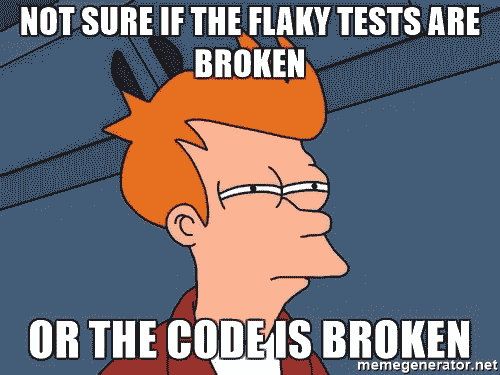

# 古怪的测试——一场永不结束的战争

> 原文：<https://medium.com/hackernoon/flaky-tests-a-war-that-never-ends-9aa32fdef359>

# 什么是片状测试？

你不讨厌事情没有确定性吗？如果没有应用代码更改，测试应该不断地通过或失败。我们应该在一个受控的环境中运行我们的测试，并根据预期的输出做出断言。我们可以使用测试夹具作为运行测试的基线。测试夹具是一个固定的状态，所以结果应该是可重复的。易变测试是指对于相同的配置可能会失败或通过的测试。这种行为可能对开发人员有害，因为测试失败并不总是表明代码中有错误。我们的测试套件应该像一个 bug 检测器。非确定性可以困扰任何类型的测试，但是它特别容易影响大范围的测试，比如验收、功能/UI 测试。

一套好的测试应该让你决定代码是否可以发布。当我有一个我可以信任的测试套件时，一个成功的测试运行给了我继续发布的绿灯。这让我有信心可以安全地重构代码。在 TDD 中，我们应该在每次代码更改后运行所有的测试。有时这并不总是可能的，但至少我们必须不时地运行整套测试。但至少，我们必须确保在提交我们的更改后，所有的测试都能成功运行。如果一个测试经常失败，这不是一个不可靠的测试，不要混淆。

# 常见的片状测试

但是你怎么能引入一个古怪的测试呢？让我们来看看测试不可靠的一些常见原因:

*   并发性:你的测试是独立运行的吗？是否有其他线程会影响流程？在集成测试中，一些并行运行的批处理作业或后台线程也可能会中断正在执行的测试。如果您在一个活动的系统上运行您的测试，是否有任何其他的外部请求会影响您？同时运行的其他测试？此外，在异步应用程序中，有时执行顺序不应该是理所当然的。
*   **缓存**:你缓存数据吗？我们应该在测试开发期间考虑缓存。有时由于时间操纵(时间旅行)、缓存驱逐或陈旧数据，测试的结果可能变得不可预测。
*   **设置—清理状态**:你在整理东西吗？一个好的测试应该总是建立它预期的环境，并且总是清除所有的定制行为。这是最难识别的片状测试之一，因为它不是失败的测试，但连续的测试可能会受到影响。
*   **动态内容**:通常，当您测试 UI 时，您希望您的测试运行得更快。但是有时候，测试可能需要先等待动态内容的加载。一些加载数据的异步调用会造成延迟。你应该记住，在人类交互的情况下，测试会运行得更快。
*   **定时炸弹**:你的测试请求当前时间吗？在哪个时区？您不应该假设您的测试将总是在与开发时相同的时区运行。你精确地测量时间间隔吗？比方说，你的测试收集了当天的事件。事件的数量会经常变化。你必须遵循与你的测试类相同的逻辑。如果这个测试在接近午夜的时候运行呢？如果您的测试受当前时间的限制，您必须记住所有特殊的情况(例如，您可能无法在夜间系统维护期间运行您的集成测试)。永远记住，一个测试将会在你的测试套件中存在很多年，并且会在所有可能的时刻运行很多次。
*   **基础设施问题**:有时候，并不是你的测试出了问题。您的测试可能会因为外部原因而失败。测试框架中的错误、selenium 驱动程序或浏览器版本的问题可能会浪费您大量的时间来找出测试中的问题。其他随机事件，如持续集成(CI)节点故障、网络问题、数据库中断等。通常更容易被发现。
*   **第三方系统**:一切都在你的掌控之中吗？不在存根外部环境下运行的集成测试不可避免地依赖于第三方系统。您也在验证外部系统的正确性。我指的是你系统中的每一个组件。应该有测试来验证与外部系统的集成，但是应该很少。当您检查系统的完整性时，应该尝试连接所有外部系统。这些测试被称为[集成契约测试](https://martinfowler.com/bliki/IntegrationContractTest.html)。

# 了解片状剥落

[*持续集成*](https://en.wikipedia.org/wiki/Continuous_integration) *是一天几次将所有开发人员工作副本合并到共享管道的实践*。不可靠的测试会阻碍/延迟开发，直到被发现和解决。问题是你不知道是你导致了测试失败，还是测试不可靠。没有简单的方法来处理易变的测试。但是有一些实践可以帮助你发现并处理它们。

# 如何识别古怪的测试

首先，用干净的系统状态重新运行所有失败的测试。这是一个简单的方法来识别失败的测试是持续失败还是不可靠。但是一次成功的复试并不意味着你可以忽略这种不可靠的测试。这是一个简单的方法来识别测试确实是古怪的，你必须处理它。有一些工具支持在开发或 CI 环境中自动重新运行失败的测试，可以帮助您度过难关。

将任何有斑点的片状测试放在隔离区。当发现一个古怪的测试时，团队应该遵循一个严格的过程。在您记录下来之后，您还可以将该测试放在隔离区。这将让其他人知道，这个测试可能是片状的，将被调查。但最主要的原因是，所有其他健康测试将保持信任。这并不意味着你可以推迟调查。很快就会有人来收拾这个。您可以通过设置隔离项目的数量限制或隔离区的时间限制来强制执行此操作。

在一天的不同时间在计划的构建中频繁运行测试可能会暴露出不可靠的测试。最好在发布过程中尽早发现一个不可靠的测试。

# 如何应对片状测试

为了处理它们，您应该以某种方式记录所有不可靠的测试。出现故障时，您必须收集所有相关数据。日志、内存转储、系统当前状态，甚至是 UI 测试中的屏幕截图，这些都可以帮助您在以后调查出了什么问题。票务系统可以很好地存储所有这些数据。这将让你知道有多少古怪的测试。你可以为这个古怪的测试创建一个新的标签，这样就有人会捡起来。

当你发现一个测试不可靠时，如果这个测试在你的代码库中存在很长时间，你应该试着找出它是什么时候被引入的。例如，如果这个测试在您的 CI 管道中再次失败，您可以尝试找出哪些代码更改可能影响了它的行为。

对动态内容做出断言的测试必须等待内容加载。将测试搁置一段时间并不是一个好的做法。UI 测试已经够慢了，你不想让它更慢。如果动态内容提供者提供了回调，那么您可以使用回调。如果没有回调，您可以在小的等待时间间隔内使用轮询。等待间隔是当内容不可用时您必须等待的最小时间，因此它应该很短。而且，它应该易于配置。测试运行环境可能会发生变化，因此等待时间间隔需要随着时间的推移进行调整。

通常通过但很少失败的测试很难重现。这就是我们前面提到的应该收集的数据可以发挥作用的地方。一旦我们发现了它们，我们就有了重现错误场景所需的东西。调查这些问题的另一种方法是多次运行测试，直到失败为止。然后我们应该做一些事后分析来找出根本原因。不幸的是，这并不总是一个双赢的程序，但在你调查可能的原因时，它是免费的。

对付定时炸弹的最好方法是用例程来包装系统时钟，这些例程可以替换为用于测试的种子值。您可以使用这个[时钟存根](https://martinfowler.com/articles/nonDeterminism.html#Time)来时间旅行到一个特定的时间，并冻结在那个时间，允许您的测试完全控制它的运动。这样，您可以将您的测试数据与种子时钟中的值同步。

如前所述，一个不小心编写的测试，在执行后没有清除它的状态，可能会浪费你很多时间，试图找出其他测试失败的原因。这些测试可能假设系统处于正常状态，这也是错误的。处理这种问题的一种方法是，当测试失败时，以相同的顺序重新运行所有的测试。单独运行时，测试可能会通过，但在特定的执行顺序下可能会失败。一般来说，您应该将测试配置为随机运行，以识别可能受到其他糟糕的书面测试影响的测试。大多数测试库提供了一种以随机顺序执行测试的方法。使用这个选项，因为它将迫使您编写更具弹性和更稳定的测试。

# 一场你赢不了的战争

当有一个大的测试套件时，很难避免不稳定的测试，尤其是在 UI/集成测试上。通常，插入率与成交率相同。团队中应该有一定程度的关于易变测试的意识，并且应该成为保护测试的[团队文化](https://hackernoon.com/the-importance-of-team-culture-af6fffead7b5)的一部分。毕竟，团队的生产力会受到影响。当你习惯于看到自己的管道出现赤字时，你不可避免地会减少对其他问题的关注。一个重复出现的有问题的测试变得不可靠，如此不可靠以至于你忽略了它是通过还是失败。更糟糕的是，其他人也会看到红色管道，并注意到失败是在非确定性测试中，但很快他们就会失去采取任何行动的纪律。一旦失去了这个原则，那么健康的确定性测试中的失败也会被忽略。红色管道应该像一个警报。这就像交通灯。红色意味着我们不应该继续发展！

# 失败的测试并不总是不可靠的！

根据经验，如果你面临一个不稳定的测试，不要认为这是一个测试问题。您应该首先怀疑生产代码，然后才是测试。有时候，一个古怪的测试可能是完美的，它只是揭示了你代码中的一个错误。请记住，bug 最好的藏身之处是不可靠的测试，开发人员会认为是测试出了问题，而不是代码出了问题。

# 进一步阅读

[根除测试中的非确定性](https://martinfowler.com/articles/nonDeterminism.html)

[Go 团队不再有奇怪的测试](https://www.thoughtworks.com/insights/blog/no-more-flaky-tests-go-team)

[谷歌的古怪测试以及我们如何减轻它们](https://testing.googleblog.com/2016/05/flaky-tests-at-google-and-how-we.html)

[如何处理和消除片状测试](https://semaphoreci.com/community/tutorials/how-to-deal-with-and-eliminate-flaky-tests)