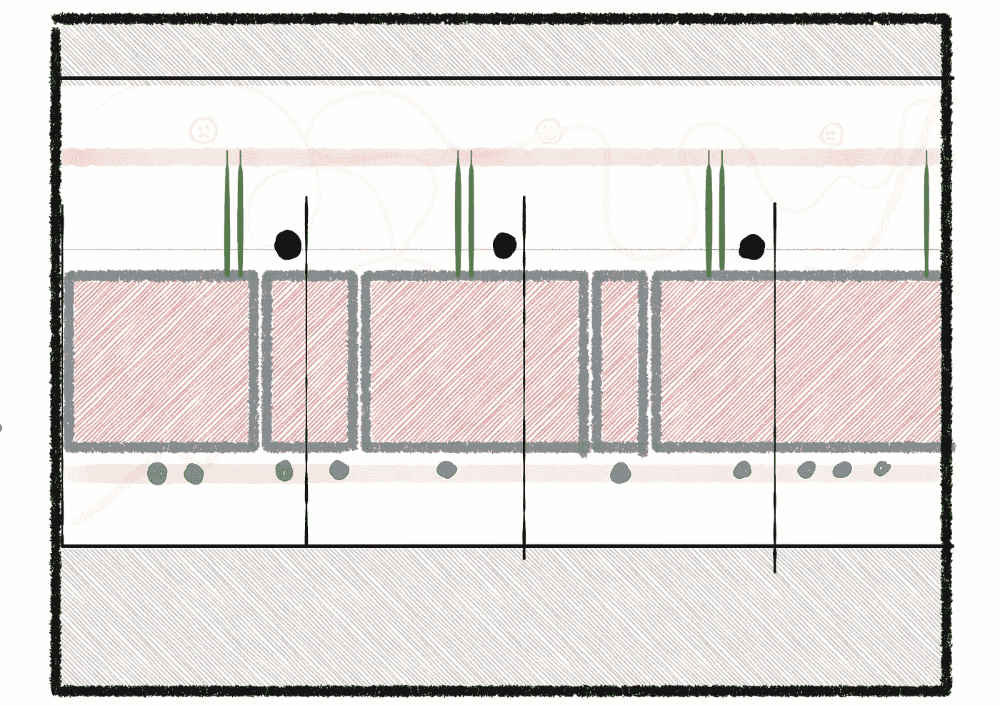
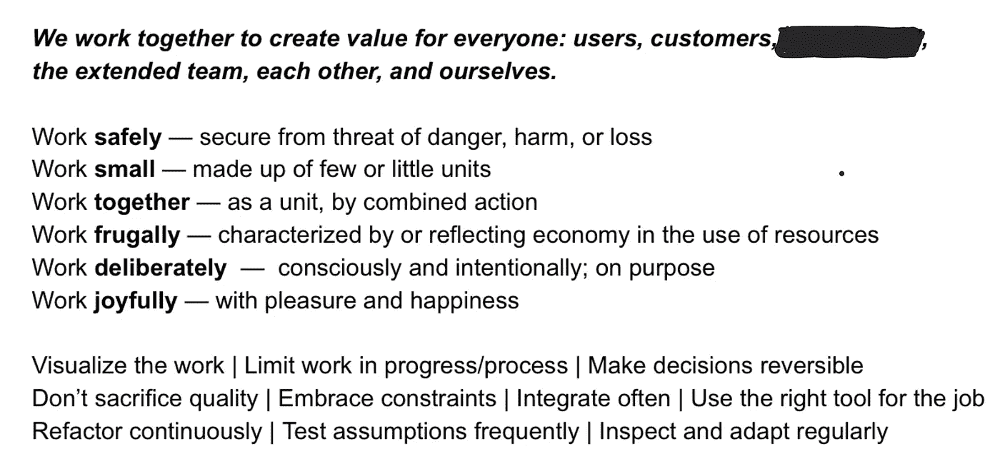

# 心流、解耦节奏和定长冲刺

> 原文：<https://medium.com/hackernoon/flow-decoupling-cadences-and-fixed-length-sprints-3eac1428ad73>

***更新:我在这里创建了一个视频来配合这个帖子***

我最近因为建议团队放弃定长冲刺而受到了一些批评。阻力在于，定长冲刺更适合经验不足的团队，而所谓的“连续流”更适合高绩效团队。

在这篇文章中，我将通过讨论可变性、有意义的目标以及“独立且有价值”与“小且可测试”来尝试触及问题的核心。

我希望展示有一系列的方法可以同时使用，即使经验不足的团队也可以从可变规模的批处理、流、拉、**和固定节奏**的实验中受益。这不是一个非此即彼的问题。

# 变化性

Sprints 会因为很多原因而中断:解决生产问题、病假、计划外休假、随机的公司会议、工具/管道问题等等。再加上“工作”的不可预测性，以及“工人”的不可预测性，你就有很多可能“出错”的地方。在任何给定的 sprint 中，我们只能控制这么多(尽管随着时间的推移，我们可以努力消除障碍)。

依赖性使这变得更加复杂。“自组织”和“跨职能”在理论上是好的，但是很少有团队——尤其是刚起步的团队——有这种程度的自主性。移交给 QA、共享 UX、共享运营、合规、客户时间表、利益相关者时间表……这些事情都不理想，但它们确实发生了(比我们希望的要频繁得多)。

这里的要点是，在现实世界中，事情是混乱的。存在大量的可变性——即使是在短时间的冲刺中——团队很少在真空中行动。这使得预测冲刺和设定“冲刺目标”变得极其困难。对于初学者和有经验的团队来说都一样——尤其是有依赖关系的团队——这变成了一场西西弗式的磨难。一个答案是让冲刺更短…我将在下面谈到这一点。

# 有意义的目标和产品增量

有意义的目标并不总是出现在同一个整洁的 N 周/天的盒子里。当然，你可以人为地“填充”一个目标使其变大，缩小一个目标使其变小，但有时你需要三天(或三个小时)来验证一个重要的假设，有时你需要十五天来拼凑一个复杂的工作流程。事情就是这样。由于时间的限制，我经常看到团队编造“某种虚假的”(他们的话)目标。

因为所有的故事都是独立的，即使是“有点假”的目标也没问题…对吗？即使团队没有实现“目标”，价值仍然是交付的。嗯。如果每一个故事都独立于 Sprint 的目标，情况就会是这样。然而…

谈到投资中的“独立”和“有价值”，这里有一个范围。从学习和帮助用户工作流程的角度来看，故事可能是独立的和有价值的，但从有意义的目标的角度来看，故事不是独立的。这就是“我”和“V”与“小”和“可测试”发生冲突的地方。如果每一个用户故事都代表一个端到端的、面向结果的用户目标(或业务目标)，那就太好了，但它通常不会那样工作。

Scrum 指南将定长冲刺描述为各种定长项目:

> 每个 Sprint 可能被认为是一个不超过一个月的项目。像项目一样，冲刺是用来完成一些事情的。每个 Sprint 都有一个要构建什么的目标，一个指导构建它的设计和灵活的计划，工作，以及最终的产品增量。

这里的 Operative 是“完成某事”的想法，这在理论上是很棒的。然而，现实中发生的是，团队开始时会问“我们在[冲刺阶段]能完成多少工作”。他们“填满”冲刺，而不是从一个有意义的“最终产品增量”开始向后。论点是，1)如果一切都是有价值的和独立的，2)一切都是有序的，3)有速度的历史，4)有透明度…嗯，一切都会解决的，如果一些东西在最后被“剩下”了…没什么大不了的。

实践中接下来会发生什么？一个 sprint 结束时没有产生产品增量(或者没有真正达到目标的增量)，当故事被“踢”到下一个 sprint 时，有很多歌曲和舞蹈，并且新的目标——前一个目标和新目标的奇怪混合物——被设定。

# 小工作与“价值”

同样，在小规模工作(小故事、频繁集成和演示，以及频繁交付到产品中)和交付价值(以不同的规模和分辨率)之间存在矛盾。短距离冲刺非常有价值，因为它们帮助我们更频繁地检查/适应/整合/现实检查。但是你并不总是能够把有意义的目标放进那个时间盒里。这给团队带来了延长时间盒的压力…导致冲刺跑太长。

这是我的看法。你谈论的是两种不同的节奏:有意义的目标(有价值的产品增量)，以及有价值的、紧密的、频繁的反馈循环……它们非常有价值，但不是*相同的*类型的价值。单一的、固定的迭代长度不可能适应各种有意义的目标。有时我们会做一些小的优化。有时候我们在测试一个新产品的核心生存能力。有时我们每天都在改变。

# 到目前为止的总结

总结一下。

*   我们会遇到大量的可变性(包括我们无法控制的可变性)。
*   我们有意义的目标往往与我们独立而有价值的故事不相符。两者都很重要。
*   有意义的目标不会都有相同的大小/形状
*   “小工作”有惊人的好处，有一个有意义的(灵活的)目标也有惊人的好处。
*   经常检查和适应有惊人的好处。

# 混合场景

团队如何应对这些挑战。我将使用实际团队的工作协议:

团队:

1.  有一个有意义目标的优先列表(待办事项是在目标中描述的，而不是单独的故事)
2.  设定 1 天到 30 天的有意义的目标(团队同意最长 30 天，之后重新评估整个目标)
3.  在拉动的基础上连续处理这些目标(一次一个，只有在最后一个目标完成后才开始一个目标)
4.  直观显示依赖关系，并直观显示计划外中断的影响(例如生产问题)
5.  使用历史数据预测“有意义的目标”的持续时间(如果有很多噪音、干扰、依赖等，这尤其有用)。)
6.  及时解决目标规划问题(故事地图等)。)
7.  在频繁配对的情况下，将单个故事的长度限制在 3 天以内
8.  每周召开会议，进行回顾并讨论进展
9.  每周在一个功能标志后面将新工作投入生产(自动，每周)
10.  尽可能进行演示和可用性测试(使用试运行和/或生产)

这是一个混合体。有些事情每周发生一次，有些事情及时发生，有些事情以自动化的批次和“任何可能的时候”发生(例如，每周的发布系列和频繁的测试)。

# 为什么？好处…

这里发生了什么事？定长短跑是一种游戏。你玩游戏，玩游戏也有好处。团队只能误入歧途到此为止，如果你“照章办事”,你将会在每一次冲刺结束时得到一个可发布的产品增量。如果你失败了，那么，无论如何一切都是独立的(希望如此)。或者你只是把事情推到下一次冲刺。

让它们发挥作用需要技巧。但老实说，也有很多运气在起作用。在某些情况下，它们还会掩盖实际发生的事情，特别是当你是一个更大的系统的一部分，有依赖关系，并且负责一个生产系统的时候。

我上面分享的模型享受了固定长度短跑的一些元素。但是团队并没有在每个冲刺阶段结束时载歌载舞，而是专注于重要的目标。同时——这一点很重要——他们也致力于小工作，并经常检查、适应和测试。当他们遇到意想不到的变化时，他们会随遇而安，不断改进，以尽量减少这些干扰。

小工作+有意义的工作+检查/适应。

# 最后

我并不是说定长短跑不好。他们可能为你工作。事实上，假设你决定每月发布一次“新东西”。这是你的固定增量。但是一个月是一段很长的时间！因此，您仍然可以从每周进行的小规模工作中受益，并且可能及时地(尽可能频繁地)向大约%的客户演示/发布特性。

我的观点是它不是非此即彼的。你应该意识到，并不是所有的团队都按照固定长度的冲刺、每个冲刺结束时的回顾以及节奏计划等来进行 Scrum。有很多方法可能对你有用。

无论你做什么:

1.  想象你的工作真实发生的样子
2.  检查和调整
3.  小工程
4.  经常集成和检查/调整
5.  做有意义/有价值的工作

喜欢这个由团队创造的使命宣言:

