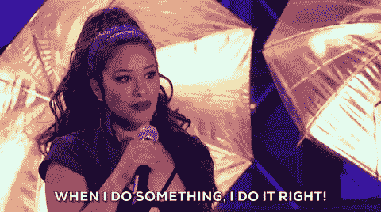

# 用 Android 开发单飞

> 原文：<https://medium.com/hackernoon/flying-solo-with-android-development-c52d911b62bf>

Photo credit : [http://www.magic4walls.com/crop-image?id=14269](http://www.magic4walls.com/crop-image?id=14269)

我的 [Android](https://hackernoon.com/tagged/android) 职业生涯始于两年半前，当时我在一个四人 Android 团队的支持下，从后端开发过渡到移动[开发](https://hackernoon.com/tagged/development)。一年后，我加入了一家 B 轮创业公司，在那里的大部分时间里，我是两名 Android 工程师之一。在小团队中工作是获得独立性和向其他工程师学习的好方法。

但是，五个月前，当我加入一家由六名员工组成的种子基金创业公司，成为他们在 T4 唯一的安卓工程师时，我实现了从小团队到无团队的飞跃。在我的新角色中，我一直在从头开始构建 [Winnie](https://winnie.com/) 应用程序，它刚刚发布了！

事实证明这是一个巨大的飞跃。单飞是一项挑战，但也非常值得。一路走来，我明白了独自工作有利也有弊。最重要的是，你可以做一些事情来帮助自己走向成功。以下是迄今为止帮助我的一些策略。

## **与社区有联系。做你的作业。**

我对单干的担忧之一是没有 Android 队友来讨论新想法或作为他们想法的共鸣板，这是我在以前的角色中非常享受的。

好消息是网上有大量的资源可以扩展你的知识和视野。从网上各种会议的对话如****[**360 |安德夫**](http://360andev.com/)**等到你的及时剂量从 [**零散播客**](http://fragmentedpodcast.com/)**[**安卓对话**](https://www.youtube.com/channel/UCMEmNnHT69aZuaOrE-dF6ug/videos) 和 [**安卓周刊**](http://androidweekly.net/) ，有很多方法********

****我个人最喜欢的是[**caster . io**](https://caster.io/)**——每一个小讲座的代码样本都让我保持警觉！本地聚会或虚拟社区，如[**Android dev subred dit**](https://www.reddit.com/r/androiddev/)， [**Google+社区**](https://plus.google.com/communities/105153134372062985968) **，** Slack 小组和 Twitter 是继续对话和在遇到困难时提问的好地方！******

## ****回顾你自己的公关并保持高标准。****

****我高度鼓励打开公关，然后自己审查。评论你自己的公关会感觉很傻，但我认为这是一个健康的习惯(在这个相关的 Android 对话[集](https://www.youtube.com/watch?v=CtxBO9zq7vQ)中也有讨论)。****

****我使用 Github 的预览功能进行第一遍浏览，然后让它停留一段时间，然后再看一遍。我尽我最大的努力来审查我的公关，就像我审查同事的公关一样，这样我就能以同样的标准来对待自己。第二次检查你所有的代码也有助于捕捉错误和边缘情况，并保持你的代码一致和干净。****

## ****一个“坏”的模式通常比没有清晰的模式要好。****

****您将不得不做出许多决定——您应该使用 [MVVM](https://upday.github.io/blog/model-view-viewmodel/) 、 [MVP](/upday-devs/android-architecture-patterns-part-2-model-view-presenter-8a6faaae14a5#.vcztbt47h) 、 [Flux](http://lgvalle.xyz/2015/08/04/flux-architecture/) 和/或其他架构模式吗？片段还是自定义视图组？什么应该有抽象，什么不应该？****

****在项目开始时，从一种模式开始，然后意识到另一种模式更好，这种情况并不罕见，这导致了一些重构或模式的分化。****

****虽然在某些情况下打破你的模式是有意义的，但是当你找到你更喜欢的东西时，最好注意重构并在任何地方一致地改变它。这听起来可能很明显，但是当你独自工作时，很容易对所有新代码使用新模式，这可能会在你知道之前很快导致混乱和不连贯的代码库！**即使模式不是很好，一致性也使得确定路线变得更容易。******

## ******强烈考虑使用 Kotlin。******

****尤其是如果你是从零开始！如果没有，考虑在你要写的下一个类中尝试一下。****

****我最终没有使用 [Kotlin](https://kotlinlang.org/) 是因为我对提出这个想法没有信心，因为我当时对它没有任何经验，也不想阻止团队中的后端 Java 开发人员为代码库做出贡献。****

****然而，在看了[克里斯蒂娜在科特林的讲话](https://www.youtube.com/watch?v=mDpnc45WwlI)并做了更多研究后，**如果我再做一次，我至少会尝试一下。Kotlin 有很多优点——甚至仅仅是避免了因为空指针异常而导致的崩溃，以及不用处理 Java 样板文件就让我信服了！杰克·沃顿的这个演讲也是一个很好的起点。******

## ****不要过于依赖第三方库，尽量保持控制。****

****我记得花了很多时间试图决定一个用于 MVP 的库，因为有很多这样的库。虽然被宠坏的选择是一个很大的问题，但我最终自己实现了一个简单的版本，并对此非常满意！****

****当选择使用什么样的第三方库时，我建议考虑你是否真的需要它，以及它将如何限制应用程序未来的开发——它是否会增加单元测试的难度？它是否限制使用 Android 免费提供的功能，比如屏幕之间的过渡动画？它是否正在积极开发中，是否有许多应用程序使用它？这帮助我做出明智的权衡和决定。****

******我建议进行优化，在不重新发明轮子的情况下，尽可能多地保留控制权。几乎所有东西都有一个库，但是你最好自己实现一些东西。******

## ******制定测试和可访问性计划。******

****如果你是从零开始构建，那么从第一天起你就有机会做正确的事情是非常令人兴奋的！如果没有，你可以试着用你写的所有新代码把它做好！****

****当试图赶上紧迫的截止日期时，测试和可访问性退居次要位置的情况并不少见——当你独自一人时，会更难找到时间来做这件事，因为你没有和其他任何人分担工作。****

****我承认我自己只是在这个旅程的开始，但是我写代码时考虑到了测试，通过使用依赖注入、模型视图呈现模式、只向 UI 暴露我的模型对象的接口等等，目的是使测试更容易。我还让 [**CircleCI**](https://circleci.com/) 从项目一开始就在每次提交后构建，作为健全性检查并更接近运行测试。****

********

****对于可访问性，我尽可能添加内容描述，并在发布前使用 [**可访问性扫描器**](https://play.google.com/store/apps/details?id=com.google.android.apps.accessibility.auditor&hl=en) 来找出我下一步应该关注的内容。肯定还有更多工作要做，但这是一个开始。Kelly Schuster 做了一个很棒的[演讲](https://realm.io/news/kelly-shuster-android-is-for-everyone/)，讲述了开发人员可以采取哪些可行的措施来让他们的应用程序更容易访问。****

****如果你不能花时间写测试，那么准备一个手动测试计划。例如，在一个文档中为每个特性写下不同的测试用例(正面的，负面的),并确保在每次发布之前测试它们！**为自己开始编写测试设定最后期限，并为可访问性改进设定同样的期限，否则他们很可能永远也不会完成**。****

## ******告诉你的 iOS 设计师他们错了，寻找潜在的 Android 皈依者:-)。******

****不要害怕为你的平台挺身而出！当你单干时，你负责让其他人跟上最新的 Android UI 模式，以及代码库。****

****我主要处理 iOS 截图，但使用[材料设计规范](https://material.io/guidelines/)和精心设计的 Android 应用程序作为资源，帮助我将这些设计转换为 Android。此外，没有什么比链接到官方材料设计文档更好的方法来表达你的观点了！****

********

****关于代码库，当我的 CEO 帮忙几个月的时候，我帮助她了解我们的架构和概念，比如 MVP、Dagger2、RxJava2 等等。我建议留意潜在的 Android 转换者，因为向某人解释你的决定或者教他们一个新概念有助于你真正拥有它，或者认识到你的错误。****

## ****尽早进行测试。****

****如果你正在使用一个尚未发布的应用程序，或者正在对一个现有的应用程序进行重大修改，这是适用的。Google play 有一个 [alpha 和 beta 频道](https://support.google.com/googleplay/android-developer/answer/3131213?hl=en)，在 beta 频道中，你可以选择封闭或开放的 beta。****

****如果你正在开发一个现有的应用程序，你仍然可以并行运行一个测试版，只要它的版本高于生产应用程序。如果是公测版，用户可以在 playstore 上选择加入，或者点击链接。如果你试图测试小规模的变化，那么[分阶段推出](https://support.google.com/googleplay/android-developer/answer/6346149?hl=en)可能更好。****

****如果你正在开发一个新的应用程序，我建议**尽快进行封闭测试，并在发布前准备好的时候将其转换为开放测试。**我们的第一个封闭测试版功能很少，但它帮助我们在早期排除了错误，进入了定期发布的轨道，并在整个过程中收到了宝贵的反馈。这也导致了无压力和顺利发射！****

****第一次单干是一次很好的学习经历，因为你可以前所未有地挑战自己，更加自立，对代码库进行完全的创造性控制(不管是好是坏)，了解更多你喜欢的东西，并处理那些你只能怪自己的错误(耶)。我对单飞感到紧张，但事实证明这是一次有趣的经历，因为上面的建议对我起了作用。希望对你也有帮助！****

****你在考虑单飞还是想分享你的经验？我很想收到你的来信！请评论或❤帖子，或随时在 [Twitter](https://twitter.com/anitas3791) 上联系。****

************************

> ****[黑客中午](http://bit.ly/Hackernoon)是黑客如何开始他们的下午。我们是阿妹家庭的一员。我们现在[接受投稿](http://bit.ly/hackernoonsubmission)并乐意[讨论广告&赞助](mailto:partners@amipublications.com)机会。****
> 
> ****如果你喜欢这个故事，我们推荐你阅读我们的[最新科技故事](http://bit.ly/hackernoonlatestt)和[趋势科技故事](https://hackernoon.com/trending)。直到下一次，不要把世界的现实想当然！****

********