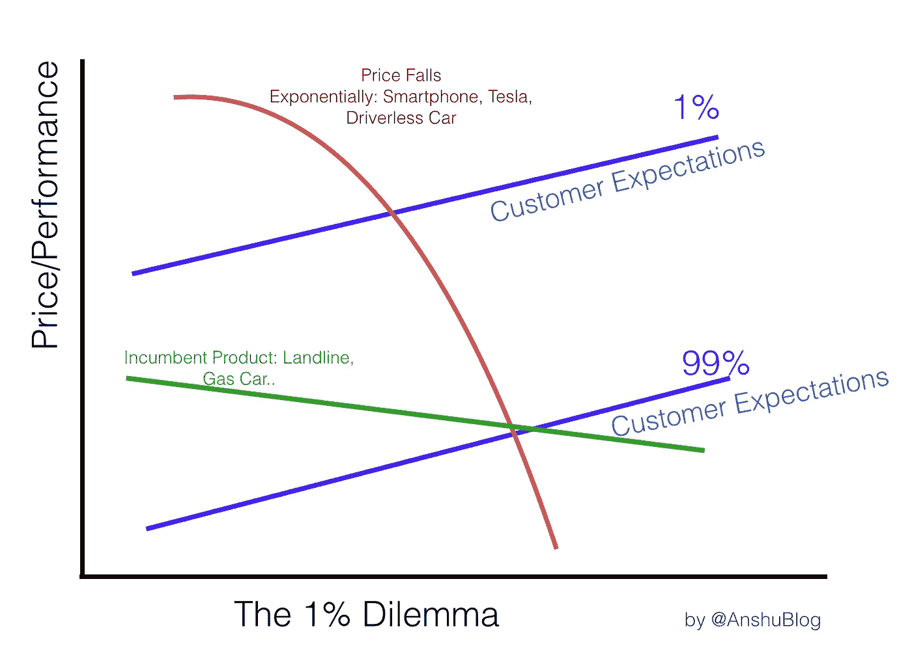
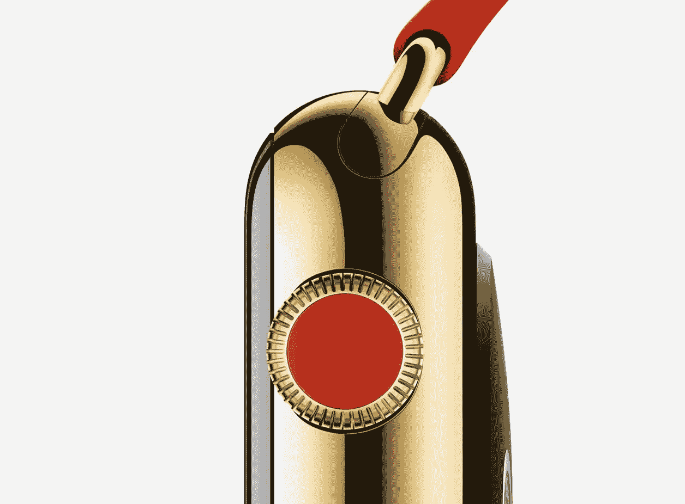
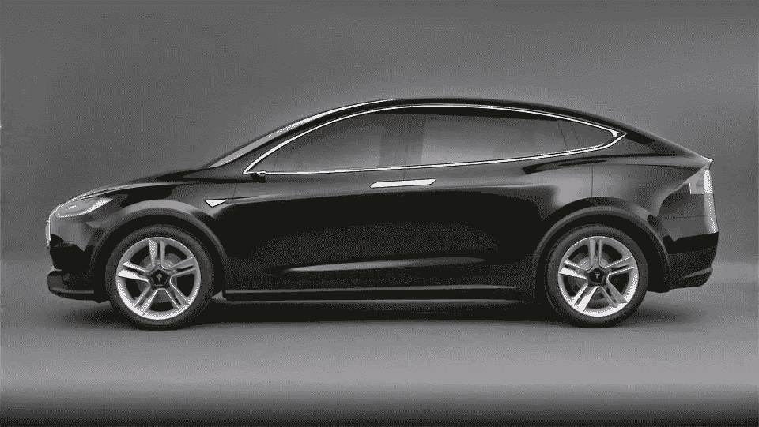

# 忘记穷人，为 1%的人建造它

> 原文：<https://medium.com/hackernoon/forget-the-poor-build-it-for-the-1-5317c2d5b6ba>

1%的话题不断引起共鸣，因为它既吸引了大众，也造成了很大的分歧。随着苹果推出最新款 iPhone，其价格甚至高于早期的苹果手机，这是一个重新审视为什么这是一个伟大的战略的好时机。

苹果推出了另一款产品，许多批评者称其定价过高，并专注于 1%。我在这篇博文中认为这是一个非常好的产品策略。

Apple Watch Edition: The Gold Watch for the 1% of the 1%

有一些非常有趣的初创公司正在将技术带给大众，并为金字塔底层的人解决问题。手机让像移动商务这样的创新进入了银行和医疗保健领域，这在以前是不可能的。

但我相信，对一个企业家来说，正确的答案往往是反其道而行之，专注于相对富裕的人。事实上，像 iPhone 这样的创新始于以只有相对富裕的人才能负担得起的价格解决一个问题。特斯拉也一样。还有奥古斯特。

Car for the Rich Elites. The 1%.

让我们来看看为什么这看起来工作得这么好，以及对于什么样的创新。

**金字塔顶端的创新——未来是富裕的，生活在堪萨斯州**
想象两三年后我们都将获得哪些商品和服务的一种方法是，看看相对富裕的人今天在做什么。随着特斯拉扩大规模，走向低端市场，竞争对手许可其技术或制造自己的版本，电动汽车将成为所有人都能负担得起的产品。随着它成为事实上的行业，我们在未来几年都将获得超薄的 Macbook Air 电脑。

The Lock Suitable for Kings. Only $199 for a lock.

作为一名企业家，你可以通过迎合那些“生活”在未来的人的需求来预测“未来”——因为他们有能力花更多的钱。事实上，收入只是预测未来的一种方式——你也可以瞄准某些地区。比如美国[有谷歌光纤的城市](https://fiber.google.com/about/)，以及未来提前到来的韩国和日本的高带宽无线城市。当你制造出一个满足这些“未来城市”和“未来人”需求的产品时，你就解决了一个最终与大众相关的问题，你将领先你的竞争对手很多年。

**在未来，每个人都是富有的(比喻)**
好吧，我们都知道这不是字面上的真实说法。但是如果你看看今天即使是最普通的人也是如何生活的，几十年前我们的生活方式会让富人羡慕——空调很少，很少有好的娱乐(或任何娱乐),旅行很难而且很慢，床有虫子，没有人对我们今天所有人都有神奇免疫力的疾病有免疫力，这要归功于疫苗和抗菌药物。你不必回到 100 年前才能感觉良好。与十年前相比，现在你和我可以用一部普通的智能手机做些什么。

摩尔定律和它的伙伴们从本质上降低了获得各种惊人创新和发明的成本。本质上让我们变得富有。就在昨天，我被一个最低工资的保安打断了，他只是在做他的工作——用一个应用程序在他的 Android 手机上拍摄共享烧烤区的照片来完成他的工作！

这对你的实际意义是——如果你生产的产品价格只有相对富裕的人才买得起，那么随着时间的推移，你的产品会变得更便宜，进入更大的市场。我相信，价格过高的联网锁、个性化医疗、3D 打印、无人驾驶汽车、学习恒温器以及其他许多令人惊叹的创新都将是如此。今天，它们看起来都有点贵——当你把它们与大规模生产的竞争对手相比时，甚至贵得离谱。但是价格神奇地下降(规模和时间会这样)比低端产品神奇地变得更好(永远不会自己发生)更容易。

富人像兔子一样成倍增长
过去几十年的收入增长都流向了相对少数的人。在美国，收入超过 10 万美元的家庭数量在过去 20 年里实际上增加了很多。因此，尽管我们的家庭收入中值增长速度没有美国快，但高收入家庭的数量正在激增。尽管富人是通过收入增长而不是再生产创造出来的——事实上，生育率随着收入的增加而下降。

波士顿咨询公司的报告指出，现在如果你把中国和印度的新百万富翁考虑在内，全球拥有高净值和高可支配收入的人数正在快速增长。

我们有机会制造满足富裕大众市场需求的产品。正如星巴克将咖啡的平均价格从不到 1 美元提高到 3 到 5 美元，富人乐于花钱购买有价值的产品。

在技术方面，我们可以从苹果产品的表现中看出这一点——不仅仅是数量(这是值得尊敬的)，更重要的是盈利能力。

对我来说，以下产品代表了满足富裕大众市场“需求”的产品。
-苹果 iPhone
-苹果 iPad
-星巴克
-特斯拉(早期和高端)
-普锐斯
-有机食品(我们都想要好的食物，只有我们中的一些人买得起)——见[中国](http://www.businessweek.com/articles/2013-07-10/after-safety-scares-chinese-look-to-mothers-milk-and-other-alternatives)
-后备箱俱乐部

目标:250，000 美元
考虑开发那些对年收入 250，000 美元或更多的人有吸引力的产品。或者，如果你想更富裕一点，把家庭收入定在 10 万美元，在旧金山和纽约以外的地方，这仍能让你获得大量可支配收入。

如果你关注富人，你会建立什么？
-更好的租车服务？像 Silvercar.com
——更好的旅游服务？
-更好的空中旅行？NetJets.com？Clearme.com？
-家庭保健？OneMedical.com？私人医疗服务？
-更多设备连接到我的身体？
-更好的睡眠？睡几号床？泡沫？
-更快的互联网？谷歌光纤
-更好的锁？更好的婴儿监视器？

最棒的是你现在可以用一个新的约束来思考。(没有约束通常是个坏主意)。拿起你不喜欢的产品，想想你能用 2 到 10 倍的价格造出什么！