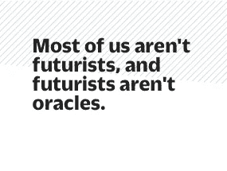
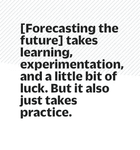

# 让你公司的每个人都成为未来主义者的四个问题

> 原文：<https://medium.com/hackernoon/four-questions-to-turn-everyone-in-your-company-into-a-futurist-5be1f6ff1850>

[Image: flickr user Dragan]

## 坚持问正确的问题，你对未来的预测会比你的竞争对手更少出错。

还记得 1997 年是什么样子吗？有多好？

这是亚马逊的第一个完整财年。微软的 Windows 97 操作系统还没有出现，它很快就变成了 Windows 98。互联网泡沫正在形成，但我们看不到它。2000 年也即将到来，但我们中很少有人担心。谷歌？两年内不会。许多公司仍然在问自己是否真的需要一个网页，专业人士正在决定是否要一个电子邮件地址。

当时，2007 年的世界还很遥远，难以想象，而 2017 年实际上是一个完全的抽象概念。当然，就商业世界而言，这并不是一个可悲的失败；未来真的很难预见。但回过头来看，不完美的预测总会带来真实的成本(金融危机是其中之一，日益增长的网络安全威胁是另一个)，这些成本在很久以后仍必须得到考虑。

我们大多数人不是未来派，未来派也不是神谕。他们只是试图对即将发生的事情有所了解——不是硬性的预测，只是可能性。我们能够做出的最准确的预测往往是宽泛的。有一点一直很清楚，那就是技术只会更加深入我们的世界和组织，扰乱我们做事的方式，给我们带来更多的威胁和机遇。相比之下，这将会是一个公开的问题。

尽管如此，公司还是有一些方法不仅可以更好地预测即将发生的变化，还可以更好地预测这些变化一旦到来将会对公司产生怎样的影响。让你公司的每个人都成为更有效的未来主义者，首先要问正确的问题。以下是其中的几个。

## 1.我们评估未来的过程是什么？

你的公司可能没有一个正式的、成文的方法来预测未来，但它肯定有一个商业战略。商业战略源于对正在发生的变化的一些假设——准确与否。

这意味着，从功能上来说，你的公司*已经*一直在猜测未来。重要的是它的基础，确定这一点需要一点自我检查。首先采取以下步骤:

1.  仔细检查你当前的策略，就在此时此刻。你的团队执行当前计划的情况如何？今天需要什么样的改变？从你当前情况的角度考虑这些执行方法，以确定变化的环境是否可能使你的组织更有效或更无效。
2.  分析当前工作对团队、合作伙伴和客户的影响。你的业绩最明显可以提高或增加收入的地方在哪里？
3.  评估你目前的能力，以便做出这些改进。你有什么资产和资源来尝试新事物？

如果这种评估听起来有点过于关注当下，不要担心。你对未来的假设直接根植于你现在做事的方式中。组织内部的大多数人——一线员工一直到高管——通常不会花时间去思考这些问题。仔细地重新审视你现有的过程可以让你更容易看到你当前的战略假设你正在走向的未来。

## 2.我们如何阅读新闻？

对我们许多人来说，科技领域的创新往往预示着任何地方的变革。许多商业领袖的预测依赖于他们在新闻中读到的总体主观感觉。这是一个不错的开始。但真正重要的是我们可以对尖端创新做出的推断，做出更多经过研究的推断需要实践。

让我们举一个去年早些时候关于“智能灰尘”的文章中的例子这是指一种物联网(IoT)技术，它基于可以分散在各处的微小传感器，然后向网络报告环境信息——噪音、光线、化学物质、振动、温度等。在地平线上的是针头大小的 RFID 标签，它可以贴在任何产品上，因为它可以通过制造和分销。

例如，如果你在会计部门工作或为一家化学公司工作，“smartdust”可能看起来只不过是科幻小说中的好奇心，特别是因为物联网作为一个整体似乎最近已经[遇到了一些严重的障碍](https://www.fastcompany.com/3064904/after-years-of-warnings-internet-of-things-devices-to-blame-for-big-internet-attack)。

虽然具体细节可能不会直接影响你或你的行业，但这种创新的潜在趋势肯定会。它暗示着，随着地球变得越来越互联，我们将被新一波信息淹没。这些是我们可以对这一浪潮将如何展开做出的一些基本推断，即使个别技术有着截然不同的命运:

*   任何可以数字化的东西都会被数字化。
*   任何可以无线传输的东西都会。
*   任何可以变小的东西都会。
*   信息将会更加自由地流动。

这些技术变革将继续重塑商业世界的组织方式。随着信息变得越来越丰富，越来越不集中，更多的组织也可能去中心化，以便对所有信息做出快速反应。

在跟踪新闻发展时，不要被细节淹没，但也不要忽视它们。想一想先分析后综合:那个引起如此多关注的新的大合并——它揭示了买家的优先考虑和对即将到来的事情的本能？或者，还有几年才能上市的新技术，你不断听到的零零星星的新技术——它建立在什么样的技术之上，或者有可能最终取代什么样的技术？

然后开始连接这些点:其他公司都在做类似的赌注吗？有没有另一种现有技术的命运可能会被这种听起来科幻的技术所决定？培养这种对你所听到的变化的综合感觉——无论多么不同——可以帮助你磨砺你的未来主义肌肉。仅仅在公司会议上花点时间(甚至每周 15 分钟)一起讨论一些最新的商业和科技新闻就能让你的整个团队养成这个习惯。

## 3.我们是否一直在测试我们认为运行良好的东西？

当业务和技术没有整合时，各种不好的事情都会发生。这种缺乏集成的最常见的原因是对两者之间关系的未经测试的假设。

例如，旨在自动化现有业务流程的软件可能只会加速低效或无效的流程，而不会贡献最大的业务价值——即使您假设技术 X 正在自动化流程 y。“我们已经在做那件事了，”您可能会想象。但是你能确定它真的有效吗？

它也可以反过来切。调整流程以适应软件中嵌入的规则可能会消除一些使公司与众不同的活动，并给它带来优势——至少是暂时的，直到你对竞争的假设不再正确。在这两种情况下，外部世界比以往任何时候都变化得更快；它有时会在项目实施前出现变化。

有时最终用户会改变主意。有时他们会对强加给他们的任何新事物犹豫不决。有时技术人员会因为新技术本身而爱上它。有时候，他们从来没有被问过有什么新技术可以改善业务流程。难怪这么多科技项目失败！解决这个问题的唯一方法是不断测试支撑你公司选择的基本信念——尽快知道什么时候某些“解决方案”(技术或其他)不再实际解决任何问题，即使它们曾经解决过。

但这里的答案不是试图一次又一次地翻转每一块石头。而是不停地问“我们的目的是什么？”换句话说，你为什么在这里，你的公司服务于什么目的？你这个月是否和上个月一样有效地实现了这个目标？如果不是，怎么来的？而对*的回答是*会在你的组织中那些断开的链接一断开就带你去找它们。

## 4.我们如何管理信息？

想象一下，你工作的大楼被剥去了墙壁，露出了管道基础设施——将水引入大楼并进行分配的管道。现在想象一下它的各种用途——有人在一层用热水洗手，有人在另一层用冷水洗手，热水器提供热水，饮水机冷却等等。

相关:

*   [攻克 3 种最常见的公司危机](https://www.fastcompany.com/3062710/the-three-kinds-of-crisis-companies-face-and-how-to-pull-through)
*   [这段无人机捕捞金枪鱼的视频能教会你什么是破坏](https://www.fastcompany.com/3059743/what-this-video-of-a-drone-fishing-for-tuna-can-teach-you-about-disruption)
*   数据科学会让你的商业直觉变得无关紧要吗？

现在想象一下大楼的信息基础设施——电话和互联网布线、收发蜗牛邮件的盒子、有线电视连接、无线路由器等等——从外部或内部获取信息并分发出去。

然后想象一下这些信息的使用者。一名主管研究一个计算机仪表板上的运营数据，一名员工在网上冲浪，一名行政助理筛选纸质邮件，一个委员会开会并听取报告，电子邮件源源不断，运营计划被打印、装订并放在书架上，等等。

新的想法随着这些信息的“流动”而产生。领导者的任务是双重的:确保你有正确的流程，并创建“过滤器”来捕捉最有价值的想法，同时丢弃无用或相关的东西。

你如何设置这些过滤器？一般来说，信息可以通过三种方式进行管理。一种是通过组织结构，如决策小组。另一个是过程——谁把什么信息交给谁。另一种是通过自动化——收集和呈现数据的技术，比如来自网站的 CRM 数据。

但是，尽管将您的组织同时视为信息收集者、处理者和分发者是至关重要的，但在所有这些信息中发现新的东西并采取行动也同样重要。未来学家[艾米·韦伯概述了一些问题](https://www.fastcompany.com/3066258/innovation-agents/how-to-spot-fake-trends)，任何人都可以问自己，以区分真正的趋势和仅仅是“趋势”的东西——从噪音中分辨出众所周知的信号。套用她的三条标准(尽管不止这些):

*   趋势是及时的，但会持续一段时间。
*   一种趋势甚至在它还在出现的时候就已经在演变了。
*   随着趋势成为主流，点与点之间的联系越来越紧密。

我们无法预测未来。但我们可以确保下一代领导人准备好生活在其中，理解它，并尽可能战略性地策划它的剧变。这需要学习、实验和一点点运气。

但这也需要练习。只要你能让组织内的每个人都不断问正确的问题，你对未来的预测就可能比你的竞争对手更少出错。

**原创文章**[**@ fast company**](https://www.fastcompany.com/3066740/the-future-of-work/four-questions-to-turn-everyone-in-your-company-into-a-futurist)**。**

*连续创业者* [*费萨尔·霍克*](http://www.fastcompany.com/user/faisal-hoque) *是* [*沙多卡*](http://www.shadoka.com/) *的创始人，使创业、成长和社会影响成为可能。他是《万物互联:如何在创造、创新和可持续发展的时代进行变革和领导》和其他书籍的作者。免费使用* [*万物互联领导 app*](http://app.everythingconnectsthebook.com/login.php)*。*

**版权所有 2016，作者 Faisal Hoque。保留所有权利。**

> [黑客中午](http://bit.ly/Hackernoon)是黑客如何开始他们的下午。我们是 [@AMI](http://bit.ly/atAMIatAMI) 家庭的一员。我们现在[接受投稿](http://bit.ly/hackernoonsubmission)，并乐意[讨论广告&赞助](mailto:partners@amipublications.com)机会。
> 
> 如果你喜欢这个故事，我们推荐你阅读我们的[最新科技故事](http://bit.ly/hackernoonlatestt)和[趋势科技故事](https://hackernoon.com/trending)。直到下一次，不要把世界的现实想当然！

