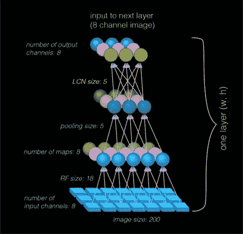
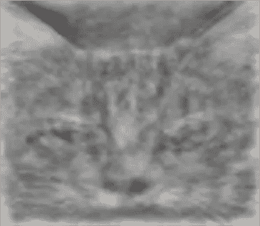
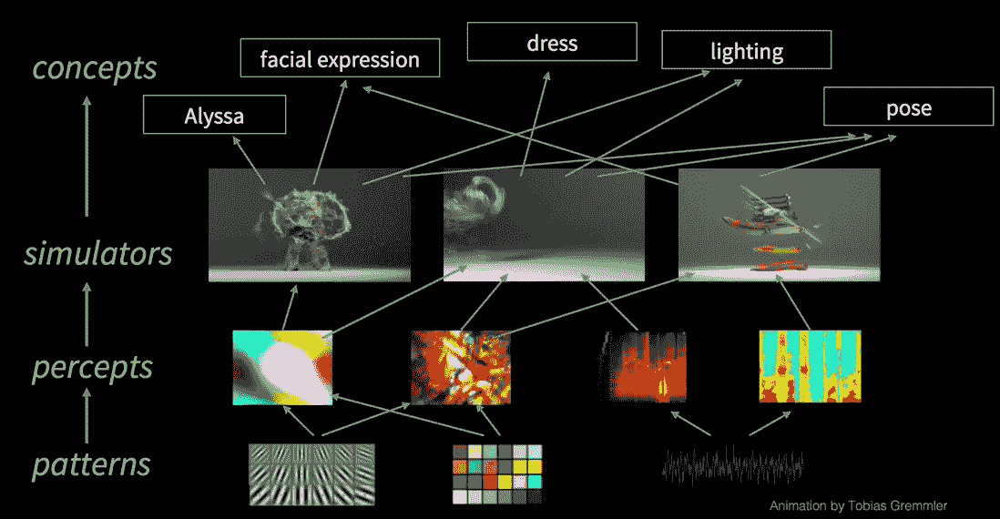
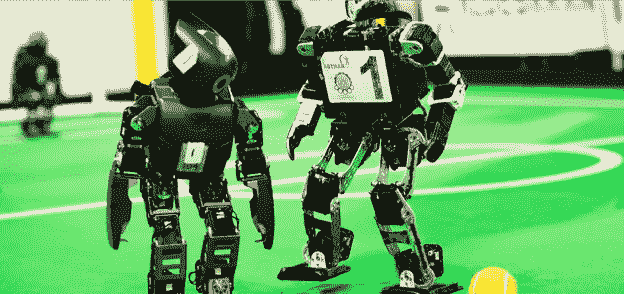
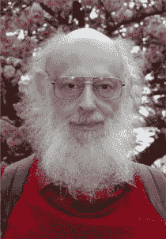
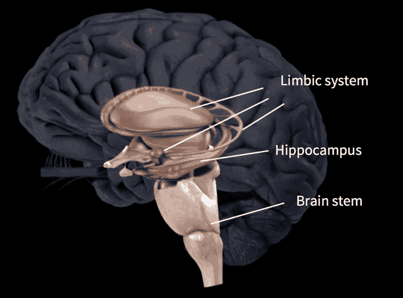
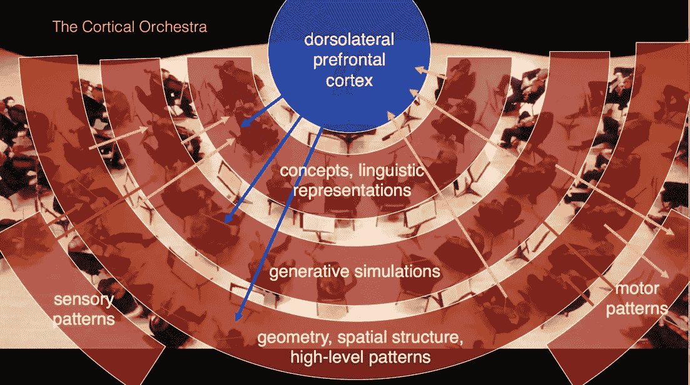
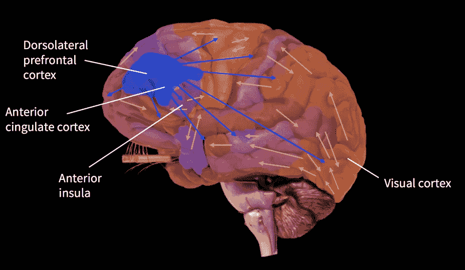

# 从计算到意识:人工智能能揭示我们思维的本质吗？

> 原文：<https://medium.com/hackernoon/from-computation-to-consciousness-can-ai-reveal-the-nature-of-our-minds-81bc994500ab>

TEDx talk on the topic of this post

问题:“我们是谁？”——我们的大脑是如何工作的，它与宇宙有什么关系？——是我们人类可以问自己的最迷人的谜语。我相信人工智能领域可以给我们独一无二的答案。计算机模型允许我们将思维理解为*因果系统*，并通过构建开始自己理解世界的系统来测试这些模型。

One of 9 layers of the image recognition network presented by Andrew Ng’s group in 2012

现在，我们正处于一场技术革命之中，被称为“深度[学习](https://hackernoon.com/tagged/learning)”。自 20 世纪 50 年代末以来，工作中的人工神经网络就已经出现，并且进展稳定而缓慢。但是在 2012 年的春天，不寻常的事情发生了。[由吴恩达领导的一个来自谷歌和斯坦福大学的研究团队](https://arxiv.org/abs/1112.6209)建立了一个运行在 16000 个计算机核心上的神经网络，并用从 Youtube 上随机选择的 1000 万帧对其进行训练。网络事先不知道它在看什么，也没有收到任何关于结果的反馈。这个网络只是在寻找结构，寻找任何一种规律性。一千万张图片——这可能是一个人类婴儿在生命的前六个月所能看到的数据量的十倍。经过三天的训练，研究人员可以向系统展示来自 ImageNet 数据库的任意图像，该数据库包含 22000 种不同类型或对象。在 15.8%的情况下，[网络](https://hackernoon.com/tagged/network)会猜出正确的图像，尽管在训练期间没有人监督。它的结果比以前存在的任何东西都好 70%，比任何复杂的手工制作或学习的图像识别软件都好。

Overlay of patterns triggering the “cat neuron”

该系统还在互联网上一夜成名，因为它能以 75%的准确率识别猫的图像。(当然，如果它是用 Youtube 训练的，这并不是一个非常令人惊讶的结果。)

深度学习使用学习特征检测器的层次结构，有时有数百层。我们的系统正在快速改进:去年，它们在识别 ImageNet 数据库中的图像方面实际上比人类更好，并且在玩 PacMan 时打败了人类。今年早些时候，蒙特卡罗方法和深度学习的结合在围棋上击败了人类，这种游戏被认为在未来相当长的一段时间内都是计算机无法企及的。

## 建立一个对你进行图灵测试的系统

然而，尽管取得了这些成功，我们学习的计算机系统和实际的大脑之间还有相当大的距离。你可能听说过图灵测试，这项任务是建立一个系统，让人类认为它似乎是智能的。但是你知道我们如何识别一个系统是真正智能的吗？它会对你进行图灵测试！

有头脑意味着我们理解什么是有头脑，并且我们积极地在别人身上寻找它。我们在他人身上寻找理解，包括他们是谁的意识，以及他们如何在我们身上寻找这种意识。

## 需要多长时间？

我们要多久才能成功建造人造大脑？马文·明斯基在 1953 年和约翰·麦卡锡等人一起创立了这个领域，他给出了我所知道的最好的估计之一:

> “我相信现实主义，正如约翰·麦卡锡的评论所总结的那样，如果我们真的努力工作，我们将在 4 到 400 年内拥有一个智能系统。”——马文·明斯基

从一开始，该领域就分成了两种截然不同的方法:认知人工智能，它将计算机模型视为理解和构建思维的一种方式；狭义人工智能，它是一种构建更智能数据处理的工程学科。我们的模式识别系统远不是头脑。

Photograph by Lois Greenfield

想象一下，我们正在舞厅里看一群跳舞的人，我们想辨认出哪个是艾丽莎。我们的系统通过过滤掉所有分散我们对 Alyssa 身份的注意力的混乱来做到这一点:舞者的姿势，灯光，服装，特别的面部表情。所有这些事情都可能发生变化，而艾丽莎仍然不知何故保持不变。但是我们需要超越过滤:世界上没有混乱，因为一切都是相互关联的特征，在不同的环境中变得有意义。我们需要超越对个别类别的认识。我们需要建立一个完整的、动态的世界。

我们的大脑通过创建从低级感知开始的层次来做到这一点:简单的视觉或听觉模式。我们把它们组织成动态的感觉运动脚本，精神模拟。在我们的脑海中，我们看到移动的物体，听到声音和说话声，我们观察人们的互动，我们想象可能的世界。我们将这些模拟映射到概念，我们可以用逻辑和分析思维来处理这些概念，并将它们映射到自然语言中，以使我们的想法与他人同步。

Our mental representations of movements are produced by hierarchies of neural generators in the brain (motion capture visualization by Tobias Gremmler)

头脑不是分类器，它们是模拟器和体验者。模拟和体验不是我们感官数据的一部分:这些数据只是从神经细胞传入我们大脑的电和化学模式。我们所经历的世界实际上是我们头脑的创造，一个锚定在由我们的感觉神经产生的稀疏而不稳定的冲动中的梦。这个梦是最能预测我们的神经下一步会发现什么样的冲动的数据结构。

## 机器人认识论

在我学术生涯的早期，我在一个教机器人踢足球的小组工作。这些机器人观察从相机传感器、运动探测器和加速度计进入它们计算机大脑的数据模式，充当它们的感觉神经。根据这些数据，他们创建了一个运动场、其他机器人和球的模型。他们用它来计划、协调和执行他们的行动，由行为程序驱动，使他们把球推进球门。

当我们旅行时，我们经常把机器人的身体和操场留在家里，因为它们又重又大。相反，我们让机器人在模拟的世界中玩耍，有模拟的身体，模拟的身体互动，模拟的图像生成。机器人没有办法注意到实际物理游戏场的任何差异，因为到达机器人计算机大脑的数据具有完全相同的结构，不管它是来自物理世界还是我们的模拟器。我们的机器人在同一个梦境中工作，不管它们是共享我们的现实世界还是被困在母体中。

## 索洛蒙夫归纳

Ray Solomonoff

这个原理是，思维正在从感官数据中产生一个模拟世界，一个梦，无论是我们踢足球的机器人的简单的，无意识的思维，还是我们人类的思维，都是 Solomonoff 归纳的结果。

在 20 世纪 60 年代，Ray Solomonoff 发现了信息处理大脑所能知道的极限。他问自己:如果一个机器人醒来并意识到它只是一个机器人，一个与环境相连的信息处理系统，除了数据、信息和可辨别的差异之外，他什么都不能给他，怎么办？机器人能想出的世界上最好的模型是什么？Solomonoff 归纳说，机器人能做的最好的事情就是从所有过去的观察中，为你的所有观察找到最能预测下一次观察的最短程序。从人工智能的角度来看，所有的头脑都是这样的信息处理系统，从感官数据中生成一个模拟世界，一个梦。我们对世界的感知，包括我们对物质、能量、空间、人和艺术的想法，是一个动态的梦，我们的大脑用过去的观察来预测未来的观察。

## 从反馈循环到认知

深度学习让我们对神经元如何获取信号流并发现其中的结构有了重要的见解。我们的大脑可以用这些结构做对计算机来说仍然非常困难的事情:我们可以将它们排列成一个完整的、动态的世界，我们将它们重新排列成可能的世界。这允许我们去想象，去记忆，去创造。(这也是大多数动物做不到的。)

我们的神经系统是我们机体的控制系统。它从许多简单的反馈循环开始。其中一些存在于我们的脑干中，调节我们的体温、心率和呼吸模式。

通常，反馈循环是不够的，我们需要改变我们与环境的互动，以保持我们的有机体活着。痛苦告诉我们少做目前正在做的事情，快乐告诉我们:多做现在正在做的事情。快乐和痛苦让我们选择行动和地点。它们位于大脑中部。它们也在学习信号，所以我们可以朝着未来快乐的方向前进，避免未来的痛苦。为了实现这一点，他们在我们的需求和世界各地之间建立了联系。

我自己的工作主要是理解我们需求的结构，这给我们感知、体验、预期和决定带来了动机上的相关性。

A simplified model of the engine of motivation, showing physiological, cognitive and social needs, interacting to produce pleasure, pain, valence, arousal, attention.

每当我们感到有需要时，我们可能会唤起情境来减少它。每当我们期待一个地方，我们可能会有一种感觉，它会给我们带来好处或坏处。我们的需求和地点之间的这种联系可以储存在海马体中。

哺乳动物拥有一个新大脑皮层，我们也许可以最好地理解为海马体的延伸。我们的新皮层是我们大脑中最大的部分。正是在那里，我们的有机体创造了它所感知的世界的梦想，包括它所感知的自己的故事。

Cortical columns

我们的新大脑皮层可以做一些我们尚未充分理解的事情，以便用机器学习来重建它们。例如，我们的思想、概念和心理模拟都是合成的。就像乐高积木一样，我们可以用许多可能的方式把它们组合在一起，或者更确切地说，它们学会了如何自我组织来做到这一点。相同的神经元素可以以不同的方式连接起来，在我们的脑海中演绎出公园散步、一段音乐、一部电影或一部陀思妥耶夫斯基小说。许多研究人员认为，大脑通过将我们的神经元组织成皮层列来实现这一点。每一列都是一个小电路，大约 2 毫米高，包含 100 到 400 个神经元。我认为它们中的每一个都在学习逼近自己的小数学函数，并被一个状态机控制着，这个状态机控制着它们如何连接和相互交流。我目前的研究探索了这是如何工作的。

这些列被组织成皮层区域。每一个都专注于特定类型的特征，当它们连接起来时，就会产生一个动态移动的世界。一个典型的皮质区有几百万个皮质柱。把大脑皮层想象成管弦乐队中的一件乐器，演奏我们大脑的音乐，理解世界的一部分，协调我们行为的一部分。

一些仪器连接到我们的感觉输入，来自视网膜或脊柱。其他人可以控制我们的运动。大多数人只是听他们的邻居，传递他们的音乐，以便处理流的形式。

我们无法整体体验皮层音乐，但在这个皮层管弦乐队中，有一个大脑区域充当指挥。我们认为它位于背外侧前额叶皮层，它与大多数其他大脑区域有联系，所以它可以注意他们在做什么。指挥没有自己的想法。它只是一个专门的大脑区域，就像其他区域一样，它每次只能对其他几个大脑区域正在做的事情给予肤浅的关注。它的作用类似于真正的管弦乐队中的指挥:当乐器走调或它们之间有冲突时，它试图控制它们，并决定今晚演奏什么。指挥提供执行功能和对头脑表现的反馈。没有导体，我们的大脑仍然可以执行大部分功能，但我们是梦游者。一个梦游者也许能够开门、出门、回答问题甚至做饭，但是家里没有人:梦游者的行为是不连贯的，没有目的的。

## 意识的功能基础

我们神经系统中的每一个过程都用来调节机体的一部分及其环境。导体调节大脑皮层自身的功能。在每一个时刻，它会将注意力集中到一个或几个皮质乐器上，而其他的可能会在背景中继续演奏而不被注意到。为了学习和反思，指挥会保持一个它所关注的协议。这个协议是一系列由其他皮层仪器产生的经验的链接。这是我们的经验被整合的唯一地方，在这里我们的心智模型的不同部分可以一起被体验。

在指挥家的礼仪中，最新的、新鲜的条目是我们对当下的体验。意识可能只是我们前额叶皮层所处理的最近记忆。有意识的体验并不是一种存在于世界或内在空间的体验。这是一个梦的重建，锚定在由 50 多个区域演奏的音乐中，由 860 亿个神经元组成，反映在一个区域的协议中。我称之为**意识的指挥理论**。意识的一个有趣的方面是，指挥可以将注意力引导到自己的协议上，从而体验到有意识的体验。这样，我们的头脑不仅在给自己讲述一个关于自己的故事，它也在倾听它。

作为一名人工智能研究人员，我的目标是建立不仅仅是对数据进行分类的系统。我想建立一个系统，学习从这些数据中构建一个动态的梦，发现它们是自己的思想，并对你进行图灵测试。我相信建立这样的系统是我们发现自己的最好机会。

> [黑客中午](http://bit.ly/Hackernoon)是黑客如何开始他们的下午。我们是 [@AMI](http://bit.ly/atAMIatAMI) 家庭的一员。我们现在[接受投稿](http://bit.ly/hackernoonsubmission)，并乐意[讨论广告&赞助](mailto:partners@amipublications.com)机会。
> 
> 如果你喜欢这个故事，我们推荐你阅读我们的[最新科技故事](http://bit.ly/hackernoonlatestt)和[趋势科技故事](https://hackernoon.com/trending)。直到下一次，不要把世界的现实想当然！

