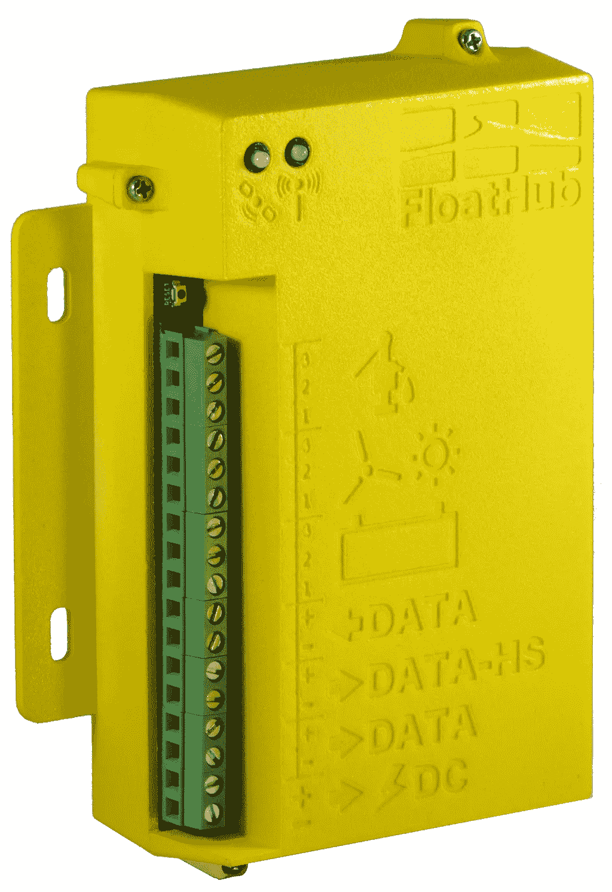
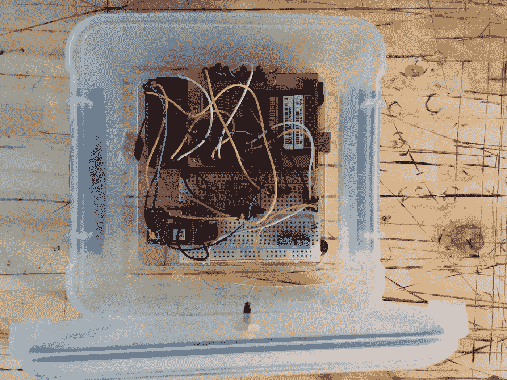
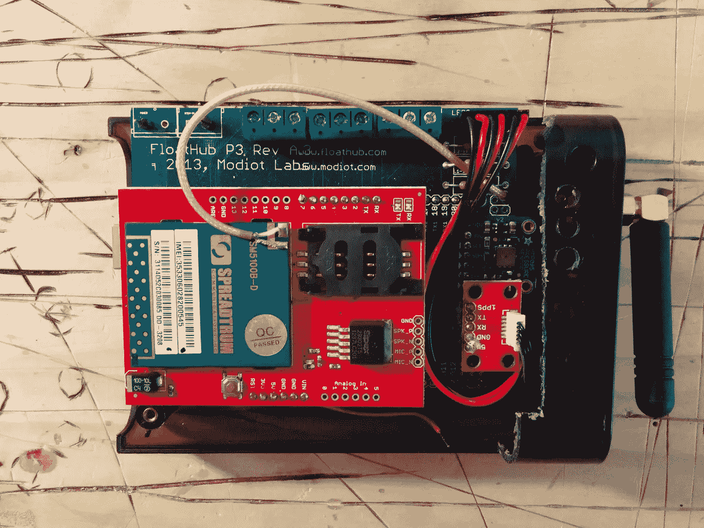
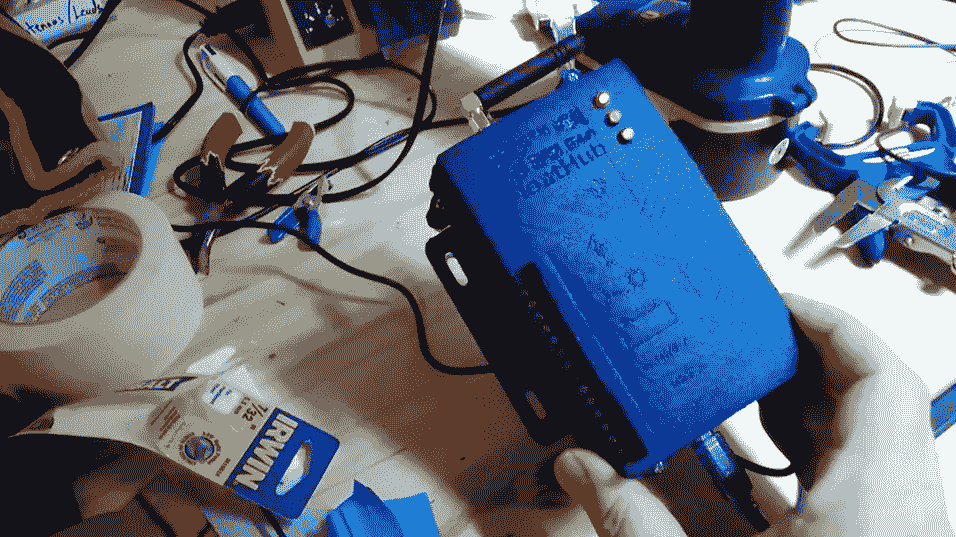
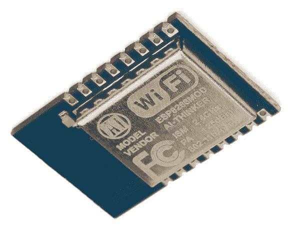
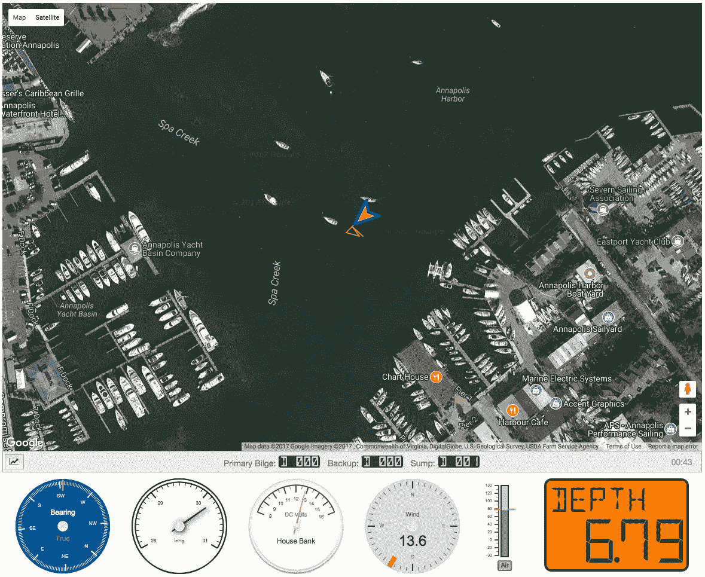

# 从跃跃欲试到发布

> 原文：<https://medium.com/hackernoon/from-itch-to-launch-3a8cfa7a241e>

(对于那些突然联系到这里的人来说，Floathub 是一种单向的“船只之巢”；一个 [*硬件设备*](https://support.floathub.com/hc/en-us/articles/219307708-The-FloatHub-Device) *监控船只的系统并发送数据到一个* [*在线接口*](https://floathub.com/demo) *)*

当我们为我们的 [KickStarter 发布](https://land.floathub.com/kickstarter/)做最后准备时，许多被我们强迫充当 beta 测试者的人一直在问我们关于 FloatHub 的历史。我们并没有在这里或那里散布答案的片段，而是试图写下一个相对简短的叙述，说明我们是如何走到这一步的(从技术的角度来说)。

最初的动力是一个明确的痒；在无数次到达我们的船上，发现一些与电池没电、地板进水等相关的小灾难后。等等，我们想，破解这个问题的解决方案能有多难？当我们不在船上时，必须有一种负担得起的方式来监控船上发生的事情。只需将一些传感器焊接到一部旧的 2g 手机上，然后将读数推送到某个地方的服务器上。平面文件数据存储、一些 grep 脚本、一些日志循环，就大功告成了。不会超过一个下午。:-)

最初，我们没有试图创造一个商业产品的意图。我们只想解决自己的问题。也许为处于相同情况的朋友创建一些额外的副本

**硬件选择**

在最初几次很容易被遗忘的实验失败后，我们做出了一些基本的硬件决定。我们希望使用真正的微控制器(而不是更复杂的 Raspberry Pi 或其他更高级别的系统)。主要原因是用电，因为船只经常需要自己发电。但是我们也被这个设备的一个非常简单的设计目标所吸引；理想情况下，它会在船上呆上几个月甚至几年，没有人需要干预和更新它，安装新的驱动程序等等。在某种程度上，我们想用数据做任何聪明的事情，我们非常确定正确的想法是在网络上做，在它已经被推下船之后。另外，写低级微控制器代码有一些很难定义但非常令人满意的事情；你负责几乎所有的事情。与大多数其他类型的软件开发相比，仅仅在裸线上运行一个编译器并使用以千字节为单位的内存是一个令人耳目一新的变化。

因为我们想与其他船上系统(深度探测仪、风速等)交流。)由于船上大多数历史数据系统使用 4800 波特协议，这是 RS-232/RS-422 的近亲，我们知道我们需要多个串行端口。因此，我们选择了 Arduino Mega 作为原型开发平台(它有 4 个串行端口)。我们还希望能够直接测量模拟电压，以报告电池电量、充电系统和泵电压(查看泵何时运行以及运行多长时间)。我们还是保持非常简单，开始设计一个定制的 Arduino 屏蔽，其中包括由简单电阻组成的简单的[分压器](https://en.wikipedia.org/wiki/Voltage_divider)。我们还确保我们的电路板设计通过所有接头连接，以便我们可以在顶部堆叠更多的屏蔽层。添加嵌入式 GPS 绝对是轻而易举的事情(只需供电并与任何丰富的 GPS 芯片组进行串行连接，例如无处不在的 [Neo 6](https://www.u-blox.com/en/product/neo-6-series) 系列)。这不仅给了我们位置，也给了我们日期和时间信息。我们还增加了一个测量温度和气压的博世芯片。

因此，有了现成的 Mega 和半试验板/半屏蔽原型，我们就有了一个基本系统，可以监控 9 个电压，与其他板载系统对话，知道它在空间和时间中的位置，并进行一些环境天气测量。

FloatHub Hardware v0.0.1 (~2012)

在硬件的第一次实际工作迭代中，我们使用了一个蜂窝屏蔽，它与串行端口 2 上的 Mega 进行交互，并且基本上使用了一个 Hayes 调制解调器命令集。这样，我们可以定期执行 AT-CALL *{HOME}* (这将获得到主机和端口的基于 GRPS 的 TCP/IP 套接字连接)，然后 AT-SEND *{STRING OF DATA}* 向主机发送数据包。

所以下一个挑战是，*{数据串}* 实际上应该由什么组成？

**协议**

在服务器端，无论出于何种目的，我们都可以在数据类型、标记、握手、传输频率、安全性、加密等方面做任何我们想做的事情。挑战在于设备端，我们的小微控制器花费了大量的时钟周期将字符组合成一个字符串。发送它们需要更长的时间。如果连接中断，我们不得不担心如何将数据存储在一个很小的 EEPROM 中，同时试图不断给家里打电话。

至于标记数据，最明显的选择是许多海洋仪器已经使用的 NMEA 协议，基本上所有的 GPS 芯片组都会说话。这将具有使设备非常非常简单的优点。它可能只是一个网关，通过手机链接把 NMEA 送上来。主要的缺点是，在这种情况下，NMEA 是白痴般的罗嗦；一个 GPS 芯片即使完全静止不动，也能以 4800 波特的速度在 NMEA 链路上不断输出位置数据。由于 NMEA 实际上是一个本地的硬连线串行协议，它完全没有身份或安全的概念。

第二个自然的选择是当时新兴的基于 JSON 的机载系统标准，名为 [SignalK](http://signalk.org/) 。这有几个很大的优势，尤其是它是真正自由和开放的。不幸的是，虽然试图在极小的内存空间中标记 JSON 几乎是不可能的，但这非常困难，并且非常限制您可以处理的数据量(SignalK 在 FloatHub 世界中的正确位置是作为服务器的输出，这是我们目前正在积极努力的方向)。

所以，当然，我们推出了自己的方案。细节是[可用](https://www.modiot.com/FloatHubCommunicationsProtocol_0.35.pdf)，但它的要点是，我们需要两种消息类型，而且它们都必须是好的和紧凑的。首先，我们需要一个及时采样类型的消息，显示所有系统的当前状态(电池电压、水深等。).我们还需要一个可以在重要事件刚刚发生时发送的时间点消息(例如，一个泵在 UTC 时间 11:23:06 准时打开)。然后，我们必须有一些约定来解释消息来自哪个设备(即唯一的标识符)。最重要的是，我们需要某种形式的加密，否则我们将在 TCP/IP 上传递明文数据(包括位置信息)。一个完整的 SSL 风格的基础设施堆栈可能会淹没我们的小 Megas，但我们确实有足够的空闲程序空间来挤进一个 [AES-CBC](https://en.wikipedia.org/wiki/Block_cipher_mode_of_operation#Cipher_Block_Chaining_.28CBC.29) 例程。

**迭代硬件**

然后，我们在晚上和周末花了将近 3 年的空闲时间来迭代硬件。我们离真正的电路设计忍者还很远，但逐渐从通孔、手工焊接元件发展到表面贴装。所有的布局和设计都在 [Eagle](https://www.autodesk.com/products/eagle/overview) 中完成。我们尝试了几个不同的地方进行印刷电路板(PCB)原型制造，但最终选定了[seed](https://seeedstudio.com/)，因为他们可以以合理的速度小批量地完成 PCB 制作和[组件组装](https://www.seeedstudio.com/fusion_pcb.html)。

Hardware Rev P3.A3 (2013)

在我们的定制屏蔽取得进展的同时，我们在物理堆栈顶部使用了一些不同的 Arduino WiFi 和蜂窝屏蔽进行通信。我们需要一个外壳，它可以包含这种三层 PCB 夹层，有一个开孔，螺丝端子可以用来连接电压测试、GPS 安装点、WiFi 和蜂窝天线等。我们确实花了相当多的时间寻找现成的现成案例，但从未找到一个真正有效的案例。

所以，为了增加这个“简单的破解”解决方案的时间投入，我们开始摆弄 CAD/CAM 软件。我们知道我们可以 3d 打印一个案例，如果我们能设法用建模软件来包装我们的大脑。我们从 [OpenSCAD](http://www.openscad.org/) 开始，我们非常喜欢它。它实际上更像是一种编程语言，而不是传统的基于 GUI 的 CAD/CAM 工具，所以我们在使用它时能够像软件开发人员一样思考。数据和指令在“源代码”中(例如，在这里画一个盒子*在那里画一个圆柱体的体积*)，然后通过“编译器”(即 OpenSCAD)运行，以创建“对象”(即可以发送到 3-D 打印机的文件)。我们获得了一个简单的 Printrbot，并开始大量修改外壳。随着我们原型单位的数量增加，我们最初用 [Shapeways](https://www.shapeways.com/) 打印它们，尽管最近越来越多地使用[巫毒制造](https://voodoomfg.com/)。**

**

*Hardware Rev P4/P5 (2014)*

*在 2015 年的某个时候，我们真正确定了物理设计，并认为从机箱的角度来看我们已经“完成”了。我们仍然只是半认真地对待真正的商业产品，我们开始阅读[注射成型](https://en.wikipedia.org/wiki/Injection_moulding)。我们天真地认为，任何可以 3d 打印的文件也可以很好地用于工具模具。有几个问题:1)当时，OpenSCAD 对大多数工具系统使用的 IGES 或 STEP 文件不太好，2)一个叫“草稿”的小东西。我们设计的围栏几乎处处都是简单的直角。事实证明，对于将从模具中出来的零件来说，这并不太适用。你需要逐渐变细(至少一点)的角度，这样零件冷却后可以弹出。这种[草图](https://en.wikipedia.org/wiki/Draft_(engineering))的概念可能在任何 CAD/CAM 或工程课程的第一个月就被教授，但这对我们来说是新闻。由于我们已经有了 OpenSCAD 的格式问题，而且我们无论如何都要重新设计整个外壳，我们转而使用 [FreeCAD](https://www.freecadweb.org/) 进行我们的 CAD/CAM 工作。经过几个月的业余时间学习工具，然后用它来重新设计外壳，我们终于有了一些东西，ProtoLabs 的自动化设计检查人员说可以毫无困难地注射成型。*

***一个服务器进程***

*随着电子设备和物理规范的出现，我们回到了自己开发的数据协议的服务器端。这是一个很好的项目，有一个非常明确的范围:*

1.  *侦听传入的连接*
2.  *从设备接收字符串，以换行符结束*
3.  *通过发送一个简短的响应字符串(通常是关闭连接)来确认接收*
4.  *给定字符串初始部分的唯一标识符，尝试解密它(AES-CBC)*
5.  *成功解密后，解析出数据元素并将它们填充到永久存储器(数据库)中*

*我们基本上使用了一个带线程混合的 Python TCPSocketServer，在一些相当小的 AWS EC2 实例上运行。每项工作都非常谨慎。当字符串到达时，在开头附近有一个包含唯一标识符的定义部分。在服务器端数据库中查找，我们获取该“帐户”(设备的唯一标识符)的相关 AES 密钥并尝试解密。如果成功了，那么我们就可以从字符串中解析出明文数据，并存储在这个“帐户”的相关表中。*

*我们在这里做的唯一一件近乎聪明的事情是，认识到每个“帐户”的流数据可以存储在自己的表空间中(没有设备数据直接依赖于任何其他设备的数据)。我们可以使用中央数据库来查找“帐户”信息，并在其中包括指向可以存储消息数据的特定于设备的主机/数据库/表的指针。虽然设备的每次传输非常小，但他们每小时可以发送多达 120 次，经过几天、几周和几个月的时间，每台设备的传输量可以增长到多个 GB。以这种方式对数据进行分片使得处理起来更加清晰。例如，删除一个“帐户”只是一个简单的表格删除，而不是在一个巨大的超级数据表上仔细选择。我们可以通过横向添加更多的数据库实例，以相对简单的方式进行扩展。*

***令人惊叹的 ESP8266***

*在 2015 年的某个时候，我们注意到我们开始大量使用“账户”这个词，这意味着我们真的开始认为这是我们可能试图进行商业销售的东西。剩下的最大技术障碍是设备配置。在此之前，我们一直在对设备标识符、AES 密钥、网络设置和其他参数进行修改，主要是通过编辑源代码、重新编译，然后重新刷新 Mega。对于验证核心功能来说，这已经足够了，但是作为“用户体验”来说，这还远远不够。我们用一个非常简单的串行协议做了一点实验，你可以通过一个终端程序来设置参数，但是即使这样也不是非常用户友好。我们还试验了蓝牙和一个应用程序，我们可以将串行线路协议隐藏在手机/平板电脑 GUI 后面。*

**

*The ESP-8266 WiFi Microcontroller*

*大约在同一时间，每个人和他们的叔叔开始写一种新的以 WiFi 为中心的微控制器，称为 [ESP8266](https://en.wikipedia.org/wiki/ESP8266) 。这种芯片具有完整的 TCP/IP 堆栈，可以同时进行接入点和常规站模式(甚至同时进行这两种模式)，在 [Arduino 环境](https://github.com/esp8266/Arduino)中得到快速支持，并且便宜得离谱(即使在完整的分线板配置中也不到 10 美元)。我们开始试验，并意识到我们可以在 FloatHub 上添加一个，让它发挥两个作用:1)取代基于 shield 的 WiFi 解决方案，从设备上发送数据，2)运行一个微型网络服务器，让最终用户设置配置值。*

*与复杂的应用服务器堆栈和 API 到 API 的现代 web 开发世界相比，编写一个完整的基于微控制器的 http 服务器是非常简单的。与我们之前的 Mega 代码非常相似，您要处理的是极小的可执行文件大小和非常严重的内存限制。例如，我们的设备登录需要 cookies，所以我们实际上必须想出一个尽可能小的 C 结构来表示它们。界面中的图形元素必须被字节编码到可执行文件中，因为没有传统的文件系统为它们提供服务。*

*ESP8266 作为上游数据通道也非常可靠。只要它可以看到它指定的 WiFi 连接，它就会保持连接，失去连接然后要求它重新建立连接的交互非常简单可靠。它可以同时做接入点和常规站模式的事实意味着 FloatHub 有效地拥有两个 WiFi 接口；一个拥有自己的 192.168.4 的“私有”地址。*地址空间，以及一个与外界连接的“公共”地址空间。我们唯一的抱怨是，由于这两种模式共享实际上相同的物理硬件，它们必须处于相同的 WiFi 频率。因此，如果上游连接必须移动到一个新的频率来连接，它必须将专用连接也拖到那个新的频率，有效地碰撞客户端并迫使它们重新连接。但这是一个很小的代价，而且能够用任何手边的浏览器摆弄设备设置也是一种乐趣。*

*由于我们需要在所有 FloatHub 设备(即使是蜂窝版本)上安装 ESP8266，以便进行设备配置，我们意识到我们还应该添加一个通过 WiFi 广播 NMEA 的选项。也就是说，让一个小的服务器进程与 http 服务器并行，将 NMEA 数据推送到任何连接的客户端。这实际上是一个 NMEA 到 WiFi 的网关，推送由板载传感器内部生成的或从其他设备(通过串行)看到的任何有效数据。有许多手机、平板电脑和电脑的海事应用程序可以连接到这些类型的服务器，然后显示船只的位置、深度、风速等。最初，这几乎是一个意外的副产品，因为我们需要一些方法来轻松地配置一个浮动控件。现在，它很容易成为我们测试人员最喜欢的功能。*

***在线网站&网页界面***

*“这真的是我们能卖的东西吗？”问题是使一个[功能的网站](https://floathub.com/demo)与数据接口。我们实际上更多的是服务器端开发人员，而不是前端开发人员，但是有志者事竟成。*

**

*FloatHub’s Web Interface*

*我们的核心框架是 [Flask](http://flask.pocoo.org/) ，我们用 [gunicorn](http://gunicorn.org/) 运行它。 [Nginx](https://www.nginx.com/resources/wiki/) 是面向公众的 web 服务器(用 letsencrypt 证书处理 https)。我们基于 Flask 的用户帐户、基于电子邮件的验证等。都是非常普通的东西。我们为支付和订阅设置了[条](https://stripe.com/)。在 RDS 实例上有一个主用户帐户数据库，然后根据我们前面提到的 shard 设置引入设备数据流。*

*实际的船舶监控界面是一个简单的“一页应用程序”，它显示大量数据，并在新数据可用时自动更新。在我们如何实现这一点上没有什么新奇的东西；我们使用 JQuery [getSON()](http://api.jquery.com/jquery.getjson/) 方法每 30 秒调用一次数据 API，看看是否有新数据到达。如果有，我们相应地更新仪表和显示。你永远不会想用它来实际导航，但对于快速总结你的船发生了什么或跟随船只航行，它是非常有用的。*

*对于量规，我们看了相当数量的不同包。外面有很多这样的人。我们选定了 Mikhail Stadnyk 的 [Canvas Gauges](https://canvas-gauges.com/) ,因为它有广泛的浏览器支持，正在积极开发中，并且像宣传的那样工作。我们还没有真正做到完全公正的帆布量规的可能性，并计划随着时间的推移添加更多的细节和更好的抛光。*

**

*Charts from the Web Interface*

*为了显示历史数据(并实时更新)，我们使用了 [C3](http://c3js.org/) (依次基于 [D3](https://d3js.org/) )。C3 让创建有吸引力的交互式图表变得轻而易举。因为它是基于 D3 的，所以有相当丰富的代码可供使用，包括 JSON 方法，在这些方法中，您可以从 API 中请求一些数据，一旦数据返回，代码就会自动绘制相关的图形。在[文档](http://c3js.org/gettingstarted.html)中有一些关于这一点和 C3 的许多其他特征的很好的例子。*

***关启动***

*差不多就是这样了。当然，我们跳过了许多细节，但我们已经涵盖了从那里到这里的主要内容。在整理这些想法和笔记的时候，距离我们的 [KickStarter 发布](https://land.floathub.com/kickstarter)只有几天了。我们很乐观，因为我们认为 FloatHub 是一个非常有用的产品和服务，我们的测试团队已经给出了相当积极的反馈。但是，不管 FloatHub 是喜欢被成功采用还是变得无足轻重，现在似乎是尝试将这段历史记录下来的时候了。*

*从这一点小小的痒，我们花时间探索电路布局，微控制器，协议设计，WiFi 芯片组，嵌入式服务器，CAD/CAM 建模，注射成型(草案！)，组件采购，数据库设计，服务器进程，烧瓶，前端库，Javascript/JQuery，以及响应数据接口。*

*请在这里或通过电子邮箱[info@floathub.com](mailto:info@floathub.com)将您的想法或评论告知我们。*

******

> *[黑客中午](http://bit.ly/Hackernoon)是黑客们开始他们下午的方式。我们是 [@AMI](http://bit.ly/atAMIatAMI) 家族的一员。我们现在[接受提交](http://bit.ly/hackernoonsubmission)并很高兴[讨论广告&赞助](mailto:partners@amipublications.com)机会。*
> 
> *如果您喜欢这个故事，我们建议您阅读我们的[最新科技故事](http://bit.ly/hackernoonlatestt)和[趋势科技故事](https://hackernoon.com/trending)。直到下一次，不要把世界的现实视为理所当然！*

**