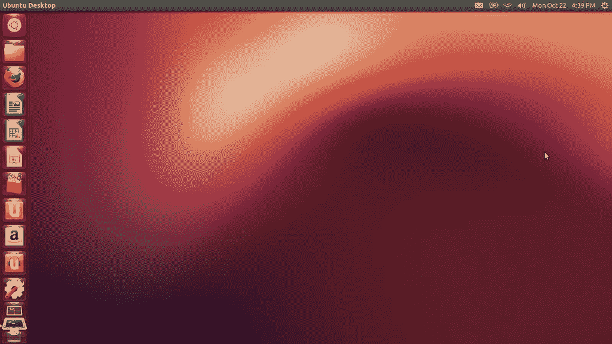
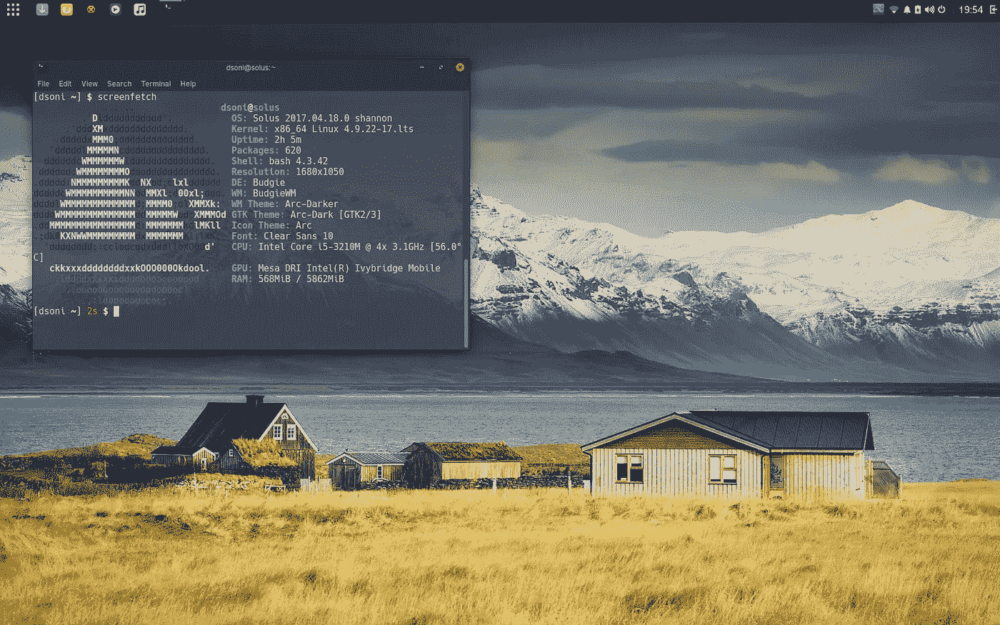
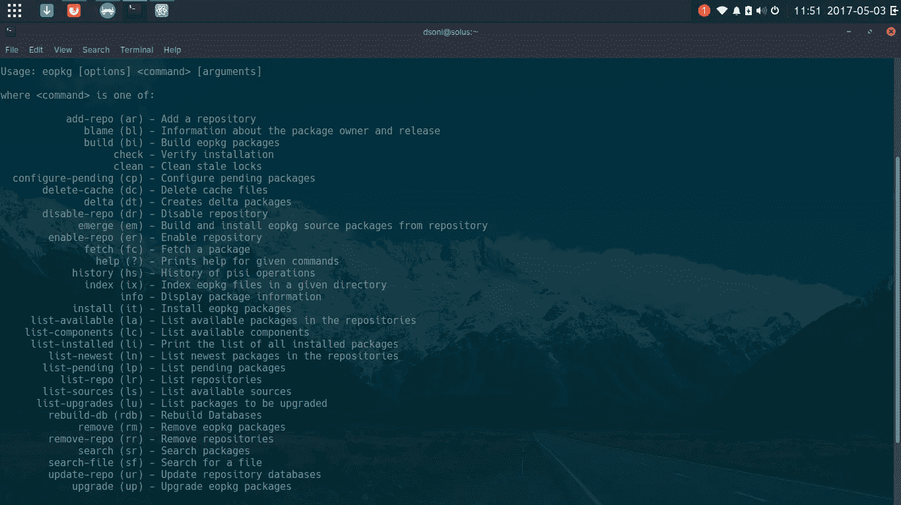

# 从 Ubuntu 到 Fedora 到 Solus

> 原文：<https://medium.com/hackernoon/from-ubuntu-to-fedora-to-solus-b6a42e7a3201>

*原载于 2017 年 5 月 2 日*[*【darshandsoni.com】*](https://darshandsoni.com/2017/05/02/migrating-to-solus.html)*。*

这篇文章相当长，但是它总结了我到目前为止的 linux 体验，并详细说明了我采用 Solus 作为日常驱动程序的原因。我没有资格从技术上评价基于 linux 的发行版的开发人员，我对他们作为开源项目开发人员的辛勤工作给予了肯定。相反，把这当成一个普通的工程学生的一个帐户，他只需要一个愉快的日常司机:)

# 1.离开乌班图

两年前，我收养了 Fedora，这是我在长达 6 年的 Ubuntu 工作后的第一次“发行”。Ubuntu 是我的第一个 linux 操作系统，安装它彻底颠覆了我的计算世界。没有什么能取代我多年来对我的老作品《苍鹭》的学习，它可以说是迄今为止 Ubuntu 最著名的版本。我跳到 Fedora 的原因是多方面的，下面将深入探讨。

## 桌面环境

其中最大的可能是 Ubuntu 的彻底更名和向 Unity 桌面环境的转变。虽然 Unity 在其生命周期的后期变得相当稳定并受到用户的欢迎，但不可否认的是，当它第一次被介绍时，它是不完整的，这对 GNOME 2.0 用户来说是一个很大的冲击。我有一个理论，Unity 一直被讨厌，甚至在它成为一个完美的桌面环境之后，仅仅是因为仍然有一整个阶层的用户用 GNOME 2.0 开始了他们的 Ubuntu 体验，并且把地毯从他们的脚下拉开了。因此，虽然有 Ubuntu 2012 年后的新用户看到并爱上了一个非常精致的 Unity 环境，但他们背后是一代不满的 GNOME 2.0 用户。对于 GNOME 阵营来说，情况也没有变得更好，因为 GNOME 本身在 3.0 版本中更名了，导致了一场令 Linus Torvalds 本人不安的 UX 灾难。这使得一大群用户涌向其他桌面环境来打电话回家，包括我自己。因为工作繁忙，我暂时和 Unity 和解了。在接下来的几年里，我频繁地在 Unity 和 GNOME 3 之间切换，看到了它们的改进，但从未感到满意。

## PPA 系统

Ubuntu 和它的 Debian 基础就像是我的家。我的世界从未超过`apt-get`和`add-apt-repository`。首先，GNOME 3 试图修复很多问题，但是 Ubuntu 库的冻结状态使得不添加其他 PPAs 就不可能获得 GNOME 的最新版本。这一切都很好，直到我开始到处添加 PPAs，只是为了测试新的软件。当我每 6 个月进行一次系统升级，发现大量的存储库、冲突的包、断开的链接、未满足的依赖时，这就变成了乏味的地狱……清单还在继续。我基本上把 Ubuntu 搞坏了，不得不核爆铺路。这种情况一次又一次地发生。很明显，考虑到我对更快获得更新的兴趣，我需要切换到其他方面。这并不是说 Ubuntu 在这个意义上不好；相反，我现在有了不同的目的！

## 无聊？

最后，我觉得我和我的 Ubuntu 知识处于一个高原上。我需要改变工作环境；更精细的颗粒控制和新的程序！这并不是说在 Ubuntu 机器上没有别的东西可学——远非如此！这只是其中一种需要改变的情况，一种不需要开发人员 PPAs 在我的机器上撒泼的情况。

所以你走了，足够的重量背后的推动因素，导致我远离 Ubuntu。

# 2.我的软呢帽时代

软呢帽真的很吸引我。众所周知，它是最前沿的，但非常坚固，这部分要归功于 Red Hat 的支持。我开始接触 rpm 世界，并接触了 dnf 包管理器(当我打开 Fedora 时，yum 包管理器刚刚被弃用)。很喜欢。对我来说，`DNF`比`apt-get`处理事情要好得多。我对它不太熟悉，但是它看起来非常坚固，有可视的事务检查和更丰富的包版本列表。我体验了最前沿的 GNOME 3，并对在 [omgubuntu](https://omgubuntu.co.uk/) 向它的“buntu 人群”传播消息之前拥有软件感到兴奋——舌头重重地压在我的脸颊上！在两年的使用过程中，一切都很好，但最终也出现了一些问题。请注意，我对 Fedora 项目仍然很有感情。这是迄今为止我用过的最可靠的系统之一，RedHat 毫无疑问是 T4 SaaS T5 做得好的一个显著例子。他们的文档可读性很强，软件基础非常可靠，考虑到他们可靠的客户群，这是意料之中的。fedora 论坛是一个非常有用的空间:很少“noob shaming”；迅速的回复和简洁的思路，这要归功于用户群平均来说比各种各样的 Ubuntu 用户更有经验。我没有衡量最后一句话的标准…只是我的一种感觉。不管怎样，是什么让我离开了 Fedy？

## KDE 多屏困境

我对 GNOME 项目的方向越来越失望。在我看来，他们似乎一直在朝着“降低”界面的方向努力:从默认的文件管理器 Nautilus 中去掉高级用户元素；几乎没有引入有用扩展的生态系统；变得非常耗费资源，并且奇怪地从桌面体验转向一个没有实际可行的硬件与之匹配的半成品桌面界面。

所有这些问题让我感到沮丧，并让我寻找另一个桌面环境。我的一个同事向我推荐了 KDE，他是我的长期粉丝。我对此有所保留，要知道为什么，你必须追溯到过去。远在我们今天所知道的稳定、美丽的等离子体 5 之前，到 KDE 4 令人沮丧的年代。在从 KDE 3 到 4 的过渡中，他们基本上推出了“GNOME 3.0”。一个让用户疏远的漏洞百出的界面。我唯一的体验是一个实时的 Kubuntu iso，它在我老化的宏基盒子上播放得很好，我再也没有回头看过它。所以我想，好吧，那我就再给 KDE 一次机会！我刚换了一份新工作，所以这是尝试新事物的绝佳时机。哦，奶油鹰嘴豆泥，我多么喜欢我所看到的！它看起来很舒服，界面也比 GNOME 更直观。Qt 框架确实使它成为一个连贯的空间。然后，我发现了我对所有设置的细粒度控制水平。我说的是 kioslaves，krunner，下拉终端和所有其他隐藏的好东西。然后你就有了像 KDE 连接这样的工具，它们非常简单，但是工作却非常出色。我告诉你，Unix 哲学被认真对待！

但这一切都随着多屏灾难和包装膨胀而崩溃了。现在，这些都不是 KDE 的核心问题，在这一点上我很同情 KDE 的开发者。他们经常谈论为什么多屏是一件复杂的事情，这无疑使它变得更加棘手，因为 KDE 在如此多的平台上使用，以至于在分发级错误和全球桌面环境错误之间存在模糊的界限。在我最忙的时候，KDisplayManager 出现了一个多显示器 bug，导致任何辅助显示器完全无用。我不会深入这个 bug 的技术细节，但本质上，我的屏幕一直是半空白的。回滚不起作用，因为当我放入依赖它的任何其他包时，它会重新更新。卸载它的工作，但使我的辅助显示器无用。由于没有时间处理它，而且开发人员有大量的工作要做，所以我放弃了它，开始寻找一些快速简单的东西。

## 所以我给自己弄了 Xfce

你好 Xfce。为什么选择 Xfce？是老派的 gtk2。准系统，但模块化。那是我的 GNOME 2.0(当时 MATE 在我脑子里还是实验性的)。Xfce 让我坚持了几个月。它是最小的，非常稳定和模块化的。我甚至对它更熟悉，因为我把我的通勤友好型 Chromebook 上的油炸面包丁换成了一个完全成熟的单一 linux 发行版， [GalliumOs](https://galliumos.org/) ，这是一个基于 Xfce 的 Chromebook 改编发行版，在低端硬件上运行起来很容易。直到今天，Xfce 对我来说仍然是一个“温馨”的环境。无论在哪里给我，我都没意见。当然，它的普通版本可能很难看，但我的大部分桌面工作都是基于键盘的。但是 Xfce 是一只老化的鹿。它还在用 GTK 2——现在连 MATE 都在往 gtk3 迁移了！众所周知，它没有任何更新，几乎不能适应不断变化的多媒体内容和用户交互方式。所以我准备好了一个新的环境！

## 太危险了？

看，Fedora 是彻头彻尾的，前沿的分布。我可以使用最新的软件包，但我必须接受未经测试的损坏。该项目没有隐藏这一事实，说实话，对于一个前沿发行版来说，它非常稳定！同样，这可能是我的需求没有得到满足的问题，而不是 Fedora 本身的问题(除了那个小小的 KDE 显示设置崩溃)。经过一番思考后，我意识到 Fedora 在我不断测试的开发机器上会很好。似乎在过去的几年里，我的东芝笔记本电脑已经成为我的一个“基地”:足够坚固，可以处理我的工程项目，但也可以作为我的家庭娱乐系统。我在家里所做的就是把它连接到一个更好的显示器上。所以我需要更稳定的家用电脑。也许我用一台热情的 Fedora 机器过度补偿了过时的 Ubuntu 软件，这台机器有时比每天更频繁地下载更新。

我需要的是一台“精心策划的、尖端的、完全适合家庭计算使用的机器”。如果任何 Solus core dev 阅读该声明，我怀疑他们会兴奋不已！我很想在我的机器上安装新软件，但我不需要 AUR 水平的深度；大多数包都是多余的，我见过的每个核心包都有几十个包装器。

# 3.采用解决方案

自从 Solus 从 EvolveOS 重新推出以来，我一直在关注他们的发展。我所看到的真的让我兴奋。紧密团结的开发团队获得了开源项目，并清楚地传达了为什么 Solus 正在开发以及它到底是为谁而开发的。它不仅仅是另一个基于其他东西的“发行版”,最终只包含一个主要开发者首选的核心桌面环境和一个预配置的易于使用的选项菜单。不，远非如此！取而代之的是 Solus 回头看看所有其他的操作系统，批判性地问:什么没有工作？什么可以做得更好？应该重写什么？我们可以从哪里消除旧系统中的冗余？如果你要将现代操作系统提升到一个全新的水平，这些问题都需要回答。

## 以虎皮鹦鹉桌面为例

这种“从过去的错误中学习”方法的一个很好的例子是旗舰桌面环境 Budgie。老实说，当我第一次看到虎皮鹦鹉时，它并没有吸引我。我为解析另一个桌面环境的利弊而叹息。但是当我尝试了 Solus 之后，我读到了虎皮鹦鹉的发展，我突然明白了。Budgie 是为一个特定的目的而创建的:一个家庭计算环境(想想台式机，连接到外围设备的家用笔记本电脑等)。为什么目标是为每个用例开发一些东西，却处理不好？为什么要创建一个在并不存在的平板设备上显示精美的界面，而市场明确表示对此不感兴趣，同时在一小块需要良好桌面环境的市场上牺牲良好的体验呢？Budgie 就是为了解决这个用例而编写的。它无法想象它会出现在某个地方的平板电脑上。也没有电话。也不是服务器。它做一项工作，而且做得很出色。Budgie 是以 gtk 组件为基础编写的，但是因为它是新的，所以它不需要导入 GNOME 平台目前拥有的遗留 cruft。或者在不需要这种延迟的时候实现过时的解决方案，比如 compiz。Solus 的项目负责人 Ikey Doherty 在一些[播客](https://latenightlinux.com/late-night-linux-episode-08/)中深入讲述了他使用 GNOME shell 和 GTK 的经历。意识到在某些时候，Budgie 没有从 GTK 那里得到它需要的东西，以及围绕它工作的挫折/限制，Budgie 团队决定在 Qt 中重写这一切。当然，这需要很多汗水和泪水，但是如果你知道你想要什么，为什么要向 hacky 解决方案妥协呢？他们眼中的 Qt 提供了一个支持良好的框架，一个非常有用的开发者论坛和一个同质的界面，让应用程序感觉像是本地的。我真的很佩服这种职业道德。

## 包装

Solus 也提供先进的软件包，但与其他操作系统相比有两大优势:

*   精心策划的尖端软件包确保我仍然可以获得最新的东西，但质量保证，他们的工作，可以支持一个稳定的系统。
*   包是专门为优先使用本地依赖项的解决方案构建的。这对安装时间有很大的影响，因为你不会得到一个包去寻找用另一种语言编写的另一个发行版的依赖项，这也需要额外的编译时间。

我从来没有见过一个系统安装软件像 Solus 这么快。事实上，限制因素只是下载更新，因为北美用户将从爱尔兰接收更新。这是一个多赫蒂似乎非常清楚的问题，毕竟，我们对一个由纯粹善良的心灵资助的独立操作系统有什么期望呢？甚至拥有我们现在看到的下载速度都是一种特权。然而 Solus 不是一个接受失败的人，它现在有一个 [Patreon page](https://www.patreon.com/solus) 来帮助保持灯和冷却风扇打开。在适当的时候，我相信我们会得到一些不错的全球图像分布。

当我第一次在一些备用硬件上测试 Solus 时，我对软件包有一种紧张的感觉。没有 AUR，乌班图 PPAs 或 Fedora 库。这是否意味着我错过了大量的软件？为了减轻我的担忧，我不得不做一些深入的研究。我指的是听 6 个小时的 Ikey 的播客，Joshua 的[包装](https://www.youtube.com/watch?v=oMMfc8XxZhc&t=495s)指南和一些[“周日与 Solus”](https://www.youtube.com/playlist?list=PLhhMWYdkJJbO2yxp4kkAE71KUZWpE3Por)视频。然后，在一个晴朗的春日，我[用核武器把它铺平](https://twitter.com/DarshanDSoni/status/855836908353486850)！

Solus 似乎有我目前需要的所有包；社区对[包请求](https://solus-project.com/articles/packaging/request-a-package/en/)缺失必需品反应强烈；构建软件包似乎更容易，更重要的是，比许多其他操作系统有更好的文档记录。所以，我不再担心包装了。

## 索卢斯工作起来很有魅力

总而言之，不得不说用 Solus 很清爽。我在一台 5 岁的中档东芝笔记本电脑上记录了 3 秒的开机和关机时间。我有一些尖端的软件通过管道进来，并保证它们经过了相当好的测试(至少在稳定的存储库上)，这对于一个“个人设备”来说是一种安慰，我只需要随时准备好就可以了。我的开发工作流程很有魅力，所有常用工具如 Atom、Rsync 和 rubygems 都已准备就绪。我的家庭娱乐系统开箱即用，似乎只要我连接外部显示器，它就会记住我的设置，无需繁琐的设置。我对娱乐服务器 Plex 非常好奇，以前从未使用过，所以很快会有更多关于这个实验的内容！对于那些正在努力工作的人们，我向你们致敬！

*原载于 2017 年 5 月 2 日*[*【darshandsoni.com】*](https://darshandsoni.com/2017/05/02/migrating-to-solus.html)*。*

> [黑客中午](http://bit.ly/Hackernoon)是黑客如何开始他们的下午。我们是 [@AMI](http://bit.ly/atAMIatAMI) 家庭的一员。我们现在[接受投稿](http://bit.ly/hackernoonsubmission)并乐意[讨论广告&赞助](mailto:partners@amipublications.com)机会。
> 
> 如果你喜欢这个故事，我们推荐你阅读我们的[最新科技故事](http://bit.ly/hackernoonlatestt)和[趋势科技故事](https://hackernoon.com/trending)。直到下一次，不要把世界的现实想当然！

