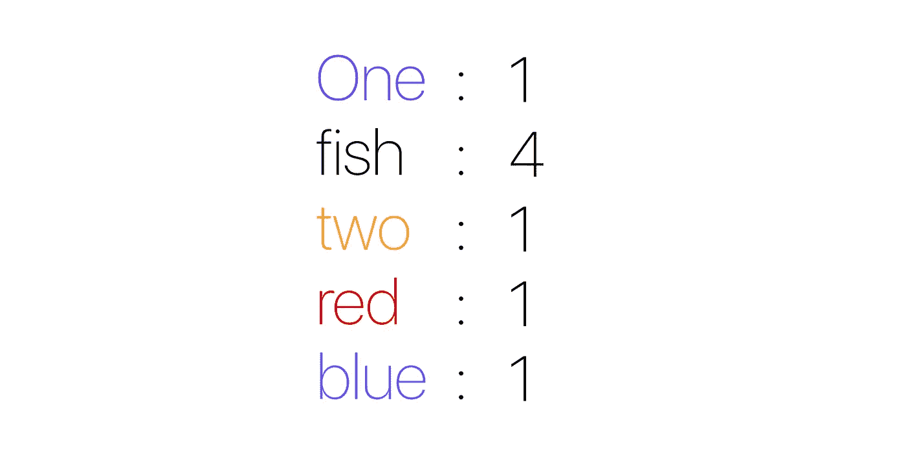
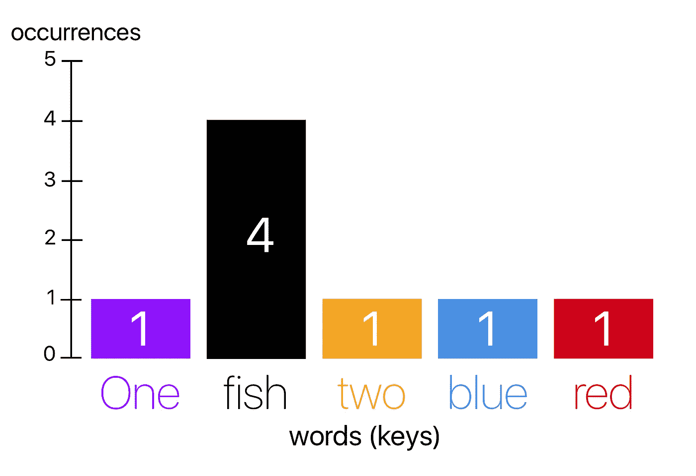
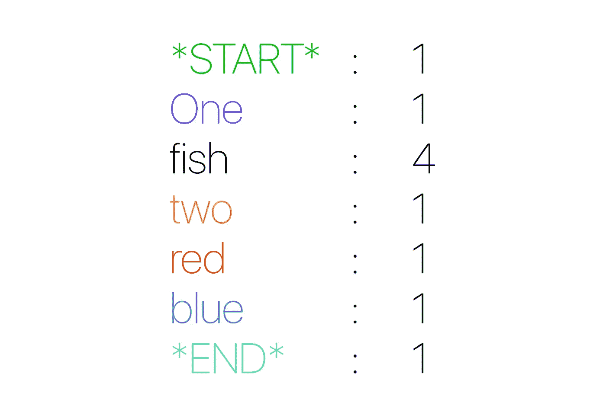
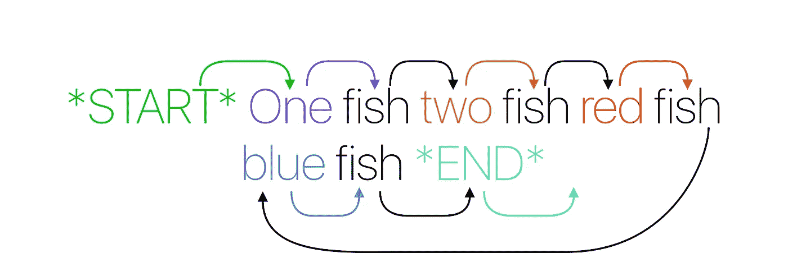
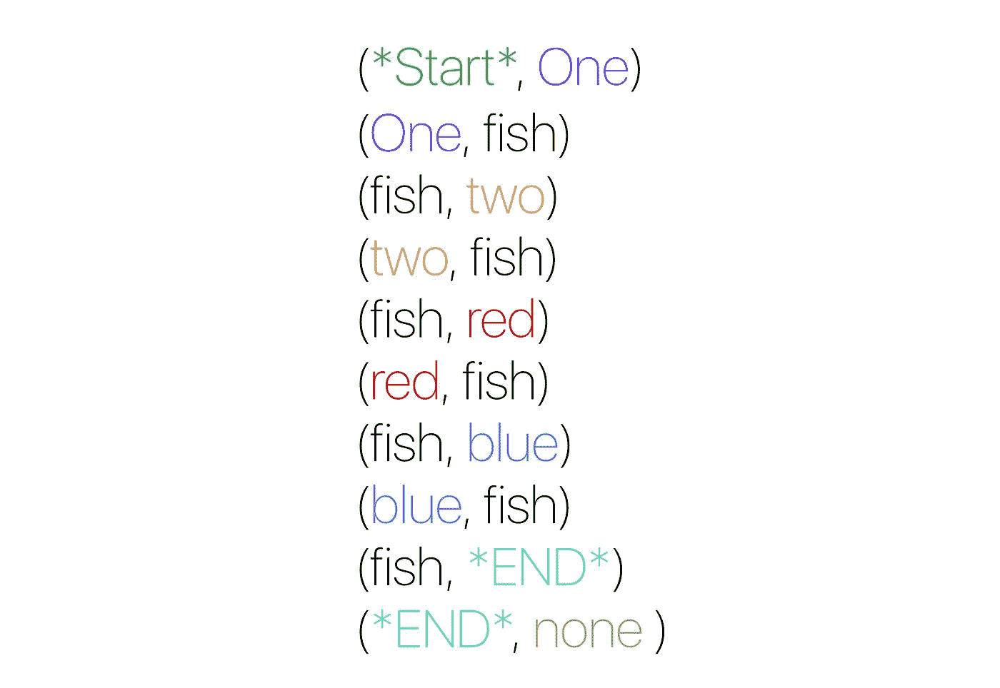
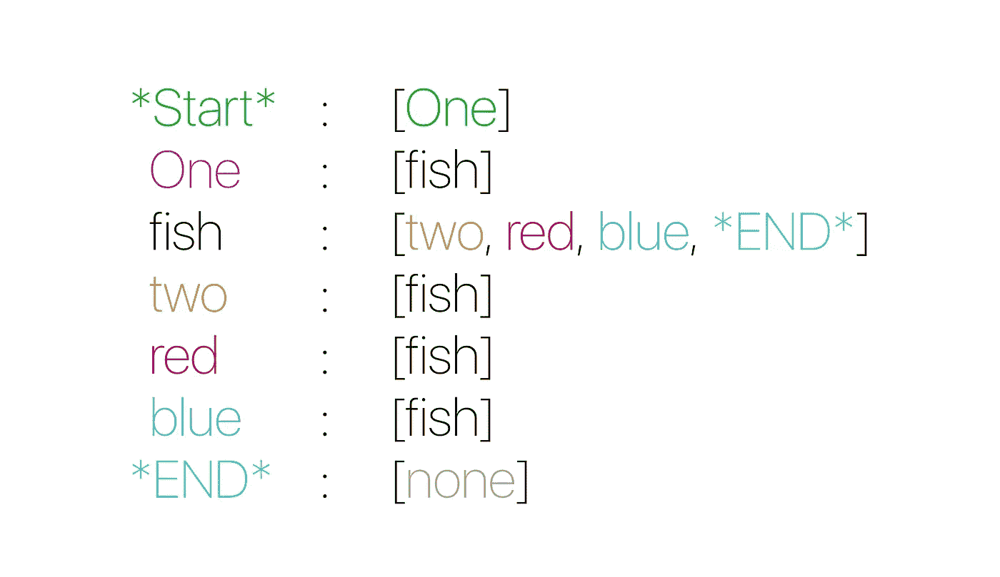
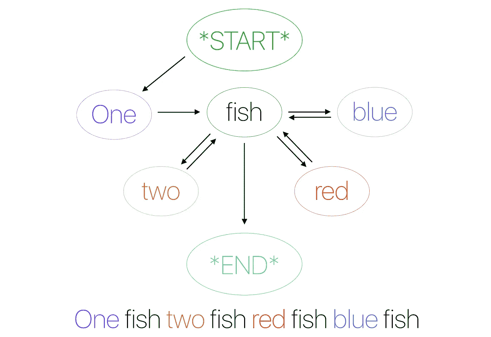
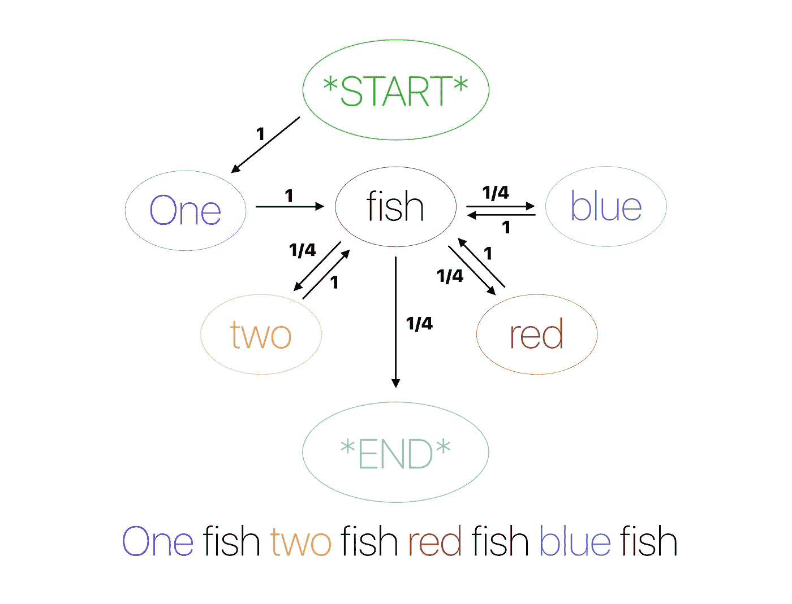
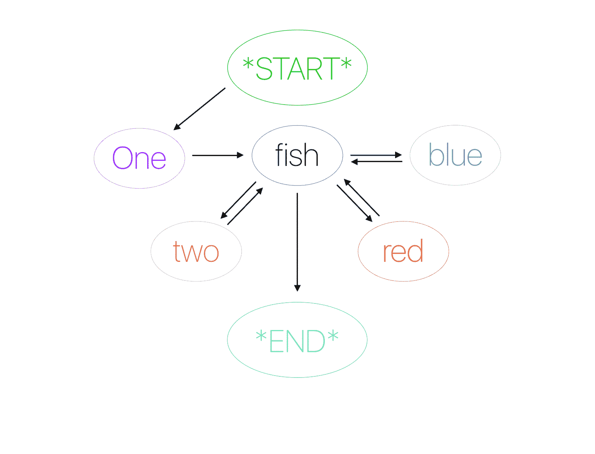

# 从“什么是马尔可夫模型”到“马尔可夫模型是如何工作的”

> 原文：<https://medium.com/hackernoon/from-what-is-a-markov-model-to-here-is-how-markov-models-work-1ac5f4629b71>

老实说，如果你正在寻找“什么是马尔可夫模型”这个古老问题的答案，你应该去维基百科(或者去 TLDR 看看😉)，但是如果你很好奇，想用一些例子来帮助你理解*什么是*马尔可夫模型，*为什么*马尔可夫模型很重要，以及*如何实现*马尔可夫模型坚持:**展示>告诉**

> ***TLDR:*** “在[概率论](https://en.wikipedia.org/wiki/Probability_theory)中，**马尔可夫模型**是一种[随机模型](https://en.wikipedia.org/wiki/Stochastic_model)，用于[建模](https://en.wikipedia.org/wiki/Mathematical_model)随机变化的系统，其中假设未来状态仅取决于当前状态，而不取决于之前发生的事件(即假设[马尔可夫性质](https://en.wikipedia.org/wiki/Markov_property))。
> 来源:[https://en.wikipedia.org/wiki/Markov_model](https://en.wikipedia.org/wiki/Markov_model)

路线图太棒了！查看这个**目录**获取这篇文章的路线图🚗

# 目录

## A.马尔可夫模型简介👶

1.起始句
2。加权分布
3。特殊附加物
4。*如何*一个*一个*马尔可夫模型如何工作
5 .完整示例摘要

## B.进一步的马尔可夫模型主题😼

1.大图示例
2。分配
3。更大的窗户

## C.实现- Python🐍

1.字典数据结构
2。哈希表数据结构
3。马尔可夫模型结构
4。解析马尔可夫模型

## D.进一步的阅读、建议、想法💚

1.应用程序
2。延伸阅读
3。最后的想法

# 马尔可夫模型介绍(☝️🐠 ✌️ 🐠 ⭕️ 🐠 🌀 🐠)

**1。显然，说明马尔可夫模型的最佳方式是通过使用一个例子。在这种情况下，我们将使用我在 [Make School](https://medium.com/u/4e3876df8481?source=post_page-----1ac5f4629b71--------------------------------) 学习马尔可夫模型时所用的同一个例子。**

> "一条鱼两条鱼红色的鱼蓝色的鱼."
> ——苏斯博士*🎩*

**2。加权分布** |在我们进入马尔可夫模型之前，我们需要确保我们对给定起始句的**、加权分布、**和**直方图**有很好的理解。


Starter Sentence

酷，我们的起始句是一个众所周知的短语，从表面上看，没有什么可以明确跳出来。但是我们要分解它，看看这个句子是由什么组成的。具体来说，它由八个字(**记号**)组成，但只有五个唯一字(**键**)。


Colored Starter Sentence

在这里，我给每个独特的单词(**键**)不同的颜色，表面上看，这只是一个有颜色的句子……但是，唉，给每个**键**不同的颜色背后有更多的含义。通过给每个唯一的**键**涂上不同的颜色，我们可以看到某些**键**比其他键出现得更频繁。



Distribution of keys

通过观察上面的**键**的**分布**，我们可以推断出**键**鱼出现的次数是任何其他**键的 4 倍。这种类型的陈述可以引导我们做出更进一步的预测，例如，如果我在起始句的任何一点随机选择下一个单词，我的最佳猜测是说“fish ”,因为它在句子中出现的次数比其他任何单词都多。💯
在我们的情况下**加权分布**是一个键出现的百分比，基于一个键出现的总次数除以令牌总数。例如，鱼的加权分布是 50%，因为它在总共 8 个单词中出现 4 次。那么一、二、红、蓝都有 12.5%的几率发生(各 1/8)。**

**直方图**是一种表示加权分布的方式，通常它们是一种图表，使您能够发现一组连续数据的潜在频率分布。在我们的例子中，连续数据是一个*句子*，因为一个句子由许多单词组成(连续数据)。



Histogram for our starter sentence

通过查看起始句的直方图，我们可以直观地看到单词的潜在分布👀显然，在我们的数据集中，鱼比其他任何东西都要多🐠🐟 🐡🐠

**3。特别添加** |太棒了！在这一点上，你应该对我们的*句子*由许多**记号**和**键组成的概念感到舒服。**另外，你应该了解**直方图**和**加权分布**之间的关系。

✅💯✅ **额外的例子** ✅💯✅

一个**标记**是句子中的任何单词。
一个**键**是一个词的独特出现。
**举例:** *鱼鱼鱼猫*有两个**钥匙**和五个**代币。**关键字是“鱼”和“猫”(🐠和😺).那么任何单词都是一个令牌。
直方图**与**加权分布**相关，因为直方图直观地显示了连续数据集中数据的频率，本质上是展示数据的加权分布。**

✅💯✅ **结束** ✅💯✅

很好，现在我们从表面上理解了我们的句子，以及某些单词是如何比其他单词出现得更多的，但是在我们继续之前，我们需要给我们的句子添加一些隐藏在表面上但我们可以同意存在的特殊附加物。句子的**开始**和**结束**


Starter Sentence with Special Additions

厉害！花一点时间，检查一下句子中存在的上述“附加内容”。这可能现在看起来是不必要的，但是相信我，这将在我们深入马尔可夫模型的下一部分更有意义😌。总之，每个句子都以一个看不见的“*START*”符号开始，并且总是以“*END*”符号结束。



Distribution of Keys in Modified Example

在上面，我继续重新创建了与前面相同的键分布，但是包括了两个额外的键(*START*和*END*)。

**4。马尔可夫模型是如何工作的？你可能已经学到了一些东西，但是现在这篇文章的核心部分来了。让我们从什么是马尔可夫模型的高层次定义开始(根据维基百科的定义):**

> **马尔可夫模型**是一种随机模型，用于模拟随机变化的系统，其中假设**未来状态仅取决于当前状态，而不取决于在此之前发生的事件**(即，它假设[马尔可夫属性](https://en.wikipedia.org/wiki/Markov_property))。一般来说，这种假设使得用模型进行推理和计算成为可能，否则这是很难做到的。”
> - [维基百科](https://en.wikipedia.org/wiki/Markov_model)

厉害！听起来很有趣…但是那个巨大的斑点到底是什么意思呢？我加粗了*什么是*马尔可夫模型的**关键**部分。总之，马尔可夫模型是一种模型，其中**下一状态**是基于**当前状态**单独选择的。

一种思考方式是，您有一个只显示当前状态的窗口(或者在我们的例子中是一个令牌)，然后您必须根据这个小窗口来确定下一个令牌是什么！



Demonstrating the next word using a window

在上面，我展示了每个令牌如何通向另一个令牌。此外，我根据 origin 键对指向下一个单词的箭头进行了着色。我建议你花一些时间在这张图和下面的图上，因为它们为*马尔可夫模型如何工作奠定了基础！🤓*



Pairs! Every Token leads to another Token!

你可能已经注意到，每个记号都指向另一个记号(甚至*END*也指向另一个记号——*none*)。在这种情况下，它形成了一个令牌对另一个令牌的配对！


Organized pairs by starting word

在上面，我简单地按照它们的第一个标记组织了这些对。此时，你可能会意识到一些有趣的事情🤔每一个开始标记后面只跟有**和**一个可能的密钥…



Possible tokens to follow each key

好了，希望你已经明白了，我们正在组织配对，我们通过使用 **"window"** 来查看配对中的下一个令牌是什么。然后在上面，我把它们进一步修剪成一些非常有趣的东西。每个**键**都与可能跟在该键后面的一组标记相匹配。

✨💡✨ **思维突破** ✨💡✨

让我们花一点时间来思考上面的图表。每个**键**都有可能让*跟随的单词。如果我们把这个结构从上面给某人，他们可能会重现我们原来的句子！*

## ***示例:***

*我们首先给它们* **Start*** ，然后我们看看 ***可以*** 跟随*START* → [One]的潜在选项。因为只有一把钥匙，所以我们必须把它捡起来。我们的句子现在看起来像“一”下面我们继续来看 ***可以*** 跟在“One”→【fish】后面的潜在词。好吧，这很简单，只有“鱼”能跟得上。现在我们的句子是“一条鱼”现在让我们看看*能跟“鱼”→【二，红，蓝，*END*】。事情变得有趣起来，这四个选项中的任何一个*会是下一个选择吗😳。这意味着我们 ***可以*** 选择“二”，然后继续，并有可能得到我们原来的句子……但有 25% (1/4)的可能性我们只是随机选择“*END*”。如果是这种情况，我们会使用我们原来的结构，随机生成一个与我们原来的句子非常不同的句子→“一条鱼”1️⃣ 🐠***

**✨💡✨ **结束** ✨💡✨**

**恭喜你。🎉🎉你在上面的**思维突破**中偷偷的表演了一个马尔可夫模型😏。不错！但是说真的…想想吧。我们用**当前状态**(当前键)来决定我们**的下一个状态**。此外，我们的下一个状态只能是当前键之后的一个键。听起来很酷，但它变得更酷！让我们为我们的起始句画一个马尔可夫模型。**

****

**Markov Model for the Starter Sentence**

**呀!🙃上面的图表如何表示我们刚刚做的事情？仔细看，每个带单词的*椭圆形*代表一个**键**，箭头*指向可以跟随它的潜在**键**！但是等等，还有更酷的:***

****

**Markov Model for the Starter Sentence with Probability**

**没错。每个箭头都有可能被选为当前状态到下一个状态的路径。**

****

**Full Gif of the Starter Sentence being Created Using A Markov Model.**

**厉害！总之，我们现在理解并通过使用苏斯博士起始句说明了马尔可夫模型。有趣的是，你用来创建模型的数据通常被称为语料库👻**

****5。完整示例总结** |你做到了！再次祝贺🏅在这一点上，你可能可以描述什么是马尔可夫模型，甚至可以用这个基本的例子教别人如何工作！你，我的朋友，会有所成就的🚀。但是你猜怎么着！这仅仅是你对马尔可夫模型更全面理解的开始，在接下来的部分中，我们将继续加深和扩展你的理解:)还记得分布吗？我们将在下一个例子中使用它们来展示如何使用**加权分布**到*潜在地*创建一个更准确的模型；此外，我们将讨论**更大的窗口**😲(越大越好吧？🙄);最后，我们将用 Python 实现一个漂亮的马尔可夫模型🐍。所以系好安全带，享受旅程吧🔥🎢**

# **进一步的马尔可夫模型主题😼**

******** 免责声明 ****** 🦊我将遵循与上面相同的过程来创建马尔可夫模型，但是我将省略一些步骤。如果有些东西看起来令人困惑，请参考第一部分🔥**

****1。更大的例子** |保持苏斯博士语录的精神我找到了四句西奥多·苏斯·盖泽尔已经**不朽的语录:****

> **“今天你是你。那比真实更真实。没有一个活着的人比你更好。**
> 
> **“你脑袋里有脑子。你的鞋子里有脚。你可以随心所欲地控制自己。你只能靠自己了。”**
> 
> **“你读得越多，你知道的事情就越多。你学得越多，去的地方就越多。”**
> 
> **“左思右想，低思高想。哦，他们认为只要你试一试，你就能想出来。”
> ——苏斯博士🎩**

**原始起始句和我们的新句子之间的最大区别是，一些**键**跟随不同的键一个**变量**的次数。例如，“more”跟在“the”后面四次。那么，这种额外的复杂性会对我们的马尔可夫模型构造产生什么影响呢？🤔总的来说，**可以改善我们句子的逻辑结果。我的意思是:在英语(或任何其他语言，就此而言，🇷🇴)中，有些词出现的频率比其他词高。例如，单词“a”在日常对话中出现的次数远远多于“wizard”🎩。世界是如何运转的🌎考虑到这一点，了解一个键与另一个键出现的频率对看起来更真实至关重要😊当决定马尔可夫模型中的下一个**步骤**应该是什么时，这被称为将**加权分布**考虑在内。****

**一种以编程方式💻代表这将是为每个**键**跟随一个**窗口**你存储**键**和该键的**出现**的数量！这可以通过拥有一个字典来完成，字典*键*将表示当前窗口的*值*的那个*字典键*是另一个字典，它存储**唯一令牌**，随后是*键*，它们的*值*将是**出现的数量……**这让你想起我们已经讨论过的一些事情吗📊？**直方图**！没错。*内部字典*被分割成一个直方图——它只是记录**键**和它们的**出现**！哇，好的，这么多钥匙🔑如果你对代码感兴趣，你当然应该看看下面的内容👇但除此之外，只要认识到为了创建更高级的模型，我们需要跟踪哪些**键**继续其他**键**以及这些键的**出现次数**。**

****2。分布** |太棒了，快速切线然后我们将开始进入这个例子😋🍴酷到连这个数据集都 ***非常*** 小成为一个不错的语料库！为什么？嗯，我们将获得不同的单词分布，这很好，并将影响整个结构，但在生成**自然**独特生成句子的更大范围内，您应该以至少有**20，000 个**标记为目标。如果你至少有 **10 万，**代币就更好了。然后，如果你想拥有一个真正壮观的模型，你应该瞄准 **50 万** +代币🚀**

**但是让我们用这个更大的例子来讨论单词在**一键窗口**中的分布。**

****

**Colored distribution of keys**

**哇！非常酷😎看看所有的数据——我已经清理了这些数据，现在你可以看到我们语料库中的每个唯一的**关键字**都有一个数组，其中包含唯一关键字之后的所有**关键字**和**事件**。非常好！**

**想知道一个小秘密吗？😏这与之前的马尔可夫模型几乎没有区别，因为在这两种情况下，我们仅基于当前状态对下一步**做出决策，但是存储单词的分布允许我们对下一步进行加权。让我们看一个来自我们数据的真实例子:****

```
**more : [things : 1, places : 1, that : 2]**
```

**厉害！👏因此，如果马尔可夫模型的当前状态是“更多”，我们将随机选择下列单词之一:“事物”、“地点”和“那个”。然而，“那个”出现了两次，而“事物”和“地点”只出现了一次。因此，有 50%的机会选择“是”, 25%的机会选择“事物”或“地点”!😃**

```
**think : [high : 1, up : 1, right : 1, low : 1, left : 1]**
```

**☝️☝️☝️真棒，类似的例子如上，但在这种情况下，“高”，“上”，“右”，“低”，和“左”都有 20%的机会被选为下一个状态，如果“认为”是当前状态！有道理吗？💭**

****3。更大的窗口** |目前，我们只看了窗口*大小为 1 的马尔可夫模型。我们可以增加窗口的大小来获得更多“准确”的句子。所谓更准确，我的意思是模型生成的句子随机性更小，因为它们越来越接近原始语料库句子。这可能是好的也可能是坏的😇 😈这是因为如果你的马尔可夫模型的目的是生成一些真正独特的随机句子，它将需要一个更小的窗口。如果你有一个 ***显著的*** 大语料库 **100，000+代币，更大的窗口是一个好主意。*****

**增加窗口的大小被称为将马尔可夫模型带到一个**“更高阶”**。我们目前使用的例子是**一阶马尔可夫模型。**如果我们使用二阶马尔可夫模型，我们的窗口大小将是 2！类似地，对于三阶→窗口大小为三。**

**该窗口是马尔可夫模型的当前状态中的数据，并且是用于决策的数据。如果在一个较小的数据集中有一个较大的窗口，那么来自一个窗口的可能结果不太可能有较大的唯一分布，因此**只能重建相同的句子。****

**让我们看看我们最初的例子，一个**二阶马尔可夫模型** -窗口大小为二！2️⃣**

****

**2nd order Markov Model Data**

**很有意思！有什么看法吗？🕵️，你可能已经注意到，每个大小为 2 的独特窗口只有**一个可能的结果**…因此，无论我们从哪里开始，我们都会得到相同的句子，因为不可能偏离原始路径。我们有 100%的机会生成同一个句子👎不太好。这揭示了马尔可夫模型可能面临的一个潜在问题…如果你没有足够大的语料库，你可能只会在语料库中生成句子，而不会生成任何独特的东西。得到一个**巨大的数据集——50 万+令牌**然后**使用**不同阶**的马尔可夫模型围绕**玩 **👍****

# **实现— Python🐍**

****1。字典图数据结构** |
字典图的目的是作为一个直方图，但有令人难以置信的速度💨和持续的查找时间，不管我们的数据集有多大。基本上，它是一个使用字典构建的直方图，因为字典具有常数查找时间 O(1)的独特属性！**

**dictogram 类可以用一个可迭代的数据集来创建，比如一个单词列表或整本书。我在创建时跟踪**令牌**和**密钥**计数，这样我就可以访问这些值，而不必遍历整个数据集🤓**

**值得注意的是，我创建了两个函数来返回一个随机单词。一个是**选择一个随机键**，另一个函数考虑每个单词的出现次数，然后返回一个**加权随机单词！**🏋️‍♀️**

****2。马尔可夫模型结构** |
哇！从 ***什么是*** 马尔可夫模型到现在谈论 ***如何*** 实现马尔可夫模型，经历了一段漫长的旅程🌄**

**在我的实现中，我有一个**字典**，它存储*窗口*作为键-值对中的**键，然后每个*键*的*值*是一个**字典图**。基本上，我为每个窗口存储一个单词直方图，这样我就可以根据当前状态知道下一个状态是什么😌如果一个键已经存在于当前窗口中，我们就在字典中增加这个键的数据！****

****3。n 阶马尔可夫模型结构|** 你们中的一些人肯定对如何**实现高阶马尔可夫模型很好奇**所以我也包括了我是如何做的😏**

**☝️☝️☝️☝️☝️非常类似于一阶马尔可夫模型，但是在这种情况下，我们将一个 ***元组*** 作为**键**存储在**字典**的**键-值对**中。我们这样做是因为一个 ***元组*** 是表示单个列表的好方法。我们使用元组而不是列表，因为字典中的键不应该改变，并且元组是不可变的🤷‍♂️**

****4。解析马尔可夫模型** |
耶！！🎉👏 🎉我们现在已经实现了一个字典图，但是我们现在如何基于**当前状态**和**步骤**到新状态生成内容呢？👇👇👇在这里，我们将浏览我们的模型🚶**

**太好了，所以我个人希望能够只使用有效的起始句单词，所以我检查了结尾关键字图中的所有内容🐶。否则，你用一个**起始状态**开始生成的数据(它是我从有效起始中生成的)，然后你只需继续查看**个可能的关键字**(通过进入那个关键字的字典图)，这些关键字**可能跟随当前状态**，**基于*概率*和*随机性* ( **加权概率**)做出决策**。我们不断重复这个动作，直到我们做了 ***长度*** 次！💯**

# **进一步的阅读、建议、想法💚**

****1。应用** |马尔可夫模型的一些经典例子包括基于天气、股票市场和 tweet 生成器的人们行为！🐣想想你如何使用一个**语料库**来创建和 ***生成基于**马尔可夫模型**的新内容*。想想什么会改变？
提示:不要太多，如果你对马尔可夫模型工作的内容、原因和方式有很好的理解，并且能够被创建，那么**唯一的区别**将是*你如何解析马尔可夫模型*以及你是否添加了任何*独特的限制。*****

**例如，在我的 dope [**硅谷 tweet generator**](http://bit.ly/SVTweets) 中，我使用了一个更大的窗口，将我生成的所有内容限制在 140 个字符以内，句子的数量可以变化，并且我只使用现有的句子开始窗口来“播种”句子。🌱**

****2。现在你已经很好地理解了什么是马尔可夫模型，也许你可以探索一下隐马尔可夫模型是如何工作的。或者，如果你更倾向于使用你新发现的知识来构建一些东西，你可以阅读我的关于使用马尔可夫模型构建 HBO 硅谷 Tweet 生成器的文章(即将推出)！****

****3。最后的想法|我一直在寻找反馈，所以请随意分享你对文章结构、内容、例子的想法，或者任何你想和我分享的东西😊马尔可夫模型是很好的工具，我鼓励你用它来做点什么……甚至是你自己的推特生成器😜干杯！🤗****

**如果您喜欢这篇文章，请点击💚所以其他人会在这里看到它。**

**[](https://twitter.com/home?status=Fantastic%20article%20on%20what,%20why,%20and%20how%20to%20implement%20Markov%20Models%F0%9F%98%8D%20%3A%20http%3A//bit.ly/MarkovModelFrom0To100%0ACheck%20it%20out!%20%F0%9F%98%8E)********[](https://www.facebook.com/sharer/sharer.php?u=https%3A//medium.com/%40alexdejeu/from-what-is-a-markov-model-to-here-is-how-markov-models-work-1ac5f4629b71%23.fa6efg6yn)**

> **非常感谢[肯尼·巴蒂斯塔](https://medium.com/u/cf54f92f2f47?source=post_page-----1ac5f4629b71--------------------------------)和[埃里克·黄](https://medium.com/u/dbece1b69434?source=post_page-----1ac5f4629b71--------------------------------)提供编辑、见解，并鼓励我写这篇文章💎**

**[](http://bit.ly/HackernoonFB)****[](https://goo.gl/k7XYbx)****[](https://goo.gl/4ofytp)**

> **[黑客中午](http://bit.ly/Hackernoon)是黑客如何开始他们的下午。我们是 [@AMI](http://bit.ly/atAMIatAMI) 家庭的一员。我们现在[接受投稿](http://bit.ly/hackernoonsubmission)并乐意[讨论广告&赞助](mailto:partners@amipublications.com)机会。**
> 
> **如果你喜欢这个故事，我们推荐你阅读我们的[最新科技故事](http://bit.ly/hackernoonlatestt)和[趋势科技故事](https://hackernoon.com/trending)。直到下一次，不要把世界的现实想当然！**

****