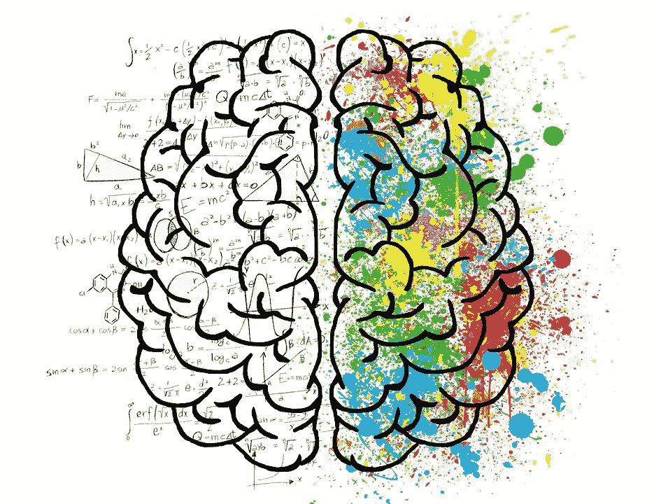
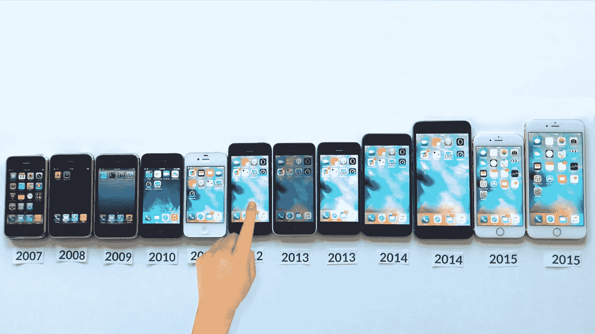
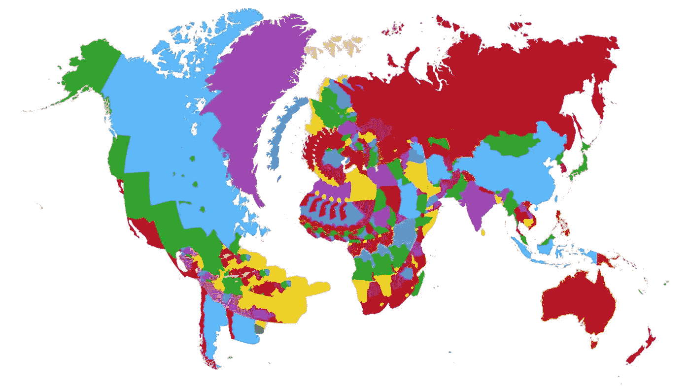
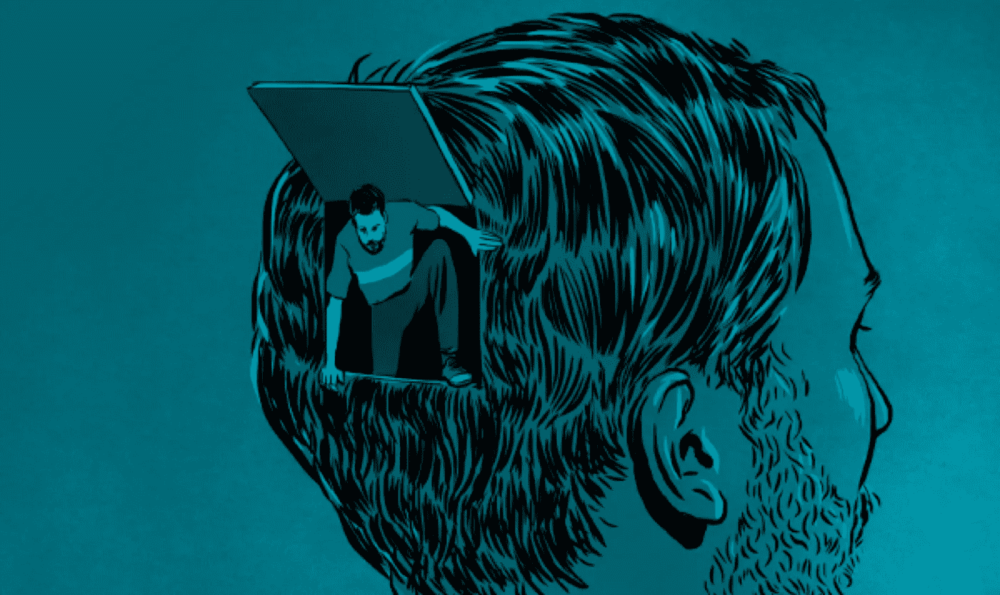

# 𝙷𝚊𝚌𝚔𝚒𝚗𝚐 𝙷𝚞𝚖𝚊𝚗 𝙱𝚒𝚘𝚕𝚘𝚐𝚢

> 原文：<https://medium.com/hackernoon/from-wheat-to-wi-fi-79ffc5e357c6>

## *从农业到国际* ⌁ *连接*

Mankey vs Mandibuzz vs Growlithe

# 这是智人的故事..✍️

大约在公元前 8000 年，人类犯了一个错误，在将近一万年的时间里，人类没有完全消化。这是一个错误，无论是在当时还是现在，都像是我们人类智慧的起源，但最终可能是一个最不幸的浮士德交易。

当一段严重的全球变暖时期把中东的土壤变成了营养丰富的矿物质之床时，我们这些自称为“智者”的人抵挡不住诱惑。我们用两条腿走路，不顾后果地任意转动我们巨大的大脑，带着满满的喜悦拍着我们的手。我们完成了不可能的任务。我们已经掌握了大自然。对吗？

"*没这么快*！"大自然母亲用她神秘而听不清的方式说。
“作为狩猎采集者，你是快乐的，你是健康的，你珍惜你的[部落](https://www.youtube.com/watch?v=iurXFfNriyg)！你们是 T21 真正意义上的自由人。”

当然，我们没有听。相反，我们打开了那三磅神奇的肉，开始耕作。

“太遗憾了，”她摇摇头说。今天的懒惰是明天的毒药。解毒剂需要几千年才能找到……”

从某种意义上说，农业革命是我们的第一次失误，从那以后，我们一直建立在一个有裂缝的基础上。期望人类将自己连根拔起，成为星际间的狩猎采集者是不现实的，就像我们期望纽约市彻底改造其病态的地铁系统一样。但是，可以进行增量更改。在下一节中，我将尝试协调这些变化是什么，以及它们可能是如何实现的

Sorry I forgot how to color for a sec

# 🤝小麦交易🤝

当心为继承人种下的核桃和梨

大约在公元前 8500 年，中东的野蛮、神秘、觅食的人认识到一个发人深省的事实:有可能利用地球的能力来培育食物，而不是跋涉数百英里寻找食物。“太棒了！”“无害！”“必要！”我们以为。但是，我们很快就会发现，所有这些思考和笨拙的摇头晃脑产生了瘫痪和不可预见的后果。

食物供应的驯化产生了非自然的人口数量*爆炸*，引发了对更加丰富的食物来源和劳动力的需求。虽然新石器时代的[农业革命](https://en.wikipedia.org/wiki/Neolithic_Revolution)让人类在智人历史[上第一次成为静止的生物](https://hackernoon.com/tagged/history)，但这个决定是在没有理解为什么它从未在它之前[19 万年的存在中定居下来的情况下做出的。](https://en.wiktionary.org/wiki/if_it_ain%27t_broke,_don%27t_fix_it)

根据 Yuval Noah Harari 的说法，推动农业发展的生物不是国王，不是牧师，也不是商人。罪魁祸首是一小撮植物。我们没有驯化小麦。它驯化了我们。**当小麦需要水的时候，人类滋养了它。当小麦生病时，人类照料它。当小麦饥饿的时候，人类培育了它。因此，随着小麦杆数量的增加，最新的猿类物种也在增加。**

*小麦*对人类的驯化仅仅是一个有机体开始严重依赖另一个有机体的众多例子之一。人类肠道中的微生物对我们的依赖程度不亚于我们对它的依赖。漂浮在海里的变形虫既需要进食，也需要被小鱼吃掉。金枪鱼需要干净的鱼，就像干净的鱼需要金枪鱼排泄废物一样。**地球有一段可疑的历史，为了促进进化发展，它让两个物种相互对立。可以说，人类对小麦和其他主要农作物的持续依赖使其陷入了浮士德式的讨价还价。只不过这种交易没有持续几年。它持续了 10，000 年(还在继续)**

> 进化的货币既不是饥饿也不是痛苦，而是 DNA 螺旋的拷贝。如果不再有 DNA 拷贝存在，这个物种就灭绝了，就像一个没有钱的公司破产了一样。如果一个物种拥有许多 DNA 拷贝，那它就是成功的，这个物种繁荣昌盛。从这样的角度来看，一千本总比一百本好。这就是农业革命的本质:在更恶劣的条件下让更多人活下去的能力。
> ~尤瓦尔·诺亚·哈拉里

有趣的是，这种恶性循环并不是孤立发生的。后来成为并一直是我们最重要的扩张物的作物——小麦、大米、大麦和土豆——似乎在全球范围内殖民人类。当然，通过修正主义历史的镜子进行批评是很容易的，指出负面的残余，因为它是由新的**造成的。然而，在我们这个人类更加自我意识的时代，我们可以从这样一个事实中得到庇护，那就是大多数有记载的历史现在都是可用的。我们可以追随潮流，并以谨慎的怀疑态度质疑一切没有经受住时间考验的事物。**对于亚洲、北美、澳洲以及基本上整个地球上的第一批人** **来说，农业是一种让生活更轻松的方式。**

*我们现在在做什么让生活变得更轻松？***

> *最省力法则表明，人们总是被最不需要认知和/或体力的任务所吸引*
> 
> **~**

****

**(Touuch. Touch. Touch.)**

# **✂ **一把好剪刀****

***太容易找到了***

> ***捷径导致长时间延迟***
> 
> ***~ JRR·托尔金***

**一位年轻的女士曾经说过“没有什么比一把好剪刀更好的了。锋利、坚固，不费吹灰之力就能切开纸板的那种。”人类[创新](https://www.wired.com/insights/2015/01/innovation-takes-the-exponential-express/)就像这些剪刀。每年，人类都会改进刀片，这样它可以更干净地切角。我们不再自己拉拖拉机，而是奴役动物。我们建造了机器，而不是从一个城镇走到另一个城镇。我们让计算机疯狂，而不是计算复杂的数学。这个列表永远不会结束。**

**人类的天才只是一把锋利的剪刀，而我们的磨刀石是任何我们可以操纵的东西。**

****人类历史是*血腥的*带着有毒的渴望成为******不仅比所有其他物种更聪明，而且比一、一百、一千年前的人类更聪明。农业农民比游牧民更聪明。宗教机构比部落机构更聪明。工业装配线工人比工匠更聪明。奴隶贩子比佃农更聪明 。******

****那么我们比谁更聪明呢？技术专家比战争贩子聪明吗？程序员比作家聪明？设计师比艺术家聪明？****

****纳西姆·尼古拉斯·塔勒布经常提醒要警惕[、](http://www.fooledbyrandomness.com/af-glossary.pdf)或*为了新事物而采用新事物*。很多时候，人类会过早地一头扎进最新的浪潮中，希望它能进一步减少对我们身体的需求，却没有意识到这真的会在未来几年激起有害的沉降物。看看上面的列表就知道了。农业摧毁了我们的健康。宗教分裂了我们的文明。工业化污染了我们的星球。****

****谁知道接下来会发生什么？ ️ ️****

****我们可能是聪明的物种，但我们肯定不是。所以进入以太我们咿咿咿咿咿呀🎢****

********

****Somewhere, deep down there, Satoshi is hiding.****

# ******VERBUM SAPIENTI SAT******

****智者一句话就够了🤔****

****人类曾经是一种健康的野兽，在他的国家里奔跑，除了他的家庭、他的安全和他晚餐会吃什么样的浆果之外，什么都不关心。今天，我们扔掉吃了一半的鱼子酱，喝梅森罐里的杜松子酒。我们在 T21 觅食的日子已经一去不复返了，但是生物基础并没有改变。“有知识的人”总是会寻找更多的知识——这是信息来源的变化。****

****在公元前 10，000 年，游牧民族从他们的环境中搜寻信息，以便找到食物、配偶和保护他们的家人。我 **n 2017 年，带着满肚子的冷冻酸奶和无麸质披萨，智人换能器的生物** [**需要**](https://books.google.com/books?hl=en&lr=&id=7yCpBRAY22UC&oi=fnd&pg=PA12&dq=information+foraging+hunter+gatherers&ots=LJN2JZgt4-&sig=-7An9jY7h1DHy4BAcxMs9bWqwBw#v=onepage&q=information%20foraging%20hunter%20gatherers&f=false) **才能将草料刮入** [**的垃圾箱**](http://www.sciencedirect.com/science/article/pii/S027841650500067X) **社交媒体【档案。然后，它抽搐地移动到下一个补丁上。根据亚当·加扎利博士的说法，这种新老现象是智人祖先觅食习惯的延伸，“在那里，营养的永久来源是网站、电子邮件程序和 iPhones。”******

****这就是当今不断受到刺激的大脑最令人不安但又最密切相关的问题:****

****人们不再需要担心导航，乘法，有时甚至关系。相反，我们用一个诱人的技术“信息补丁”果园来填充这个开放空间。这个想法，在 [MVT](https://en.wikipedia.org/wiki/Marginal_value_theorem) 模型中展示，勾勒出了**古代人类大脑与其现代目标之间固有的不和谐**。****

> *****……未来 40 年将给我们带来一些美好的事物。我并不是说它们都应该避免。酒精是一种危险的药物，但我宁愿生活在一个有酒的世界，也不愿生活在一个没有酒的世界。大多数人可以与酒精共存；但是你必须小心。我们喜欢的东西越多，就意味着我们要小心的东西越多。*****
> 
> *****~保罗·格拉厄姆(Y Combinator 创始人)*****

****一百年前，香烟是健康的，可卡因是处方药。在那之前，我们把水蛭粘在自己身上，抽干身体里的血液，进行荒谬的钻孔手术。这个世界完全是一个令人迷惑的地方。****

******谁知道我们在** [**做什么**](https://www.bestbuy.com/site/headphones/earbud-in-ear-headphones/pcmcat143000050007.c?id=pcmcat143000050007) [**那就是**](http://www.restroomdirect.com/hand-dryers.aspx) [**杀戮**](https://swagtron.com/product/recertified-swagtron-turbo-five-hoverboard-cool/?attribute_pa_feed-color=black&gclid=Cj0KCQiA3dTQBRDnARIsAGKSflmdos0ModR4a-tOlBPYU7y7Y3Qxeczn3HvnX47TwyIRC0K79pZb7X4aAoZlEALw_wcB) **我们？******

****现在，我们将开始讨论一些事情，我不认为这些事情会杀死我们，但肯定会伤害我们的大脑和注意力。****

********

****Ow 🤯****

# ****加冕☯F 私有化****

*****关于私人空间私有化*****

****无论是穿过拥挤的火车站，还是坐在繁忙的咖啡馆，或者仅仅是在自己的公寓里安静地工作，隐私和 T2 公开的概念已经被 T4 科技混淆了。曾几何时，在拥挤的餐厅吃饭被定义为:*公共*。在你的卧室写作文:*私人。*但是现在，我们迷茫了。在任何时候，一个人都可以通过藏在口袋里或放在膝盖上来逃避隐私和公开的感觉。****

> ****逃离自我从未如此容易****
> 
> ****一行禅师****

*****那么，在一个比以往更加萧条的世界里，* [*逃避现实*](http://www.truth-out.org/buzzflash/commentary/are-we-trapped-in-an-age-of-technological-escapism) *是一件好事吗？*****

****尽管如此，我们不能把抑郁症和自杀率的飙升完全归咎于新技术。更有可能的是，在史蒂夫·乔布斯给我们 iPhone 之前，甚至在亨利·福特发明汽车之前，我们就已经在这条路上了。也许，我们的不快乐是人类曾经做过的每一个决定的汇集，或者更可怕的是，也许它已经根植于我们的 DNA****

********

****Bitch, we free!****

****然而，在即时联系和交流中有一种潜在的美。是的，目前我们可能很难将自己从有毒技术中解脱出来，然而我能够在旧金山的一间公寓里将这些想法传达给你这一事实本身就承载着积极的结果。****

****还记得[寨卡吗？](https://www.cdc.gov/zika/index.html)****

****人们担心这种疾病会变成爆炸性的疫情病毒，我们要治愈它还需要很多年。那是 2016 年。****

****寨卡的故事显示了人类联系的强大。而认知负荷****

****农业革命是一个僵硬的潘多拉盒子。一旦打开，就没有回头路了。工业主义也是如此。然而，这两者都通过工程和可再生技术得到了改善。因此，或许，连接革命承载着自我分解的力量——或者至少编辑自己的代码。对于我们所有人来说，技术可能是一个分散注意力和认知负荷的星座，但它也允许来自世界各地的优秀人才聚集在一起，综合新的想法。那是我们在历史上从未见过的。****

****协作变得如此容易，以至于有时被认为会分散注意力。除非有一些技术上的东西来控制我们的注意力，否则没有理由相信我们不会使用我们所能使用的连接工具来把我们自己从墨守成规的状态中抛弃出来，进入下一个技术恐惧的阶段****

****我想我们会的。如果你在寻找答案，这篇文章的最后一部分不适合你，但是如果你喜欢思考棘手的问题，也许它适合你。****

********

****“Yes, seriously, this big”****

# ****到技术人员****

*****我们去哪里？*🚀****

****人类的“巧思”往往是我们痛苦的原因；然而，让我们感到鼓舞的是，技术的快速发展也**缩短了我们停留在认知定势中的时间。我们花了 **10，000** 年才意识到狩猎采集者的饮食可能是正确的，花了 **2，000** 年才认识到宗教的自由程度，花了**150**年才认识到排放对我们星球的损害，花了 **20** 年才发现持续联系经济的危险。******

****一如既往，我们以 ***结尾，问题多于答案:*******

> ****人类要多久才能确定自己的「科技古饮食」？****
> 
> ****我们会成为发现它的人吗？****
> 
> ****下一个悲剧会是什么？[虚拟](/@jstreich13/the-goal-of-many-but-not-all-movies-is-to-find-as-much-immersion-as-possible-bde2c743b58b)现实？太空旅行？ [AI](/@jstreich13/surfing-the-ocean-protocol-on-a-blockchain-of-new-paradigms-e37e3b6e1d0c) 动力**懒惰**？[区块链](/@jstreich13/surfing-the-ocean-protocol-on-a-blockchain-of-new-paradigms-e37e3b6e1d0c)供电**懒惰**？****
> 
> ****正是这种自我施加的循环使我们成为人类吗？我们能逃脱吗？****

****我们正处于从智人到技术人的转变之中吗？****

> ****判断一个人要看他的问题，而不是他的回答****
> 
> *****——伏尔泰*****

****然而，在可预见的未来，我们将继续面临远多于答案的问题。所以，要保持警惕，因为不管我们今天面对的“小麦”是什么，我们可能还不知道。****