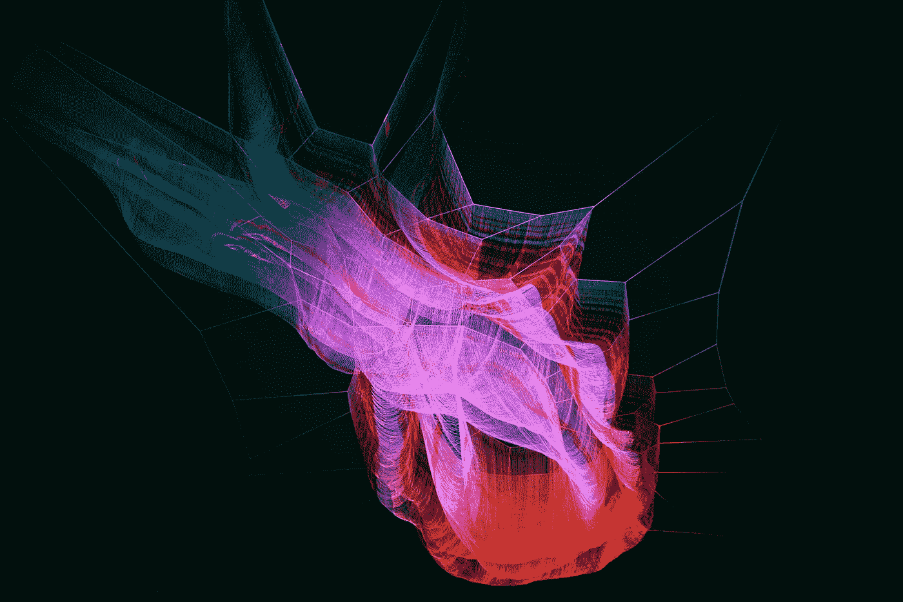

# 前沿技术堆栈

> 原文：<https://medium.com/hackernoon/frontier-technology-stack-fde9daddc156>

> 做好准备迎接🗝基于密码的，🤖AI 使能，👓混合现实驱动的创业公司💥嘣！💥

不可能把这样的声明当真。围绕“前沿”技术[的炒作如此之多，如加密、人工智能和 AR/VR，以至于说出任何一个名字都足以引起眼球转动。但是把这三个放在一起？这是下一个层次的模仿，直接出自*硅谷*的一集。](https://hackernoon.com/tagged/technologies)

起初我在 Twitter 上和 VC 朋友开了一个关于它的玩笑，为我的快速机智感到自豪。但从那以后，我一直在想这是否是真的。有一句受西格蒙德·弗洛伊德启发的谚语:“笑话是包裹在微笑中的真理”。我现在确信这在这里再合适不过了。

为什么？

## 真实项目

我遇到了一些新项目，它们以实际上有意义的方式结合了前沿技术。一些公开的例子包括:

*   [熊猫](https://panda.af/):AI+AR 相机
*   RoVR :一只超级可爱的人工智能+增强现实宠物
*   [分散的土地](https://decentraland.org/):一个密码+虚拟现实的世界
*   [OpenMined](https://github.com/OpenMined) :密码+ AI 基础设施

还有其他的仍在工作中。随着这些技术变得更容易理解和使用，它只会变得越来越普遍。

## 下一代堆栈

当你把它想象成下一代[三层应用架构](https://en.wikipedia.org/wiki/Multitier_architecture)时，这些技术配合得很好就不足为奇了:

*   [表示层](https://en.wikipedia.org/wiki/Multitier_architecture):沉浸式 3D 界面，由 AR/VR 实现
*   [逻辑层](https://en.wikipedia.org/wiki/Business_logic#Business_logic_layer):感知、学习和行动的智能代理，由 AI/ML 实现
*   [数据层](https://en.wikipedia.org/wiki/Data_access_layer):分散式分类账和状态，由 crypto/ [区块链](https://hackernoon.com/tagged/blockchain)启用

这些层在概念上被设计为相互抽象，因此它们是可堆叠的，这正是这些项目中开始发生的事情。

注意:不可否认，这过度简化了这些技术的范围。我将在下面和以后的文章中更多地讨论这个问题，但这里的重点只是为了说明这些看似不同的趋势为什么以及如何走到一起的一种模式。

## 历史相似

所有这些都让我想起了 21 世纪初，当时很像现在，很明显一些基本趋势正在发生:

*   **云** →大规模计算、数据和网络的新基础设施和运营模式(谷歌、AWS)
*   **社交** →新的价值主张和使用模式，例如交友、状态更新、消息传递(MySpace，脸书)
*   **移动** →新的外形和主界面，例如小显示屏、触摸界面、始终开启/连接(黑莓、iPhone)

不太明显的是，至少在早期，这些趋势对于彼此的成功会变得如何相互依赖和相互加强。移动既稳固了又被云的力量所推动(见:ridesharing /优步)。云还独特地实现了社交，它与移动相结合达到了一个全新的水平(见:messaging / WhatsApp，Snap)。

## 前方是什么

因此，也许我们现在正处于一个类似的转折点，对于那些我们在过去几年里一直在关注和等待的前沿技术。Crypto 既激励又保护数据的共享，以推进人工智能，而人工智能则使去中心化的系统实现真正的自治。AR/VR 依靠基于人工智能的感知和合成来获得身临其境的体验，同时还提供模拟环境来训练人工智能。虚拟世界需要加密来进行资产所有权和交易，而分布式加密团队在 VR 中进行协作。

我们可能会从人们通过堆叠混合现实+人工智能+密码创造的东西中获得更多的惊叹，而不是更多的欢笑。💥👓🤖🗝💥