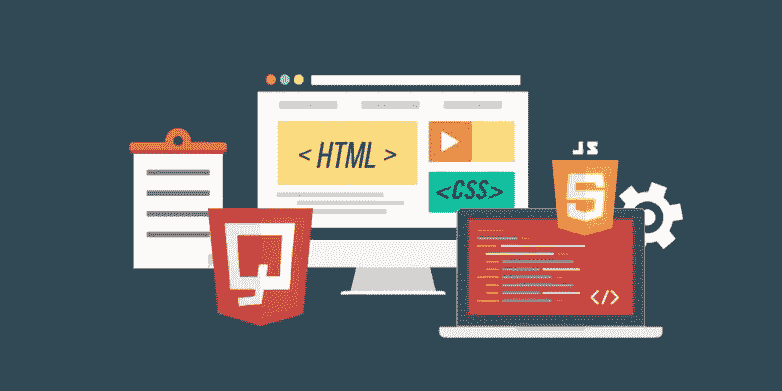
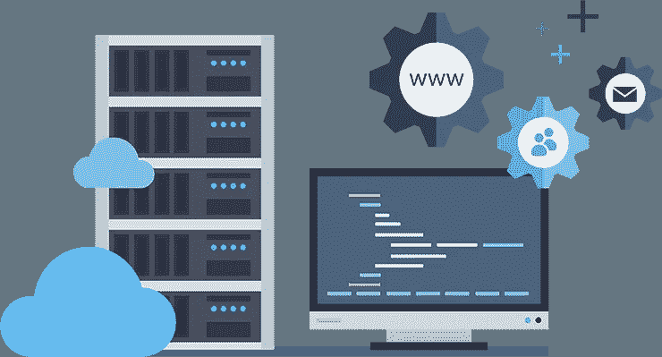
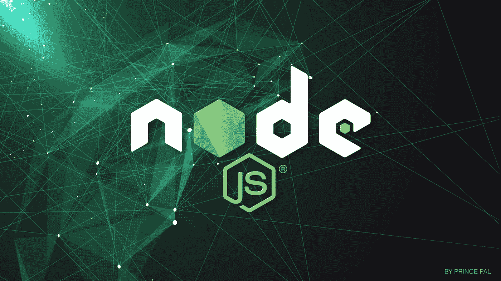
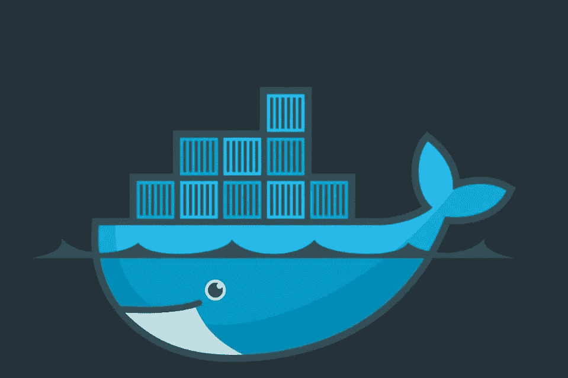

# 全栈 Web 开发—完整的路线图

> 原文：<https://medium.com/hackernoon/full-stack-web-development-the-complete-roadmap-9fe43ec0ba32>

学习 web 开发对一个创始人来说是一个巨大的优势，即使了解基础知识也会非常有用。这篇文章会给你一个你需要学习的所有东西的高层次概述，一个开始的路线图，以及一个你可以用来快速学习的最佳资源的集合。

我将告诉你一个专业的全栈 web 开发人员需要知道的一切，但是如果你只对理解基础感兴趣，你可以停止阅读“域名和托管”部分。

# 基础(HTML/CSS/JS)

最好的开始方式是学习所有网站的 3 种主要技术。HTML 定义了网站的内容，CSS 规定了它的外观(字体/颜色/图像/等等)，JavaScript 允许你动态操作元素(你在互联网上看到的所有交互都是用 JS 制作的)。

学习基础知识的最好方法是通过 Udemy 上的[Web 开发者训练营。](https://www.udemy.com/the-web-developer-bootcamp/)

 [## Web 开发者训练营——Udemy

### 学习 web 开发唯一需要的课程——HTML、CSS、JS、Node 等等！

www.udemy.com](https://www.udemy.com/the-web-developer-bootcamp/) 

它将带你完成创建你的第一个网站的过程，并给你一个开始的好地方。

# 结构

框架是允许你更快更容易地实现所有公共功能的工具。

我建议尽早使用框架，因为它们将使您能够更快地获得结果，同时以一种非常自然和直观的方式教给您最佳实践。仅仅通过使用框架，你将会以令人难以置信的速度吸收大量的知识，并且避免在任何不必要的事情上浪费时间。

在 web 开发中，总是有大量的技术可供选择，而这种选择对于新手来说往往是困难的。在本文的其余部分，我将避免您的困惑，而不是列出每个选项的利弊，我将只告诉您基于我的经验最好使用的东西。

最好的起点是学习**引导**和 **jQuery** 。到目前为止，这些是大多数网站使用的最流行的框架。

Bootstrap 是一个 CSS 框架，它给你一堆容易定制的界面元素，并允许你非常快速地创建响应性网站(响应性意味着它们在移动设备上看起来很好)。

Bootstrap 最近发布了新版本，您可以通过以下[课程](https://www.udemy.com/bootstrap-4-from-scratch-with-5-projects/)开始使用它:

 [## Bootstrap 4 从零开始，包含 5 个项目— Udemy

### 掌握 Bootstrap 4 并构建 5 个真实世界的主题，同时学习 HTML5 语义、CSS3 和 Sass

www.udemy.com](https://www.udemy.com/bootstrap-4-from-scratch-with-5-projects/) 

jQuery 是一个 JavaScript 框架，它极大地简化了你操作网页元素的方式。它有大量的插件，可以满足各种各样的需求，所以无论何时你需要一些交互元素，你都可以找到用 jQuery 创建它的方法。这也非常容易，因为 StackOverflow 已经为您将遇到的 95%的问题提供了解决方案。

要学习基本面，你可以只看[这个精彩的讲座](https://www.youtube.com/watch?v=BWXggB-T1jQ)。

最后，为了完整起见，我应该提一下[指南针](http://compass-style.org/)。你不需要在一开始就考虑它，因为它对你制作网站的能力来说不是必不可少的，但当你达到一个点，你正在编写大量的中级/高级 CSS，并开始发现它有点乏味时，你绝对应该记住它。Compass 让编写 CSS 的过程变得更快、更愉快，所以如果你能花几个小时来学习，这将是你能想象到的最好的生产力助推器之一。

# wordpress 软件

WordPress 是世界上最流行的内容管理系统。如果你不是一个技术人员，只是想快速开始制作一个容易定制的网站——你只是学习安装和使用 WordPress，差不多就是这样，你不需要再看了。它有无限量的主题和插件，可以满足你 90%的需求。

如果你有兴趣成为一名更专业的 web 开发人员，并学习创建自己的定制网站，你可能想跳过它，学习一个后端框架(我将在下面的部分中描述它们)。

# 域名和托管

一旦你学会了基本知识，并建立了你的第一个网站，自然你想让它对世界开放。同样，为了节省您的研究时间，我不会列出数百个可用选项，而只是告诉您使用“正确”的东西。

要购买域名，你将使用 [Namecheap](https://www.namecheap.com/) 。顾名思义，它有非常好的价格，也有出色的用户体验。

要托管你的第一页，你应该使用 Bluehost，它很便宜，很容易使用，有很好的文档和很多自动化工具。它使得安装 WordPress 或托管简单的 html 页面变得极其容易，所以如果你的目标是快速入门——这正是你所需要的。

最后，当你想走得更远，获得更多技能时，你将需要一个 VPS(虚拟专用服务器)。简而言之，它是一台您可以完全控制的远程计算机，并将用于服务您用框架构建的站点。我强烈推荐使用 [DigitalOcean](https://www.digitalocean.com/) ，它价格实惠，界面美观直观，在过去的 4 年里，我一直愉快地使用它来托管我所有的网站。

# 后端框架

现在你已经学会了基础知识，并使用上面列出的工具创建了几个简单的网站，你可以决定更进一步，学习如何专业地创建自定义网站。

要做到这一点，最好的起点是学习一个后端框架。后端框架运行在服务器上，并且每当用户访问一个 url 时，动态地为网站生成 html。

和往常一样，有几十个选项，但我会帮助您将它缩小到 3 个— **Django** 、 **Ruby on Rails** 和 **Node/Express** 。

对于应该先学习哪一个，不同的开发人员有不同的看法，但是我强烈建议您从 Django 开始，然后学习 Node/Express。

Django 的主要优势在于它是用 Python 编写的——这是一种漂亮、强大的语言，可用于你能想到的每个领域，同时也是你第一次使用编程语言的最佳选择。

Django 本身简单、强大、灵活，拥有优秀的文档，以及构建 95%的网站所需的所有工具。更重要的是——它会给你一个思考后端代码的极好的框架，并且理解它是学习一般 web 开发的核心基础的极好方法。

我最喜欢的 Django 入门是 TutsPlus 课程[Django 入门](https://code.tutsplus.com/courses/getting-started-with-django)，从初学者到中级/高级的最好方法是一本优秀的书[两勺 Django](https://www.twoscoopspress.com/products/two-scoops-of-django-1-8) 。

 [## Django 1.11 的两个独家新闻:Django Web 框架的最佳实践

### 关于 Django 最佳实践的书，Django 1.8 的两勺已经被修改、更新和扩展。

www.twoscoopspress.com](https://www.twoscoopspress.com/products/two-scoops-of-django-1-8) 

另外，我强烈推荐 Mike Hibbert 的免费 youtube 教程。

# 节点和 Express

Node 和 Express 是我推荐你在 Django 之后学习的极其强大的工具。对于初学者来说，它们可能有点难，但是如果你对 Django 有所了解——你会很快很自然地学会它们。

Node 有很多优点，体验的最好方式就是自己去尝试。通常它会让你比用 Django 更快地构建网站，你会更深入地理解许多后端编程概念，更容易地构建 API、实时 web 应用程序(像聊天或游戏)和通用 web 应用程序(当你学习 React 时会遇到它们)。

我遇到过最好的课程是[完整的 NodeJS 开发者课程](https://www.udemy.com/the-complete-nodejs-developer-course-2)。

 [## 完整的 Node.js 开发人员课程(第二版)

### 通过使用 Node、Express、MongoDB、Mocha 等构建真实世界的应用程序来学习 Node.js！

www.udemy.com](https://www.udemy.com/the-complete-nodejs-developer-course-2) 

# 前端框架

如果你理解 HTML/CSS/JS 和一个后端框架，你就是一个有能力的 web 开发者，有能力创建多种类型的网站。如果您想成为全栈开发人员，欢迎来到前端框架的世界。

前端框架将使您能够创建强大的单页面应用程序。此时，你实际上是在制作一个完全在浏览器中运行的应用程序，偶尔会与服务器交换数据(比如 Gmail 或 Trello)。

很长一段时间以来，这一领域一直存在许多竞争，但当你阅读这篇文章时，最佳选择很明显——你应该学习**反应和还原**。

我不能解释它们是如何工作的，或者它们有什么优点(这需要很长时间)，但幸运的是，有一门绝对精彩的课程会教你需要知道的一切——[现代反应与 Redux](https://www.udemy.com/react-redux/learn/v4/) 。

 [## 现代反应与还原——Udemy

### 在开发 NPM、Webpack 和 ES6 支持的应用程序时，通过本教程掌握 React 和 Redux 的基础知识

www.udemy.com](https://www.udemy.com/react-redux/learn/v4/) 

要了解更多高级功能，您可以观看本课程的第二部分，作者同为——[Advanced React and Redux](https://www.udemy.com/react-redux-tutorial/learn/v4/)。

这些课程的作者 Stephen Grider 是一位非常出色的老师，他对每一件事情都解释得非常好，通过学习他的课程，你会在学习这些技术的所有复杂性时获得很多乐趣。

我强烈推荐你用 Node 和 React/Redux 来创建一个网站，因为这真的会帮助你掌握如何创建和使用 REST APIs，把整套技术组合成一个强大有用的软件。

# DevOps

唷，那是一大堆东西。全栈 Web 开发人员需要学习的最后一个难题是 DevOps。这是一个很深的主题，我不是这方面的专家，但是部署网站的基本原理并不难理解。

到目前为止，仅仅通过建立和部署网站，你可能已经学到了很多。您可能已经使用 github 和一些 CI 工具来部署您的网站，并使用 Nginx 来服务它们。

现在，你应该学习的最重要的事情是 **Docker** 。Docker 是部署 web 应用程序的行业标准，它使整个过程变得快速、优雅和方便。

就我个人而言，我从[学习了 Docker 这门课程](https://www.udemy.com/docker-tutorial-for-devops-run-docker-containers)，我对此非常满意。本课程简短、直截了当、切中要害、易于理解。

 [## 面向开发人员和开发人员的 Docker 技术— Udemy

### 了解如何使用 Docker 技术开发和部署 web 应用程序。让你的 DevOps 技能更上一层楼。

www.udemy.com](https://www.udemy.com/docker-tutorial-for-devops-run-docker-containers) 

# 结论

我希望这篇文章对你有用。显然，不可能在一篇文章中涵盖这个深刻、复杂且快速发展的领域的所有内容，但我相信上面的主题和资源将为您提供一个清晰的未来愿景，以及一个有用的路线图。至少，这是我希望几年前就能看到的那种文章。

当你继续下去的时候，你肯定会学到更多，深入到你最感兴趣的主题中，但是我认为现在你的道路将会更加直截了当，更少困惑。

如果您有任何问题、意见或寻求建议，请随时给我发消息至**webdevadvice @ startup lab . io .**

此外，如果你对更多关于网络开发、创业和建立你的在线业务的文章感兴趣——去订阅我的每周时事通讯吧！

