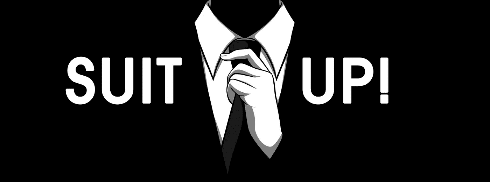

# 全副武装，准备好！

> 原文：<https://medium.com/hackernoon/full-stackers-suit-up-bcfd5c7a026f>

**一个全栈开发者必须对所有事情都有所了解**。从 [UI](https://hackernoon.com/tagged/ui) 和前端的启发世界到后端基础设施的深渊，他必须能够构建一个工作产品。尽管他缺乏某项专长(在某些情况下是必需的)，但他却是拥有最多、最多技能的人。他是我们要找的可靠的人。
但是要加入这个团队，开发人员必须用工具、技能和知识包围自己。作为一个有抱负的 [Stacker](https://hackernoon.com/tagged/stacker) ，我将与你分享我目前正在做的事情，以攀登全栈开发者的梦想状态。

# 学习…必须学习…

任何称职的开发人员都必须站在前沿，不断学习和提高。web 开发的世界是不断变化的，在这种永无止境的学习状态中找到动力是很重要的。我们可能喜欢呆在开发世界的第一线，或者优化我们的工作，甚至给我们的朋友留下深刻印象。但是，如果你找不到动力，这将成为一个问题，因为迟早你将无法理解你面前的代码，总有人会用“开发人员世界的最新时尚”来取代你。

为了让自己保持最新状态，我阅读/收听:

*   [黑客新闻](https://news.ycombinator.com/)
*   [编程的子编辑](https://www.reddit.com/r/programming/)和其他如 [dotnet](https://www.reddit.com/r/dotnet/) 和 [javascript](https://www.reddit.com/r/javascript/)
*   [Techcrunch](http://techcrunch.com/)
*   像[全栈电台](http://www.fullstackradio.com/)和[这样的播客。净岩](https://www.dotnetrocks.com/)

# 任务管理

一天中我们有许多任务要完成，通常，对我来说，除非是例行公事，否则我知道我会忘记。所以我决定用 Google Keep 来保存我所有的想法。它简单、快速，并且可以同步到我所有的设备上。哦，它是 100%免费的。对于时间明智的项目，我正在尝试使用 Trello，但我不喜欢将我的注意力分散在两个应用程序上的想法。

因此，我建议使用以下方法之一:

*   [谷歌保持](http://keep.google.com/)
*   特雷罗

# 密码管理器

我发现的另一个很棒的东西是密码管理器。我在一些密码之间轮换，但在 lastpass sync 开始位于自由层后，我尝试了一下，我喜欢将我所有的密码都放在一个地方。我知道有各种各样的风险，为了安全起见，我决定保留两个重要的账户。说到底，我认为在全部集中的情况下，更容易监控我的安全性。

一些密码管理器是:

*   [最后一程](https://www.lastpass.com/)
*   [仪表板](https://www.dashlane.com/passwordmanager)
*   [KeePass](http://keepass.info/) (开源)

# 生产力

作为一名开发人员和学生，我发现自己被锁定在 4 台设备上。我的家用电脑、笔记本电脑、工作时的工作站和智能手机。一段时间后，我发现有必要保持所有信息同步。为此，我使用了各种具有同步功能的应用程序(如 google keep 和 google photos)，对于短信、通知和剪贴板，我发现[加入](http://joaoapps.com/join)非常适合我。

*   [加入](http://joaoapps.com/join)(是最简单的选项)
*   Airdroid ( 它有一些安全问题，但它是一个非常完整的应用程序，我喜欢这种体验)

# 焦点

每天有如此多的干扰，让我越来越难最大限度地利用时间，更重要的是，进入“状态”。晚上音乐和代码的完美结合是我最喜欢做的事情之一，自从我学会用 Java 做我的第一个“Hello World”以来。

如今我试着:

*   播放没有声音的列表([史诗](https://www.youtube.com/watch?v=ASj81daun5Q&list=RDQM0SeXmAvYbCs)或[轻松](https://open.spotify.com/user/1170256139/playlist/51HYKQy8pUrD4dkfPA8m9L)
*   在每个人都睡觉的时候编码(现在不像以前那么频繁了…)

# 设计

我不得不承认这不是我的强项，但是我知道一个好的界面可以创造奇迹。这是一个好的和坏的应用程序之间的关键点，可以定义你是否会有人使用它。

帮你自己一个忙，花点时间在这件事上。

对于原型开发，我发现 F [igma](https://www.figma.com/) 是 S [ketch](https://www.sketchapp.com/) 的一个非常有趣的替代品，因为它对学生是免费的，windows 用户也可以使用。

我喜欢遵循的一条规则是，不管使用什么工具，都要记录我的工作。有了这个，我能够很快理解我做决定时的思路，并更好地理解我做了什么。

我在大学时已经学会了创建图表(我讨厌它)，但现在我发现它们是描述我的想法和架构的最佳方式。

设计工具:

*   [图玛](https://www.figma.com/)(用于原型制作)
*   [草图](https://www.sketchapp.com/)(原型制作，但仅适用于 Mac)
*   [绘制](https://www.draw.io/)(用于图表)
*   [Lucichart](https://www.lucidchart.com/) (作为绘图的替代)

最后，作为一个不精通设计的人，好的旧纸和旧笔创造了奇迹，并且是最快的解决方案。

# 发展中的

馅饼中的精华！我们都最喜欢的东西(至少我希望如此)！
作为一个满满的堆垛机，我们需要弄脏自己的手，从头到尾对一切负责。因此，我们可以将其分为:

**代码编辑器**

我发现 [Visual Studio 代码](https://code.visualstudio.com/)是编程的完美工具。如果你用 typescript 编程，这很好，但如果你是为。网芯。(这两项工作都由桑塔德拉的微软完成)。我发现有了内部或开放社区制作的插件，我几乎可以做任何事情，但是，如果你还需要更多，总有 Visual Studio 2017 社区。

如果您正在构建小型演示或正在进行试验，并且想要共享您的代码，您可能会考虑在线编辑器。

我发现自己正在使用的一些工具:

*   [Visual Studio 代码](https://code.visualstudio.com/)
*   [Visual Studio 2017](https://www.visualstudio.com/)
*   [CodePen](http://codepen.io/) (适用于文件数量较少的项目或演示)
*   [Plunker](https://plnkr.co/) (更适合 Angular 之类的框架)

**API**

我不得不承认一件事。当我制作第一个 API 时，我通过在浏览器中打开一个新标签并检查它是否显示了正确的信息来测试它。

当我开始处理多个请求、认证等问题时，我意识到我需要一个更好的工具。这向我介绍了单元测试(但是我将把它留给将来可能的文章)。

关键是，如果你需要一个 API，你需要测试它，如果你不想花无数的时间重复测试相同的请求，你需要升级。

测试 API 的工具:

*   [提琴手](http://www.telerik.com/fiddler)
*   [邮递员](https://www.getpostman.com/)

**持续集成**

我是在 2016 年才接触到这一点的，但这对开发者来说是个奇迹。您可以自动部署和测试您的代码，使您免于许多头痛和不眠之夜。

CI 工具列表:

*   Jenkins (可以托管在私人服务器上，但对初学者来说可能有一个陡峭的学习曲线)
*   [Travis CI](https://travis-ci.org/) (非常简单，直接链接到 github)

## 贮藏室ˌ仓库

将我们的代码保存在存储库中几乎是必须的。有两个选择，SVN 和 Git，但 Git 是这里的国王。这有助于保持我们的变更，并管理来自其他开发人员的贡献。我们还有其他功能，比如 wiki 和 issues，但事实是 Git 让我们的生活变得更加简单。

使用 Git 的主要选项有:

*   [GitHub](https://github.com/) (所有选项中使用最多的)
*   [Bitbucket](https://bitbucket.org) (被 Atlassian 收购，让你创建私有库)
*   [Gitlab](https://about.gitlab.com/) (新成员，但有现成的 CI)

# **奖励:**

截图: [Lightshot](https://app.prntscr.com/pt-br/index.html)

拼写检查:[语法上](https://app.grammarly.com/)

# 结论

如果你正在读这篇文章，我希望你已经耐心地读完了整篇文章。如果没有，您可以通过浏览每个部分的列表来快速检查我正在使用的所有工具(我不怪您；-) ).

我只是开始学习和优化我的编程方式。我仍然缺乏长时间不间断地编码的纪律，我现在才开始写副业。

但是我希望能够提高和学习。

从现在起的一年内，我可能会从这篇文章中切换一半的程序，并且可能会增加一些(容器、云和单元测试都在我的视线之内)。

但如果我做到了，那是因为我离全栈启蒙又近了一步:-)。

**免责声明:**我没有收到我列出的多种工具的一分钱。我真的希望分享我的工作工具，并在评论中获得一些反馈。

> [黑客中午](http://bit.ly/Hackernoon)是黑客如何开始他们的下午。我们是 [@AMI](http://bit.ly/atAMIatAMI) 家庭的一员。我们现在[接受投稿](http://bit.ly/hackernoonsubmission)并乐意[讨论广告&赞助](mailto:partners@amipublications.com)机会。
> 
> 如果你喜欢这个故事，我们推荐你阅读我们的[最新科技故事](http://bit.ly/hackernoonlatestt)和[趋势科技故事](https://hackernoon.com/trending)。直到下一次，不要把世界的现实想当然！

