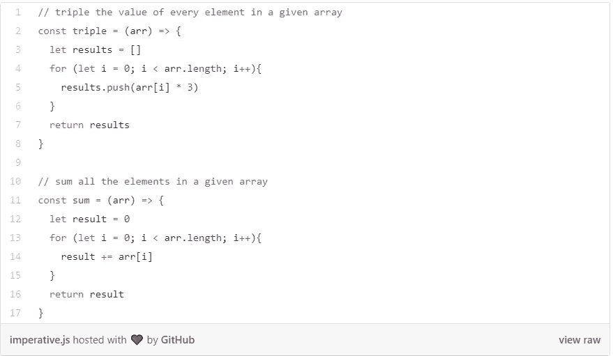

# 函数式编程:你应该使用什么语言？

> 原文：<https://medium.com/hackernoon/functional-programming-what-language-should-you-be-talking-313dd8bc379b>

Source: Pexels.com

您准备好踏上函数式编程之旅了吗？你来对地方了。我们将了解学习函数式编程语言的好处，以及科技巨头如何将函数式编程融入其软件开发周期的例子。

但是在我们开始之前，首先什么是函数式编程，为什么你需要了解它？

事实上，函数式编程没有任何固定的定义，因为它不是一成不变的。但是你当然可以把它看作是一种“范式”，一种独特的方法或者一种编程的“方式”。

维基百科将其定义为计算机程序的[‘一种构建结构和元素的风格’](https://en.wikipedia.org/wiki/Functional_programming)，将计算视为数学函数的评估，并避免改变状态和可变数据。有意义了吗？

这个 [quora 定义](https://www.quora.com/What-is-functional-programming)让它更容易理解，因为它将函数式编程定义为一个关注‘计算结果’而不是执行动作的范例。然而，定义函数式编程并不容易，因为它在本质上并不确定！

如果您正在为编写大型应用程序而奋斗，您并不孤单。虽然可以使用其他方法来编写更小的函数式应用程序或 MVP，但是函数式编程可以用来简化更大、更复杂的项目。

关键的区别在于使用了一种[“声明式”方法，而不是其他编程方法中使用的“命令式方法”](https://hackernoon.com/javascript-and-functional-programming-an-introduction-286aa625e26d)。命令式方法可能很难理解，它围绕着告诉软件如何做我们想要它做的事情，而不是确切地告诉它我们想要它做什么。

这里有一个命令式方法的例子:

[(图片来源)](https://hackernoon.com/javascript-and-functional-programming-an-introduction-286aa625e26d)

这个代码是 XYZ 的。但是看到它有多难读了吗？它看起来很笨重，在理解它的时候会耗尽你的大脑！

将这与函数式编程中使用的声明式风格进行比较:

[(图片来源)](https://hackernoon.com/javascript-and-functional-programming-an-introduction-286aa625e26d)

真是优雅。

上面的代码片段做了与命令式代码片段完全相同的事情，即，将值增加三倍，并将给定数组中的每一项相加。

然而，它是如此的干净、清晰和易于理解。这就是为什么函数式编程可以增强能力并且有效。

话虽如此，函数式编程并非没有“神话”。它们是真的吗？

为了了解更多关于函数式编程的信息，我们联系了一些科技巨头的高层和领导，包括澳大利亚电信、REA 集团、康蒂诺、ICM 咨询有限公司和 The Big Red Group。

让我们开始吃吧。

# 关于函数式编程语言的几大误区

**单一定义？**

函数式编程的主要神话是只有一个标准定义。我不敢告诉你没有。

虽然函数式编程可以被宽泛地定义为构建计算机程序基本组件的一种风格，但是对于什么是函数式编程以及如何定义函数式编程，并没有标准或被广泛接受的理解。

大多数专业人士都同意，与其他类型的语言相比，函数式语言使用不同的哲学。这意味着他们代表并重视一种看待软件结构的特定方式。

**任何人都可以开始吗？**

与普遍的看法相反，函数式编程并不是不可能学会的，即使你刚开始是一名软件开发人员。函数式编程是一项新技能，当你学习它的时候，你会觉得自己像一个程序员新手。然而，它就像任何新技能一样——从一开始就很难理解，但随着你学习规则，你会开始变得更舒服。

Telstra 的大数据分析总经理马克·莫洛尼(Mark Moloney)启发道:“一个神话是函数式编程很难或者太学术性。这只是另一种需要学习的技能。掌握它需要时间和练习——这与开发人员在 80 年代末 90 年代初学习面向对象编程的历程没有什么不同。技术在不断发展。这是我热爱软件的原因之一。学会如何学习和你知道什么一样重要。”

# 需要学习的顶级语言的分类

如果你想为一家伟大的科技公司工作，最好学习哪种语言？

Haskell 是一个很好的语言选择，因为它在许多科技公司中被广泛使用。它当然不是最容易学的语言，但它是一种纯粹的函数式编程语言。作为一门语言[它也是“懒惰的”](http://learnyouahaskell.com/introduction)，就像在，它不会执行函数，直到它被明确指示向你显示一个结果。

最常用但也最难学的语言之一是 APL，它需要自己独特的键盘。一想到要学习使用一种新型键盘，就让人望而生畏！

那么，可以学习哪些语言呢？考虑以下一些强有力的竞争者:

*   Clojure
*   长生不老药
*   榆树
*   F#
*   哈斯克尔
*   伊德里斯
*   斯卡拉

马克·莫洛尼分享了他职业生涯中使用过的语言。“曾经，开发人员可以选择一种语言，比如 C#或 Java，并在这个生态系统中履行他们作为软件开发人员的职责。今天需要多种语言的方法。换句话说，根据任务使用多种语言。

“比如 web 应用的 JavaScript，原生移动应用的 Swift 或 Android (Java)，Java，Scala 等。后端服务，深度学习用 Python。从技能的角度来看，学习多种语言是有价值的。我学习函数式语言(如 Scala)的道路变得更加容易，因为我第一次在 JavaScript 应用中应用函数式技术。”

Contino 的工程副总裁云志·林用他 15 年的经验提供了他的见解:“我一直偏爱编译型和强类型语言。我已经从 Java、Groovy 和 Scala 等基于 VM 的高级语言转向了 golang 和 C++等更简单、更低级的静态编译语言。”

REA 集团软件开发人员 Jack Low 也看到了 Scala、Haskell 和 Idris 的好处。“我对学习使用强类型系统在编译时检测尽可能多的潜在错误的方法很感兴趣。到目前为止，这让我接触到了 Scala、Haskell 和 Idris 等语言。特别是 Idris，它的依赖类型系统让我非常着迷。我认为它的成功将由未来传入主流语言的概念数量来衡量。函数式编程语言最近影响了许多主流语言，我预计这种情况会继续下去。”

考虑到这些，最难的编程语言是什么？

正如你可能已经猜到的，答案取决于，很大程度上取决于你解决问题和访问互联网上现成资源的能力。

好消息是，由于该职业的合作性质，学习编程语言可以相对较快地完成。

# 当前如何使用 Functional 的示例

根据具体情况，Moloney 支持 Scala、Python 和 JavaScript。“鉴于我在大数据和数据科学领域工作，Scala 是一种通用语言。Apache Spark 是最流行的分布式数据处理框架，Spark 是用 Scala 编写的。该语言减少了完成工作所需的输入，同时保留了所有的库和集成选项，这些都来自于它与 Java 紧密互操作的能力。对于机器学习和更多，特别是深度学习，Python 也是一种关键语言。用一个前端，精通 JavaScript(或 transpilers 如 Typescript，Elm 等)构建端到端的系统。)依然重要。”

# 掌握语言的专业技巧

莫洛尼分享了他最喜欢的两个资源，Github 和 T2 Coursera。他解释说，“Github 是因为副业让我能够试验和尝试新的语言。你学习的每一门新语言都会变得更容易，因为更多的学习是从以前的语言中转移过来的。

" Coursera 的《Scala 函数式编程原理》是对 Scala 和函数式编程的极好介绍."

ICM 咨询公司的首席技术官 Brendan Bates 分享了一些实用的建议:“我喜欢在个人项目中练习我的技能——大多数我从未完成，有些我完成了，但再也不会看一眼。过去，我喜欢在[项目欧拉](https://projecteuler.net/)上快速浏览一些问题