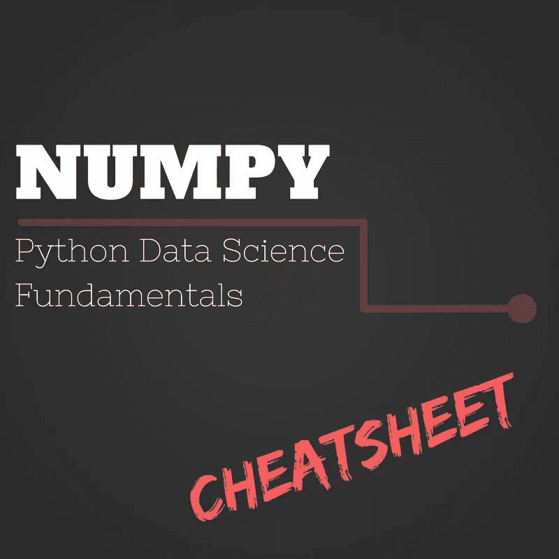

# 基础 Python 数据科学库:备忘单(第 1/4 部分)

> 原文：<https://medium.com/hackernoon/fundamental-python-data-science-libraries-a-cheatsheet-part-1-4-58884e95c2bd>



如果您是一名开发人员，并且希望将数据操作或科学集成到您的产品中，或者开始您的数据科学之旅，下面是您需要了解的 Python 库。

1.  **NumPy**
2.  熊猫
3.  Matplotlib
4.  sci kit-学习

本系列的目标是提供关于如何使用必备库的介绍、亮点和演示，以便您可以选择更深入的内容。

# NumPy

正如 NumPy 的[网站](http://www.numpy.org)上所写的，这个库是 Python 科学计算的基础。它包括超高速的强大的操作和数学功能。

## **图书馆的焦点**

这个库是关于多维数组的。它在外观上类似于 list & [索引，就像 list](https://docs.scipy.org/doc/numpy-1.13.0/user/basics.indexing.html) 一样，但是带有一组更强大的工具。

## **安装**

打开命令行并键入:

```
pip install numpy
```

Windows:过去我发现安装 NumPy 是一件令人头疼的事情，所以我鼓励所有 Windows 用户下载 Anaconda 的 Python 发行版，它已经安装了所有的数学和科学库。

## **详情**

NumPy 数组在几个方面不同于列表。

1)NumPy 数组中的所有数据必须是相同的数据类型，一个列表可以包含多个

2)NumPy 阵列的内存效率更高，速度更快！详细解释见[此处](https://stackoverflow.com/questions/993984/why-numpy-instead-of-python-lists)

3)列表没有内置那么多强大的数学方法和属性！—对数据探索和开发非常有用。

让我们开始吧！

```
import numpy as np
```

## **创作**

可以用几种不同的方法创建数组。

**来自列表或元组**

```
# 1 dimensional array (you can pick more)
future_array1 = [1,2,3,4,5]
array1 = np.array(future_array1)>>> array1
array([1, 2, 3, 4, 5])
```

**带占位符内容**

```
# there are other placeholder options, see jupyter notebook below
placeholder_zero = np.zeros((3,4), dtype=np.int) # default np.float>>> placeholder_zero
array([[0, 0, 0, 0],
       [0, 0, 0, 0],
       [0, 0, 0, 0]])
```

**同一个序列**

```
# sequence based on steps (start, end, step_value)
sequence_array1 = np.arange(10, 30, 4)# evenly spaced sequence based on number specified
# (start, end, number_of_elements)
sequence_array2 = np.linspace(10, 30, 4)>>> sequence_array1
array([10, 14, 18, 22, 26])>>> sequence_array2
array([ 10\. ,  16.66666667,  23.33333333,  30\. ])
```

**上传数据**

```
# csv = comma separated values
data = np.genfromtxt("your_file_here.csv", delimiter=",")
```

## 让数学变得简单

你可以对整个数组进行各种数学运算。不需要循环！将使用结果创建一个新的数组。

```
a1 = np.array([1,2,3,4])
a2 = np.ones((1,4), dtype=np.int)
a3 = np.zeros((1,4), dtype=np.int)# Addition/Subtraction
A = a1 + a2 - a3# Multiplication/Division
B = a2 * a3 / a2>>> A
array([[2, 3, 4, 5]])>>> B
array([[0, 0, 0, 0]])
```

## **属性&方法**

除了数学运算，NumPy 还提供了许多强大的功能，您可以利用这些功能来节省时间并提高可读性。

**汇总统计**

```
>>> array1.mean()
3.0>>> array2.mean(axis=0)
array([ 5\.  6\.  7\.  8.])>>> array2.mean(axis=1)
array([  2.5   6.5  10.5])
```

此外，还有。max()，。min()，。sum()，还有更多。

**重塑**

```
A = np.array([1,2,3,4,5,6,7,8,9,100])
B = A.reshape((2,5)) # takes a tuple of dimensions
C = B.T # transpose>>> B
array([[  1,   2,   3,   4,   5],
       [  6,   7,   8,   9, 100]])>>> C
array([[  1,   6],
       [  2,   7],
       [  3,   8],
       [  4,   9],
       [  5, 100]])
```

**更多数学知识**

```
D = A.reshape((1,10))>>> A.dot(D)
array([10285])
```

还有更多(不胜枚举)可用的数学方法。Dot 只是我的最爱。

我在这里提供了一个链接来下载我的 NumPy 演练，使用 Jupyter 笔记本来完成我们所涉及的所有内容甚至更多！

以前没用过 Jupyter 笔记本？访问他们的网站[这里](http://jupyter.org)。

总的来说，如果您需要对数据列表进行复杂的转换，我建议您在自己编码之前搜索 NumPy 解决方案。这将省去你许多头痛的事。

## 应用程序

让我们看一个场景。比方说，我能够出口贸易交易:购买和销售。我想看看每次交易后我手头有多少现金。

```
import numpy as np# deposited $100,000 and then started buying and selling
trades = [100000, -10000, 10500, -100000, 175000]# convert my trades to a numpy array
trades_array = np.array(trades)>>> trades_array.cumsum()
array([100000, 90000, 100500, 500, 175500])
```

这是一个非常简单的版本，虚构的数据。然而，如果我们想处理上面显示的数据，但是数据旁边有日期，那该怎么办呢？这是可能的，看看我的[下一篇关于熊猫](https://hackernoon.com/fundamental-python-data-science-libraries-a-cheatsheet-part-2-4-fcf5fab9cdf1)的文章。

感谢阅读！如果你有问题，请随意评论&我会尽量回复你。

感谢阅读！如果你有问题，请随意评论&我会尽量回复你。


在 Instagram 上与我联系[@ Lauren _ _ glass](https://www.instagram.com/lauren__glass/)&[LinkedIn](https://www.linkedin.com/in/laurenjglass/)

在亚马逊上查看我的[必需品清单](http://bit.ly/my_essentials)

[访问我的网站！](https://www.laurenglass.me)


Search for me using my nametag on Instagram!