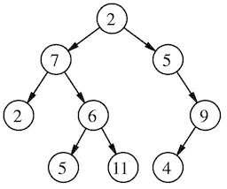
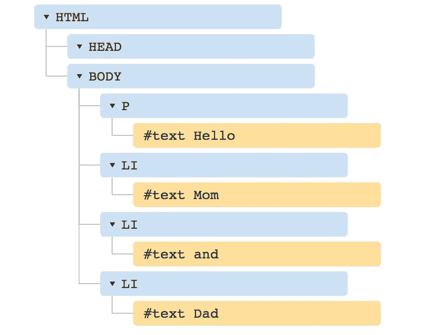
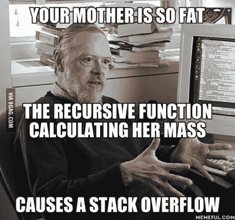

# 游戏 CS 面试

> 原文：<https://medium.com/hackernoon/gaming-cs-interviews-20a78045c0ef>

非计算机专业人士在白板面试中大显身手的技巧

Image Credit: [Coding Interview University](https://github.com/jwasham/coding-interview-university) and [Silicon Valley](http://www.hbo.com/silicon-valley)

首先，我要说的是，科技行业的许多公司(T1)已经开始(T2)远离传统的技术白板面试，包括我自己，因为这些面试往往与员工的日常发展工作没有什么关联。大多数公司最好专注于测试[实践技能和回答](https://hired.com/blog/employers/whiteboard-interview-alternatives/)问题的能力，而不是算法、计算机科学问题，这些问题来自真正喜欢这类问题的人。当然，也有例外，但我相信今天大多数工程工作都属于这一类。

话虽如此，最大和最受尊敬的科技公司如**谷歌、脸书、亚马逊、微软**等。所有人都仍然采用非常相似的技术面试循环，这使得*倾向于更青睐具有标准计算机科学背景的候选人，而不是那些自学成才的候选人*或者更喜欢关注软件工程而不是计算机科学的“科学”方面的候选人。

不管你对这一过程是否公平或最佳的看法如何，我有很多朋友属于后一种类型，即自学或软件工程，并对与这些大公司之一面试的想法嗤之以鼻，尽管我从经验中知道，一旦他们通过面试，他们会很好地适应。鉴于这些也是我有幸共事过的更好、更有激情的开发人员，我想分享一些我多年来积累的可靠建议，希望能鼓励其他工程师考虑通过在一家或多家大型科技公司工作来推进自己的职业生涯。

我真诚地相信，通过采用正确的思维方式，并提前研究一些关键主题和问题原型，大多数擅长用自己选择的语言开发代码的开发人员能够通过谷歌式的面试循环。

因此，带着这个目标，让我们深入白板吧…

Here’s a picture of a generic whiteboard… because it’s on topic and not at all redundant…

# 一般提示

当遇到编程问题时，千万不要马上开始编码。通过首先验证你的假设和思维过程是正确的，来讨论问题。

我强烈建议你在任何时候都要试着舒服地描述你的思维过程，尤其是当你不确定如何继续的时候。通常，面试官更关心你的思考过程而不是解决方案，并且/或者会根据你的想法给你指导。期待指导；一次伟大的面试应该更多的是一次交谈，而不是一个片面的问题和一个片面的答案。

通常从你能想到的解决问题的最天真、最直接的方法开始，即使你认为这真的很低效。在这样做的时候，用语言描述你的思维过程，要么面试官会说这很好，你可以开始编码了，要么你会得到确认，他们想更深入地挖掘一个更好的解决方案，这通常会导致一场关于算法最低效的部分在哪里(比如最内部的循环)以及你如何潜在地减少其运行时间的对话。

总是使用你最熟悉的编程语言；永远不要使用“更难”的语言，因为你认为这会让你看起来更合法。

在面试的最后，你的评估将是高度主观的，所以记住这一点，试着找点乐子，冷眼看着面试官，利用他或她的兴趣。几乎总是尽早问他们在 X 公司做什么，这将有助于你了解他们是什么样的人，也有助于让他们心情愉快，因为人们喜欢谈论自己。例如，我最近采访了一位在 X 公司的编译器团队工作的开发人员，该团队调整了我处理某些对话部分的方式，使其更加低级，并在某一点上开玩笑说一些所有编译器窥视者都能理解的事情。如果他们喜欢你这个人，不管他们是否意识到，他们在评估时会更加宽容；那只是人类的本性。

Credit: [xkcd](https://xkcd.com/1293/)

# 采访主题

在算法面试中有一些非常常见的原型，可以解释你会遇到的绝大多数问题。如果你了解这些核心问题类型，并能解决其中的一些问题，你就能在真正的面试中更好地解决类似的问题，并随后解决工作中的实际问题。

# 算法复杂性

这个题目归结为理解 [**big-O 批注**](http://bigocheatsheet.com/) **。**尽管还有其他更罕见的复杂性指标(如 little-o、theta……)和 NP 完全性等话题，但 *I* *还是建议略读一下*，因为它们不太可能出现在典型的技术面试中。

对于面试中要求你解决的几乎每一个问题，你要么会被明确地问到一个提议的解决方案的 big-O 运行时，要么会被含蓄地期望在你们的讨论中提出来。

这一部分肯定可以通过提前练习一些有代表性的问题来进行。您将掌握它的窍门，并且通常能够相当容易地说问题 X 看起来像问题 Y，所以它们很可能有相似的运行时。

I love how they portray algorithms in movies, don’t you? (Credit: [The Winter Soldier](http://www.imdb.com/title/tt1843866/), 2014)

请注意，对于 big-O 复杂性，最常见的是从*运行时*的角度考虑问题，但是也可以从*空间*存储的角度考虑问题。例如，排序算法可能需要`O(n log(n))`运行时间，这是很常见的，但是能够就地对数组进行操作，只需要`O(n)`存储。有时候，在考虑不同的方法时，这可能是一个重要的因素，否则面试官会补充说你的记忆能力有限之类的。

我建议回顾并理解最常见的数据结构操作的 big-O 运行时，例如:

*   从一个**数组**中添加/移除/获取/查找
*   从**链表中添加/移除/查找**
*   从**堆栈中添加/移除/查看**
*   从**队列中添加/删除/查看**
*   从一个**散列表**中添加/移除/获取
*   从**平衡二叉树**中添加/删除/获取
*   从**堆中添加/移除/获取**(尽管堆不太常见……)

您应该非常熟悉这些操作的运行时，因为许多算法将使用它们作为构建模块。不仅要记住这些运行时间，而且要对它们是如何产生的有一个坚实的理解，这是非常值得的。

即使是最合格的候选人，在不同的环境下也很难理解这个主题，所以如果你能想出一个解决方案，但在运行时有困难，也不要担心。还要注意的是，这是最容易“游戏”的主题之一，通过提前练习例子。

理解 Big-O 的复杂性将影响你回答以下所有主题的面试问题的能力，这就是为什么在继续之前，它是唯一最重要的基础主题。

我建议基本熟悉的一个常见子主题是*摊销* big-O，也称为*预期* big-O，由此您可以使用一些简单的概率理论来说明某项操作的*预期值*例如是`O(1)`，尽管有时对于单个调用来说可能是`O(n)`。实践中最常见的摊销/预期 big-O 的例子是散列表查找被摊销`O(1)`和快速排序被摊销`O(n log(n))`。例如，在 Javascript 中，所有像`myObject.foo`或`window.document`这样的对象查找都是分摊的`O(1)`散列表查找(除了编译器能够在幕后优化这些操作的特殊情况)。

# 图形和树

Example graph composed of nodes and edges.

图表是一个有很多潜在的复杂性和废话需要解决的领域，但是在一天结束时，一旦你理解了基本知识，几乎所有与图表相关的面试问题都非常简单。*当你不确定什么是“基础知识”时，有时你可能会不知所措*，你试图理解像 Djikstras 算法这样的东西，这肯定超出了大多数面试人员的研究范围。

## 术语

*   图是一组节点和这些节点之间的边。节点和边通常有标签或权重之类的有效载荷与之相关联。
*   最常见的图形区别是无向图和有向图。例如，当您在两个节点之间有一条边时，它是一条有向的单行道，还是一条无向的双行道，当您从一个节点到另一个节点时，它可以双向行驶。
*   树是一种非常常见的图形类型，带有一些有趣的约束，所以你学习的任何关于图形的知识通常也适用于像二分搜索法树和 DOM 这样的树。
*   遍历图是访问图中节点的过程，通常从一个根节点开始，并基于每个节点的邻居从那里递归地扩展*。*
*   *理解 w.r.t .图的两个主要算法是 **95%的图问题归结为广度优先搜索(BFS)和深度优先搜索(DFS)** ，下面简单介绍。*

**

*BFS vs DFS visualization (credit: [https://github.com/kdn251/interviews](https://github.com/kdn251/interviews)).*

## *建议*

*在处理图表时，通过在白板上绘制示例来可视化它们会特别有用，这是我在一般技术面试中能想到的白板的唯一好用途之一...*

*在学习过程中，你可能会遇到许多不同类型的图表和专业，但它们的区别对于面试来说很少是重要的。*

**

*The [Document Object Model](https://developer.mozilla.org/en-US/docs/Web/API/Document_Object_Model/Introduction) (DOM) is an important example of a common graph used by many frontend developers.*

*从头开始编写 BFS 和 DFS 应该会很舒服。即使问题不是直接“编码 BFS”，许多问题也会间接涉及到你从感兴趣的给定节点开始遍历图，并确保你没有多次访问节点，这正是 BFS/DFS 擅长的。*

*注意我是如何交替使用 BFS/DFS 的；它们彼此之间有很小的差异，大多数情况下，使用 BFS 或 DFS 并不重要，但是您仍然应该理解两者之间的差异，并能够在白板上绘制示例遍历。*

*BFS 和 DFS 都可以迭代或递归实现(任何所谓的“尾递归”函数都可以迭代重写)。递归思维要强大得多，所以我会先把你的努力集中在那里。*

*大多数时候，如何定义将要使用的图表完全取决于您。例如，这里有一个非常简洁的方法，通过定义一个`Node`来表示一个图:*

*Node-centric example graph representation.*

*图形的一个常见区别是你使用的数据结构是“以节点为中心”还是“以图形为中心”。前面的`Node`定义是以节点为中心的，因为每个节点都是智能的，并且封装了关于其相邻边的信息。下面是另一个以图形为中心的例子，我们也使用整数来表示节点:*

*Graph-centric example graph representation.*

**例题:**

> *给定一个图，其中节点代表美国主要城市，边代表这些城市之间的航班，编写一个函数，该函数接受两个城市并返回这两个城市之间的有效航班路径，如果没有这样的航班路径，则返回 null。*

*   *这个问题最直接的解决方案是使用 DFS。*
*   *这类问题的一个更难的变体是，如果每条边(飞行)都有一个代表距离的数字，那么就找到最短的*路径，这就是 Djikstra 算法发挥作用的地方。**

**

*Graph visualization of flights between major US cities (credit: [databricks](https://databricks.com/blog/2016/03/16/on-time-flight-performance-with-graphframes-for-apache-spark.html)).*

# *整理*

*对数字、字符串等进行排序。是很多面试解题中很常见的一道子题。面试官要求你编写合并排序或快速排序或任何其他类型的排序并不常见，但很常见的是，要么必须将你输入的某个部分作为一个难题进行排序，要么解决方案非常类似于众所周知的排序算法。出于这个原因，复习一下[并能够编写最常见的代码是很有用的。](https://www.toptal.com/developers/sorting-algorithms)*

*Note: please don’t take this algorithm seriously. (Credit: [Reddit](https://www.reddit.com/r/ProgrammerHumor/comments/5w9pnz/new_ultra_fast_sorting_algorithm/))*

## *常见排序算法*

*   ***合并排序**；特别是，它的递归“divide&converge”方法经常出现。`O(n log(n))`*
*   ***快速排序**；通常被认为是最健壮的通用排序算法。一般摊销`O(n log(n))`*
*   ***半径排序**；仅使用位黑客处理数字，但效率明显更高。`O(n)`*

*Radix sort 太高级了，无法在任何不是来自地狱的面试中实现，所以不要担心它的内部，但如果知道它的存在并能够利用它，它会派上用场。*

**例题:**

> **给定一个整数数组，写一个函数移除所有的重复项。(一定要加上强制跟进，它的运行时间是什么？)**

*   *如果您意识到通过对输入进行排序，您可以沿着所有重复项彼此相邻的数组走，从而得到一个高效的解决方案，那么“啊哈”时刻就到了。*

# *用线串*

*用您喜欢的语言复习字符串基本操作。例如，对于 javascript，`slice`，`substr`，`substring`，`toLowerCase`，`toUpperCase`，`charAt`，以及使用`match`的非常基础的 regex 东西。*

**

*Luckily, most interview questions focus on ascii.*

## *笔记*

*   *字符串只是字符的数组，所以你为数组学习的任何算法也适用于字符串。*
*   *一种非常常见的字符串问题涉及到查找给定输入字符串的所有可能的子字符串。*

**例题:**

> **给定一个长度为 n 的密码字符串作为输入，并从所有 26 个小写字符映射到可能的替代字符(如“E”映射到[“E”，“E”，“3”])，实现一个函数，返回所有可能生成的长度为 n 的密码组合。**

*   *例如，“haxor”可以是“Haxor”、“hax0r”、“HAX0r”等。*

# *递归*

*编写递归函数应该像面包和黄油一样流畅，并且与这里列出的所有其他主题有很多重叠。*

**

*Credit: The Internets*

**例题:**

> *实现一个函数，返回斐波纳契数列中的第 n 个数字(1，1，2，3，5，8，13，…)。*

*   *一个常见的后续问题是，直接的解决方案通常效率很低，那么如何优化递归呢？*

**例题:**

> *给定一个二叉树，实现一个“访问者”模式函数，它接收一个节点并访问所有的子节点。实现前缀、中缀和后缀遍历。*

*   *遍历顺序的不同只是改变了访问“当前”节点的顺序，可以在子节点之前，在左子节点之后，或者在右子节点之后。*

**例题:**

> **给定一个简化的 DOM 节点，定义为:* `*class Node { string className; Array<Node> children; }*` *，编写一个函数，它接受一个* `*Node*` *以及一个目标 css 类，并返回与该 CSS 类匹配的所有子节点的列表。**

*   *除了遍历之外，访问每个节点的逻辑需要考虑 DOM 节点可以有多个类名的事实，所以仅仅在目标 CSS 类和节点的`className`之间进行直接比较是不够的。*
*   *这正是内置函数`getElementsByClassName`的作用。*

# *脑筋急转弯(抽象的狗屎)*

*脑筋急转弯不像以前那么常见了，这类问题对于项目经理(项目/计划经理)来说更常见，但它们偶尔也会在开发人员面试中出现。*

*它们通常包括要求你解决一些不可能的或非常困难的问题，概括了你的思考过程比你想出的解决方案更重要的咒语。*

*一个最著名的例子来自谷歌，它曾问候选人“你会如何移动富士山？”*

## *建议*

*   *认识到目标不是想出最好的可能的解决方案，而是一个合理的、可行的、由推理支持的解决方案。*
*   *提出澄清性问题；"我们要把富士山搬到哪里？"，“我们有什么资源来完成任务？”等。*
*   *脑筋急转弯的一个常见子集是问“存在多少个 X？”比如“美国有多少加油站？”*
*   *这里的目标是能够猜测一些数字，给出响应数量级的概念，所以如果我们估计每个城镇有 10 个加油站，每个州和 50 个州有 2000 个城镇，…这应该足够开始行动了。*

# *不太常见的话题*

*这些主题不像上面的核心算法和数据结构主题那样常见，但根据你申请的职位，理解高层次的类别并能够在遇到某一类型的问题时识别它仍然是一个好主意。*

*   *并发*
*   *数据库*
*   *更通用的数据结构*
*   *动态规划*
*   *体系结构*
*   *还有如此之多的…*

# *从这里去哪里？*

*这篇文章的目的是作为一个起点，让你的面试准备集中在几个核心话题上。一旦你准备好深入了解更多细节，这里有一些很好的资源可以帮助你更好地理解这些核心概念，重点是实际的面试培训。*

*[编码面试大学](https://github.com/jwasham/coding-interview-university#graphs)是 Github 上明星最多的 repos 之一，理由很充分。它汇集了大量与 cs 面试相关主题的文章、课程、视频和其他学习资源。我唯一的警告是，这是相当压倒性的，涵盖了比标准技术面试真正需要的更多的领域。尽管如此，这是我推荐去学习或复习我在这篇文章中概述的任何主题的第一个地方。*

*[受雇于 Tech](https://www.hiredintech.com/) 是一个惊人的、组织良好的资源，它涵盖了许多有用的高水平技术以及具体的例子。我强烈建议你去看看。*

*[技术面试手册](https://github.com/yangshun/tech-interview-handbook)是一个很好的资源，除了涵盖大量 CS 材料本身，还提供了更多实用的技巧，告诉你应该期待什么以及如何处理技术面试循环。*

*一旦你熟悉了我在这里概述的核心 CS 概念，我建议你把大部分准备时间花在练习在线编码问题上。请记住，在练习的时候，要考虑如何在真实的面试环境中描述你的思维过程，除了解决问题本身，还要考虑 big-O 之类的事情。以下是我最喜欢的一些寻找高质量实践面试问题的资源:*

*   *[交互式编码挑战](https://github.com/donnemartin/interactive-coding-challenges) —列出了大量的交互式练习题，其中许多都附有解答和解释。*
*   *[谷歌面试问题](https://www.interviewcake.com/google-interview-questions) —面试蛋糕提供的谷歌以前用过的面试问题大列表。*
*   *[编码面试大学](https://github.com/jwasham/coding-interview-university#coding-exerciseschallenges) —他们关于编码练习/挑战的部分是寻找练习问题的额外资源的一个很好的元列表。*

*最后，让面试变得更舒服的最好方法是实际面试。我知道这听起来显而易见，但我能给出的一条具体建议是，在任何地方、任何地方都适用，甚至适用于你不一定会考虑为之工作的公司，目的是在真实世界的面试中获得宝贵的经验，以及可能发现你事先不知道存在的机会的额外好处。*

*例如，如果你有兴趣为谷歌/脸书/ Twitter / etc 工作，但你不会太热衷于为甲骨文和 IBM 工作(严格来说是为了举例…)，我会鼓励你仍然申请它们，以便获得实践经验，并在面试时更加自如。据我所知，这是在现实世界中磨练技能的最佳方式，这与更有声望的科技公司的面试环节相当。*

*我希望你喜欢这篇文章！如果你觉得有用，请相应地鼓掌/点赞/分享😃*