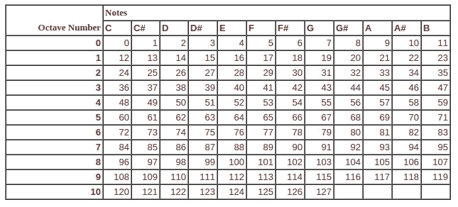
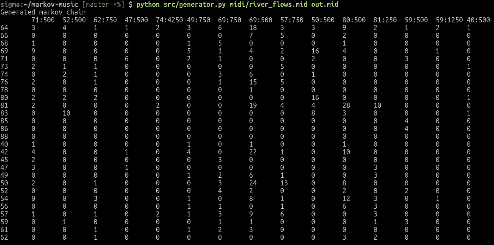

# 使用马尔可夫链生成音乐

> 原文：<https://medium.com/hackernoon/generating-music-using-markov-chains-40c3f3f46405>

所以这个周末，我重温了一个我搁置的项目。在这个技术演示中，我试图使用马尔可夫链的基本实现来程序化地生成音乐。这个项目实际上是受韩国钢琴家李闰珉的音乐的启发，我决定把它作为一次学习经验来阅读马尔可夫链。

简而言之，马尔可夫链是跟踪状态转移概率的数学系统。它们经常被用来模拟复杂的系统和预测行为。它们被用于很多商业应用，从文本自动完成到谷歌的 PageRank 算法。我第一次接触马尔可夫链实际上是在我高中的软件开发课上，当时一个同学用这个概念构建了一个聊天机器人。他从我们班的聊天记录中提取信息，并将其输入马尔可夫链。用每个单词作为一个“状态”，他绘制了单词转换的概率，并用这些概率生成文本。

作为如何工作的一个例子，单词“I”后面往往跟有单词“am”或“are ”,而不是后面跟有单词“假设”。使用我们的课堂聊天作为训练数据，他生成了一个单词转移概率的映射，并使用它来将可能在彼此之后找到的单词串在一起。这个方法非常有效，所以我打算把这个概念应用到李闰珉的音乐中。如果你感兴趣，[你可以在这里](https://en.wikipedia.org/wiki/Markov_chain)阅读更多关于马尔可夫链的内容。


Picture from [http://yiruma4ever.blogspot.com/](http://yiruma4ever.blogspot.com/)

由于结构简单，我决定在这个项目中使用 MIDI 文件。MIDI 文件是简单的文件，由包含文件中编码的音乐信息的块组成。需要注意的一个重要区别是，MIDI 文件不像 MP3 文件那样是音频文件。相反，它们包含如何演奏曲子的说明，这些曲子可以由各种不同的计算机生成的乐器演奏。正因为如此，它们受到限制，因为它们只能存储一定范围的音符，而不能存储像声乐歌词这样的复杂音频。

通常，MIDI 文件包含一个头块，其中包含播放声音的“乐器”的信息，后面是轨道块，其中包含播放的音符及其持续时间、力度(音量)等。

我做的第一件事是试图找到一个 Python 库来解析 MIDI 文件。在做了一些研究后，我选定了[美度](http://mido.readthedocs.io/en/latest/index.html)。几个月前，当我第一次尝试做这个项目时，mido 的文档非常糟糕，在他们的示例代码中有语法和逻辑错误，但现在他们似乎已经解决了这个问题。这个库使用起来非常简单。

```
**from** mido **import** MidiFilemid **=** MidiFile('song.mid')**for** i, track **in** enumerate(mid**.**tracks):
    **print**('Track {}: {}'**.**format(i, track**.**name))
    **for** message **in** track:
        **print**(message)
```

这就是你开始阅读 MIDI 文件中的信息(mido 使用术语“信息”)所需的全部代码。我做的第一件事是用这个写一个基本脚本来打印 MIDI 文件中的所有信息。我从[这里](http://midicollection.net/songs/index.php?id=13)下载了李闰珉最著名的作品之一《河流在你体内》的 MIDI。这是 MIDI 包含的内容。


River Flows in You by Yiruma dissected into MIDI messages

为了简洁起见，我省略了 MIDI 信息的其余部分，但是您可以理解它如何工作的要点。零号轨道包含许多关于 midi 的元数据，包括它的拍号、速度等。我仍然不能 100%确定为什么设置速度和拍号会有多个消息，但是因为我们并不太关心元数据，所以我们现在忽略它。

音轨一是存储如何播放歌曲的数据的地方。“音符开”信息包含音符演奏的音高、音量和时间信息，这正是我们所需要的。(**旁注:【时间】字段实际上代表的是前一条消息之后当前消息应该播放的时间，因此时间为 0 意味着该消息应该与前一条消息同时播放)**。

我做的下一件事是写一个[脚本来隔离音轨中的所有“note_on”消息，并将它们分组到一个进程图](https://github.com/omgimanerd/markov-music/blob/master/src/parser.py)中。对于每个音符，我将其持续时间四舍五入到最接近的 250 毫秒，并将其与同时播放的每个音符分组。这是一个有向图。


Song and notes converted to a directed graph

下面是上图的邻接矩阵表示。我们可以这样表示，因为我们只关心节点之间的边缘，以及特定音符转换到另一个音符的频率。为简单起见，我们将只考虑音符过渡到的持续时间和音符过渡到的次数。

```
 C (500 ms) | D (250 ms) | F# (250 ms) | A (750 ms)C       0            2            1             1
D       2            0            0             2
F#      1            0            0             1
A       1            1            0             1
```

在内部，我将 Python 代码中的图形表示为字典中的字典。Python 集合模块[在这里非常有用，因为我使用了默认字典和计数器来跟踪注释及其转换。](https://docs.python.org/3/library/collections.html)

与上面的图表不同，我们将音符存储为数字，因为 MIDI 文件将每个音符的音高存储为数字。下图显示了每个音符对应的数字。



[http://www.midimountain.com/midi/midi_note_numbers.html](http://www.midimountain.com/midi/midi_note_numbers.html)

下图显示了河流流量邻接矩阵的一小部分。为简洁起见，省略了矩阵的其余部分。顶行中的数字表示要过渡到的音符及其持续时间(格式为“音符:持续时间”)。最左边一列中的数字表示从。矩阵中的每个条目代表特定音符转换到另一个特定音符/持续时间的次数。



A small portion of the adjacency matrix for River Flows In You by Yiruma

既然《你的河流》是用 A 大调写的，那么从 81 号音符(A6)开始有大量的转场也就说得通了。它过渡到音符 80，持续时间 500 毫秒(第六个八度音阶中的 G#)共 28 次。如果你熟悉这首曲子，这是意料之中的，因为这个音符过渡构成了旋律的大部分([如果你没有听过这首曲子](https://www.youtube.com/watch?v=7maJOI3QMu0)，这是李闰珉自己的录音)。

酷力欧斯。现在，为了生成音乐，我将从一个随机音符开始，在矩阵中查找它，并选择它过渡到的随机音符，向更频繁的过渡加权。为了简单起见，我只生成一个单音符的旋律。这里有一小段一分钟的旋律，是我根据《你心中的河流》创作的。

Music generated using River Flows In You

这是我用肖邦的 E 小调第一协奏曲(作品 11)创作的一小段 30 秒的旋律。

Music generated using Chopin’s Concerto №1 in E Minor (Op. 11)

我以前涉足过音乐创作，所以出于好奇，让我们通过这个来运行我的一个原创作品。这是一小段一分钟的视频。

Music generated from one of my original compositions

嗯，听起来肯定不是很好:/

尽管如此，这仍然是一个有趣的项目。下一件我要尝试的事情是为音乐生成编写更好的试探法，考虑音乐理论/和声。如果我找到它，我会写一篇关于它的技术文章，请继续关注。

这就是我目前所知道的。如果你感兴趣，这里有一个到项目库的[链接。感谢阅读！](https://github.com/omgimanerd/markov-music/)

在推特上关注我: [@omgimanerd](https://twitter.com/omgimanerd)