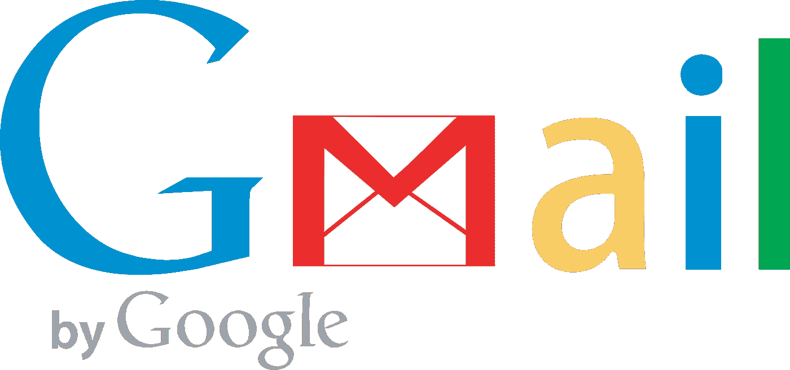
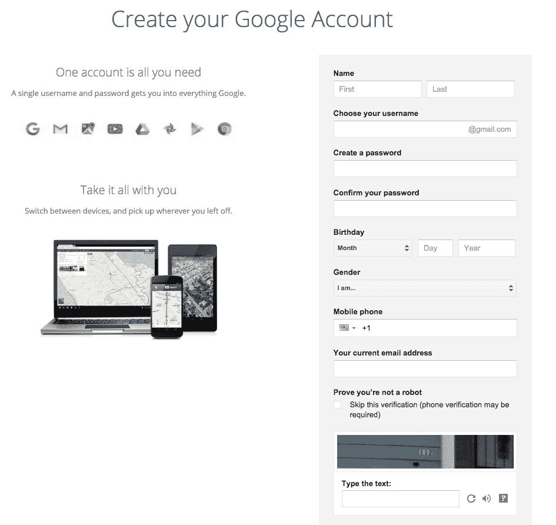
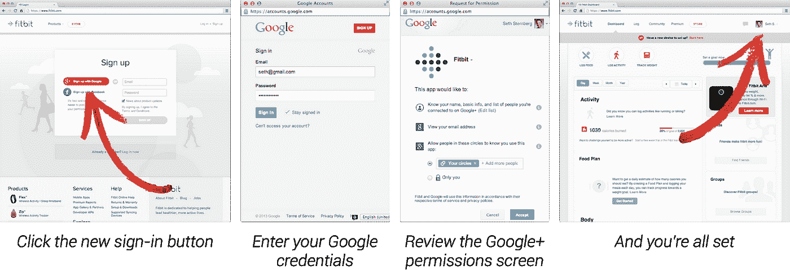

# Gmail、身份和战略重点

> 原文：<https://medium.com/hackernoon/gmail-identity-strategic-focus-ce82188d0019>

杰森·科斯塔

谷歌进军社交领域的行为有目共睹，围绕该公司在该领域取得成功应该在产品方面做些什么，也有很多争论。然而，人们不禁要问，这些碎片是否已经存在，以应对一个相邻的、同样重要的机会——互联网上的身份。通过 Gmail 的关键。

早在 2004 年 Gmail 推出时，大多数人认为这是一个愚人节玩笑。与当时大多数电子邮件客户端的操作方式相比，这是一个不可思议的飞跃。)的存储，全部作为 web 服务。如今，Gmail 的月活跃用户超过了 1B，并且还在稳步增长。当时，除了搜索之外，谷歌提供的服务很少，但慢慢地，越来越多的产品开始形成谷歌服务的星座。随着时间的推移，Gmail 之谜的一个重要部分变得越来越清晰，那就是产品的命名模式——以及这个关键点如何将所有这些服务联系在一起。

大约在 2008 年，就在 Gmail 推出几年后，身份在网络中的重要性变得越来越明显。人们厌倦了为每个新网站创建新账户和记住不同的密码。电子邮件在很大程度上仍然是这种身份密钥的机制。

但问题就在这里 Gmail 和“谷歌账户”的命名模式是不同的，这给那些根本不了解两者区别的用户带来了巨大的认知开销。实际上，根本不应该有什么不同。用户可以使用任何电子邮件提供商(@yahoo.com、@aol.com、@gmail.com 等。)创建他们的“谷歌账户”，这将允许访问其他服务(地图、YouTube 等)。).但实际上，这应该是一对一的映射——你的 Gmail 账户**就是你的谷歌账户** ，用户可以通过@google.com 名称空间“登录谷歌”。

谷歌有一个用户容易理解的身份机制——有效地解决了与最终用户的*认证*、*表示*和*通信*。相反，谷歌指望电子邮件账户来解决一个根本不同的问题:社交。该公司随后推出了几个“我也是”的社交产品(Buzz、Google+等)，而不是依靠自己的优势。

# **发挥你的优势**

现在，谷歌依靠自己的优势意味着两件事高于一切:

*   意识
*   品牌亲和力

认知度仅仅意味着谷歌品牌在当时已经无处不在；每个人都知道谷歌是什么。他们喜欢谷歌——因此，这是品牌亲和力的一部分。人们现在忘记了这一点，但谷歌在 2003/04 年(Gmail 在实验室推出时)是一个广受欢迎的品牌。这些都是谷歌的优势，也是其他公司的主要竞争优势。

相反，他们首先试图通过提供社交产品 Buzz 来竞争，这种经历导致了 T2 消费者信任度的真正下降。后来，谷歌选择推出 Google+作为登录机制。G+升级流程非常复杂:我是用 Gmail、我的 Google 账户还是我的 Google+个人资料登录的？

这一点很重要，因为它定义了当您使用电子邮件帐户登录另一个服务时的帐户所有权。*这是用户验证其账户的路径，也是密码恢复流程发生的地方。*这是用户与另一项服务之间关系的重要支柱。如果通过电子邮件的“谷歌账户”已经成为用户访问其他服务的基本方式，它可能已经为互联网身份设定了标准。相反，事情变得极其支离破碎。

# **不玩竞争对手的游戏**

谷歌本可以围绕认证、表示(“我是谁”)和沟通(“如何联系到我”)推出一个真正的解决方案，而不是解决这个社会问题。这些对最终用户以及应用程序/发行商来说都是主要的价值主张:这为这两个群体提供了利用这种身份服务的理由。如果谷歌将 Gmail 命名为“谷歌邮件”，并给用户一个“[xyz@google.com](mailto:xyz@google.com)”的电子邮件地址，它将剥离认知负荷，并让用户清楚地了解与谷歌其他服务的更广泛的身份联系，而不仅仅是电子邮件。谷歌员工本可以迁移到@corp.google.com 地址。然后，除了第一方资产(YouTube 等)之外，该用户身份机制可能已经被整合到第三方应用和发布者。).

虽然这种以身份为中心的方法可能不会像社交 feed 那样为出版商带来相同水平的推荐流量，但公开的秘密是大多数公司仍然从谷歌搜索中获得最大份额的流量。鉴于谷歌通过“拥有”身份在其他网站上获得的注册和参与数据，它可以在广告定位方面获得更多优势(长相相似的受众简介、再次参与广告等)。).

# **结论**

当在众多服务产品中进行产品开发时，最困难的事情之一是理解所有的部分在未来如何组合在一起。例如，命名模式上的一个小调整可能会影响产品的发展轨迹。显然，没有人有一个水晶球可以预测事情将如何发展，但这是一个团队必须投入的思考和远见，以使事情变得正确。同样重要的是，不要给你的用户带来不必要的认知开销；让他们简单，一直到产品名称空间。尤其是如果你以后想把你的产品过渡到一个平台的话。

以下是一些关键要点:

*   专注于你有优势的问题领域，不要迎合竞争对手的
*   寻找你可以让这个领域向你有利的方向倾斜的方法(例如，“身份”对“社交”)
*   不要在产品中引入抽象的层次结构；保持简单，直到名字
*   尽可能深入地提前思考一些东西如何融入更广泛的产品拼图中
*   如果不同的团队在产品套件的不同部分工作，确保他们保持联系。这通常是不必要的产品复杂性的根本原因

在这种情况下，专注于“身份”而不是“社交”并利用广泛采用的资产(电子邮件)将有助于谷歌控制用户和应用程序/出版商之间的认证、表示和通信。它也可以很容易地与这些网站一起进入个性化，但没有朋友请求、内容创建、共享等义务。如果谷歌刚刚把 Gmail 命名为“谷歌邮箱”，那就是你的“谷歌账户”，会怎么样？事实上，电子邮件不仅仅是一个收件箱。

Jason Costa 目前是 GGV 资本投资公司的 EIR。这篇文章是正在进行的系列文章的一部分，旨在探索消费产品开发、平台分析和策略等主题。