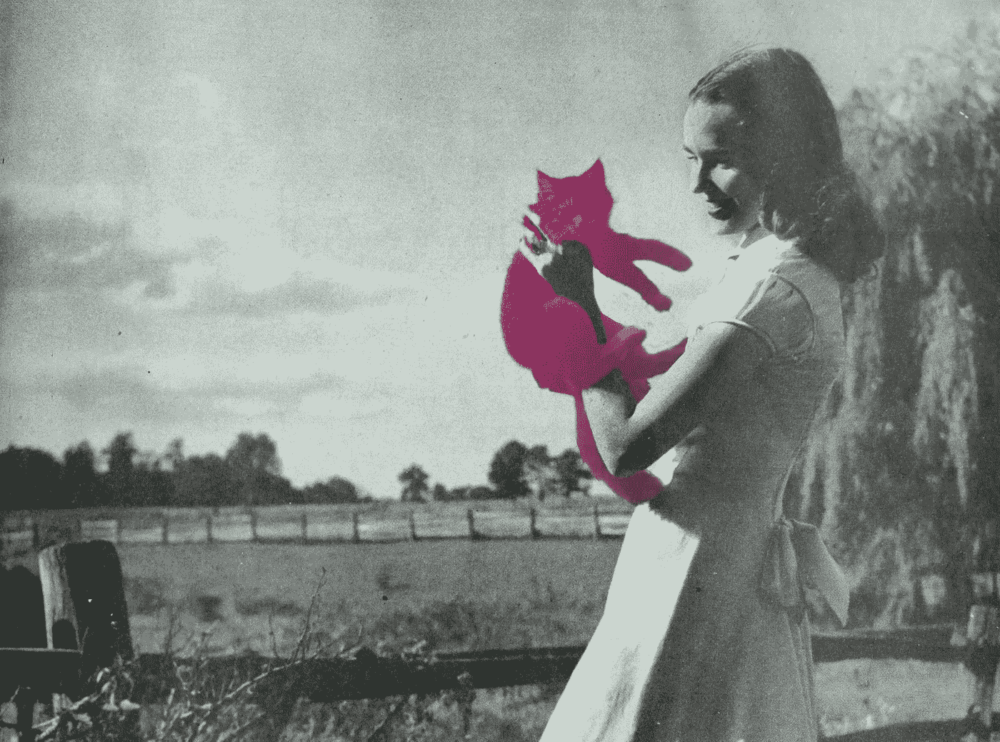

# Google Blocks 旨在简化

> 原文：<https://medium.com/hackernoon/google-blocks-aims-for-simplicity-61153fb8f416>

倾斜刷是我一直最喜欢的 Vive 体验。它简单、迷人，最重要的是，它很漂亮。它通过一个超级简单的界面让首次用户了解房间级 VR 的沉浸式质量，拥有一个你可以随意改变的华丽环境，并采用足够多的闪闪发光的绘画模式，即使是最活跃的用户也能保持参与。在 Axiom Zen，我们用它来向走进办公室的贵宾演示虚拟现实的可能性。戴上耳机，给他们一分钟的指导，让他们玩十分钟。通常，他们会写下自己的名字，或者制作公司标志的 3D 版本。

所以当我听说谷歌发布了另一个免费的 3D 设计工具时，我兴奋不已。我下载的程序块只有一些小的技术挑战(说真的，这项技术什么时候才能顺利运行？)并扑通一声戴上了我的耳机。广阔的沙漠是为了淡出背景，不如倾斜刷的野生景观选择引人入胜，并保持静态。我被提示进入一个教程，并很快建立了我的冰淇淋甜筒，并在上面放了一个樱桃。当开始绘制时，工具的简单性实际上让我大吃一惊——教程不断告诉我“翻转”到油漆颜色，我尝试了滑动、点击、拖动、摇动，期望获得更多按钮。几乎是偶然地，我终于扭了一下手，意识到了控制面板下面的颜色。他们人数不多！没有像倾斜画笔一样的颜色渐变，只有一组原色，你就可以走了。

能够扭曲和生长形状很有趣。在空中画出形状也同样有趣。颜色的选择确实让我有点沮丧，即使在我习惯了卡通风格的简约风格之后。但作为一个没有特别艺术天赋的人，我很快发现自己希望能玩别人的作品。我找了一个画廊或图书馆，但一无所获。给出的五个选项(制作形状、拖动形状、移动形状、擦除形状、绘制形状)就是它。

在我断开连接坐下来写这篇文章后，我发现你实际上可以做我想做的事情；导入别人的创作，拿来玩。但我还没有探索如何做到这一点，显然这不是设计师们敦促你做的事情，因为它不在教程中，也没有快速浏览公共形状库的按钮。

总的来说，Blocks 的简单性对其有利，但游戏化的方面将大大有助于使这种体验对每个人都有趣，而不仅仅是设计师。

*原由鹪鹩 Handman 为***所写。**