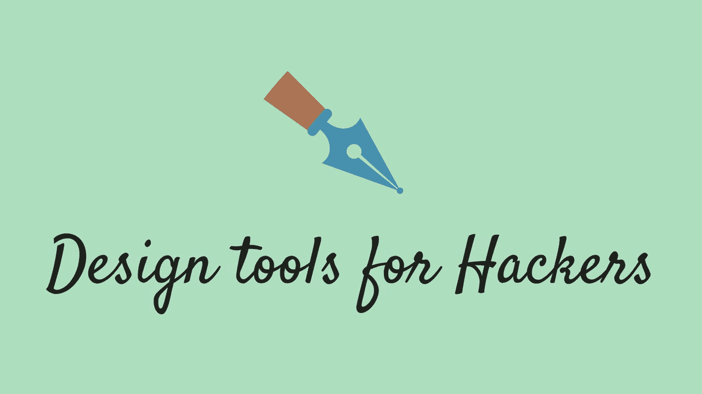

# 黑客的图形设计工具

> 原文：<https://medium.com/hackernoon/graphic-design-tools-for-hackers-1c925977e1c9>

不到 0 美元就能运行的工具，但仍包含一些重要的设计元素。

I ain’t no designer but I have products to build

如果你和我一样，喜欢创作像网络和移动应用程序这样的数字产品，但设计不是你的茶，那么这篇文章是给你的，我的朋友。

我本质上是一个开发者，也是一个创业者。我编写[应用](https://medium.com/rayn-studios)，并将它们直接发布给我的观众，所以在我的小工作室里，我同时负责编码和设计。

> 像应用程序这样的数字产品更多的是关于漂亮的设计和不可思议的 UI/UX，而不是模块化和可维护的代码库。

每个新的应用程序项目都有一些基本的图形要求，例如:

1.  调色板
2.  标志；徽标
3.  社交媒体的特色图片
4.  核标准情报中心

你可以使用什么工具来设计让你的应用成为现实所需的所有必要的图形资产？让我和你们分享一些设计工具，我用它们来创建我的应用程序中的大部分图形。

## 【Canva.com 

这是满足您大多数图形需求的一站式商店。它为图标、标志、脸书封面图片、YouTube 缩略图等提供了许多现成的现成模板。，你也可以根据自己的需求定制。

除此之外，它还提供了基本形状、调色板、谷歌字体、文本块等元素。，你可以在你的项目中混合搭配，创造出完全原创的艺术作品。

它提供下载功能，因此您可以在*中下载您的设计。png* 和*。jpg* 格式化并在其他地方免费使用，如果你在你的设计中只使用了免费的元素。如果你的设计中有一些付费元素，你需要相应地付费，以便下载你的设计。

*我使用 Canva 为我的应用程序、社交媒体图片、封面照片和应用程序商店列表创建图片。*

## [Figma.com](https://figma.com)

我最近了解了 Figma，这个工具简直让我大吃一惊。它使您能够使用钢笔工具绘制自定义形状和设计。您还可以使用基本的剪切-复制-粘贴-调整大小功能来设计您的应用程序屏幕。

你可能会想，*我不是设计师，兄弟！为什么你会认为我足够精通使用钢笔工具？*我懂了！但是使用 Figma 的钢笔工具是一个完全不同的故事。

他们的钢笔工具有一个很棒的“矢量网络”功能，可以让你同时画和调整你的画。任何人都可以用贝塞尔曲线和直线画出基本的形状。这将需要几分钟来熟悉钢笔工具，这将是一个有趣的旅程。*我保证！过了这一关，你的创造力就到了极限。*

你可以使用钢笔工具设计自定义形状，并将它们与方形和椭圆形等基本形状混合在一起(*还有其他工具来绘制这些*)，以创建原始设计和应用程序模拟屏幕。您还可以对形状进行分组，以便于编辑。

*我使用 Figma 来创建自定义徽标和应用程序屏幕模型以及 SVG 资源。*

> 因此，如果你需要一个完全原创的图标，请遵循以下流程:在 Figma 中设计原始形状或吉祥物>导入到 Canva 模板中>调整颜色等。>下载您的原创设计>使用它！

## [Inkscape](https://inkscape.org/en/)

这是一个基于桌面的软件，可以安装在 Windows，Linux 和 Mac 上。它实际上是 Adobe Illustrator 的开源替代产品。

你基本上可以在 Inkscape 中绘制形状、图标和徽标。唯一的限制是你的创造力。但是让我们面对现实吧！我们不是设计师，也不想成为设计师。那么这个工具给我们带来了什么好处呢？

最近 Android 已经开始支持 [VectorDrawables](https://developer.android.com/reference/android/graphics/drawable/VectorDrawable.html) ，这是一个特殊格式的[SVG](https://en.wikipedia.org/wiki/Scalable_Vector_Graphics)的花哨术语，网络也正在从 png 和 jpg 向 SVG 转移。因此，您可以使用 Inkscape 来创建 SVGs 文件并调整其大小，这些文件可以在您的网站和应用程序中使用。

*我使用 Inkscape 创建 SVG 格式的基本形状或徽标，并压缩从其他地方(如 Figma.com)获得的 SVG 的大小。*

## [GIMP](https://www.gimp.org/)

这是一个运行在 Windows、Linux 和 Mac 上的免费图像编辑软件，可以用来编辑图像。这个工具处理位图图形，而 Inkscape 处理矢量图形。

[https://www.thoughtco.com/vector-and-bitmap-images-1701238](https://www.thoughtco.com/vector-and-bitmap-images-1701238)

GIMP 是 Adobe Photoshop 的开源替代品，所以如果你有一些 Adobe Photoshop 的经验，你可以用类似的方式使用它。它有基本的编辑功能，如剪切，裁剪，缩放，桶填充等。它也有“层”的功能，使用它你可以在现有的图片上写或画一些东西。

在 GIMP 中学习基本的图像编辑是相当容易的。一个小时之内，你就能熟练地执行基本操作，如剪切、裁剪、分层和导出你的设计。

我使用 GIMP 来剪切、裁剪和调整我的图像资产。我也用它来设计或在现有图像上写东西。有时我也用它来创建模型和应用程序屏幕。

如果你能用这些工具练习几个小时，几个星期。你会发现自己有足够的能力为你的应用程序设计和导出基本的图形资产，并要求你的设计师朋友做出特殊的改变，而不是要求他“*把它变得漂亮*”:P。

# 奖金

## [隐形 App](https://www.invisionapp.com/)

在进入编码部分之前，最好先为你的应用程序创建模型和故事板。这将发掘出许多 UI/UX 的基本问题和应用程序中难以理解的部分。

> 一旦你准备好了应用程序的代码，纠正设计和用户界面/UX 问题就变得更加困难了。

InvisionApp 帮助你为你的应用程序创建这样一个故事板。以下是如何工作的速成课程:

1.  你创建你的应用程序屏幕的模型。我用 Figma 做这个。
2.  你在 InvisionApp 中导入所有这些
3.  你在你的屏幕上创建热点，点击它，就可以导航到其他屏幕。
4.  您可以使用热点和屏幕过渡来编织整个故事板。
5.  你现在可以与股东分享故事板了
6.  利益相关者现在可以播放故事板，就像一个真正的应用程序一样，并为您提供关于用户界面/UX 和设计的反馈。

差不多就是这样。现在你知道我用什么设计工具来为我的数字产品创建图形资产了。我希望你们中的一些人能从上面提到的工具中受益。

## 如果您选择在下一个项目中使用这些工具，请与社区共享您的项目。

如果你喜欢这篇文章，请把它推荐给你的社交网络，并关注我的更多文章。如果你喜欢开发数字化的东西，你也应该订阅我的 YouTube 频道。

## [推特](https://twitter.com/rajat1saxena) | [YouTube](https://www.youtube.com/channel/UCUmQhjjF9bsIaVDJUHSIIKw) | [瑞恩工作室](https://medium.com/rayn-studios)

直到下一次…