# 优秀的移动应用程序及其成功原因:案例研究

> 原文：<https://medium.com/hackernoon/great-mobile-apps-why-theyre-successful-a-case-study-414065bf5ec0>

成功在生活的各个领域都有不同的衡量标准，甚至因人而异。当谈到应用程序时，一些开发者期望每天至少有成千上万的用户，而其他人则对几百人感到满意。

并不是每一个好主意都会带来一个成功的应用。执行得不好的好主意和执行得很好的坏主意没什么不同。一个不能吸引观众是因为它不可用，而没有人愿意与另一个连接，尽管它是可用的。

和大多数智能手机用户一样，我的手机已经取代了床头柜上的闹钟。自 2012 年以来，我一直使用同一个非常简单的闹钟应用程序。这款应用的[设计](https://hackernoon.com/tagged/design)很复古，但很实用，除了你在闹钟中能想到的功能之外，它几乎没有其他功能。抛开 2014 年不谈，这款应用一年内更新从不超过三次，一个月内下载量也很少超过 5000 次。但在首次发布近 8 年后，它仍然受到支持，并且仍然可以在使用最新操作系统的新设备上工作。

这是一个成功应用的一种观点。

另一个是每天吸引成千上万用户的应用程序，自最初发布以来已经发生了相当大的变化。无论是功能还是设计。这些是我将在本文中关注的应用程序，重点关注它们如何随着时间的推移而变化，以及这些变化如何影响它们的成功。

变化是成功应用的重要组成部分。至少，就像我使用的闹钟应用程序一样，它确保了应用程序在最新的设备和操作系统上继续工作。比这更深刻的是:

*   **新特性**在不完全改变原有用途的情况下，扩展了原有应用的功能。
*   **对 UI 和 UX** 的改进，使应用程序更容易使用。

UI 和 UX 是任何面向数字财产的消费者的重要组成部分，对两者的逐步改进有助于取得成功。作为一种新的媒体，从 90 年代中期到后期的网站在设计和导航方面经常是非常实验性的。糟糕的用户界面和 UX 在 90 年代的缩影是众所周知的神秘肉导航(MMN)[——这个术语首先由文森特·弗兰德斯](http://www.webpagesthatsuck.com/mysterymeatnavigation.html)使用。

就在我们似乎掌握了 UI 和 UX 的窍门时，智能手机和相关的应用商店颠覆了一切。

在数字设计中，这是一种复制物理对象元素的用户界面的使用——这不是一个现代的概念，尽管它被许多人讨厌，但它在计算机、互联网、智能手机和应用程序的早期确实起到了重要的作用。写到了苹果对 skeuomorphism 的使用， [Kieron Gurner 指出](https://calvium.com/importance-intuition-calviums-kieron-gurner-ux-design/):

“苹果希望减轻人们在使用数字显示器时的认知负荷。我们习惯于使用实体台历，所以让数字日历看起来一样有助于人们理解它的机制。随着时间的推移，随着人们对数字设备越来越适应，苹果日历应用变得越来越扁平和简约，这可能是对屏幕空间的更好利用，也更具美感。”

许多应用程序的初始版本在 UI 和 UX 方面并不总是做得很好。但成功应用的开发者很快开始分析人们如何使用该应用，识别用户界面和 UX，甚至特定功能的问题。然后他们对每一个进行更好的改进，并推出它们。最好的应用程序是那些有些变化是为了让应用程序与目标受众相关，而有些是为了让应用程序更容易使用的应用程序。

# 脸书，测试和可用性

将[脸书](https://www.facebook.com/)列入“最佳应用”名单似乎有些老生常谈，尤其是因为人们很容易将他们视为从不需要非常努力就能获得成功的“特权孩子”。但是，像这个列表中的大多数应用程序一样，脸书最初是一个网络应用程序，远在智能手机普及之前。

当你的所有用户都已经非常熟悉你的网络应用时，启动一个移动应用比同时启动一个网络和移动应用更困难。您的用户已经习惯了您的 web 应用程序的布局，并且已经有了他们经常使用的特定功能。你和你的开发者面临的挑战是在你的移动应用程序中复制其中的大部分；对于更小的屏幕，这并不总是可能的。

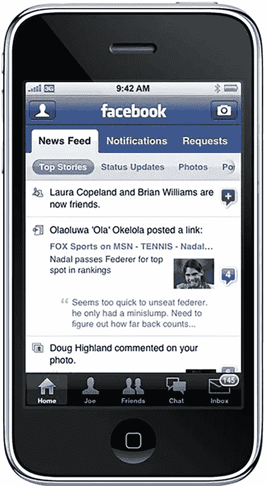

在首次发布适用于大多数品牌智能手机的移动优化网络应用后，脸书于 2010 年发布了首个独立的移动应用。它以网络为中心，速度慢，经常崩溃；当没人能真正使用应用程序时，谁还会关心用户界面和 UX 呢？终于，在 2012 年，[马克·扎克伯格承认](https://thenextweb.com/facebook/2012/09/11/zuckerberg-the-performance-stock-obviously-disappointing/):

“完全押注 HTML5 是我们犯下的最大战略错误之一。”

然后脸书[发布了一款完全重新设计的原生应用](https://www.facebook.com/notes/facebook-engineering/under-the-hood-rebuilding-facebook-for-ios/10151036091753920)。

正是在这个时候，脸书也转向了移动优先的战略，对于一家公司来说已经很晚了，因为现在[超过三分之二的用户每天都通过移动设备登录。这是任何拥有 web 和移动应用程序的开发人员都应该遵循的重要策略；新功能和用户界面变化几乎同时在两个应用版本中推出。功能不应该局限于一个应用程序，即使应用程序的布局有所不同——因为屏幕大小——它仍然应该非常熟悉。](http://mashable.com/2013/09/20/facebook-mobile-strategy/#A8iQcb_CEgqC)

当然，脸书受益于规模:组织规模大，用户基数大。但这并不意味着较小的开发商不能获得脸书所拥有的一些东西。随着移动优先战略的实施，脸书也开始关注速度和空间。速度不仅是指应用程序的响应速度，还包括用户执行某些功能的速度。还有空间，嗯…这一直是移动领域的优势，但通过更加重视用户界面，脸书已经设法让应用程序看起来更大。

2012 年，该应用程序仍然让位于大菜单栏和按钮。

但随着苹果在 2013 年发布 iOS7 后转向使用平面设计，脸书应用程序中的按钮、图标、菜单栏甚至文本都缩小了。

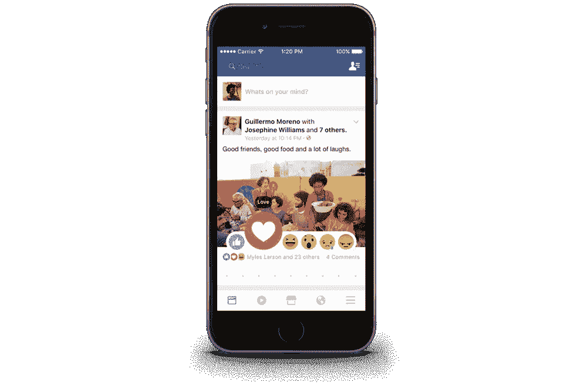

2013 年，iOS 上的脸书出现了一个大变化，菜单栏从屏幕顶部降到了底部，并且失去了蓝色背景。

不是每个人都是粉丝，但是脸书确实发现某些指标随着底部横条的增加而提高。

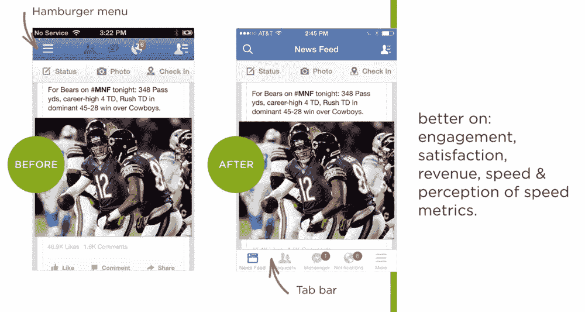

Image Source: [LukeW](http://www.lukew.com/ff/entry.asp?1945)

但是脸书和其他成功的应用程序不会随意改变用户界面和 UX。除了拥有由各个领域的专家组成的设计团队，他们还进行广泛的测试。Android 的脸书测试版让在 Android 上的测试变得简单，但是脸书产品经理 Michael Sharon 早在 2013 年就表示，在 iOS 上进行测试是不可能的。为了克服这一点，他们在 iOS 应用程序中内置了一个测试框架。iOS 应用现在和**一起提供了几个不同版本的内置于**的脸书用户界面，不同的用户使用不同的版本。本质上，iOS 版的脸书应用程序是一个大的测试程序。但是[莎伦也指出这些不是典型的测试版](https://techcrunch.com/2013/09/18/facebooks-new-mobile-test-framework-births-bottom-tab-bar-navigation-redesign-for-ios-5-6-7/):

> “我们不会发布不合格版本的应用程序。我们正在推出完整的生产就绪版本，这可能会成为主要的体验。”

将菜单栏放到屏幕底部是内置测试框架推出后对用户界面/UX 的第一个改变。一旦你更多地关注人们如何使用他们的手机，并记住眼不见心不烦的风险，拥有一个始终可见、触手可及的菜单就更有意义了。

# **通过 Airbnb 进行信任设计**

和脸书一样， [Airbnb](https://www.airbnb.com/) 最初是一个网络应用，名字叫 AirBed & Breakfast。Airbnb 的移动应用程序(iOS 版)被认为是 2011 年 SxSW 上的突破性应用程序，但它并没有过多地描述这个品牌的早期历史[，这一点无可否认地很吸引人。直到 2012 年，才出现了安卓版本。](https://techcrunch.com/gallery/a-brief-history-of-airbnb/)

自那以后，随着品牌和网络应用的发展，移动应用也在发展。其中一些是由公司战略及其受众的变化所驱动的，其他的则是 UI 和 UX 改进的结果。Airbnb 并不羞于谈论设计的影响，它有一个专门讨论设计的博客。

通读这些帖子可以让你深入了解创建优秀应用程序、提供卓越体验的工作。UI 由图标、按钮、文本等组成。你用来与产品互动，而 UX 是关于如何使用产品给你的感觉。UI 大部分是可见的，而 UX 大部分是不可见的，但是受可见的影响。

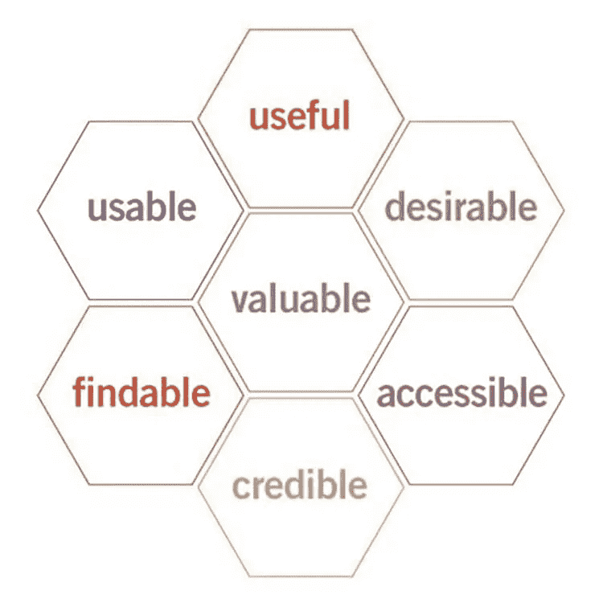

[Peter Morville 提出了用户体验蜂巢](http://semanticstudios.com/user_experience_design/)，因为大 UX 由七个不同的方面组成:

*   显然，产品必须是**有用的**。
*   必须是**可用**。但可用的产品并不总是易于使用，伟大的 UX 着眼于可用性和易用性。
*   肯定有**可取性**的成分。效率很重要，但是任何只关注效率的设计很可能不会引起情感上的反应。
*   可查找性是 UX 和用户界面之间的纽带:用户需要能够在你的应用中轻松找到他们想要的东西。
*   **无障碍** —对残疾人而言。
*   背景和设计元素确实会影响可信度，最好的应用不用明确要求用户信任就能建立信任。
*   有价值不仅仅是为终端用户创造价值，也是为应用所代表的公司创造价值。

这里列出的每一个应用都不需要证明它们的有用性，虽然脸书用测试来提高可用性(和易用性)，但信任是 Airbnb 非常重视的东西。[Airbnb 体验设计主管 Charlie Aufmann 在公司博客](http://airbnb.design/designing-for-trust/)上写道:

> “对于一家公司来说，谈论信任当然不是什么新鲜事。区别在于:我们不是在谈论一家公司何时以值得信赖的方式行事，从而让客户信任他们或他们的产品。当然这很重要，但让 Airbnb 成为可能的信任是主人和客人相互信任。”

Airbnb 致力于增强信任的两个设计元素是评论和信息。消费者将评论作为质量的决定因素，与信任相关联:一个产品或企业的评论越正面，我们就越有可能信任他们。

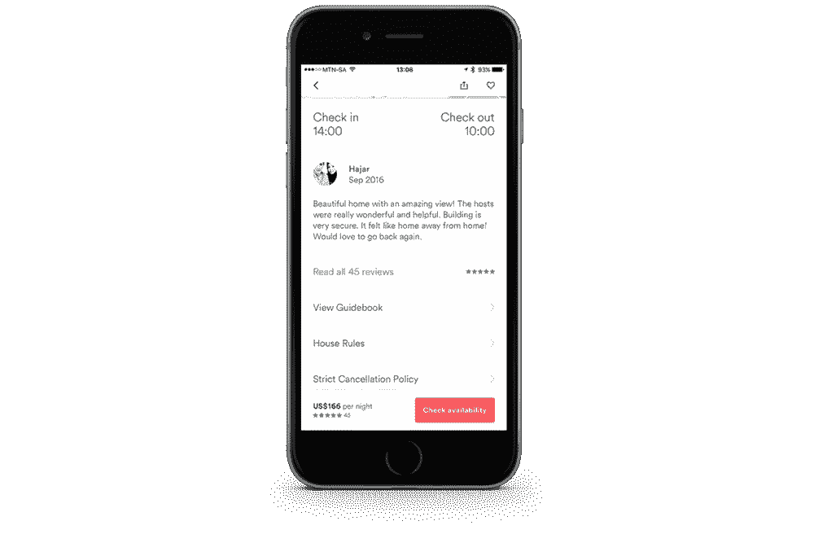

而且评论在 Airbnb 的应用里也不难找到。每个列表的静态栏中会显示一个星级，以及一个表示评论数量的数字。评论也出现在链接到房子的规则，取消政策，和东道主的联系方式。

当尝试联系主机时，系统会提示您填写个人资料(如果您尚未填写)。记住主人和客人需要相互信任，为每个潜在的客人准备一张个人照片和联系方式是很重要的。

但是正如 Joe Gebbia 在上面的 TED 演讲中所揭示的，客人与主人分享的信息量也会影响接受率。信息太多和太少一样糟糕。因此，提示引导你分享正确的信息，而为你的信息提供的空间则作为分享多少信息的视觉指南。

到 2016 年，Airbnb 自 2011 年以来的增长正在影响 UX 的另一个方面——可发现性。到 2011 年，Airbnb 用了两年半的时间达到 100 万间客房预订量，但到了 2016 年[一年预订量超过 7000 万间客房](http://fortune.com/2016/04/11/airbnb-bookings-one-billion-a-year/)。这意味着寻找住宿变得越来越困难，过滤结果的过程本身就令人沮丧。所以它成为了设计团队在 2015 年至 2016 年间重新设计 app 时重点关注的领域之一。

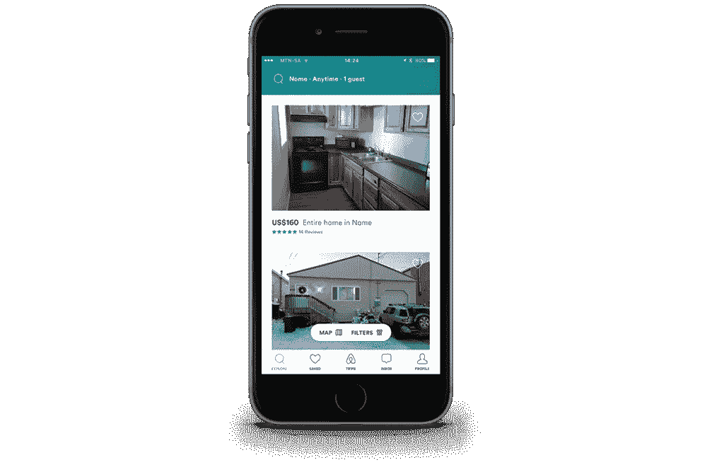

结果的基本过滤更加简化，更高级的过滤仍然很容易实现。如果不减少过滤选项，用户面对的屏幕会更少。因此，可用性提高了，找到更符合您需求的住处的能力也提高了。

Airbnb 体验设计总监 Katie Dill 当时表示，重新设计的目的是让手机版的 Airbnb 不仅仅是桌面版的伴侣:

> “(现在)手机是预订 Airbnb 的最佳方式。”

# 以消费者为中心的定制

Tastemade 成立于 2012 年，是 YouTube 上的一个多频道[网络](https://hackernoon.com/tagged/network)，以高质量的食物和烹饪视频为特色。不久之后，他们开始向脸书上传极具吸引力的视频——大多数视频只有 1-2 分钟，但也有很多视频甚至更短。

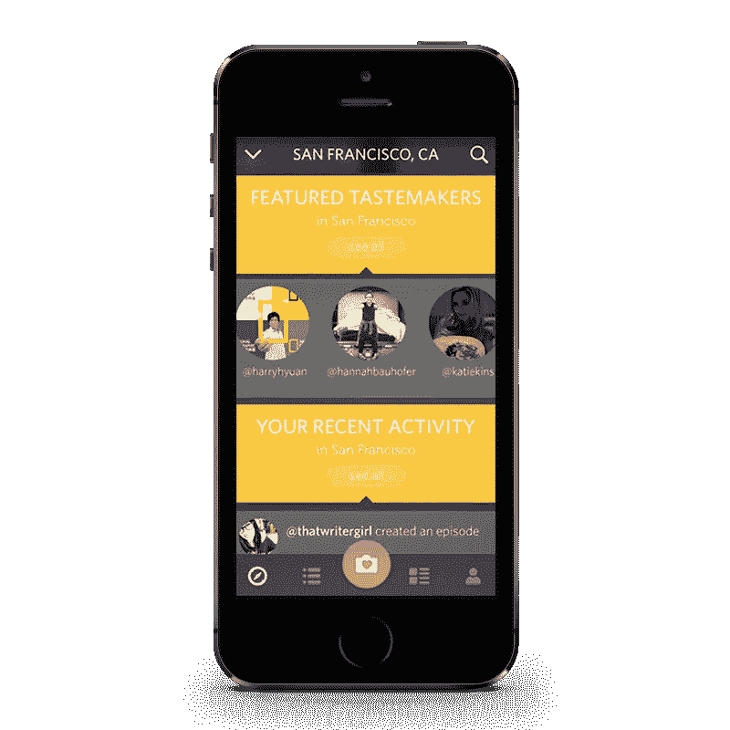

他们进军移动应用的尝试起初不太成功。2013 年，他们推出了 Tastemade 视频城市指南，这是一个面向美食爱好者的伪社交网络。这个应用程序在 2015 年与他们的 [Facet 旅游视频应用程序](https://facet.com/)合并，但也在 2016 年被关闭。然而，他们在 2015 年推出的另一款应用——简称为 taste made——取得了其他人未能取得的成功。

其中一个原因是，这款应用是原有业务的真实延伸，让人们可以在手机上轻松找到菜谱，观看 Tastemade 以烹饪节目而闻名。

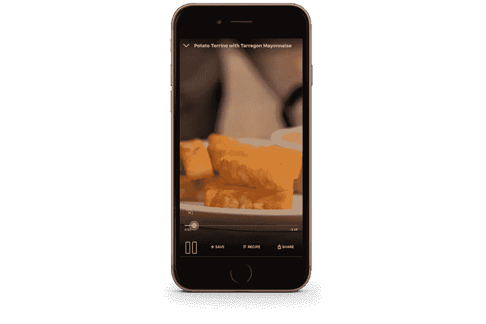

而且因为重点是视频和烹饪，app UI 几乎看不到。相关的控制，使用一个非常简约的设计，在每个视频开始前短暂显示，然后消失。只需在屏幕上轻轻一点，就可以再次调用它们。因为手机屏幕上没有太多的空间，所以不是所有的东西都能在手机用户界面上看到。这使得手机设计充满挑战。谷歌产品总监卢克·乌鲁布莱夫斯基写了一篇关于手机应用中隐藏元素的风险的文章，但他进一步解释道:

> “与台式机不同，在台式机上，大屏幕允许我们在屏幕上显示每一个特性和功能，而移动设备要求我们做出决定:什么重要到足以在移动设备上显示出来？
> 
> 回答这个问题需要了解什么对您的用户和业务至关重要。换句话说，它需要好的设计。"

在 Tastemade 的例子中，这是充满屏幕的专业拍摄的视频——专注于烹饪。没有隐藏的控件会破坏体验。“今日”标签上的视频很小，但无论您是在纵向还是横向模式下，只需轻轻一点就可以将它们扩展到整个屏幕，这只会进一步增强用户体验。

虽然这是一款免费增值应用，但该应用的基本使用不需要注册或订阅。也不会经常通过弹出窗口等方式催促你注册。公告框位于应用程序“今日”标签的视频之间，通过列出好处来鼓励注册和订阅，但它们并不显眼，也不会干扰应用程序的使用。

Tastemade 开始制作可以在 YouTube 和脸书上播放的视频，但他们的内容现在也可以在他们自己的应用程序中显示，并通过 Apple TV 播放。因此，他们现在创建的每一点内容都被编辑成不同的版本，包括脸书和 Instagram 的 square，以及苹果电视和 YouTube 的全帧 4K。[联合创始人史蒂文·基德这样评价这种方法](http://www.usatoday.com/story/tech/news/2016/05/26/tastemade-rivals-buzzfeed-mobile-food-video-views/84814740/):

> “[它]是一种不同类型的故事，但却是一个独特的机会。如果你关注消费者，以及他们是如何使用你的产品的，那就会把你带到一个非常不同的地方。”

# 交付与设计和研究的影响

[Deliveroo](https://deliveroo.co.uk/) 和 Tastemade 一样，都是关于食物的。但是这一次是关于订购食物——并让它快速送到你的手中——而不是学习如何自己制作。

找出不同之处。

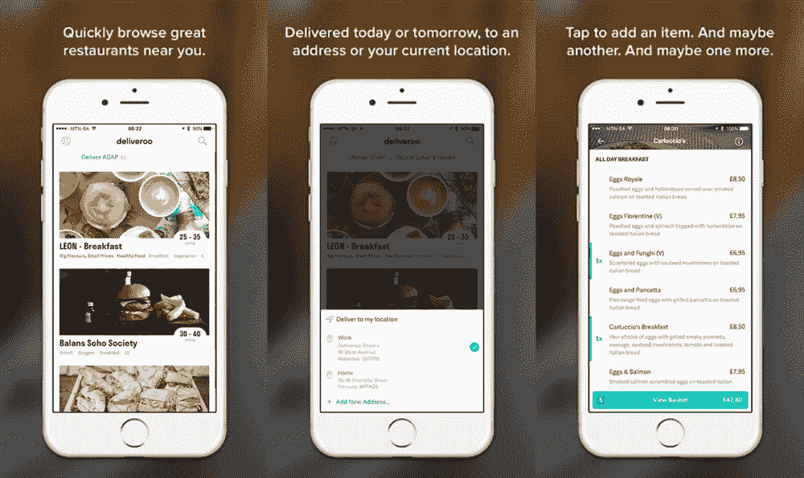

与本文中讨论的一些其他应用相比，Deliveroo 仍然是一个年轻的应用，它可能受益于老年人犯下的错误。尽管该公司去年进行了彻底的品牌重新设计，但自 2015 年推出以来，该应用程序本身没有任何重大变化。这并不意味着设计师和开发人员的工作很轻松，但他们应该有更多的案例研究来做决策。

Deliveroo 的使命是双重的，他们想把美味的食物——不仅仅是标准的外卖食品——送到你的家或办公室，而且他们想尽快做到这一点。他们明白，hungry 和 hangry 之间的差异最多是几分钟，所以即使是应用程序也是在考虑速度的情况下设计的。没有入职流程:第一次启动应用程序时，你会遇到一个“开始吧！”屏幕，然后请求访问您的位置。这是一个大胆的方法，Deliveroo 团队做了两个假设:

*   你已经熟悉这项服务，并且可能以前通过网络使用过，而且
*   你不是新的智能手机用户，并且熟悉大多数应用程序的工作方式。

这是一个安全的假设:他们的移动应用程序是在他们第一次开始运行两年后发布的，也是在第一部 iPhone 发布八年后。如果你允许应用程序访问你的位置，并且你希望你的食物被送到你当前所在的地方，使用它就非常容易。

伟大的图像被用来突出你所在地区的每家餐馆提供的食物，而每个菜单项的描述都保持简短。该应用程序中的大多数功能都可以通过点击和滑动来完成，在每个菜单项上点击多次以增加数量的能力是一种深思熟虑的触摸。

虽然我之前说过这款应用自发布以来没有经历过任何重大变革，但这并不意味着设计团队没有不断改进 UI 和 UX。但是变化是微妙的改进，当你的原始设计已经相当强大时，这是可能的。设计上的改变是基于改进添加新地址的流程，以及您支付订单的方式，这两者都直接关系到您下单和送货的速度。

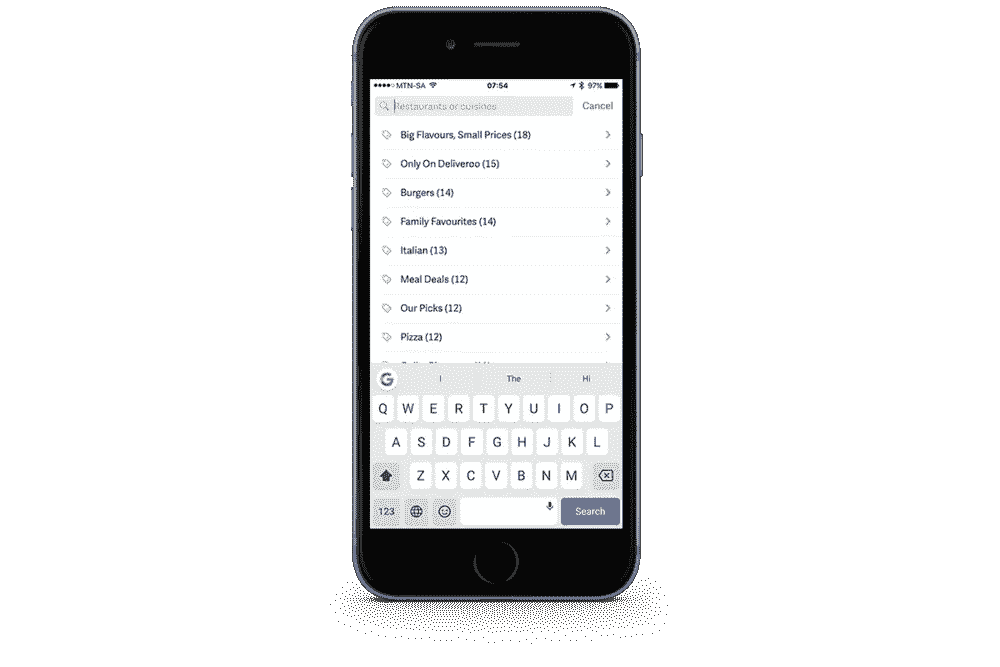

搜索功能也进行了优化，以消除摩擦，所以你不会面对一个空白的搜索栏，除此之外还有一个美食类型列表。想知道你周围哪些餐馆有无麸质选择？由于在 Deliveroo 应用程序中设置了搜索功能，您可以直接跳到一个选择，而不必在无尽的餐厅和菜单中滚动。

但所有这些都是通过强大的研究团队和强大的设计团队的结合而成为可能的。在一篇媒体文章中(顺便说一下，Deliveroo 设计团队[非常擅长在媒体](https://medium.com/deliveroo-design)上分享他们的想法和过程)，产品设计师 [Rob Hunt 观察到](/deliveroo-design/five-things-canvas-conference-taught-us-about-product-design-894c6bf80a89):

在过去的一两年里，我们发展得非常快，产品团队不仅仅是为一组用户设计和制造产品，我们需要让我们的客户、乘客、餐厅和内部团队满意。我们的研究团队是确保我们实现这一目标的核心。

# 用列车线简化综合体

简化复杂任务的应用程序——移动或网络——肯定会成功。毕竟，这是我们在使用移动设备和计算机时所期望的:我们希望能够更快、更容易地做事。但是简化复杂的任务并不简单。这也不是一次性的任务。

对[列车公司](https://www.thetrainline.com/)来说幸运的是，简化复杂的任务是他们自 90 年代末以来一直在做的事情，2009 年首次发布了一款移动应用。

最初的设计遵循了当时的潮流，有厚重的按钮，大量使用渐变。

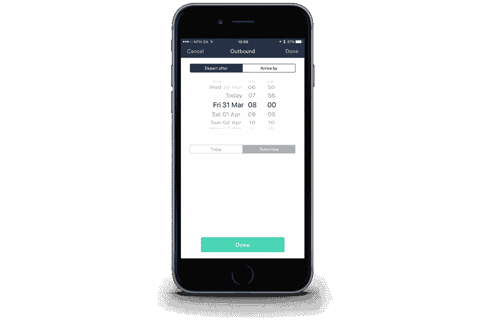

但这已经逐渐被更干净、更扁平的设计所取代。选择日期和时间不仅看起来更新鲜，而且现在您还可以指定您是否想要在特定时间后出发或在设定时间到达的列车。虽然给你的应用增加更多的选择/选项会增加摩擦，但这个例子不会。

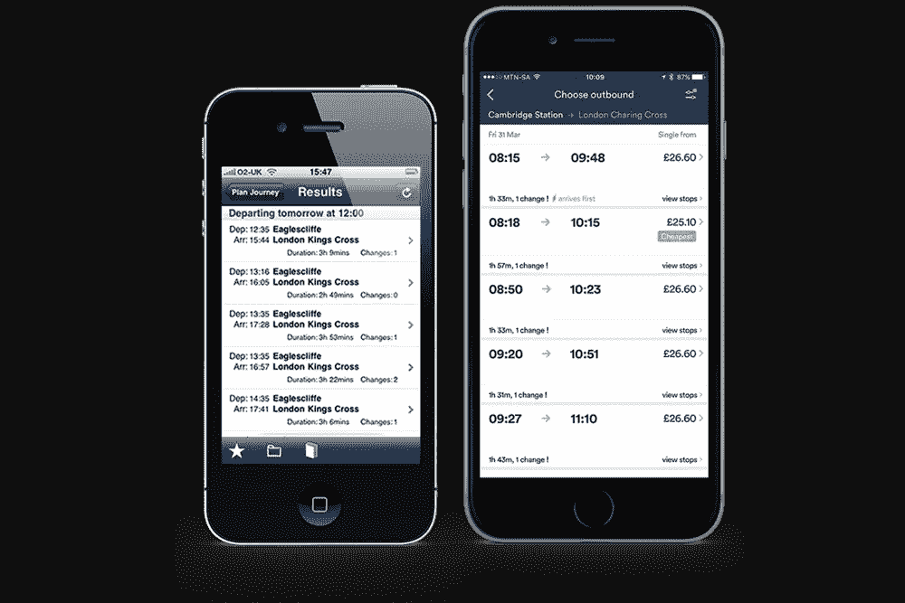

同样，您知道要从哪个火车站出发，到达哪个火车站，因此没有必要为每个结果重复这些信息。通过从结果中删除站名，您现在可以查看票价以及其他重要细节，例如哪个选项最便宜，哪个最先到达。

其他值得注意的变化是计划旅程屏幕-现在*计划&购买*。在一个屏幕上，你现在可以输入几乎所有与你计划的旅行有关的信息。单程票、往返票、乘客数量、铁路卡选择等。—所有这些都在一个屏幕中完成，而不是通过多个步骤/屏幕。所有可能的选项/排列也是可见的，避免了一些应用程序中明显的眼不见心不烦的问题。

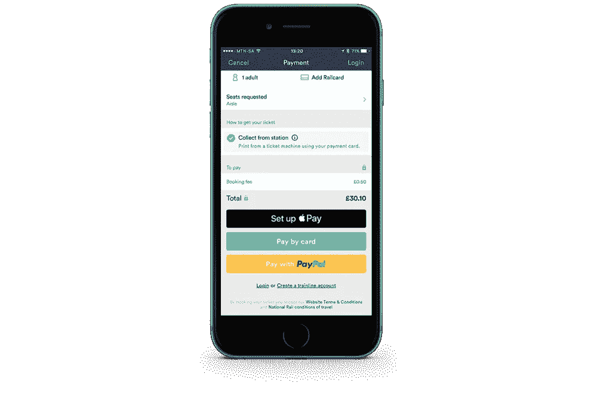

选择一次旅行会带来额外的选项，如座位偏好(如果有)，但这并不显眼，也不会影响下一步:付款。有些旅行是提前计划好的，而有些是意想不到的，但无论是哪种情况，组织门票都不应该是一项复杂的任务。Trainline 明白这一点，就像 Deliveroo 明白点餐应该简单快捷一样。

优秀应用的另一个标志是它们与新技术的融合程度和速度，因为这通常会提高 UX。有了 Trainline，你不仅有[苹果钱包集成](http://blog.thetrainline.com/2016/12/02/web-apple-wallet/)——允许你在选定的路线上选择手机票而不是纸质票——还有 [iMessage 集成](http://blog.thetrainline.com/2016/09/15/trainline-for-imessage/)，以及[最近推出的 BusyBot](http://blog.thetrainline.com/2016/09/14/busybot-from-trainline/) 。通过 iMessage 集成，你可以轻松地与 F & F 分享你的旅行细节，他们可以实时跟踪你，BusyBot 使用众包反馈来帮助你在繁忙的路线上找到座位。

我们不需要依靠 Trainline 的设计者来告诉我们这个应用程序在用户中是否成功，我们可以很容易地通过查看用户评论来判断，例如*Florida couse*的评论:

# 潘多拉和个性化的重要性

潘多拉(也被称为潘多拉电台)自 2000 年以来一直存在，但如果你不太熟悉这项服务和应用程序，也不要觉得太糟糕。尽管 Pandora 已经运行了 10 多年(如果把最初几年算作野蛮野兽科技公司的话是 17 年)，但它只在美国、澳大利亚和新西兰可用。但拥有超过 2 亿注册用户和超过 10 亿美元的收入，它们值得在本文中提及。

就像许多与 iOS 应用商店一起推出的应用程序一样，早期版本的 Pandora 应用程序现在看起来又丑又笨。它充斥着大按钮和图标——以及深色渐变和背景——这在当时的许多应用程序中都可以找到。虽然有些想法可能已经进入了用户界面，但 UX 当时更多的是事后的想法，因为进度条——大多数音乐应用程序的主要部分——只是在应用程序首次发布 6 个月后才添加到 Pandora。参与潘多拉[首个移动应用的工程师尼尔·米克斯记得](http://blog.pandora.com/the-pandora-story/happy-birthday-to-the-pandora-app/):

> “在早期，开发这款应用非常具有挑战性。我们都在开发一个全新的界面和平台。早期还意味着开发工具有时不完整，Xcode 会崩溃，文档也很简单。尽管如此，这些碎片还是稳定地结合在一起了。”

当然，我们当时并不了解更多，但就像脸书、Airbnb、Trainline 和那个时代的其他应用程序一样，Pandora 此后更加关注与 UI 和 UX 相关的趋势和研究。到 2012 年，[超过 75%的总收听量发生在移动和连接设备上](https://www.engadget.com/2012/10/29/pandora-app-gets-major-redesign/#/)，潘多拉的用户界面和 UX 得到了急需的改进。

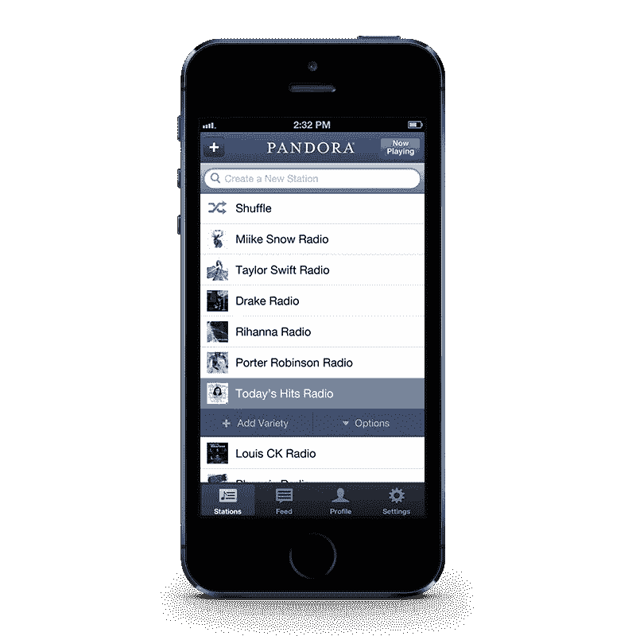

这发生在苹果开始远离 skeuomorphic 设计之前，所以虽然梯度和大按钮仍然存在，导航和其他控制被简化了。潘多拉的使命是改变你发现和聆听音乐的方式，但直到潘多拉 4.0 发布之前，发现都有点碰运气。此次更新对用户界面进行了细微的更改，但改进了 UX，增加了更详细的艺术家页面，引入了个人资料页面，以及音乐提要，允许用户关注朋友，并查看具有相似品味的用户正在听什么。它也见证了潘多拉最终变得更加社会化，允许用户通过脸书和推特分享喜欢的歌曲和电台。

Pandora 应用的下一次重大更新于 2014 年推出，带来了你现在在许多应用中看到的相同的平面设计——使用最少的颜色。这种趋势一点也不无聊，它有两个非常重要的目的:

*   通过[遵循和使用已建立的 UI 模式](https://www.uxpin.com/studio/blog/5-reasons-to-use-ui-patterns-in-your-design-work/)，你创造了一种熟悉感。用户能够更轻松地浏览您的应用程序，并且不太需要入门
*   通过限制应用程序中颜色的使用，您可以更有效地使用颜色来吸引对重要功能和信息的注意。

[访问艺术家信息更容易，利用滑动和点击手势](http://blog.pandora.com/us/hitting-refresh-an-update-to-our-ui/)而不是导航到单独的页面。虽然个性化一直是 Pandora 的一个功能，但它现在更受关注，更容易喜欢电台、歌曲和查看过去的喜欢。一些功能被隐藏，再次增加了眼不见心不烦的风险，但由于用户基数大，人们会认为 Pandora 密切监视哪些功能最常用，因此只隐藏不常用的功能。

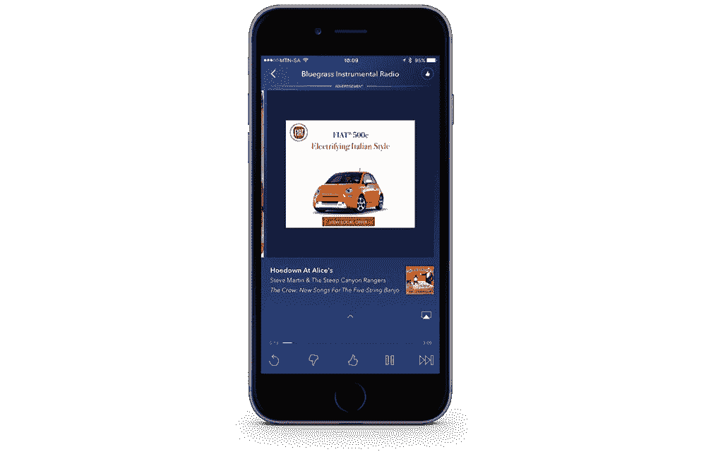

像脸书一样，潘多拉受益于庞大的用户群，以及每天都与该应用广泛互动的观众。这使得设计团队可以获得大量与用户如何使用该应用相关的数据:他们经常使用哪些功能，以及他们避免使用哪些功能。谈到她在 Pandora 的产品设计师角色， [Anabelle Zee 这样描述:](https://designation.io/blog/interview-with-anabelle-zee/)

[……]这个职业的大问题是“这是否改善了用户的生活？”好的设计渗透到我们生活的方方面面。而设计精良的产品能带来这样的愉悦。

# **结论**

虽然这里提到的应用程序都是由大公司支持的，都已经投资了数百万美元，但 UI 和 UX 并不是只有他们才能使用的东西。有了像 [UXPin](https://www.uxpin.com/) 、 [InVision](https://www.invisionapp.com/) 和 [Localytics](https://www.localytics.com/) 这样的工具，UI 和 UX 设计、指标和优化对所有应用开发者都是可访问的。而且投资 UI 和 UX 的好处也不容忽视:

当你着手开发或改进自己的应用程序时，你可以从这些公司学到很多东西。尽管我对每家公司都有一两个具体的见解，但它们并不是该公司独有的。相反，你可以期待这些是适用于所有成功应用的原则。

通过脸书，我们了解到测试的重要性，然后在应用改变之前分析和解释数据。他们的测试直接内置在他们的应用程序中，但对于较小的开发者来说，对功能和新设计进行常规的 A/B 测试就足够了。但是正如脸书产品经理迈克尔·沙龙指出的:

> “我们[不是]‘数据驱动’。我们是“数据感知型”或“数据知情型”

跟随直觉是允许的，只要你继续监控用户数据，并且如果你的直觉是错误的，你能够纠正。

Airbnb 不仅教会了我们建立信任的重要性，还教会了我们如何保持可发现性。重要的是要记住，随着业务和受众的增长，查找特定产品或信息会变得更加困难。除了脸书，这里讨论的每一款应用都致力于简化搜索功能，而不增加摩擦。使用搜索功能的步骤越少越好。

通过 Tastemade，我们了解到关注消费者的重要性，以及他们如何使用你的应用程序。永远记住你是在为你的用户设计，而不是为你自己设计，但是不要太专注于用户要求什么。在为 UXPin 撰写的文章中，Adam Fairhead 用 Aaron 和 Moses 做了一个类比,讲述了给用户他们想要的东西和引导他们到达正确目的地之间的区别。他将 UX 和设计描述为:

UX 设计师的责任是为正在设计的体验的接受者规划一个优雅的、深思熟虑的、自然的过程。然后带他们去那里，尽可能少遇到阻力。换句话说，就是带领一群人走向成功。好的设计不是强有力的、模糊的、自私的、无知的或偶然的，而是有意的。好的设计引领着人们。

从 Tastemade 学到的另一个教训是，你的应用应该总是从你核心产品的延伸开始。Tastemade 的前两款应用并非如此，而是为用户提供了一种体验，创始人希望这将成为他们的下一个垂直应用。他们只在一款直接扩展现有产品的应用上取得了成功。脸书和 Airbnb 都开始超越他们最初提供的服务:脸书提供了[信使](https://www.messenger.com/)，Airbnb 提供了[体验](https://www.airbnb.com/experiences)。脸书很快将 Messenger 从他们的核心产品中分离出来，而体验仍然嵌入在 Airbnb 应用程序中，但因为它们与旅行(Airbnb 的核心产品)有着内在的联系，所以可以工作。

同样，Trainline 向我们表明，将新技术集成到你的应用程序中是可以的——而且要快——只要它们不是噱头，并且实际上让用户直接受益。Trainline 和 Deliveroo 还向我们展示了简化复杂任务的重要性，以及如何在不使用太多单独屏幕的情况下仍然可以共享和收集大量信息。

最后，鉴于 Pandora 宣布推出一项高级计划，随后又谈到出售公司，我们了解到，尽管用户界面和 UX 很重要，但你仍然需要关注你的公司所在的市场正在发生什么。虽然 Pandora 是互联网广播的先驱，但在某些方面，它没能跟上竞争对手。推出 10 多年后，Pandora 仍然只在三个地方可用，相比之下，Spotify 有 20 个地方可用，Apple Music 有 100 多个。

你在 UI 和 UX 上投入了多少努力，你在使用什么工具？在看看应用开发者可用的其他工具之前，请在评论中告诉我们。

# 作者简介

Nabeena Mali 是 [AppInstitute](https://appinstitute.com) 的营销经理，这是不用写一行代码就能创建自己的移动应用程序的最简单方法。她对设计、用户体验和数字增长充满热情，通过可行的策略帮助企业利用新兴的移动趋势。她也喜欢返璞归真，喜欢老式拍立得相机和骑无齿轮自行车。

【ebooks.localytics.com】最初发表于**。**

******

> *[黑客中午](http://bit.ly/Hackernoon)是黑客如何开始他们的下午。我们是 AMI 家庭的一员。我们现在[接受投稿](http://bit.ly/hackernoonsubmission)并乐意[讨论广告&赞助](mailto:partners@amipublications.com)机会。*
> 
> *如果你喜欢这个故事，我们推荐你阅读我们的[最新科技故事](http://bit.ly/hackernoonlatestt)和[趋势科技故事](https://hackernoon.com/trending)。直到下一次，不要把世界的现实想当然！*

**