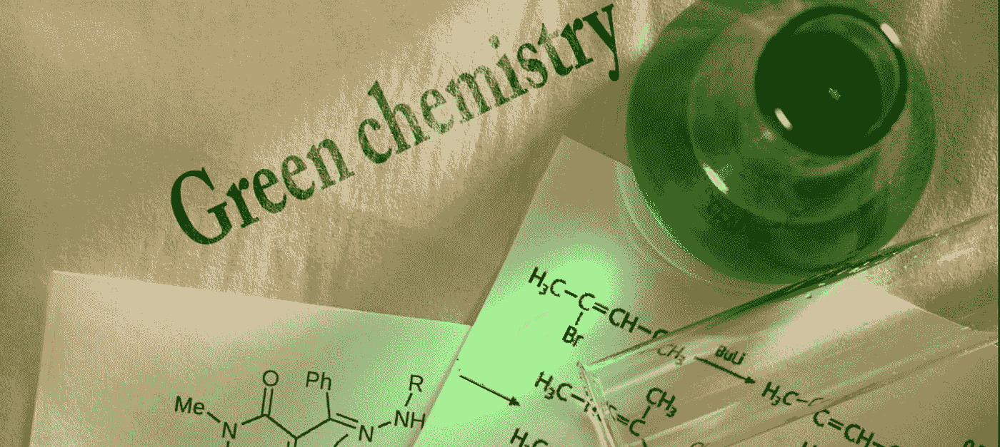
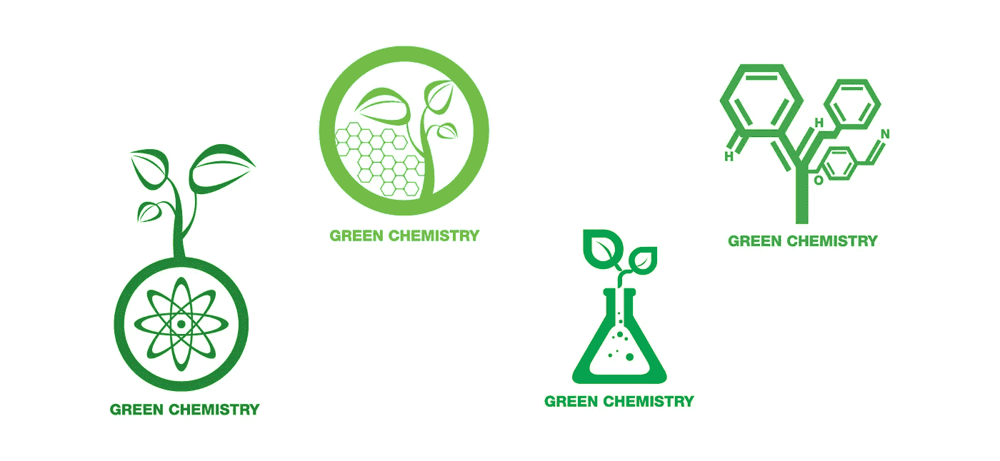

# 绿色化学和材料科学

> 原文：<https://medium.com/hackernoon/green-chemistry-and-material-science-e03ad1d0a28b>

Image [Source](https://cefic.org/sign-up-for-green-chemistry-news/)

> 研究和复制自然是绿色化学工具箱中最伟大的工具之一。
> 
> 保罗·阿纳斯塔斯接受乔希·沃尔夫采访(2012 年)

化学家保罗·阿纳斯塔斯和约翰·华纳发起了一场名为“绿色化学”的全球运动，旨在设计化学产品和工艺，以消除或大幅减少化学工业产生的有害物质。Anastas & Warner (1998)制定了绿色化学的十二项原则。这些原则邀请化学家提出的一些问题是:

**我们如何创造化学合成方法，最大限度地将工艺中使用的所有材料融入最终产品？**

**我们如何才能尽可能地依赖合成方法，使用和产生对人类健康和环境几乎没有或没有毒性的物质？**

**我们如何(重新)设计化学产品，在降低毒性的同时保留功效？**

**通过在环境温度和压力下进行化学合成，我们如何最大限度地减少能源需求以及相关的环境和经济影响？**

**我们如何支持可再生而非消耗性的原料(只要技术和经济可行)？**

**我们如何设计在功能结束时分解成无害产品且不会在环境中持续存在的化学产品？**

2009 年，保罗·霍肯、珍妮·本尤斯和约翰·华纳(华纳·巴布科克绿色化学研究所)开始了一项雄心勃勃的项目，旨在创造一种无毒、低成本的太阳能技术，该技术基于一系列无毒的光活性染料，这些染料被印刷在一种完全可回收的薄膜上。他们没有遵循光伏技术发展的传统标志，通过追求电池板的最大耐用性和使用硅基技术的最大转换效率，而是决定看看大自然如何创造自己的太阳能电池板。

大多数叶子每年更新，完全可回收，光合作用的效率很低，但基于在环境温度和环境压力下组装的可再生无毒材料。如果他们的公司 OneSun Inc .成功开发出这种基于仿生学和绿色化学的“染料敏化太阳能电池”技术，他们的发明将改变太阳能领域的游戏规则，并使我们更接近创造更公平的再生文化。还有其他公司在追求这一目标，其中包括澳大利亚的 Dyesol 公司和爱尔兰的 Solarprint 公司。

基于绿色化学和仿生学的突破性创新正在迅速增加。许多研究小组和清洁技术公司正试图创造一种合成版本的蜘蛛丝，这种蜘蛛丝的抗拉强度与钢相似，但像橡胶一样柔韧，并且无需高温即可生产。德国公司 AMSilk 在 2013 年宣布，它将开始生产“第一种机械性能类似于天然蜘蛛丝的可伸缩纤维”。

生物技术和绿色化学领域的其他领先企业正在努力支持向以区域为基础的循环生物经济转变，这种经济以植物和废料为主要原料。总部位于美国的可持续化学公司 Novomer 的联合创始人斯科特·艾伦(Scott Allen)受到“大自然每年使用数十亿吨二氧化碳来制造纤维素等有用材料”(Casey，2011 年)的启发，开始在使用二氧化碳和一氧化碳作为原料的塑料生产中创建催化途径。

目前，Novomer 的塑料仍然由传统的石油原料制成，但通过使用二氧化碳，所需原料量减少了一半。Novomer 创新方法的关键是催化剂，它允许二氧化碳和一氧化碳以经济有效的方式转化为各种工业产品(塑料、燃料、肥料、药品)。这些突破性技术的开发已经从最初的实验室测试转向全面展示，预计将很快进入商业生产。

> 我们正处于一场材料革命的边缘，这场革命将与铁器时代和工业革命相提并论。我们正在跃进一个新的材料时代。我认为在下个世纪，仿生学将会极大地改变我们的生活方式。
> 
> 材料科学家 Mehmet sari Kaya(janis ch，2015 年)

红鲍鱼( *Haliotis rufescens* )设法生产出一种非常坚韧的、彩虹色的彩色陶瓷，称为“珍珠之母”或珍珠质。它的强度是我们目前使用超过 2000 摄氏度的温度生产的任何陶瓷的两倍。鲍鱼在环境温度下实现这一壮举，是通过交替放置转化为晶体形式(文石)的碳酸钙层(从海水中提取)和一种名为 Lustrin-A 的蛋白质层。

在桑迪亚国家实验室，由 Jeffrey Brinker 博士领导的研究小组发现，非常坚硬的霰石层与灵活的蛋白质层相结合，使珍珠质能够在压力下滑动。由此产生的砖墙结构阻止了任何裂缝的蔓延。该团队在自我组装过程中模仿了他们从鲍鱼身上学到的东西，创造了一种矿物和聚合物的分层结构。由此产生的材料“在光学上是透明的，但比玻璃要坚硬得多。

与传统的“加热、敲打和处理”技术不同，Brinker 的蒸发诱导低温工艺允许液体建筑块自我组装并硬化成涂层，可以强化挡风玻璃、太阳能汽车车身、飞机或任何需要轻质但抗断裂的东西”(Janisch，2015)。在绿色化学、分子生物学和材料科学领域，还有许多其他鼓舞人心的仿生创新:

> 彼得·斯坦伯格(生物信号公司)创造了一种模仿海钱包的抗菌化合物。这些红藻通过一种叫做呋喃酮的环保化合物干扰细菌的通讯信号，从而阻止细菌在表面着陆。[……]*Bruce Roser*(剑桥生物稳定性)开发了一种热稳定的疫苗储存方法，无需昂贵的冷藏设备。这一过程是基于一种自然过程，它能使复活植物在干燥状态下保持数年。[……]*丹尼尔·莫尔斯*(加州大学圣巴巴拉分校)已经学会模仿硅藻生产二氧化硅的过程。这可能预示着一条低能量、低毒素的途径通向计算机部件。
> 
> 珍妮·本尤斯(载于《仿生学》3.8，2014 年 a)

德国企业家 Hermann Fischer 建立了“奥诺”公司，这是一家生产植物和矿物基油漆、涂料和胶水的国际公司，具有最高的环境和性能标准，他呼吁到 2050 年彻底转向“21 世纪的太阳能化学”(Fischer，2008)。在他的书 *Stoffwechsel 中，* Fischer 回顾了基于石油的化学工业的历史，并详细探讨了向基于无毒植物和矿物原料的化学转变不仅是可能的，而且是迫切需要的。作为一个在石化行业占主导地位的行业中的成功企业家，费舍尔花了 40 多年的时间证明这种转变是可能的，并且可以以一种经济可行的方式进行。

【这是摘自我的书[设计再生文化](http://www.triarchypress.net/designing-regenerative-cultures.html)的一个分章节，Triarchy 出版社 2016 年出版。]

[Image Source](https://kimiaundip09.files.wordpress.com/2012/07/green_chemistry_logo_by_ameratsu.jpg)

—

如果你喜欢这个帖子，**请鼓掌**记住，如果你非常喜欢，你可以鼓掌**多达 50 次**；-)!

**丹尼尔·克里斯蒂安·瓦尔**——在面临多重危机的情况下催化变革性创新，为可再生整体系统设计、可再生领导力以及可再生发展和生物区域再生教育提供建议。

国际知名书籍[设计再生文化](https://www.triarchypress.net/drc.html?source=post_page---------------------------)的作者

**请考虑成为赞助人来支持我正在进行的工作:**

 [## 丹尼尔·克里斯蒂安·沃尔正在创造支持再生文化和区域再生的内容…

### 亲爱的潜在支持者，自从《设计再生文化》在 2016 年初出版以来，我一直在分享它…

www.patreon.com](https://www.patreon.com/DanielChristianWahl?fan_landing=true)