# 为 Carvana Kaggle 挑战赛破解 GTA V

> 原文：<https://medium.com/hackernoon/hacking-gta-v-for-carvana-kaggle-challenge-6d0b7fb4c781>


“Check out this licence number, dude!”

[ka ggle 上举办的 Carvana 图像掩蔽挑战赛](https://www.kaggle.com/c/carvana-image-masking-challenge)吸引了深度学习社区的大量关注。目前，比赛有 600 多个团队注册。任务是建立一个模型，将汽车从场景背景中分割出来。

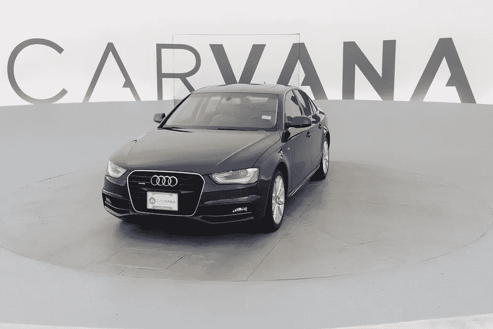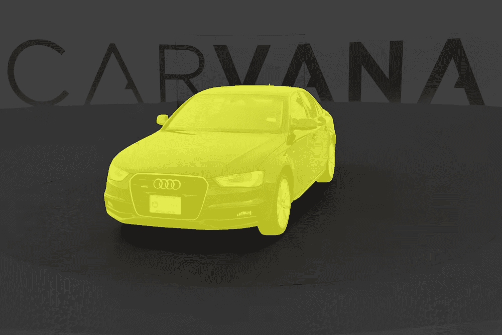

Original and target images

从概念上来说，这项任务似乎定义明确且简单，特别是在比较中，比如说，与安全自动驾驶的道路场景的完全识别相比。

的确，有 396 支队伍取得了 0.99 以上的成绩。所有进一步的比赛将在最后分数的小数点后 3-4 位进行。

总的来说，Kaggle 社区极具创造力，非常重要的解决方案是激烈竞争的结果。比如，[出租车预测挑战赛](https://www.kaggle.com/c/pkdd-15-predict-taxi-service-trajectory-i)的[冠军解答](https://arxiv.org/pdf/1508.00021.pdf)。

然而，当涉及到语义分割问题时，非平凡的方法很难利用。在大多数得分最高的解决方案中，以不同分辨率训练的 Unet 类架构的集合将占优势。在非常相似的方法相互竞争的情况下，机会起着巨大的作用。

下面的问题出现了:

> "有没有其他方法可以获得竞争优势？"


我们认为答案是肯定的，特别是如果我们从不同的角度来看这个任务:**攻击数据而不是建模**。

在本帖中，我们将描述[我们](https://deepsystems.ai)如何设法生成与真实图像(挑战组织者提供的训练数据)非常相似的合成 Carvana 图像(加上地面真相)。更重要的是，我们的合成训练集是免费提供的，每个人都可以利用它在挑战中获得更高的分数。

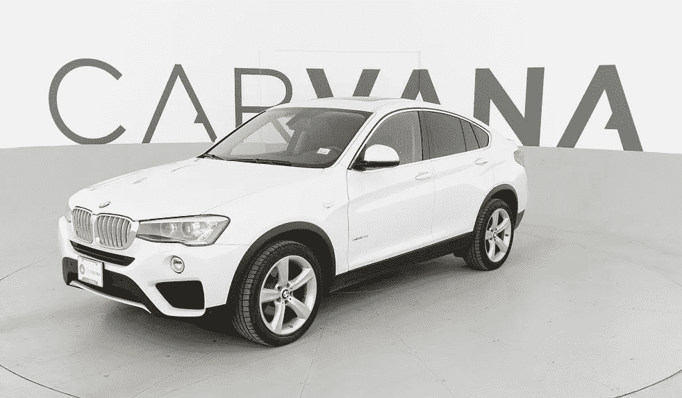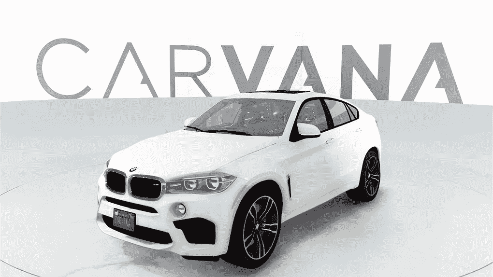

看看上面那两辆车。一个是真实的，一个是用 GTA V 合成生成的，哪个是哪个？

# 来玩 GTA V 科普一下吧！

现代电脑游戏与深度学习有着有趣的联系。它们很吸引人，更重要的是，看起来很真实。以 GTA V 为例。 [Rockstar North](https://en.wikipedia.org/wiki/Rockstar_North) ，多年来，投入巨大的努力让游戏性尽可能的贴近现实。因此，潜在地，一个人可能认为游戏是无限的训练集，具有所有可能和不可能的道路场景配置。

这里我们缩小了上面提到的一般方法。我们使用 GTA V 来获取不同摄像机视角下的汽车图像和分割掩膜。这个想法并不新鲜，例如，[为 2016 年的数据](https://download.visinf.tu-darmstadt.de/data/from_games/)数据集而战。

不幸的是，没有直接的方法可以做到这一点(GTA V 没有这种 API 可用)。但概念上是可能的。所以一点逆向工程可以帮助我们。我们不会太关注逆向工程过程本身(如果有人感兴趣，请在评论中告诉我们)，而是会描述整个过程(并展示许多很酷的图片)。

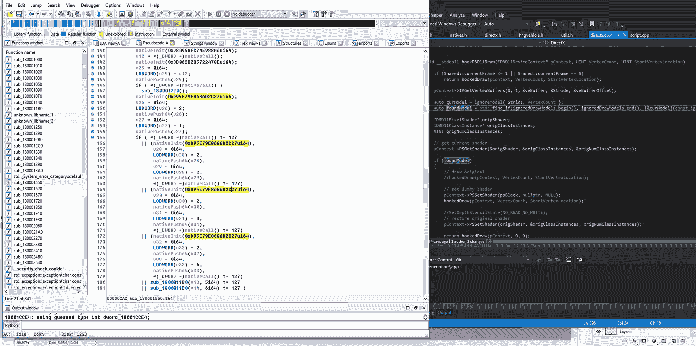

Some intermediate magic in action

在我们成功地将 DLL 注入 GTA 流程后，我们可编程地将 GTA 中的每辆车放入车库。嗯，不是每一个——经过一些筛选，我们只保留了 154 个对 Carvana 挑战赛有意义的模型，因为飞艇没有。然后，我们用几个不同的摄像机角度将模型旋转 10 度。最后，我们改变汽车颜色:我们选择了黑色和白色。


好的，现在我们可以像上面一样截取一些漂亮的截图，但是没有事实依据。那很糟糕。幸运的是，我们可以挂接 DirectX API 调用，并对场景中的对象进行一些操作。在几次键盘损坏后，我们找到了一种突出汽车的方法:


如你所见，这里没有窗户。这是因为在 GTA V 中，窗口是完全独立的对象。因此，我们也只突出显示窗口:

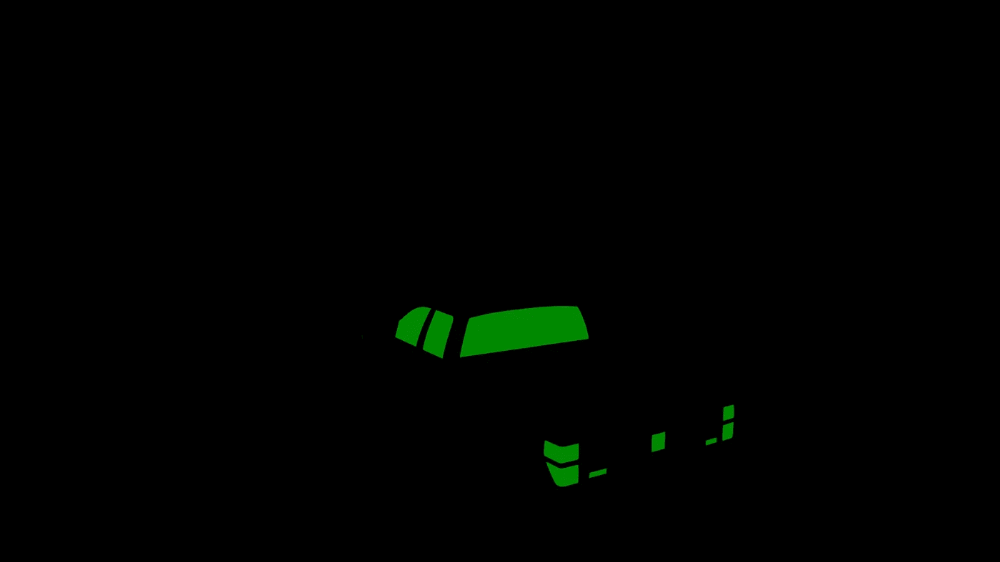

这下好了！我们实际上得到了地面真相面具和汽车图像。但是我们还需要提取我们的模型并将其放置在 Carvana 场景中，并使最终结果尽可能接近现实。正因为如此，我们还想从 GTA 中提取一个汽车阴影:

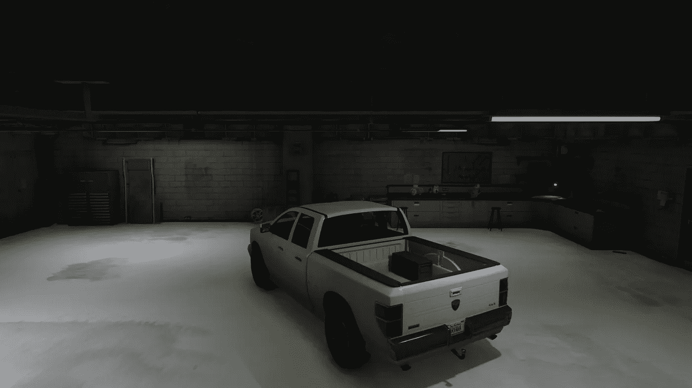

正如你所看到的，我们没有把地板弄得完全洁白和平整。但是不要担心:Photoshop 是来帮助我们的！

# 用于深度学习的 Photoshop

什么样的人会用 Photoshop 进行机器学习？嗯，我们有。

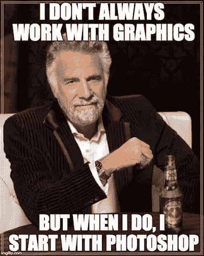

其实 Photoshop 大有可为。但是大多数人不知道可以使用优秀的 JavaScript 来自动化每一个动作。我们就是这么做的。

我们从游戏截图开始:

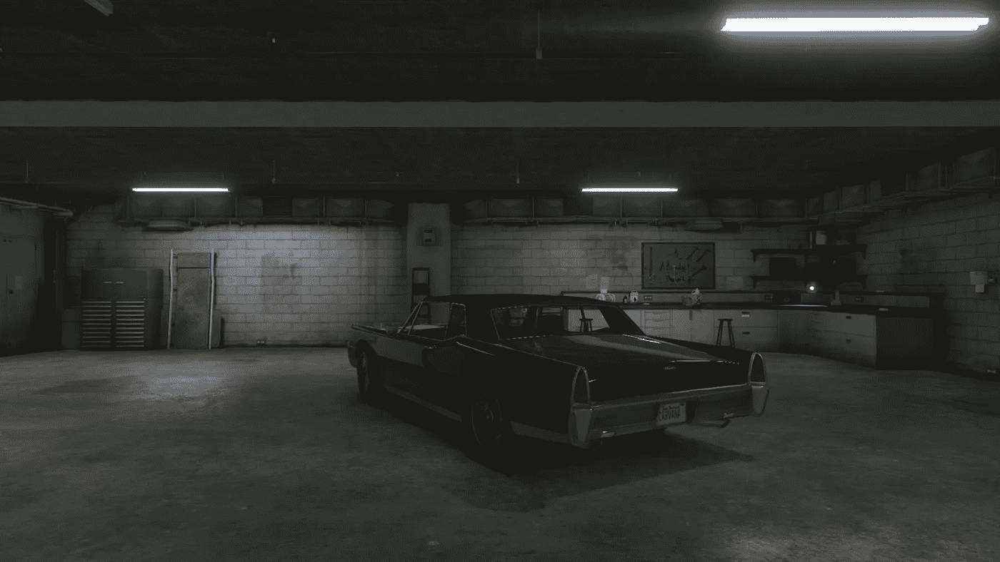

首先，简单的一个:我们结合汽车和窗户地面真相，以获得最终的面具:

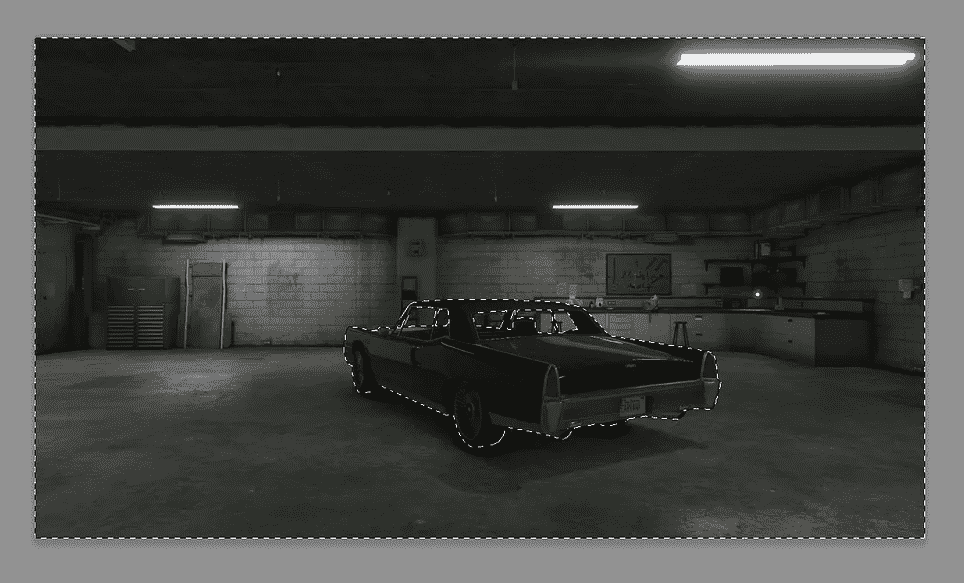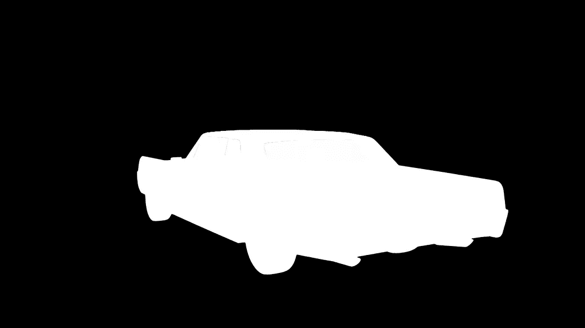

现在，我们可以从截图中剪出汽车，并将其放在我们之前制作的空舞台上:

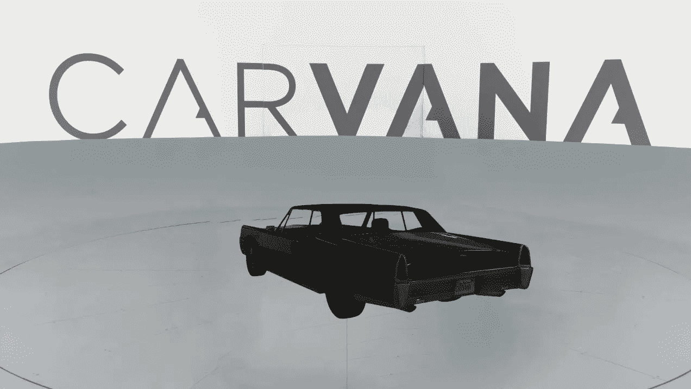

如你所见，车内太暗。那是因为它是在较暗的地方拍摄的。幸运的是，Photoshop 有自动色调和自动颜色功能:

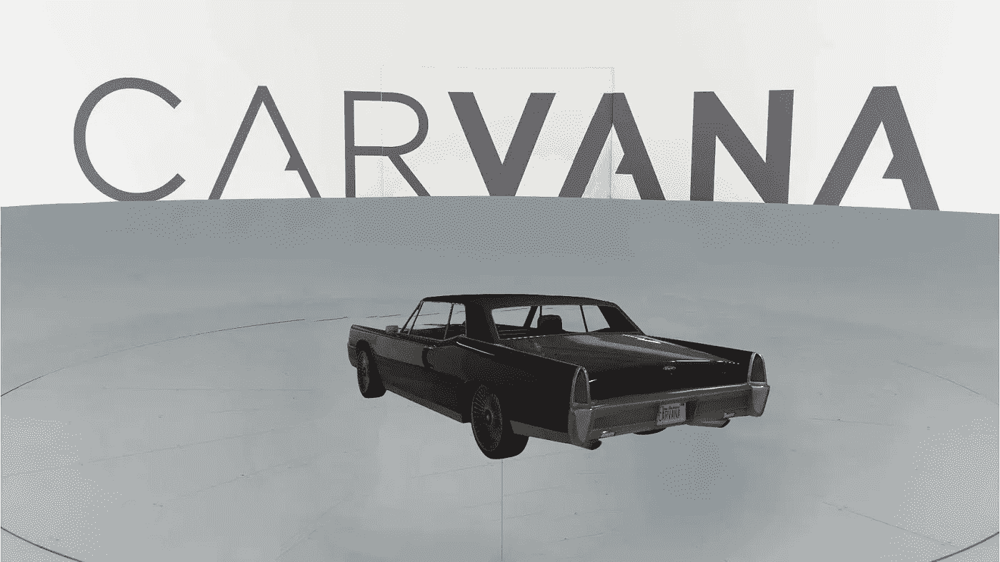

好多了！但是车是飘在空中的。那是因为没有影子。在 Photoshop 中生成阴影是可能的，但是很难，因为我们需要记住模型的旋转角度。所以，我们将直接从 GTA 中获取阴影。我们加载了白色地板的截图，并做了一些处理:

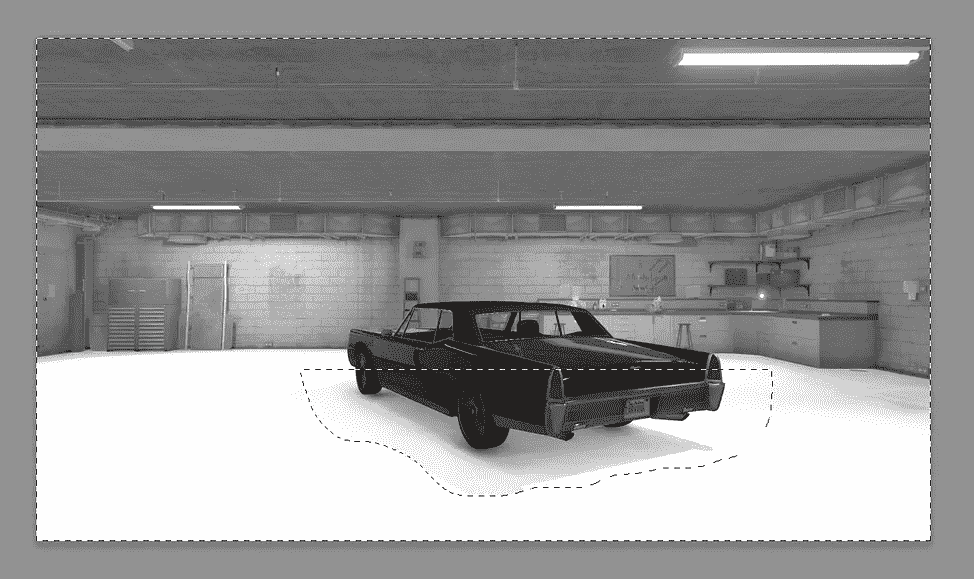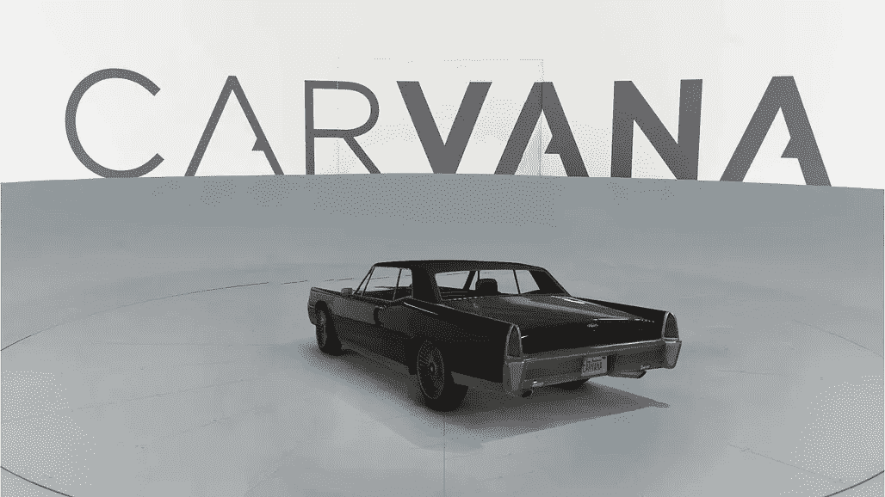

但是还是没有窗户！让我们通过使用一些渐变生成窗口来解决这个问题:

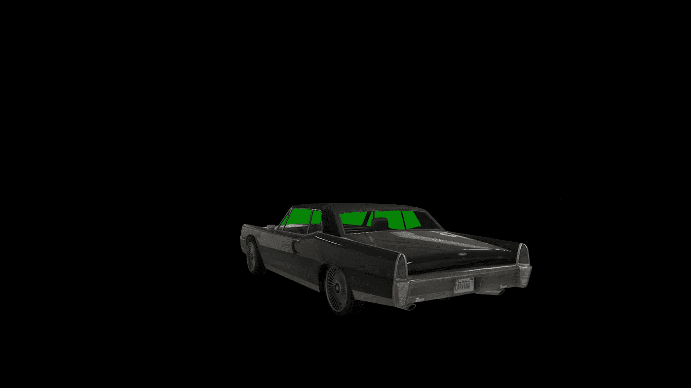

最后，放大汽车以适应场景:

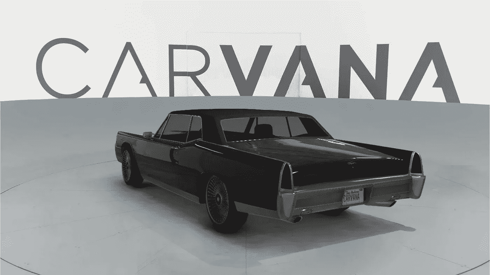

所有这些操作都是使用 Photoshop JS 脚本和预先录制的动作编程完成的。如果你认为这是一个有趣的话题，请在评论中留下你的观点。

# 如何获取合成 Carvana 数据集

我们已经在我们的培训数据平台 [Supervise.ly](https://supervise.ly) 中公开了这个数据集。如果你想了解更多，请查看 medium 上的这个[帖子。按照这些简单的步骤获取数据:](/deep-systems/introducing-supervise-ly-57b00f863040)

## 1.创建一个帐户

在 Supervise.ly 上注册。这是免费的，只需几分钟。

## 2.从库中选择数据集

打开`Import` → `Datasets`库，点击“CarvanaGTA5”数据集。输入项目名称(如“Carvana”)，点击`Next`和`Upload`。导入任务完成后，您将在`Projects`页面上看到您的新数据集。

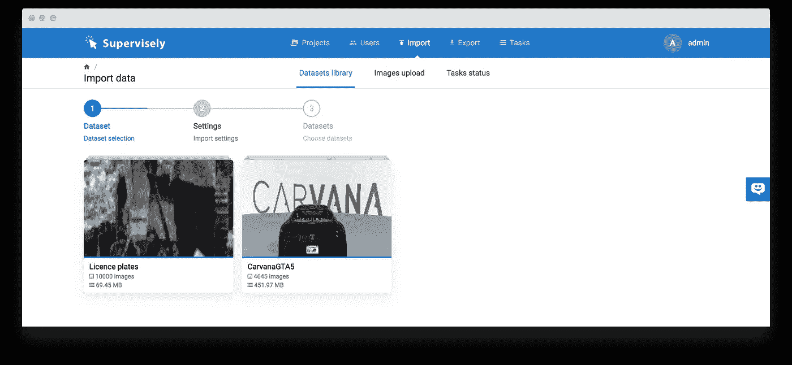

Datasets library

您可以点击数据集或查看统计数据来查看`Annotation tool`中的图像。


Annotation tool

## 3.导出数据

现在，您可以使用`Export tool`将数据集下载到您的计算机上。Export 是 Supervise.ly 的一个强大功能，它使用 JSON 配置进行过滤、调整大小、增强、训练验证分割，将多个数据集合并为一个数据集，然后将结果保存为流行的 ready to train 框架格式。

转到`Export`页面，在编辑器中粘贴以下配置:

```
[
  {
    "action": "data",
    "src": [
      "<Your project name>/*"
    ],
    "dst": "$sample",
    "settings": {
      "classes_mapping": "default"
    }
  },
  {
    "action": "tag",
    "src": [
      "$sample"
    ],
    "dst": "$sample2",
    "settings": {
      "tag": "train"
    }
  },
  {
    "action": "background",
    "src": [
      "$sample2"
    ],
    "dst": "$sample3",
    "settings": {
      "class": "bg"
    }
  },
  {
    "action": "segmentation",
    "src": [
      "$sample3"
    ],
    "dst": "Carvana",
    "settings": {
      "gt_machine_color": {
        "car": [255, 255, 255],
        "bg": [0, 0, 0]
      },
      "tag2part": {
        "train": "train"
      },
      "txt_generation": {
        "prefix": "."
      }
    }
  }
]
```

在这里，我们定义了一个数据顺序转换的数组:我们将每个图像标记为“train”，将其传递给`background`层以生成`bg`类，最后使用`segmentation`层来制作地面真实图像。你可以在[文档](https://docs.supervise.ly/en/export/)中阅读更多关于导出的信息。


现在点击`Start Exporting`按钮并输入一些名称(可选)。

Supervise.ly 将准备您的档案，一段时间后`Download`按钮将出现在任务中:

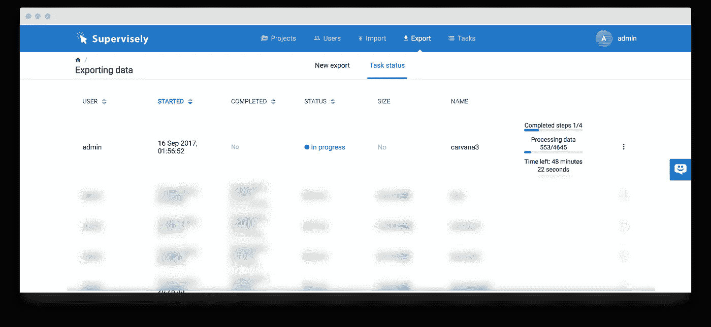

搞定了。如果你有时间，可以看看我们在 Supervise.ly 上的教程，比如[车牌检测](/towards-data-science/number-plate-detection-with-supervisely-and-tensorflow-part-1-e84c74d4382c)——它提供了很多东西。

# 代替结论的是几个普通的词

我们生活在一个深度学习技术空前民主化的时代——学术界和商界公开发表研究和构建神经网络的框架。然而，当涉及到训练数据时，情况就大不相同了。在数据可用性方面，行业巨头(谷歌、facebook、亚马逊)比其他公司有巨大的优势。

下面这张来自吴恩达的图表很能说明问题:


或者换句话说:基于深度学习的智力产品的质量是由可用的训练数据量决定的。

提高培训数据的可用性是我们公司的首要任务。我们从两方面着手解决这个问题:

*   手动注释工具的开发。最近我们免费开放了 [Supervise.ly](https://supervise.ly) 的测试版
*   研究合成/半合成场景的生成，实验自动注释过程的工具。我们今天发布的合成 Carvana 数据集是我们研究的一部分。

请让我们知道我们的合成数据集是否有助于您获得更高的分数。