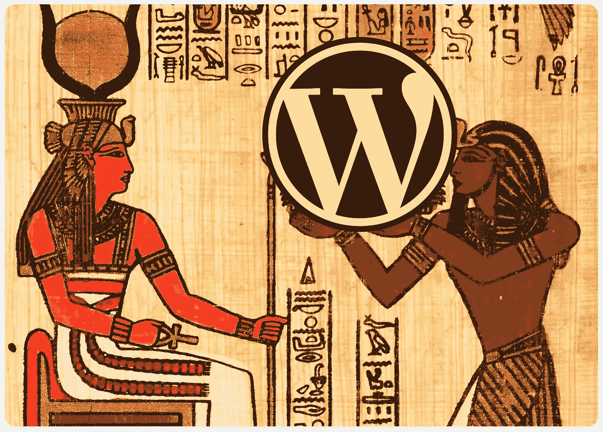
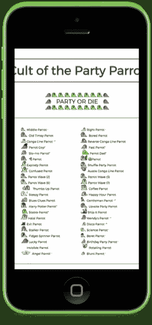

# 无头 graph QL CMS——内容管理系统的未来

> 原文：<https://medium.com/hackernoon/headless-graphql-cms-the-future-of-content-management-systems-acee1f6f9eba>

您知道内容管理系统(CMS)起源于古埃及吗？是真的，谷歌一下！



嗯，事实上，也不尽然。然而，内容管理从其卑微的开端以来已经走过了如此漫长的道路，以至于看起来，它似乎真的是在几千年前开始的。

与此同时，作为开发人员，我们经历了无数的开发语言和框架；作为内容的最终消费者，我们经历了许多平台，完全改变了我们消费内容的习惯。然而，最令人难以置信的是，CMS 幸存下来并适应了这一切。

# 我们已经走了多远

正如许多事情一样，这一切都始于现代互联网的出现，即 90 年代。那时候，互联网上的内容是由熟悉 HTML 的人创建的，因为这是创建网站的唯一方法。Jane 会打开她的文本编辑器，随心所欲地写，并将文件保存为服务器上的 HTML 文件。由于当时的网站都是纯文本的，这就像一个魔咒！还记得雅虎吗，这个网站聚合了网上最酷网站的超链接？没错。

此后不久，Jane 考虑在混合中加入图片，因为“一张图片胜过千言万语”。此外，随着互联网和网站的激增，越来越多的人，包括那些没有创建网站的技术诀窍的人，被拖进了这一混合体。博客是热门事物，各种营销人员和记者开始为在线消费创造内容。网络的速度越来越快，但同时也变得相当复杂。与此同时，网站建设者和网站内容管理者之间出现了分化。请记住这一点，因为这种分离将是一个反复出现的主题。

于是，久而久之，一个内容管理系统，或 CMS，就诞生了！Wordpress(预计。~2003)，Drupal(估计。~2002 年)和[许多其他人](https://en.wikipedia.org/wiki/List_of_content_management_systems)都在尽最大努力解决自助发布富媒体内容和协作内容管理流程的问题。

几年来，随着我们不断创建越来越多的主要在台式电脑上使用的网站，这种方法非常有效。开发人员将在网站设置期间负责定制样式。内容管理员将在 CMS 中创建他们的内容，并按下**发布**。小菜一碟！

直到有一天苹果发布了 iPhone，破坏了既定的世界秩序；欢迎智能手机！此后不久，iPad 紧随其后，其他设备制造商也相继推出了各自版本的智能手机和平板电脑，开创了内容消费的新时代。在桌面上消费内容的时代已经一去不复返了，移动网络和本地移动应用的时代已经到来。不久之后，内容也开始出现在世界各地的手腕上，智能手表上，虚拟现实耳机或增强现实设备上，甚至是联网的洗衣机上。可以肯定地说，在十年之内，我们在家里或办公室的桌面屏幕上消费内容的行为完全被颠覆了。一个多平台内容管理的时代开始了。

# 新型无头合作医疗的兴起

说到内容管理系统，对内容的新要求意味着行业正在发生变化。挑战是多方面的。每个平台应该有一个独立的 CMS 还是应该有一个 CMS 向所有平台发布内容？如何适应众多的硬件设备和屏幕尺寸？如何支持刚刚起步但很有可能变得无处不在的平台，如虚拟现实、增强现实等？当然，除此之外，CMS 还必须支持旧的习惯:发布富媒体内容和协作内容管理流程。

很自然，人们认为采用一个现有的想法，也就是一个当时已经发展的 CMS 的想法，并将其挤压和推进到新的世界秩序的要求中就可以达到目的。的确如此——很大程度上是以糟糕的用户体验为代价的，因为每个人肯定都经历过在移动设备上浏览一个显然是为网络而建的网站。



Website of the Party Parrot cult. To be fair, the website is responsive and this is a fake non-responsive mock-up. Forgive me, migthy parrot.

当传统的内容管理系统以他们最熟悉的方式解决问题，为响应性网站和本地应用程序开发主题和插件时，一个全新的思想流派出现了。我们不要试图把内容和表示一起塞进新的平台，而是把这两个问题分开，把内容管理留给内容经理，把内容的表示和布局留给开发人员。管理内容的人和负责技术方面的人之间的分离再次出现。于是，一个无头 CMS 诞生了！

无头内容管理系统的一个关键区别在于，它实际上对两类不同的人来说是两件事:对开发人员来说，它实际上是一个返回纯数据的数据库，在这种情况下是通过 API 返回纯 JSON 的内容；对于那些负责管理内容、完成翻译、支持各种角色和工作流、严格控制权限等任务的人来说，这是一个功能齐全的 CMS。虽然内容管理人员拥有成功工作的合适工具，但开发人员不会受到内置表示期望的阻碍，可以自由地为任何现有或即将出现的平台构建本机体验。这种关注点的分离在开发人员和内容管理人员之间创建了有效的协作模式。请记住，这种分离是过去的内容管理系统试图解决的原始问题之一。

# 现代无头 CMS 的问题

到目前为止，已经有很多无头的 CMS 出现了，传统的玩家也开始使用本地 API 供大众使用。这是一个激动人心的时刻，因为内容管理系统正朝着支持所有和任何内容消费平台的方向发展！只有一个问题——没有一个 headless CMS 或传统 CMS 真正支持多平台内容分发。

虽然通过 API 公开纯内容的想法很好，但真正的多平台内容分发的障碍在于选择表示性状态转移(REST)作为传输数据的方式。

尽管 REST 在理论上是平台不可知的，但它的应用，尤其是在早期，也就是说中期，一直围绕着 Web。因此，公认的做法是创建专用的 URL 来公开所谓的资源或端点。想象一个有作者和文章的博客。使用 REST，您最有可能创建两个端点:一个用于作者，一个用于帖子，每个端点都存储关于这些对象的相关数据。基本思想是，通过使用给定的命令访问这些端点，可以对存储在这些端点的文档执行操作(GET、PUT、DELETE、POST)。因此，接下来，端点决定了哪些操作是可能的，哪些数据是可用的或不可用的。在我们的示例中，如果不从 posts 端点检索数据，就无法了解作者的帖子。

在基于桌面的纯网络时代，这种方式很大程度上运行良好。然而，随着我们目前所经历的平台和设备的爆炸式增长，这种痛苦急剧增加。假设您为智能手表应用程序构建了一个屏幕，该屏幕从过去某个时间点构建的 REST 端点获取最新新闻故事。考虑到屏幕大小的限制，你最多只能显示两到三个故事的标题。你的 ***故事*** 休息端点返回如下:

```
“allStories”: [
 {
 “subtitle”: “After penguins street riot in Antarctica demanding the    finest burgers made by cats, Cat Burger Company opens first location to smashing success\n”,
 “translations”: [
 {
 “title”: “Cat Burger Company Expands to Antarctica Catering to Strong Penguin Demand”,
 “body”: “lorem ipsum\n”,
 “language”: “EN_US”
 },
 {
 “title”: “Cat Burger Company expandiert in die Antarktis Catering für starke Pinguin-Nachfrage”,
 “body”: “lorem ipsum DE\n”,
 “language”: “DE_DE”
 },
 {
 “title”: “Cat Burger Company se développe en Antarctique pour répondre à la forte demande de pingouin”,
 “body”: “lorem ipsum FR\n”,
 “language”: “FR”
 },
 {
 “title”: “Cat Burger Company breidt uit naar Antarctica voor catering aan de sterke Penguin-vraag”,
 “body”: “lorem ipsum NL\n”,
 “language”: “NL”
 }
 ],
 “last3Stories”: [
 “Scientific Research Proves Cats Are Burger Experts\nYou Won’t Believe These 7 Truths About Cats and Burgers\nA Cat Burger Company Announces 3rd Quarter Results; Price Skyrockets”
 ],
 “publishDate”: “2018–02–13T22:00:00.000Z”,
 “headerImage”: {
 “url”: “[https://media.graphcms.com/U6VRGMogRDmndHKCdfYK](https://media.graphcms.com/U6VRGMogRDmndHKCdfYK)",
 “height”: 333,
 “width”: 500,
 “fileName”: “_048”
 },
 “platform”: “Android”,
 “authorName”: “Cat Burgermeister”
 }
]
```

现在，您不必直接获取可以在智能手表屏幕上显示的字段的子集，而是不必要地使用额外的带宽来获取甚至不会呈现的字段。此外，如果您需要从其他端点收集额外的数据，可能会有相同的效果。所有这些导致开发者的额外开发工作和内容消费者的应用程序性能下降。现在，将这个数字乘以平台的数量，就能体会到挑战的严重性。

# 无头 CMS 的未来

我们选择 GraphQL 而不是 REST 作为数据传输方法并非偶然。GraphQL 颠覆了资源或端点的概念，而是允许客户端本身——无论是 Android 应用程序、Apple Watch、三星洗衣机、Oculus 设备，还是其他设备——准确地指定它需要的数据。换句话说，在跨多个端点编译数据的情况下，它消除了所有完全不必要的带宽负载，以及额外的数据聚合工作。

同样重要的是，我们的 GraphQL 端点显著简化了技术堆栈。

首先，因为 GraphQL 只是后端和前端之间的一个数据传输层，所以您可以随意选择混合其中的一部分。假设引入了新的内容分发平台。您的技术堆栈将轻松容纳它。您可能决定在后端删除或添加部件，以满足产品的新需求。同样，GraphQL 作为中间的数据传输层，为您提供了轻松发展的灵活性，而不是被今天的技术选择所束缚。

第二，通过依赖 Apollo 或 Relay 等开源前端客户端，你不必管理各种 headless CMS 或遗留内容管理系统的各种专有 SDK。这个管道工作已经为您完成了，所以您可以专注于构建您的初始产品。公平地说，如果你正在构建一个简单的网站或移动应用程序，这不是你需要担心的事情。另一方面，如果您真的从事多平台发布业务，您将从不必不断更新每个平台的 SDK 以及在应用程序中检查和修复由此产生的 bug 的自由中受益匪浅。

这些是 GraphQL API 端点而不是 REST 端点的基本好处，因为它们与 CMS 用例直接相关。GraphQL 还提供了许多其他的好处，比如自动生成文档、类型安全以及其他一些好处，但是这些好处并没有直接解决内容管理系统的需求。您可以[在这里](https://medium.freecodecamp.org/so-whats-this-graphql-thing-i-keep-hearing-about-baf4d36c20cf)了解更多关于 GraphQL 的一般知识和具体优势。

# 结论

我们很自豪成为第一个为您的数字项目提供真正的原生多平台支持的 headless CMS。我们相信 GraphQL API 的好处——改进的开发工作流程和简化的技术栈——是 headless CMS 合乎逻辑的下一步。从过去的挑战——发布富媒体内容和协作内容管理实践——到未来的挑战，例如轻松支持任何可能尚不存在的内容分发平台，我们对 GraphQL 为内容管理带来的可能性感到兴奋。


GraphCMS — The GraphQL CMS

如果您还没有机会亲自尝试 GraphCMS，我们鼓励您现在就尝试！我们提供各种价格计划来满足您的需求，以及免费试用和小爱好或测试项目的永久免费计划。开始很快，特别是如果你在其他 CMS 中有现有的项目，帮助总是在你身边。[点击此处](https://graphcms.com)了解我们合作的更多信息！