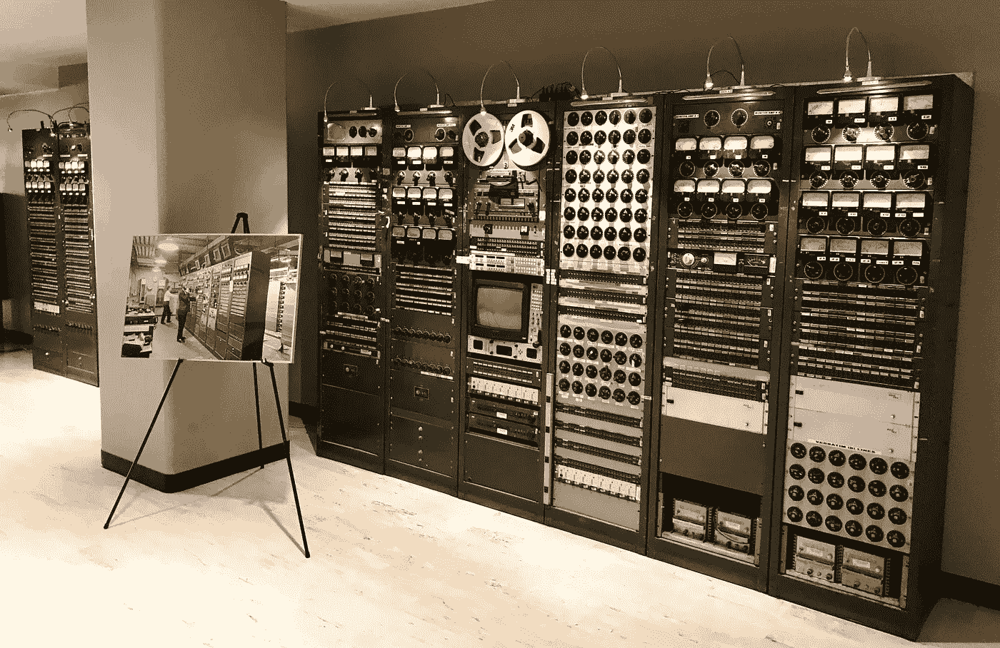

# “人工智能”新世界你好

> 原文：<https://medium.com/hackernoon/hello-new-world-of-artificial-intelligence-e49c4010908>

## 为什么每个人都必须为“自动化革命”做准备

> 我们需要对新兴技术变得更聪明，如人工智能、机器人和区块链。

引发这种想法的是上周对一家工业工厂的参观。

我们都知道有些事情正在发生。每个人似乎都同意我们的未来将是自动化的。但是，我们倾向于认为，它只会——或者主要——影响重复性的“体力劳动”。

“知识工作”的自动化并不在许多人的议事日程上。

但是，这是正确的吗？

或者，这是一个对商业和社会有害的天真的观点吗？

工厂的参观让我思考这些问题，思考什么是“知识工作者”——高管、经理、广告商、律师、会计师等。—在即将到来的新世界中保持相关性需要做的事情。

# 体力劳动的“消失”

这次访问是一次大开眼界的经历。我就不细说了，但这家工厂属于一个全球知名品牌，拥有强大的市场地位。

2005 年，工厂雇佣了 2700 人，主要在生产线上工作。今天，这个数字是 800 多一点。

但员工数量的大幅减少并不是与 12 年前的唯一区别。工作的*类型*也完全变了。

体力劳动已经不存在了。这些活动已经被机器人和机器取代。大多数工人现在是系统操作员，必须控制和监控自动化生产过程。

据我所知，这种变化有三个原因:

*   来自低劳动力成本国家的竞争日益激烈。
*   手工劳动的自动化。
*   工厂生产的产品被新的创新产品“颠覆”。

为了在竞争中保持领先，自动化是必要的。机器只是能够更好、更快、更有效率地工作。这也使该公司能够专注于“旧技术”的创新应用。

> 这基本上是在自动化或遗忘之间的“选择”。

# 而“知识工作者”呢？

在访问中与其他同事讨论这一经历时，他们的第一反应有点令人惊讶:*“自动化仅限于特定部门的‘蓝领’工作”。*

当被追问时，每个人似乎都接受了“知识工作”，如金融、法律和营销行业，也将受到自动化的影响。但是，这将主要限于为非常具体的任务应用自动化工具。

例如，人工智能将自动化日常活动。知识工作者仍然需要从事专门的、高价值的活动。

这听起来很美妙，但我认为这是一种自满的观点。

 [## 自动化的剧变将不仅限于蓝领工作

### 关于自动化将如何影响就业和经济，已经说了很多。几乎在每一次谈话中…

futurism.com](https://futurism.com/the-automation-upheaval-wont-be-limited-to-blue-collar-jobs/) 

我可以想象，过去生产线上的工人也会提出类似的论点。他们经常否认未来，当未来到来时，他们没有准备好。

一个更好的方法可能是观察工厂的例子并从中学习，并调整以下五个教训，以便知识工作者在即将到来的人工智能新世界中保持相关性。

# **《5 课》**

以下是我从参观工厂中总结出的经验:

## ***# 1——我们所有的未来都将围绕 AI***

在一点上，我的同事是正确的:人工智能将接管标准化的“知识工作”，并使其自动化。

事实上，许多知识工作者已经在从事标准化的工作，如审查合同、进行抵押贷款服务操作和处理合规问题。这些可以很容易地(并且已经)自动化。

然而，令人担忧的是，“初级”知识工作者通常正是通过做这种常规活动而被“训练”的。因此，自动化将产生重大影响。

> 许多目前被认为是“培训”的东西将很快变得无关紧要。

通过培训知识工作者如何成为人工智能工具的“操作员”并理解人工智能和机器学习，这个问题可能会得到部分解决。

但是，这意味着招聘人员——人力资源部门——需要寻找一套完全不同的技能。

## ***#2 —大数据“统治”世界***

大数据和预测分析将在知识工作者的活动中发挥至关重要的作用。它将引发一场研究如何进行、客户如何识别、产品如何做广告、冲突如何解决等方面的革命。

 [## 世界上最有价值的资源不再是石油，而是数据

### 一种新的商品催生了一个利润丰厚、快速增长的行业，促使反垄断监管机构介入，以限制那些…

www.economist.com](https://www.economist.com/news/leaders/21721656-data-economy-demands-new-approach-antitrust-rules-worlds-most-valuable-resource) 

这种变化无疑会对“就业能力”产生影响。

我们将需要更多“精通数据”的专业人士。

## ***# 3——下一代知识工作者的颠覆***

一些创新将完全取代和颠覆传统的“知识工作”。想想区块链科技和智能合约。

如果你(像我一样)认为，任何以官僚主义为特征、容易出现人为错误、欺诈和黑客攻击的行业都会受到区块链技术和智能合同的影响，那么很明显，知识工作者必须更好地理解这些创新。

> 对工厂的参观使我认识到没有自满的余地。

在数字时代，工作的方方面面都有可能受到干扰。这种破坏将是持续的、无情的。

结论呢？我们必须把终身学习提上日程。

## ***# 4——每个人都必须是创造者和探索者***

为了弥补标准化工作的损失，知识工作者将不得不寻找和探索利基或新领域。

同样，这需要对新技术有更好的理解。

例如，社交媒体和无人机将为营销和商业提供新的机会。平台公司需要非常具体的法律意见。网络安全和隐私必须用新技术来理解。

在所有这些例子中，寻找创造性的解决方案将会得到额外的奖励。过去的经验或已建立的模板的应用将变得不那么相关。

## ***# 5——每个人都必须掌握讲故事的艺术***

既然数字时代正在改变我们的工作方式(无论是白领还是蓝领)，就要为“自动化革命”做好准备。

固定且可预测的职业道路和终身雇佣的时代已经结束。我们必须不断学习，并在快速变化的市场中定位自己。

这只能通过个人的“品牌化”和“讲故事”来实现。

# 然而，我仍然担心的是。。。

我并不担心人工智能和其他新兴技术成为我们生活中心的未来。

> 我们开发并适应新技术的能力是非凡的。

在一代人的时间里，每个人都发展出了一种“第六感”,即沉迷于智能手机屏幕而不会撞到东西或其他人。

大多数这样的变化似乎是逐渐发生的，我们甚至没有注意到。

但是，我们需要做更多的工作来为我们自己和下一代的未来做准备。特别是，培训和教育必须改变。

除了技术，我们还必须教授“软”技能，帮助驾驭“智能机器”的自动化世界，增加个人品牌的价值。这从上周的访问中再次变得清晰。

这确实让我担心。每当我与我的同事讨论这个问题时，我经常遇到怀疑和抵制。

改革传统的教育和培训模式将是困难的，但我将欣然接受“五课”,并将它们融入我的教学中。

*感谢您的阅读！请按住*👏*下面，还是留下评论吧。*

每周都有新的故事。因此，如果你关注我，你不会错过我关于数字时代如何改变我们生活和工作方式的最新见解。