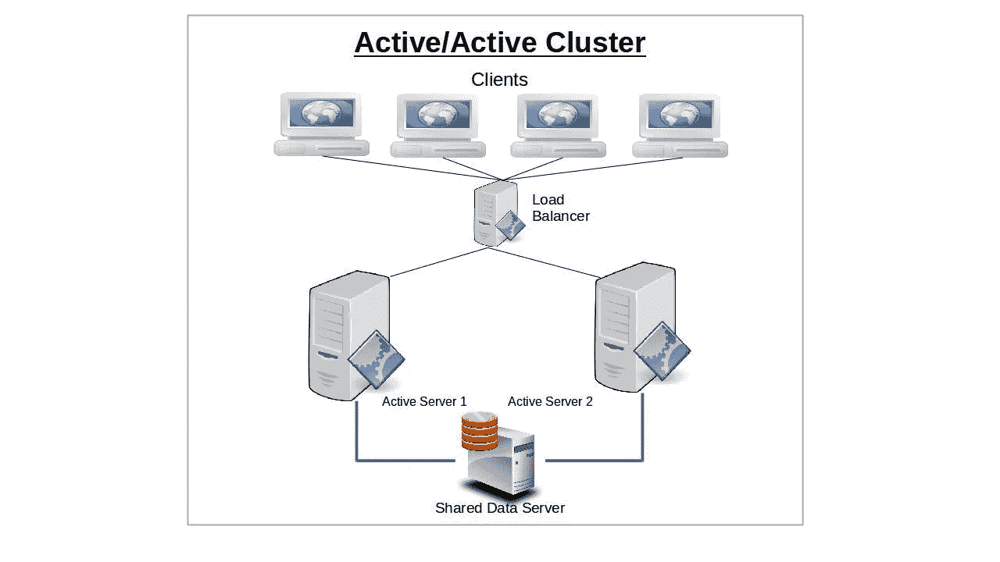
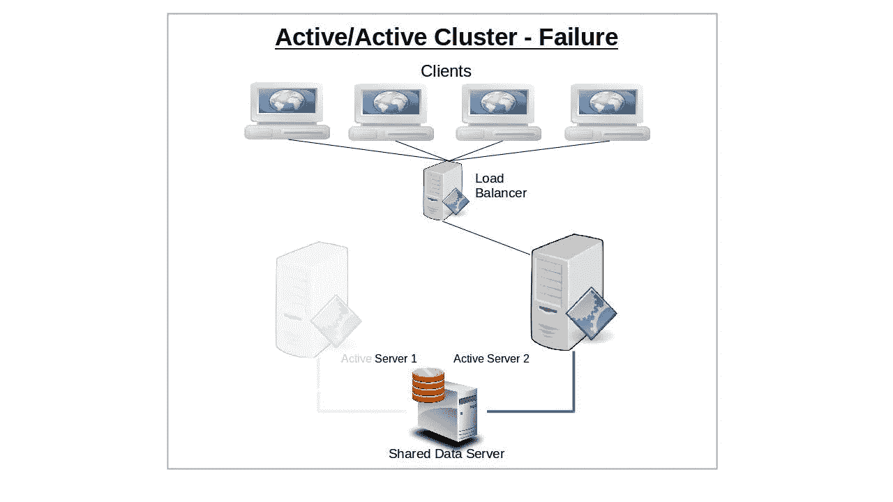
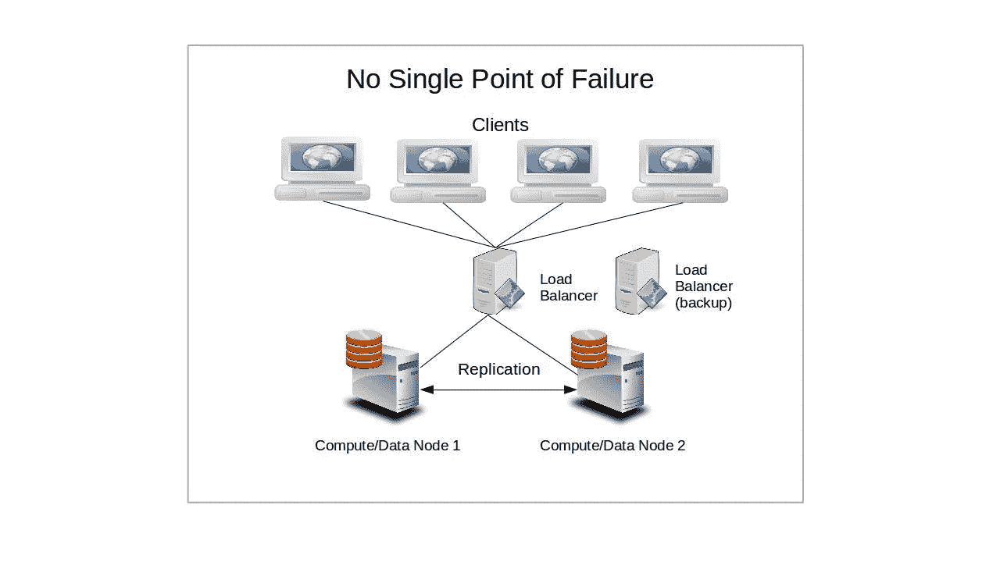

# 高可用性:概念和理论

> 原文：<https://medium.com/hackernoon/high-availability-concepts-and-theory-980c58cbf87b>

*本文改编自我的书第七章，* [*自学 Linux 虚拟化和高可用性:准备 LPIC-3 304 认证考试*](https://www.amazon.com/gp/product/B06XTZ4YWQ/ref=as_li_tl?ie=UTF8&camp=1789&creative=9325&creativeASIN=B06XTZ4YWQ&linkCode=as2&tag=projemun-20&linkId=fa7577d96ed91ffe111b08665bcb53f9) *。*

让我们更多地关注集群管理的一些更大的架构原则，而不是任何单一的技术解决方案。我们将在后面的书中看到一些实际的实现——你可以在我的来自 Manning 的书[在一个月的午餐中学习亚马逊网络服务](https://livebook.manning.com/#!/book/learn-amazon-web-services-in-a-month-of-lunches/chapter-14)中了解到很多关于这是如何在亚马逊的 AWS 上工作的。但是现在，让我们首先确定我们对基本的东西感到舒服。

使用物理或虚拟计算机集群运行服务器操作的目的是提高可靠性和性能，而不仅仅是提高单个高性能服务器的性能。您可以通过避免将整个基础架构置于单一故障点(即单一服务器)来增加可靠性。此外，您还可以通过纵向扩展和横向扩展来快速增加计算能力和容量，从而提高性能。

这可能通过以下方式实现:在不同的地理和需求环境中智能地分布您的工作负载(负载平衡)，提供能够在工作节点出现故障时快速投入使用的
备份服务器(故障切换)，优化您的数据层部署方式，或者通过松散耦合的架构实现容错。

我们会谈到这些的。不过，首先，这里有一些基本的定义:

**节点**:在自己的操作系统上独立运行服务器操作的单台机器(物理或虚拟)。由于任何单个节点都可能发生故障，因此满足可用性目标要求多个节点作为集群的一部分运行。

**集群**:两个或两个以上的服务器节点相互协调运行，作为更大服务的一部分完成单独的任务，其中相互感知允许一个或多个节点补偿另一个节点的损失。

**服务器故障**:服务器节点无法充分响应客户端请求。这可能是由于完全崩溃，连接问题，或者因为它已经被高需求所淹没。

**故障转移**:集群试图通过启动或重定向其他节点来填补服务空白，从而满足因单个服务器节点故障而成为孤儿的客户端的需求。

**故障回复**:当服务器节点从故障中恢复时，将责任恢复到服务器节点。

**复制**:创建关键数据存储的副本，以允许来自多个服务器节点或客户端的可靠同步访问，并确保它们能够经受住灾难。复制还用于实现可靠的负载平衡。

**冗余**:提供多个相同的物理或虚拟服务器节点，其中任何一个都可以采用另一个出现故障的孤立客户端。

**裂脑**:一种错误状态，在这种状态下，节点或共享存储之间的网络通信以某种方式中断，多个单独的节点(每个节点都认为自己是唯一仍然活跃的节点)继续访问和更新公共数据源。虽然这不会影响无共享设计，但会导致共享集群中的客户端错误和数据损坏。

**防护**:为了防止裂脑，stonithd 守护进程可以配置为自动关闭故障节点，或者在它和集群其余部分的数据资源之间设置虚拟防护。只要该节点仍有可能处于活动状态，但没有与群集的其余部分适当协调，它就会一直处于隔离状态。Stonith 代表“射另一个节点的头”。真的。

**Quorum** :您可以配置隔离(或强制关闭)来强制那些彼此失去联系或与某些共享资源失去联系的节点。仲裁通常被定义为整个集群中超过一半的节点。使用这样定义的配置，您可以避免两个子集群的节点，每个节点都认为另一个节点出现了故障，试图将另一个节点淘汰。

**灾难恢复** y:如果没有自动备份系统以及经过测试的集成灾难恢复计划，您的基础架构很难被视为高度可用。您的计划需要考虑到客户中每台服务器的重新部署。

## 主动/被动集群

服务故障转移背后的想法是，服务群集中任何一个节点的突然丢失都会被另一个节点迅速弥补。为此，在发生故障转移时，IP 地址会自动移动到备用节点。或者，可以使用负载平衡器等网络路由工具来重定向流量，使其远离故障节点。故障转移发生的确切方式取决于您配置节点的方式。

最初只有一个节点将被配置为服务于客户端，并且将继续单独这样做，直到它以某种方式出现故障。然后，现有客户端和新客户端的责任将转移(即“故障切换”)到被动(或备份)节点，该节点到目前为止一直处于被动备用状态。将该模型应用于多个服务器或服务器机房组件(如电源)，n+1 冗余提供的资源刚好满足当前需求，再加上一个单元来应对故障。


## 主动/主动群集

使用主动/主动设计的群集将有两个或更多配置相同的节点独立服务于客户端。



如果一个节点出现故障，其客户端将自动与第二个节点连接，并且在资源允许的情况下，获得完全的资源访问权限。



一旦第一个节点恢复或被替换，客户端将再次在两个服务器节点之间拆分。

运行主动/主动集群的主要优势在于能够在节点甚至网络之间高效地平衡工作负载。负载平衡器(将所有请求从客户端定向到可用的服务器)被配置为监控节点和网络活动，并使用某种预定算法将流量路由到最有能力处理流量的节点。路由策略可能遵循一种循环模式，在这种模式下，客户端请求只是在可用节点之间交替，或者按照预设的权重，一个节点以某种比率优先于另一个节点。

在主动/被动群集配置中，让一个被动节点充当其伙伴的备用替换节点，可以提供显著的内置冗余。如果您的操作绝对需要不间断的服务和无缝的故障转移，那么主动/被动体系结构的某种变体应该是您的目标。

## 无共享与共享磁盘集群

分布式计算的指导原则之一是避免您的操作依赖于任何单点故障。也就是说，每个资源要么是主动复制的(冗余)，要么是独立可替换的(故障转移)，并且不应该有任何一个元素的故障会导致整个服务瘫痪。

现在，假设您正在运行几十个节点，它们的功能都依赖于单个数据库服务器。尽管任意数量的节点的故障不会影响其余节点的持续健康，但是如果数据库停止运行，整个集群将变得无用。然而，无共享集群中的节点将(通常)维护它们自己的数据库，这样——假设它们被正确地同步和配置用于持续的事务安全——没有外部故障会影响它们。

这将对负载平衡的集群产生更大的影响，因为每个负载平衡的节点都有持续且关键的同时访问数据的需求。然而，简单故障转移系统上的被动节点可能能够在没有访问的情况下存活一段时间。



虽然这样的设置可能会降低集群响应某些请求的速度，部分原因是担心裂脑故障可能需要定期通过 stonith 进行隔离，但对于可靠性是首要考虑因素的关键任务部署来说，这种折衷是合理的。

## 有效性

在设计集群时，您需要很好地了解自己对失败的容忍度。或者，换句话说，考虑到消费你的服务的人或机器的需求，在暴徒拿着叉子和火把蜂拥进你的前门之前，服务中断能持续多久？了解这一点很重要，因为您在设计中构建的冗余量将对您最终面临的停机时间产生巨大影响。

很明显，你为一项服务建立的系统，可以在一个周末停机而没有人注意到，将与客户期望 24/7 访问的电子商务网站非常不同。至少，一般来说，您应该将可用性平均目标定在至少 99% —有些操作需要更高的实际结果。99%的正常运行时间意味着每年总共损失不到四天的时间。

有一个相对简单的公式可以用来建立可用性的有用估计(A)。其思想是用平均故障前时间除以平均故障前时间加上平均修复时间。

```
A = MTBF / (MTBF + MTTR)
```

A 的值越接近 1，集群的可用性就越高。为了获得 MTBF 的实际值，您可能需要花时间将一个真实的系统暴露在一些严重的惩罚之下，并仔细观察它的软件、硬件和网络故障。我想你也可以参考硬件供应商或 Backblaze 这样的大规模消费者发布的生命周期指标，以了解频繁使用的硬件预计可以持续多长时间。

MTTR 将是您的群集替换发生故障的服务器节点所需时间的产物(该过程类似于灾难恢复，但并不完全相同，其重点是快速替换发生故障的硬件和连接)。理想情况下，这将是一个尽可能接近零秒的值。


Server Availability

问题是，在现实世界中，这个公式通常有太多的未知变量，无法真正准确，因为运行不同软件配置和使用不同配置和年龄的硬件构建的节点将具有广泛的预期寿命。尽管如此，它还是一个很好的工具，可以帮助您确定最适合您的项目的集群设计。

有了这些信息，您可以很容易地估算出您的服务在一整年中可能会出现的总停机时间。

如果您在第三方平台提供商(如 VMWare 或 Amazon Web Services)上部署资源，一个相关的考虑因素是提供商的服务级别协议(SLA)。例如，亚马逊的 EC2 保证他们的计算实例和块存储存储设备每月至少有 99.95%的正常运行时间，这比每年停机时间少 5 个小时。AWS 将为未能实现目标的月份发放积分，尽管这远远不足以补偿停机的总业务成本。有了这些信息，您可以安排适合您独特需求的服务冗余级别。

自然，作为您自己客户的服务提供商，您可能需要根据您的 MTBF 和 MTTR 估计发布您自己的 SLA。

## 会话处理

对于任何服务器-客户端关系，由有状态 HTTP 会话生成的数据都需要以某种方式保存，以供将来的交互使用。集群架构会给这些关系带来严重的复杂性，因为客户端或用户与之交互的特定服务器可能会在不同的步骤之间发生变化。

举例来说，想象你登录到 Amazon.com，浏览他们关于 LPIC 培训的书籍，并定期向你的购物车添加一个项目(希望这本书有更多的副本)。然而，当你准备好输入支付信息并结账时，你用来浏览的服务器可能已经不存在了。您当前的服务器如何知道您决定购买哪些书籍？

我不知道亚马逊到底是如何处理这个问题的(但你可能会从我的《在一个月的午餐中学习 AWS》一书中得到一些提示)，但这个问题通常是通过一个数据复制工具来解决的，比如运行在一个
外部节点(或多个节点)上的 memcached。目标是为任何可能需要数据源的节点提供对可靠且一致的数据源的持续访问。

*本文改编自《* [*自学 Linux 虚拟化与高可用性:备考 LPIC-3 304 认证考试*](https://www.amazon.com/gp/product/B06XTZ4YWQ/ref=as_li_tl?ie=UTF8&camp=1789&creative=9325&creativeASIN=B06XTZ4YWQ&linkCode=as2&tag=projemun-20&linkId=fa7577d96ed91ffe111b08665bcb53f9) *》。查看我的* [*其他关于 AWS 和 Linux 管理的书籍*](https://bootstrap-it.com/) *，包括*[*Linux in Action*](https://www.manning.com/books/linux-in-action?a_aid=bootstrap-it&a_bid=4ca15fc9)*和*[*Linux in Motion*](https://www.manning.com/livevideo/linux-in-motion?a_aid=bootstrap-it&a_bid=0c56986f&chan=motion1)*——一个混合课程，由两个多小时的视频和大约 40%的 Linux in Action 文本组成。*