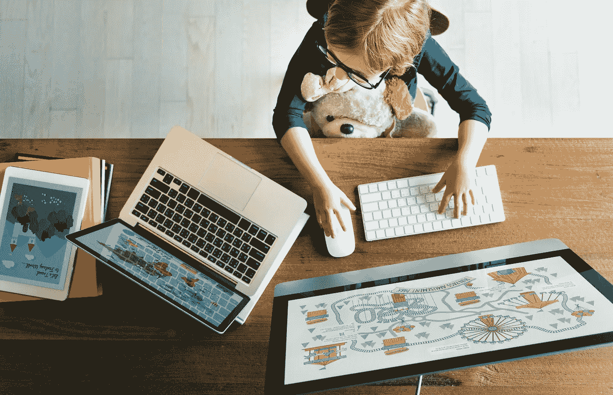

# 握住他们的手:我们从医学试验中了解到的儿童游戏化

> 原文：<https://medium.com/hackernoon/holding-their-hand-what-we-learned-about-gamifying-for-children-in-medical-trials-20ac65a8ff2f>

> DataArt 的业务分析师和可用性专家 Olga Azimbaeva 说:“为了真正有效，今天的软件开发公司需要在采用新技术之前了解客户的业务需求和行业特定问题。

作为一家全球性公司， [DataArt](https://www.dataart.com/) 在其研发中心仔细跟踪行业发展，这是我们医疗保健和生命科学实践的重要组成部分。研发中心为行业中有前途的新领域产生想法，并在概念层面发展这些想法。几年前， [Daniel Piekarz](https://www.linkedin.com/in/piekarz/) (医疗保健&生命科学副总裁)与一位客户合作，该客户用于监控临床试验结果的电子系统无效。该系统旨在收集临床试验期间的数据——例如，对给药的反应，感觉到的副作用，患者如何评估治疗的有效性等。当时，ePRO(电子患者报告结果)系统包括数字化问卷和其他文件，供受试者在试验期间填写。由于可用性差，该系统很难使用，尤其是对于儿童和青少年。

鉴于人们对组织临床试验和提高所获数据的数量和质量的广泛兴趣，R&D 中心决定创建一个概念应用程序，以满足儿童特定的临床试验需求。

最初，我们的想法是使用游戏化元素来吸引注意力，并激励儿童使用该解决方案。我们使用了一个类似于曾经流行的电子鸡的概念，孩子们被要求照顾一个虚拟宠物。

## 边发展边学习

在分析目标受众时，我们得出结论，电子鸡的概念不适合我们的情况。如果没有得到适当的照顾，虚拟宠物可能会死亡，因为我们的目标受众是患有慢性疾病的儿童(患有糖尿病、哮喘、癌症)，他们有压力和抑郁，我们认为积极的强化会产生更好的结果。创造了几个角色概念，在收集了孩子们的反馈后，选择了一只松鼠。

在我们的应用程序中，孩子和松鼠被放在一起处理:当孩子感到不适时，松鼠会服药并变得悲伤。换句话说，我们建立了一种移情联系:孩子不需要感到孤独，因为他或她有一个虚拟的朋友，他或她总是在附近。此外，孩子会因为按时完成吃药等任务而获得奖励星星，这些星星可以在以后用来给他们的角色穿上不同的服装或购买新玩具，让虚拟朋友开心。

起初，该应用程序计划用于住院临床试验，但后来我们意识到，它也可以在家里使用，用于糖尿病或癌症等需要持续监测的疾病。我们创建了另一个应用程序，这一次是针对父母的——Care Companion——它考虑到了这样一个事实，即在家的儿童(没有医务人员的监督)可能无法正确遵守处方，需要成人的监督才能进行安全有效的治疗。Care Companion 允许成人使用服药的频率和剂量来配置应用程序的儿童部分，完成日记，并回答有关儿童健康的问题。为了收集反馈，护理伴侣会分析从儿童应用程序中获得的所有数据，并以清晰的图形显示出来。此外，儿童医生的独立界面提供了对儿童应用程序中所有数据的访问，并设置了每日日程。

## 进一步的发现

我们的团队意识到，药物治疗不依从的因素之一是害怕副作用，并相信在症状消失后可以停止治疗。有鉴于此，应用程序中增加了一个教育部分，在这个部分中，孩子和父母都可以了解更多关于疾病、副作用和建议的信息。增加了另一个部分，用于联系有问题的医生。

我们相信，当一个系统满足目标受众的需求时，它就能很好地工作，所以我们试图专注于一种特定的慢性疾病——糖尿病。

为此，我们添加了食物跟踪功能(卡路里/碳水化合物)和扫描血糖仪的功能，以便应用程序可以识别设备屏幕上的数字并显示血糖水平。

两年前，该应用在 [InnovateNYP 活动:儿科应用挑战赛](https://devpost.com/software/nyp-care-companion)中获得第三名。从那时起，我们进一步发展了这个想法，增加了护理伴侣，并赢得了【2017 年辉瑞医疗挑战。

该团队还受邀在著名的[前沿健康大会](https://www.frontiershealth.co/)上发言，向与会者展示我们的成果，包括制药行业的初创企业和领导者。

## 面向未来的建筑

[KidPRO](http://orange.dataart.com/projects/kidpro/) 团队已经为这个应用程序计划了一些额外的改进。这些包括额外的定制。虽然当前的应用围绕糖尿病，但它可以帮助任何临床状态。然而，为了让它对不同类别的年轻患者(不同年龄组，如青少年)更具吸引力，我们将彻底修改应用程序的用户界面。

还会加入新的游戏化元素。我们将引入新的角色和奖励类型，定制环境(如“房间”)，嵌入小游戏和其他方式来更好地吸引孩子。FHIR 集成将得到改善，这意味着该应用程序将获取更多关于治疗计划和处方的细节，以便医生可以使用这些信息为患者准备个人每日计划，以提供更好的结果。

该应用程序的分析功能可以分析治疗过程和参与情况(例如，儿童观看某个视频的次数)，并相应地建议个性化的行动。例如，如果孩子没有正确遵循饮食，他或她可以被提示观看关于饮食重要性的视频。通知也将被开发。如果孩子错过了某些程序或常规步骤，家长将会得到通知。重要事件，如医生检查，可以直接安排在父母的设备日历。最后，将添加住院和门诊模式，这样当患者去医院时，应用程序将提供额外的信息和说明。

【medtechengine.com】最初发表于**。**