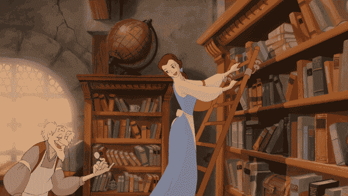
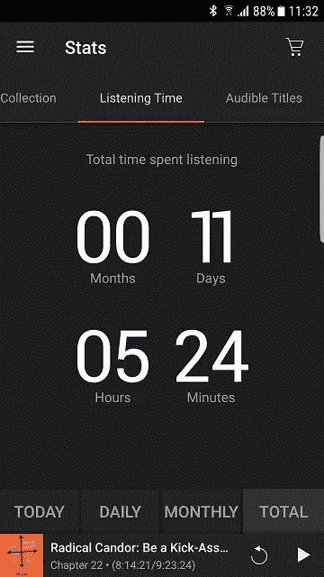
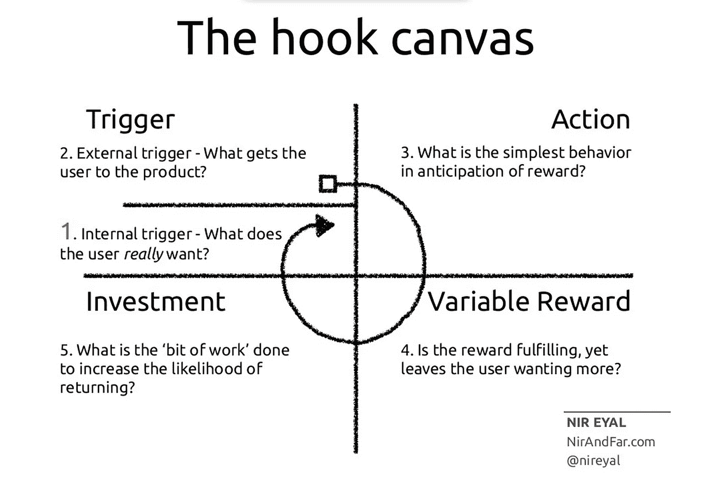

# 迷上了 Audible，涉足 Goodreads，希望有一个独特的图书馆和一个滑梯

> 原文：<https://medium.com/hackernoon/hooked-on-audible-dabbling-in-goodreads-wishing-for-a-unique-library-and-a-sliding-ladder-2e3ecd6ee40a>

## 百丽产品拆卸#1

Belle sliding the library ladder — Disney’s Beauty and the Beast

我是一个超级歌迷。我把这大部分归功于这样一个事实:它扩展了我们阅读和学习新东西的时间——当我们堵在路上、在有氧跑步机上或洗碗时。过去令人厌烦的事情现在可以愉快地忍受，作为多学一件事的时间，为多一个想法埋下种子。这都是双赢，你把无聊的事情做完，同时用新的概念充实自己。

**毫无疑问，在我的第一次产品拆解中，我选择了它，目的是近距离观察一些我觉得有趣的产品。**学习对我来说至关重要，很难想象还有其他产品能以如此令人愉快的方式实现这一目标。

你可以想到 MOOCs(大规模在线开放课程)，或者 Kindle 甚至是普通的旧书，但有声书提供的便利是这些都难以实现的。MOOCs 通常要求你看着老师，kindle 和纸质书要求你用手翻动或点击页面。你可能会认为 MOOCs 在其他方面更好，比如整合练习和所传递知识的深度，或者书籍迫使你每次只做一件事，增加注意力和吸收力。这可能是对的。但是就方便性而言，很难胜过有声读物。

## **上钩**

在我写作的时候，我的在线有声图书馆里有大约 40 本书，除了 3 到 4 本，我都已经读完了，而且我已经获得了几乎所有的徽章，除了“书库”、“瞭望塔”、“重复收听者”和“涉猎者”(这是因为用户在图书馆里有很多书，但完成率较低——例如，令人印象深刻的 1000 本书，但还没有完成书[😉](https://emojipedia.org/winking-face/))， 还有 233 个小时的听力时间才能达到大师水平(读者等级中的最高等级——我知道还有很长的路要走)😀)。 综合来看，在不间断阅读方面，我用 Audible 读了 11 天 05 小时 24 分钟。Uff！。

Audible badges

Total listening time on Audible

**就** [**Nir Eyal**](https://medium.com/u/295258f6269d?source=post_page-----2e3ecd6ee40a--------------------------------) **的框架而言，我认为我的热情程度意味着我迷上了这个产品** [😵](https://emojipedia.org/dizzy-face/)

1.  我有一个内在的触发因素:我想不断学习新的话题(非小说)，或者体验奇妙的故事(小说)
2.  外部触发因素是无聊的情况或允许大脑自由思考其他事情的情况，比如堵车或骑自行车
3.  我必须做的投资是回顾这本书，这在最基本的层面上意味着滑动屏幕以将其归属于某个开始次数，或者从商店选择一本新的[书](https://hackernoon.com/tagged/book)，我可以点击一下就购买
4.  我得到的回报是看到这本书被标记为已完成，并能够与我的朋友分享这一成就

在我的投资组合中，我认为唯一一个必须使用的、并承诺每月付费的应用是 Spotify。事实上，它们都与我有些关系，因为它们都是流式音频内容，有时我会交替使用它们。当我骑自行车时，我经常在继续阅读有声读物和收听为我推荐的每周播放列表之间切换——令人讨厌的是滑动手机屏幕来寻找一个或另一个应用程序启动器。

到目前为止我对 Audible 的体验还是比较满意的。我主要用这个应用来听书，这个应用相当干净，把你最新的书放在你的眼前，作为你打开它时看到的第一件事。我认为列出其他书籍也是很好的，因为它们给你一种背景感，给你某种动力去读完另一本书。在这个屏幕上，你还可以使用播放和倒带，这是任何音频播放器都有的最重要的命令，主要是在你玩书的时候，仅此而已。当您选择某本书时，该屏幕还会以更大的格式显示这些命令。当我开车的时候，有时外界的噪音让我无法仔细听，我不得不倒带。或者有时叙述者语调的变化使得一些句子在某个特定的时刻不那么清晰。我刚刚又回到了 30 分钟前。

## **被钩住+**

正如你所看到的，我对现状相当满意，在我目前对 Audible 的体验中，我没有看到太多的主要干扰。只有当放大时，我才能想到能把我的热情推向另一个层次的东西。

我希望有一种更快的方式来初始化应用程序，因为当我开车时，在手机上滑动屏幕是非常不舒服甚至是危险的(顺便说一下，这是在一个窗口支持物中)。我确信，在语音激活的汽车中，这不再是一个问题，因为在家里通过询问亚马逊的 Alexa，我可以只通过语音命令开始阅读，但在我的情况下，这仍然令人不快。

我也希望我能有一种更简单的方法来捕捉、存储和分享文本片段，因为当前的功能使它们消失在某个地方，只有我花多一点时间去寻找它，我才会知道——尽管大多数时候我满足于只是听内容，而在听的时候没有进一步的行动(也因为很多时候我在做其他事情)。

尽管如此，我还是要说，有一件事，如果得到改进，最有可能对用户满意度产生积极影响。我在 kindle、audible 和纸质上阅读，事实证明，拥有一个跟踪所有这些内容的图书馆非常麻烦。虽然 kindle 与[**Goodreads**](https://www.goodreads.com/)**集成在一起，但 audible 没有，所以如果我想保持我的图书馆更新，我必须去 Goodreads 并手动添加图书。更不用说我所阅读的纸质书了，它们并没有与任何东西融为一体。我不知道这些实体之间发生了什么，因为它们应该是一体的。从消费者的角度来看，这是一个痛点，因为当这个过程的所有其他部分都是虚拟和数字的时候，我不想重复手动添加产品到网站上。**

即使是纸质书——如果它们是通过亚马逊获得的——也应该有办法无缝地将它们放在一个独特的图书馆，而不是两三个。

我不是特别喜欢 Audible 网站，因为我认为图书馆的展示很差，即没有像 Goodreads 中的图书馆展示那样利用书籍封面上的精美图形。亚马逊“图书馆”更糟糕，因为它被埋在“管理您的内容和设备”下，我花了至少 5 分钟才找到它(还必须注销英国帐户并登录到)。我订购 kindle 的 com 帐户)。就目前的情况而言，我会很高兴在 Goodreads 拥有我的(独特的和集成的)图书馆，顺便说一下，这个用户主页越来越像 facebook 的时间轴(只有我注意到了吗？).

## **假设**

我的假设是，内容质量(包括叙述)和社交是有声产品的两个最重要的元素，虽然在非虚构的情况下，它们似乎可以通过让越来越多的原创内容由作者自己多次叙述或在虚构的情况下由知名作者多次叙述来实现第一个元素，但第二个元素仍有待解决，特别是在考虑到缺乏与 Goodreads 等其他平台的集成时。但我必须说，在这方面，audible 应用程序的体验与 audible 网站上的体验截然不同，一些元素，如游戏化徽章，可以转移到任何最终成为流行的社交[网络](https://hackernoon.com/tagged/network)上，用于分享书籍信息。除了我今年为 yuh-hu 完成的 Goodreads 挑战，这个平台上还没有太多游戏化的元素。

一位研究生院的同事甚至发起了一项挑战(在 goodreads 挑战中),来记录人们是如何实现 goodreads 目标的。如果 goodreads 中所有的游戏化潜力都被释放出来，这将更容易实现。

## **未来与滑库阶梯**

我喜欢看到书迷空间正在发生的进步，似乎书籍正在媒体舞台上重获一席之地。毫无疑问，我倾向于每天看更多的书而不是电视。当人们越来越多地接触到生活在其他大陆和地方的人们的鼓舞人心的思想时，这总是好的。

我即将读完(听完)金·斯科特(Kim Scott)自己讲述的激进坦率，我觉得自己对硅谷的科技公司如何运营(预期行为等)有了更好的见解。)比以前。当你的洞察力在一本书(而不是一千英里)之外时，这是非常强大的。

当浏览这些洞见像在奇妙的图书馆阶梯上滑行一样容易和愉快时，它将变得更加强大。现在的问题是谁将提供图书馆，制作梯子，并帮助 Belle 传播她正在阅读的内容。你好！[🎵](https://emojipedia.org/musical-note/)