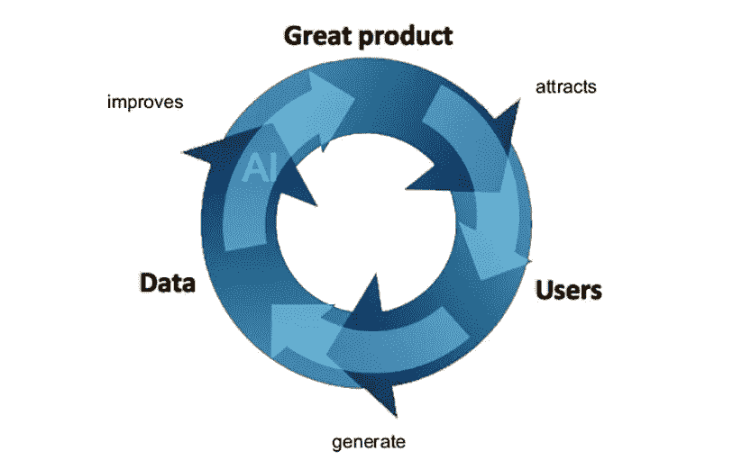
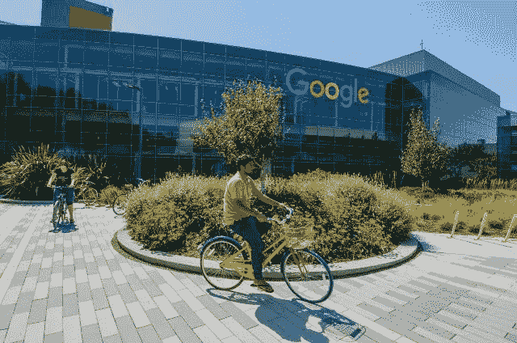

# 人工智能初创公司必须如何与谷歌竞争:回复费

> 原文：<https://medium.com/hackernoon/how-ai-startups-must-compete-with-google-reply-to-fei-fei-li-35dda19c8a3f>

谷歌是人工智能领域的巨头。每天，他们在人工智能方面的成就都会成为新闻。因此，人工智能初创公司可能会感觉被这个超级竞争对手遮蔽了，他们的视野可能会很模糊。

幸运的是，要在这些浑水中航行，他们可以依靠费-李非博士，斯坦福大学人工智能实验室(SAIL)主任。她也是计算机视觉的神经网络的在线课程[的老师。最近，她成为了](http://cs231n.stanford.edu/)[谷歌云](https://medium.com/u/4f3f4ee0f977?source=post_page-----35dda19c8a3f--------------------------------)的人工智能&机器学习的首席科学家，但由于[谷歌并不邪恶](https://en.wikipedia.org/wiki/Don%27t_be_evil)，她仍然仁慈地提供了如何与新雇主竞争的专家建议。

在 [Startup Grind 全球大会(由谷歌赞助)](https://www.startupgrind.com/blog/cloud-will-democratize-ai/)上，她宣称:

记者:“小公司如何与大公司竞争？”

*费-李非:“一部分原因是拥有标记数据的大公司有优势，但它们不会深入垂直市场。如果你是一家初创公司，你必须有创造力。*

*你如何将数据滚雪球？所以设计滚雪球式的数据。重要的是，对你正在为顾客解决的问题要有同理心的理解。”*

(…)

记者:“你为什么加入谷歌？”

费(笑):“我想让人工智能民主化。”

# 是的，人工智能初创公司必须专注于他们的客户

费-李非的建议是正确的:人工智能初创公司必须专注于解决客户的问题。这需要同理心和领域专业知识，知道如何训练机器学习模型是不够的。每个垂直行业，如制造业、医疗保健业或零售业，都需要特定的方法和技能。

人工智能创业公司应该以鼓励用户输入数据的方式设计他们的产品。通过这样做，创业公司可以推动人工智能的良性循环:收集更多数据，建立更好的模型和产品，吸引更多用户，等等。设计这种滚雪球式的数据是必不可少的。

The virtuous circle of AI

每个特定行业的人工智能市场规模相对较小，因此对于谷歌这样的科技巨头来说，深入这样的市场并不有趣。他们更喜欢建立“横向”人工智能、通用模型和云基础设施，这些都被各个垂直领域的初创公司所使用。在这种背景下，AI 创业公司需要的 AI 专业知识和数据存储能力更少，因为它们可以在谷歌云上找到。这就是人工智能民主化的方式，费-李非说。

# 人工智能“民主化”是谷歌统治的面具

有了这个观点，创业公司尊重大玩家在大的‘横向’人工智能市场中的霸权。在这种人工智能民主中，初创公司——公民们安静地呆在他们指定的垂直领域内，服从由谷歌云总裁从上面强加的纪律。

在这里，民主再次被用作帝国主义的修辞面具。费-李非关于民主化人工智能的慈善演讲让人想起 2003 年美国总统乔治·w·布什关于“民主化”伊拉克的演讲，当时他入侵了伊拉克并接管了石油。[数据是新的石油](http://fortune.com/2016/07/11/data-oil-brainstorm-tech/)，谷歌云是人工智能的丛林。

American soldier guarding an oil field as a way to ‘democratize’ Iraq. Likewise, Google Cloud guards data as a way to ‘democratize’ AI.

然而，事情不应该按计划进行。正如布什在伊拉克，谷歌云应该会遇到激烈的地面阻力。他们前面有一个泥潭。更准确地说，费-李非应该看看美国哲学家托马斯·库恩的《[科学革命的结构](https://en.wikipedia.org/wiki/The_Structure_of_Scientific_Revolutions)》。在这本书里，她将被提醒，科学受到频繁的和破坏性的[范式转变](https://en.wikipedia.org/wiki/Paradigm_shift)，这影响了它的进化。所以，谷歌在 AI 上的总统宝座，可以被下一次科学革命推翻。谷歌云可以被下一场沙漠风暴席卷。让我们看看怎么做。

# 下一代人工智能将不再那么需要谷歌数据

谷歌拥有大量专有数据，但从长远来看，这些数据可能并不重要。当前的人工智能技术基于监督学习:为了学习所需的行为，必须向人工智能展示大量类似的实例。更先进的人工智能需要的训练数据要少得多。毕竟，为了学会识别汽车，婴儿不需要成千上万地看到它们。婴儿不需要谷歌数据来变得聪明，高级人工智能也不应该。

例如，[生成模型](https://blog.openai.com/generative-models/)是迈向下一个人工智能的有希望的一步。在显示了某个领域的大量数据(例如，数百万的图像、句子或声音等)之后。)生成模型可以产生更多类似的数据。因此，基于监督学习，生成模型可以产生合成数据来训练第二模型。如果创业公司可以依赖这种免费的合成数据，他们就不需要谷歌云了。

[Synthetic birds](https://arxiv.org/pdf/1612.03242v1.pdf)

这就是为什么生成模型是人工智能创业社区的战略研究方向。我们正在调查 [Startcrowd](http://www.startcrowd.club) 开放平台上的生殖模型，欢迎所有人加入这项工作。

# 谷歌正在努力整合基础研究

谷歌的大部分研究文化不适合颠覆性科学。谷歌有一个“[混合研究方法](http://norvig.com/cacm-hybrid.html)”:研究是以产品为导向的，它通过对现有解决方案的渐进式改变来进行。谷歌仍然可以有长期的研究目标，但这样大的目标必须“分解”成一系列短期目标，每个目标都需要影响谷歌的产品。

这种研究文化对一些人才没有吸引力。例如，许多人工智能学者，如 Yoshua Bengio 或 Jürgen Schmidhuber 不想加入科技巨头:他们更喜欢保持独立的研究议程，没有影响公司产品的压力。

此外，谷歌的科学政策容易受到范式转变的影响。很多重大的技术进步都来自于外围的话题，之前影响不大，突然走向中心舞台。

一个这样的例子是人工智能和神经网络的迅速崛起。几年之内，这种学术好奇心成为了新工业革命的支柱。主流技术专家没有看到人工智能的到来，谷歌创始人谢尔盖·布林也不例外。

谷歌知道他们短期研究方法的局限性。这就是他们为长期项目建立独立部门的原因。在人工智能方面，他们的主要产品是总部位于伦敦的 DeepMind。然而，这一政策的问题是，想法没有在 DeepMind 和谷歌的其他部分之间充分流通。DeepMind 仍然与谷歌母舰绝缘。有多少谷歌员工真的在关注 DeepMind 研究？我想不会太多，调查一下谷歌员工会很有意思。

为了弥补谷歌内部知识转移的不足，DeepMind 在加州谷歌总部成立了一个专门的团队，未来将会证明这是否有效。

# 人工智能创业公司可以更好地结合基础和应用研究

最大胆的创业公司可以从这种情况中找到灵感。他们可以将部分资源用于基础研究。这种津贴可以吸引合适的人才，并保持团队的积极性。创业公司可以超越通常允许谷歌员工参与的 20%的项目，建立 50%基础研究项目的政策。

Google has 20% projects, AI startups should raise to 50%

当基础研究和应用研究由具有双重专长的同一批人进行时，两者之间的带宽会增加，这有助于激发不太可能但影响深远的突破。这让谷歌的“混合研究方法”更进了一步:现在没有影响公司产品的压力了。

这种科学政策更容易在一个层级结构扁平的小型初创企业中实施。为了爬上像谷歌这样的大组织的公司阶梯，在人迹罕至的地方进行研究是一个糟糕的策略。另一方面，在创业公司里，没有梯子可以爬，也更没有因循守旧的动机。一些保守的风险投资家可能不喜欢这种研究方法，但对于大胆的创业者来说，这肯定会有很多乐趣，他们甚至可能改变世界。

# 人工智能创业公司可以使用云来颠覆谷歌

最后，人工智能初创公司可以利用云在谷歌内部“民主化”人工智能。人工智能可以反过来“民主地”传播。例如，通过在公开场合进行 R&D，人工智能初创公司可以用他们的人工智能挑战吸引好奇的谷歌员工，并分散他们对日常工作的注意力。例如，像 OpenAI 一样，他们可以提出自己的“[研究请求](https://openai.com/requests-for-research/)”。他们甚至可以更进一步，使用专用的云平台: [Startcrowd](http://www.startcrowd.club) 。

有了 Startcrowd，谷歌员工只需点击[一下鼠标，就能体验激动人心的人工智能创业冒险。他们可以开始令人敬畏的人工智能副业，同时舒适地呆在谷歌总部的墙内，每月从谷歌领取薪水。在 Startcrowd 上，谷歌员工可以享受无摩擦的创业体验，直到他们决定全职从事他们的人工智能项目。](https://startcrowd.club)

如果愤怒的经理发现了怎么办？没问题，他们不会的。参与可以是匿名的，为了更多的自由裁量权，用户界面将很快定制，为了伪装的目的。忘掉脸书和 YouTube 吧:Startcrowd 是聪明拖延症的去处。人生苦短。是时候释放你的创造力了。解决你喜欢的问题。

The Googleplex. a good place for [startcrowdination](http://www.startcrowd.club).

谷歌云和创业人群之间的战斗将是史诗般的。他们可以用他们的钱和数据收购我们，但我们可以用我们的副业渗透他们。

谷歌员工可以在人工智能的 [*上开始他们的兼职项目*](https://startcrowd.club)

> [黑客中午](http://bit.ly/Hackernoon)是黑客如何开始他们的下午。我们是 [@AMI](http://bit.ly/atAMIatAMI) 家庭的一员。我们现在[接受投稿](http://bit.ly/hackernoonsubmission)并乐意[讨论广告&赞助](mailto:partners@amipublications.com)机会。
> 
> 如果你喜欢这个故事，我们推荐你阅读我们的[最新科技故事](http://bit.ly/hackernoonlatestt)和[趋势科技故事](https://hackernoon.com/trending)。直到下一次，不要把世界的现实想当然！

