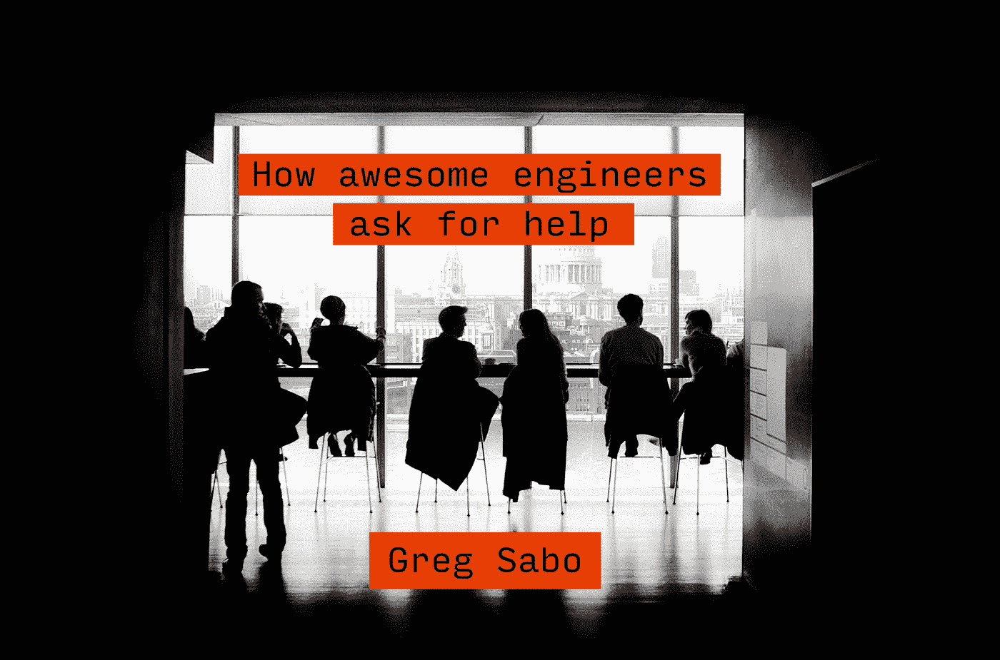

# 牛逼工程师如何求助

> 原文：<https://medium.com/hackernoon/how-awesome-engineers-ask-for-help-93bcb2c7dbb7>

## **协作技术**



Asking for help can be hard, but it’s a great chance to practice collaborative problem-solving. Photo by [Samuel Zeller](https://unsplash.com/photos/_es6l-aPDA0?utm_source=unsplash&utm_medium=referral&utm_content=creditCopyText).

您重启您的开发服务器，但是它再次发生: *err_node_unsafe* 。这昨天不在这里。什么变了？

现在是早上 9:48，你的咖啡已经凉了。你团队中的大多数其他人还没有到办公室。这是你在公司的第五周，你的特写应该在两天前就完成了。

你抬高椅子的高度，好像这样会让你对正在发生的事情有不同的看法。你再次重启，堆栈跟踪再次滑入你的终端: *err_node_unsafe* 。你擦你的开发数据库: *err_node_unsafe。来吧来吧！*

另一个小组的技术负责人坐在房间另一边她的办公桌前。她的耳机戴着。她已经进入状态了。她能解决这个问题吗？她会怎么说？她知道发生了什么吗？她能帮忙吗？

你静静地凝视着，屏幕的侧面不知不觉地向你移动了一英寸。一个咖啡圈出现在你的笔记本上。你保持沉默。然后，你重新启动。也许这一次，错误就不会发生了。

寻求帮助是困难的，拖延保护我们免受其害。这就是为什么你必须完善你的求助能力。作为一名工程师，这是提高工作效率的关键。

# 1.阐明对你的期望。

不要在不明确的预期下工作。结果只能是暧昧和内疚。以下面的例子为例:

*   走出家门去工作。
*   走出家门，去健身房。

这两件事哪一件更容易做？早上去上班并不是世界上最容易的事情，但这比去健身房容易多了。我知道如果我翘班，会有几个人注意到。没有人期望我去健身房。缺乏期望意味着我没有动力去做这件事。

当你的期望不明确时，你会拖延，找借口，改变主意几次，完成工作会很困难。

在工作中获得帮助也是一样的。如果你觉得没人期待你寻求帮助，你将会花很多时间说服自己去做。

## 问问你的经理，当你陷入困境时，他们希望你做什么。

这将改变你在工作中寻求帮助的方式。问问你的经理，当你陷入困境时，你应该怎么做。在那次谈话之后，你会开始认为畅通无阻是你工作的一部分，而不是你工作的失败。

讨论如何获得帮助使你陷入困境的过程正常化。它让你准备好直面挑战。

当你提出这个话题时，你担心你的经理会怎么想吗？一定要通过重申共同点来开始对话。重申你的主要目标是成为一个自主的、富有成效的团队贡献者。然后讨论一个高效的工程师在遇到困难时会怎么做。

## 定义你寻求帮助的个人程序。

描述一下当你陷入困境时你所经历的步骤。包括任何可能在没有帮助的情况下解除阻止的内容。流程的最后一步是请求与他人合作。

当需要帮助的时候，不要犹豫。尽可能清晰客观地做出寻求帮助的决定。你越能消除决策中的主观判断，就越好。

这里有一个您可以使用的清单示例:

```
- Did I restart my development environment?
- Did I write down the problem?
- Did I Google it?
- Did I run that build-cleaning command that sometimes works?
- Did I search our internal docs for it?
- Did I read some of the related source code for 20 minutes?
- If so, ask a teammate for help immediately.
```

与你的经理和队友分享这份清单。这是为自己设定清晰预期的一种强有力的方式。当你更多地了解如何在团队中工作时，记得修改和更新这个列表。

# 2.当你要求时，承担全部责任。

许多工程师认为寻求帮助是他们工作的失败。对他们来说，寻求帮助就是放弃。当他们寻求帮助时，他们只对获得畅通感兴趣，这样他们就可以继续他们在 T2 真正的工作。这就是为什么他们会问这样一个问题:

“我的 git 分支真的乱了。能修好吗？”

然后他们可能会坐在一边，而另一个工程师拿着键盘为他们解决问题。当他们看着别人工作时，他们的目光变得呆滞。他们对这个问题如此焦虑，以至于完全放弃了。

## **明确表示你不会放弃。**

避免使用诸如“我需要帮助”或“我不能让它工作”这样的短语。这两者都暗示你已经完成了工作，现在你正试图把责任推卸给别人。相反，描述你正在进行的工作。例如:“我正在开发服务器上调查这个奇怪的错误。”

接下来，暗示一些你已经做过的工作。“我已经检查了 Slack 中的错误，并搜索了源代码，到目前为止还没有发现任何错误。”

最后，描述他们如何参与你的下一步。“我要看看这份文件，了解这是怎么回事。如果你有一分钟的时间和我配对，这将是有帮助的。”你正在创造一列生产力列车，不管他们是否决定上车，它都会起飞。

给谈话带来活力和焦点有助于每个人都有更好的体验。如果你的队友能看到你没有被检查，他们会更加热情地帮助你。

## 积极参与帮助过程。

一旦你开始和某人一起工作，不要走开，让他们自己工作。努力建立自己的心智模型副本。问“为什么”的问题，比如“为什么一个节点可能不安全？”以及“你为什么要看这个文件？”

在这个过程中做简短的笔记。这些以后可能对你有用。他们也会对你的同事表现出欣赏和尊重。主动学习远比被动学习有效，所以尽可能通过说和写来参与。

编程需要很多能量。如果你感觉到你在萎靡不振，那么不要害怕说你要自己解决这个问题一段时间。具体说明你将如何探索这个问题，这样他们就可以放心地让你去做。这将使你不至于走神。

# 3.得到答案后，再跟进。

停滞几个小时后，项目取得进展的感觉*太棒了。错误消失了，你准备好起飞了。我的意思是，有效率才是最重要的，对吧？*

然后，三天后，事情发生了。我们都做过。“嘿，马克——我应该运行什么命令来再次修复这个问题？”如果马克认为他的帮助是左耳进右耳出，我不会责怪他。

获得帮助需要所有相关方投入大量时间。确保投资不被浪费是件好事。在你得到帮助后，要注意你的行为*。*

## 巩固你所学的。

这是至关重要的:每次你和某人一起工作时，写下你学到的东西。写作是一个烤箱，像砖头一样硬化你头脑中的想法。

尽可能无摩擦地捕捉笔记。我发现即使是选择一个文件名也太麻烦了，所以我使用颤来跟踪我的笔记。我的笔记没有组织方案，日常对我还是有用的。

如果你把你的问题发布在公司的 Slack 频道上，跟进你的解决方案。这就形成了一个对你和他人都有用的知识库。这也为你创造了一种更强烈的成就感，从而鼓励你在[未来](https://hackernoon.com/tagged/future)再次寻求帮助。

间隔重复是记忆信息最有效的方法之一。Anki 是管理间隔重复的强大工具。给自己发一封飞来横祸的电子邮件或延迟的体式任务是一种更简单的提神方式。

## 表示欣赏，而不仅仅是感激。

如果你让人们觉得帮助你很棒，那么他们会做得更多。有人帮助你后，你可能已经说过“谢谢”了。那是表示感激。欣赏和感激是不同的。当你欣赏某人时，他们会觉得自己很特别，很独特。

以下是实现这一点的一些方法:

*   在你的团队 Slack 频道中:“向爱丽丝大喊，感谢她帮我找出了那个奇怪的 bug！”
*   在站立时:“昨天我被挡住了一会儿，但爱丽丝帮我弄明白了，因为她知道很多关于我们的控制器是如何工作的。”
*   写一封简短的电子邮件:“再次感谢你今天花时间帮助我。我现在进步很大。”

延迟一段时间后再欣赏别人会让互动感觉不那么事务性。相反，感觉你在建立一种牢固的职业关系。表达欣赏比看起来要难，所以记住这样做会让你以一种好的方式脱颖而出。

# 当你寻求帮助时，一定要让它有价值。

软件工程师探索逻辑和数据的未知领域。喜欢冒险的人总会遇到意想不到的事情。你自己会发现很多东西。然而，在与你的探险伙伴的合作中，有更多的东西需要学习。拥抱它，掌握它。

作为一名专业软件工程师，你与他人一起解决难题的能力是你的关键技能之一。当你被困在一个问题上时，你能带来什么？学会这一点，没有什么可以阻止你。

# 如果你热衷于帮助团队有效合作，你应该[和我一起在 Asana](https://asana.com/jobs/engineering?utm_source=medium&utm_medium=blog&utm_content=ask-for-help) 工作。