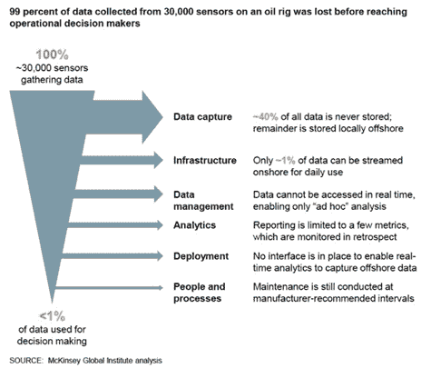
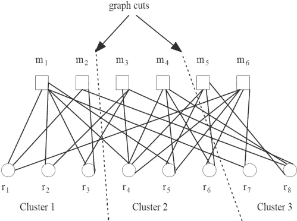

# 共同集群如何发现产业模式

> 原文：<https://medium.com/hackernoon/how-co-clustering-can-discover-industrial-patterns-985642401772>

## 一个配备了成千上万个传感器的海上石油钻井平台可以捕获石油生产和开采以及钻井平台维护的几乎所有方面的数据。但根据麦肯锡的研究，这些数据中只有不到 1%最终被使用。

更糟糕的是，这不是一个侥幸的例子。对于工业领域的许多组织来说，使用大规模数据进行知识发现仍然是困难的。近年来，数据组织和分类有了适度的发展。由于获取的数据集数量不断膨胀，分析庞大的异构数据集也是一项挑战。

然而，一种被称为数据聚类的技术会有所帮助。这种方法在原理上很简单:数据对象被聚集成组，这样一个类中的对象是相似的，但不同于其他类别中的对象。

麦肯锡（公司名）

通常，众所周知的聚类算法将数据对象分类成不同的类型。但是在现实世界中，聚类问题可能出现在涉及成对异构数据的数据挖掘操作中。尽管数据获取技术的快速发展导致了所获取数据集的爆炸性收集，但是诸如数据组织和分类、操作以及对非常大的、多样的、异构的数据集的分析之类的技术仅适度发展。这阻碍了对用于知识发现的所获得的大规模数据的有效利用和理解。

下面是一个例子:在一个客户关系管理(CRM)应用程序中，您希望对客户和购买的商品进行联合聚类。此分类让您可以研究特定人群感兴趣的项目。然后，您可以为这些客户定制产品促销活动。

电影推荐引擎是协作信息过滤的另一个例子。这些引擎共同聚集来自观众的电影评分。当新观众提交她喜欢的电影的分数时，该引擎基于对她提供给观众电影评级集群的评级进行分类来推荐其他电影。

协同聚类也用于生物医学应用中，以对患者症状和医学诊断进行分类。计算机辅助诊断将病人的症状和支持数据转化为概率。

我们用“手拉手”这个词来表示两个成对数据类型的存在换句话说，在这个场景中，一种数据类型引发另一种数据类型的聚类，反之亦然。因此，对每种数据类型分别应用传统的聚类算法不能产生有意义的共同聚类结果。

丹·亚尔莫鲁克

这是其工作原理的技术框架:通常，数据存储在一个偶发事件或同现矩阵 C 中，矩阵的行和列表示要进行同聚的数据类型。矩阵的条目 Cij 表示由行 I 和列 j 表示的数据类型之间的关系。协同聚类是通过同时聚类数据矩阵的行和列从较大的数据矩阵中导出子矩阵的问题。诸如双聚类、二维聚类和块聚类等名称经常在文献中用来指代相同的问题表述。

实现共聚类的一种技术是从图论的角度来处理这个问题。也就是说，我们使用加权二分图模型来模拟协同聚类问题中两种数据类型之间的关系。这两种数据类型表示二分图中的两种顶点。数据协同聚类是通过划分二分图来实现的。

正方形和圆形顶点(分别为 m 和 r)表示由二分图表示的共聚类问题中的两种数据类型。划分这个二分图导致两种数据类型的共同聚类。

我们欢迎任何关于应用开发的讨论，以提供更强的行业洞察力。通过结合主题专业知识、数据收集方法和下一代[数据科学](https://hackernoon.com/tagged/data-science) [工具](https://hackernoon.com/tagged/tools)，我们可以快速进入工业 4.0。

*原载于 2017 年 3 月 27 日*[*www.ioti.com*](http://www.ioti.com/analytics/how-co-clustering-can-discover-industrial-patterns)*。*