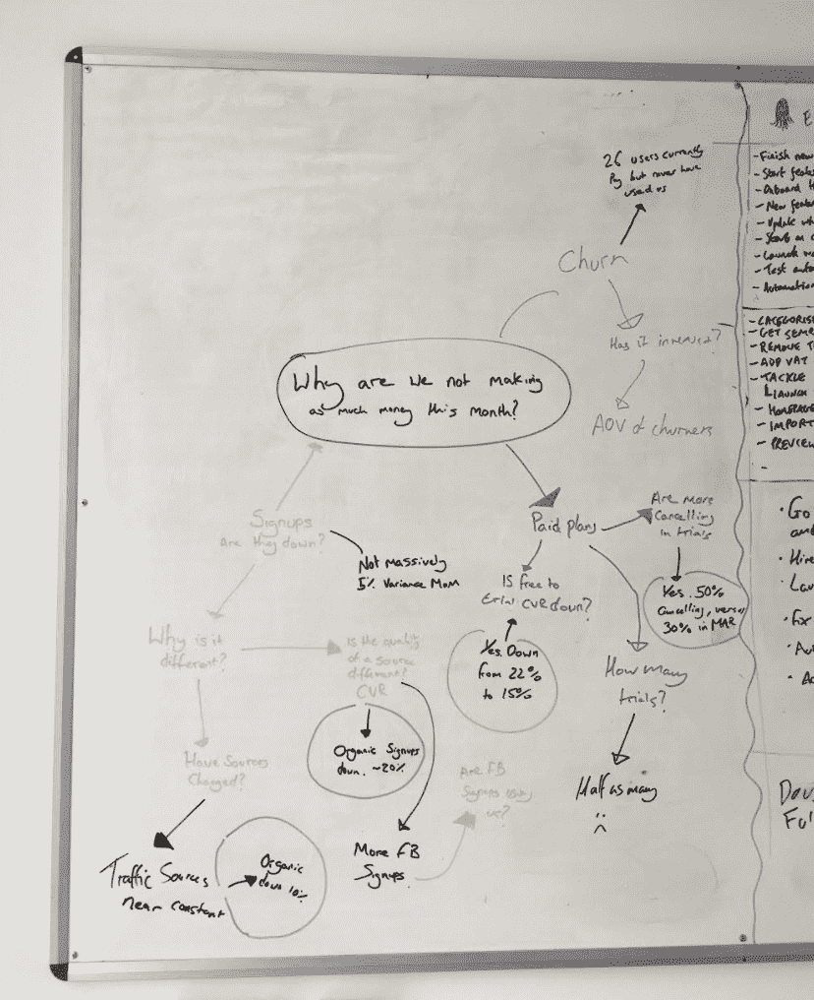

# 你如何应对 SaaS 糟糕的一个月？

> 原文：<https://medium.com/hackernoon/how-do-you-deal-with-a-bad-month-in-saas-29b77edceed2>

在过去的一年里，我们在电子邮件平台上写了很多关于我们成功的博客；从[发送 10 亿封电子邮件](/emailoctopus/the-road-to-one-billion-emails-4ed7d441e190)到我们在[的产品发布会](/emailoctopus/the-secrets-behind-a-successful-product-hunt-launch-c0d76eb5a419)。然而，不可避免的是，所有的创业公司和小企业都会经历艰难时期。收购放缓的时候，你会有一段时间增长缓慢，甚至更糟，收入或客户萎缩。

在过去的一年里，自从我们全职经营这项业务以来，我们也经历了几周和几个月的不景气。很少有企业在某个时候不会经历艰难时期，因此，识别低迷时期非常重要，这样作为一家企业，你就可以集中资源拯救那些艰难的几周，避免它们成为糟糕的一个月。下面是我们在[email ctopus](https://emailoctopus.com)中的做法。

# 监控业务

我们在评估业务健康状况时会监控数百个数据点，但我们始终认为收入是最重要的指标。随着 EmailOctopus 变得越来越成熟，业务变得越来越可预测。在早期，收购可能会大幅波动，我们会对本月“增长 50%”感到兴奋。百分比是很好的虚荣心衡量标准，但是对大多数 SaaS 企业来说，包括我们自己，指数增长是罕见的。

Our revenue growth over time in GBP. The growth now is very predictable.

通过使用 ChartMogul 定期仔细地监控我们的收入和客户增长，我们对 EmailOctopus 的“正常”月份有了一个清晰的概念。我们的 MRR(每月经常性收入)增长现在已经达到了通常每月仅波动 300 美元左右的水平，假设我们不进行任何大规模的发布，不改变我们的定价结构或大幅增加我们的付费广告支出。我们的客户增长也是可以预测的。我们知道，大约 20%的潜在客户成为试用客户，大约 60%的试用客户成为付费客户——同样，在我们的流量或现场转换没有任何重大变化的情况下，我们可以在一定程度上准确预测我们将获得多少客户。

一旦你知道了你的衡量标准，不管是通过图表巨头、利润井还是其他工具的组合，识别萧条的一周(和好的一周)就变得容易了。

# 对一个不景气的月份做出反应

在 EmailOctopus，一旦我们经历了看似缓慢的一周，我们就会对此做出反应，并进行我们所谓的“消防演习”。这个术语最初是由团队在 [Secret Escapes](https://secretescapes.com) 分析和尝试解决糟糕的交易日时使用的(因为 Secret Escapes 在 B2C 日常交易中运作，他们的日子是可以发现负面趋势的日子)。

“消防演习”分为两部分，第一部分是找出可能导致经济下滑的任何问题。在 EmailOctopus，我们的大部分消防演习都围绕“为什么收入增长放缓了？”这个关键问题展开或者简单地说“为什么我们没有赚更多的钱？”！

从核心问题中，我们用白板列出了所有可能导致收入增长放缓的因素。这些因素包括客户流失率、销售线索和试验的整体收购量是否下降，或者付费计划中是否存在问题。通过数据分析，我们从这些因素中抽取问题进行回答，下面是一些问题的示例:

1.  如果总体销售线索注册水平一致，那么按来源的划分是否有所改变？(例如，较大的 FB 注册群体可能表明销售线索质量较低)
2.  流失增加了吗？流失账户的 ARPA(平均每账户收入)是多少？

我们找到的答案越多，我们的问题就越多，最终会形成一个由问题和数据组成的蜘蛛网，如下所示:

Our whiteboard filled with questions on why our month was poor

当我们从 Google Analytics、我们自己的数据库和 [ChartMogul](https://chartmogul.com) 获取数据时，更多的问题不可避免地出现了，开始只是一个简单的两个问题的图表(客户流失增加了吗？还是付费计划减少了？)很快就变成了一个问题的蜘蛛网，每个答案只会引出更多的问题。像任何分析项目一样，我们发现我们可以花一整天的时间来问为什么网站行为发生了变化，所以我们开始为我们召开会议和讨论我们的发现设定时间目标。没有什么比分析瘫痪更糟糕的了。

# 采取行动

在进入行动阶段之前，我们通常会在“消防演习”的分析阶段花费大约 3-4 个小时，或者直到午餐时间。看着我们写满问题和统计数据的白板(由大量 Excel 电子表格支持)，我们开始强调业务关注的领域。例如，我们的试用付费转化率可能会随着销售线索的获取而下降。

很少会有什么灵丹妙药，或者一个司机度过糟糕的一天。这通常是多种因素的结合，其中一些是我们无法控制的。在旅游行业(秘密逃亡在其中运作)，天气在日常表现中扮演着重要的角色，就像一个月的时间和发薪日的时间一样。对于 B2B SaaS 企业来说，财政年度和假期也是季节性的一部分。

在选择了我们认为可以改进的指标(通常最终会在 3 左右)后，团队将再次在白板上展示我们可以采取的行动。在本次会议结束时，白板看起来类似这样:

Whiteboard of ideas on how we can improve the business. The colours reference a particular metric.

满满的想法，有些比其他人更疯狂，关于我们如何改善业务。最后，我们将对这些想法进行投票，每位团队成员将获得 5 张选票，在董事会中自由分配。我们选择实施的想法的数量取决于我们所经历的问题的严重性——情况越糟糕，我们将实施更多的想法来扭转局面。获得最多票数的想法会被付诸实施，这是一种民主的方式来选择我们作为一个群体所要做的事情，也是一种有希望建立起某种友谊的方式。

我们没有研究的剩余想法会进入我们的想法电子表格，以及一个更科学(但不那么有趣)的选择未来实验的方法。我们根据他们的努力、潜力和重要性来划分优先级。然后，我们的营销团队会在不太紧急的情况下，在正常的时间里，逐步删除这个实验列表。

Using P.I.E to rate the ideas which didn’t make the cut

# 致力于并推出我们的想法

有了选定的想法，它们就会被最合适的人拾起并付诸实施。如果我们觉得需要 Jonathan 的技能来帮助推动业务增长，我们不反对让他离开负责所有技术事务的工作。不过，最常见的是，这些想法可以用半技术 MVP(最小可行产品)的方式进行测试。实验的实现越简单，我们对它的依恋就越少，如果不成功就越容易扔掉。

一旦建成并投入使用——理想的情况是在几天内完成——实验的成功就会被追踪。我们使用不同的工具来监控每个实验，并且在实施过程中将始终考虑跟踪成功的方法。现场转换件我们会尝试 A/B 测试，如果是在网站流量足够高的部分。搜索引擎优化实验，我们将使用谷歌分析监测有机搜索流量和使用 SemRush 排名的条款。

The $1 promotion, which didn’t work, despite previous success of a similar campaign on Black Friday

在 EmailOctopus，尽管我们进行了详细的分析，但我们经常进行不成功的营销实验——这是尝试新想法的本质。上面是一个不成功实验的例子——有时最大的赢家是更简单、更快速的测试。不管结果如何，从每一次防火练习中，我们都更多地了解了我们的客户和 EmailOctopus。我们了解是什么让企业运转起来，以及在快乐和艰难时期我们可以用来创造客户、收入和减少流失的杠杆。通过采取一种潜在的负面情况，并作为一个团队工作，它有助于建立一种实验文化。在这种文化中，我们不怕在追求业务增长的过程中尝试“冒险”的事情。