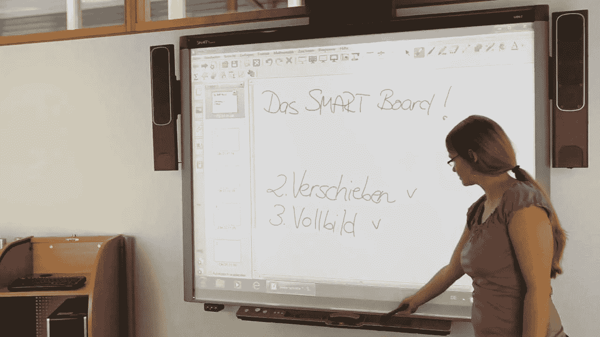
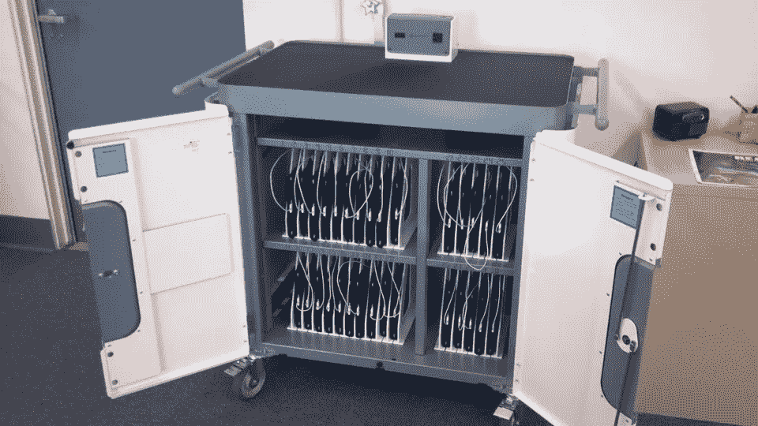

# 教育技术如何改变课堂体验

> 原文：<https://medium.com/hackernoon/how-edtech-is-changing-the-classroom-experience-5ce3cdd2295c>

EdTech 是“教育[技术](https://hackernoon.com/tagged/technology)的简称，它的存在已经超越了家用电脑和顶尖大学。这不应该让人感到震惊。电脑、平板电脑和其他先进技术已经被广泛接受为日常生活的一部分，并且正在被纳入全国的高中和初中课程。[75%的教师将技术融入他们的日常课程。教育科技正在以超乎你想象的方式改变着教师和学生的生活，但是科技的广泛应用面临着许多挑战和艰难的战斗。](http://blog.frontrowed.com/2016/11/17/2017-technology-in-the-classroom-survey-results#comments)

# 2017 年的教室是什么样子的？

我们观察了从明尼苏达州到曼哈顿的四个教室，在每一个教室里，教育技术都在对各级教育产生影响。

有趣的是，他们这样做也有相似的硬件限制。在明尼苏达州奥顿维尔的一个农村小镇，杰森·布兰森(Jason Blanshan)的 7-9 年级班级里，他们既有一对一的课程，也可以通过“iPad cart”使用 iPad。塔哈·阿迪布在哈莱姆区的民主预备高中教十年级学生 ELA，他在 MacBooks 上使用类似的购物车系统。教室之间共享 EdTech 并不少见。

Adib 和 Blanshan 的学校都在实施一对一计划。这意味着每个学生一个学校提供的设备。根据 2017 年[调查](http://blog.frontrowed.com/2016/11/17/2017-technology-in-the-classroom-survey-results#comments)，超过 50%的教师表示，他们现在拥有 1:1 的学生与设备比率。这通常意味着一个 Chromebook，对于布兰山和另一所明尼苏达州学校，明尼阿波利斯郊区的罗杰斯高中来说。在罗杰斯，学生们签署一份为期四年的租赁合同，将笔记本电脑带回家。

大多数教室使用智能板，一种交互式白板。智能板的作用与白板相同，但该技术使其易于擦除、在标签之间切换和组织信息。对于学生来说，智能板通过互动提供了触觉学习的来源。在课堂上实时记录阅读材料、解方程和填写互动工作表只是智能板提高学生参与度的几种方式。

阅读材料可以在网上找到，但大多是非教科书阅读材料，因为在许多情况下仍然使用教科书。教师在 [PowerSchool](https://www.powerschool.com/) 或同等的成绩保持项目中布置作业并完成所有的成绩记录工作。

瑞安·奥尔森(Ryan Olson)是明尼苏达州罗杰斯的一名高中社会研究教师，他喜欢[学校学](https://www.schoology.com/)，这是一个与谷歌文档集成的学习管理系统，使资源更容易获取。“我可以创建一个谷歌文档并上传到 Schoology，它会为每个学生创建一份副本，”奥尔森说。"我还把我布置的所有学习材料放在[学校学]上."考虑到谷歌套件，尤其是 Docs，在高中和初中的教室里是多么受欢迎，这种整合是至关重要的。

像 PowerSchool 和 Dean's List 这样的项目将教学带入了 21 世纪，而这些只是现有教育技术的沧海一粟。Adib 使用 [GoFormative](https://goformative.com/) ，一种将 pdf 转换成数字工作表的工具，来保持数字工作的有序性，并反映物理工作表。他还使用 [GoGuardian](https://www.goguardian.com/) ，这允许他查看和冻结学生的屏幕，以便将注意力集中到房间的前面，并消除干扰。根据 Adib 的说法，大多数学生并不觉得这有侵犯性，并且“实际上非常喜欢”，特别是他可以控制学生的屏幕以解释他们可能有困难的问题的功能。

莎拉·诺德格林在曼哈顿一所小学教四年级，为有语言学习障碍的学生授课。她用的是 Elmo，这是一台文件摄像机，可以代替老式的投影仪投影片。有了 Elmo，你放在屏幕上的任何一张纸(撕开透明片)，你都可以在上面写字。这使得学生们能够跟随诺德格林的思路，并在她写作的时候手动操作，同时考虑到一个适应性强的教学计划。

# 教师角色的变化

奥尔森说:“学区希望我们达到这样一个程度，即使学校被取消，学校也应该继续上课。”。"下雪天是在线学习日."

在罗杰斯高中，学校学以及在线作业和资源的出现正在改变课堂在学习体验中扮演的传统角色。如果你是一名学生，奥尔森地区雪天的消失可能会令人担忧(不再不耐烦地等待暴风雨后第二天的公告)，但作为一名教师，这似乎预示着未来必须发生的变化。

“更重要的是管理内容，让学生能够吸收，而不是站起来谈论术语的定义。”奥尔森补充道，特别提到了他作为一名社会研究教师的角色。“当你可以在世界上的任何地方用谷歌搜索时，知道埃及的首都已经不再重要了。”

当一切都可以用谷歌搜索时，社会研究和科学的作用不再仅仅是教授事实，而是教授研究技能、媒体素养和识别偏见。

自从学校里有了计算机实验室，学生们就通过被引导到学术资源而不是维基百科来“学习”研究技能。仔细整理学生在课堂上阅读和观看的内容是一种很好的方式，可以向他们展示偏见的例子，同时仍然展示适当的内容。这不仅仅是在数据库中教授关键字技巧。

没有教育技术，一些更专业的教学方法是不可能存在的。莎拉·诺德格林的学生就属于这一类。诵读困难症和多动症是这些基于语言的学习障碍中最著名的。诺德格林采用奥顿·格林汉姆的方法，遵循“[预防学业失败”](http://www.pafprogram.com/)计划，该计划强调多感官学习。多感官学习包括同时使用视觉、听觉和触觉方法来提高学习效果。这个项目的关键，也是教授她的学生群体的关键，是每天按照学生的节奏进行，确保在进入不同的主题之前完全理解。

“技术是必不可少的，因为我们每天都在改变我们的课程。他们理解的程度决定了我第二天的教学内容。”诺德格伦说。“过去，教师必须提前做好计划，这是不可改变的。我可以集思广益，想出不同的作文想法，当学生们和我交谈时，我可以把这些想法敲进笔记本，这可以是高效、快捷和有可塑性的。”

# 社会公民

社交媒体可能是对今天的学生影响最大的，而这在 15 年前并不存在。学校不仅仅是一个在教室里学习的地方，也是一个学习如何成为社区的一部分的地方。对于教育工作者来说，通过社交媒体教授公民意识是一个困难的课题。

奥尔森说:“我们在小学强化社会规范的方法是教人们如何对待他人的一种方式。”“在如何解决这些问题上，学校处于落后地位。我们没有从公共健康的角度考虑这个问题。”

奥尔森阐述了欺凌、网络欺凌和其他形式的在线虐待如何没有消失。当涉及到对抗网络虐待的案例时，教育工作者总是解决问题而不是症状。他告诉我关于#FreeReid 的争议。

2014 年，罗杰斯高中(Rogers High School)的一名学生高年级学生 Reid Sagehorn 回应了一条关于亲吻一名女体育老师的匿名推文，并讽刺道“事实上，是的”。这导致了他的停职，以及对该教师的调查，这可能会导致她的释放。这也引发了 Twitter 上的#FreeReid 运动，学生们抗议学校对光荣榜学生和足球队队长的停职选择。虽然这场运动本身似乎构思不周，而且在 2017 年可能会有很大不同的解释，但结果仍然是，到你高中高三的时候，应该有一些项目可以教你在社交媒体上能说什么，不能说什么。这不是言论自由的问题；不良的社交媒体公民身份会影响相关学生和教师的生活和职业生涯。一些学校开始实施在年轻时教授这方面知识的项目。

“我们使用一个叫做‘反应课堂’的项目，”诺德格林在谈到她教四年级学生社交技能时说我们谈论社交媒体以及如何恰当地使用它，如何保持安全并向成年人报告。老实说，很多成年人都可以用它。"

# 问题是:科技是为消费者而非学校打造的

这些学校中的许多都通过捐赠者或赠款收到了首批设备。但是，即使几年后，真正的问题也暴露出来了。技术过时的速度太快了。这些设备是为了让消费者每隔一年更换一次他们的设备而制造的——这对于学区来说更加困难。

“我们学校刚刚经历了一场公投。我们去要钱。上周二就通过了。”布兰山说。“如果没有通过，我们就无法维持(我们的一对一项目)。我们一直在亏损，动用了紧急平衡。”

当一个小学区每隔几年就买不起新的 iPads 时，就会发生这种情况。布兰山形容他们的 iPads“来自石器时代”。软件停止工作，设备开始崩溃，教育技术的便利开始被垂死的、不可持续的技术的不便所压倒。

即使是民主预备学校——一个有声誉和资金支持的私立机构——也和奥顿维尔的公立高中在同一个购物车系统上运作。技术更新的速度正以指数级增长。不考虑预算，这是十年前学校董事会不必担心的一个因素。而且，特别是对公立学校来说，我们的政府并没有把重点放在资助教育项目上。

# 教育科技的未来在这里吗？

虽然许多事情看起来与我五年前在高中时不同，但我们仍在努力理解技术在课堂上的作用。

在教育者的眼中，并不是所有的技术都是平等的。智能手机普遍不受欢迎，一些学校要求学生在一天开始时上交。至少大多数老师会惩罚他们的使用，尤其是在教室里，学生们为了教育目的使用笔记本电脑——手机是不必要的干扰。

是的，传统主义者，许多教室仍然使用铅笔和纸来完成许多任务，因为各种各样的原因，技术不能轻易取代这些教育的主食。对于莎拉·诺德格林的学生和全国的学习障碍学生来说，阅读实体文本比在屏幕上阅读更容易。她仍然使用数学练习册。

“在很大程度上，我们使用笔和纸，”塔哈·阿迪布说，他引用了打开包装、登录和启动笔记本电脑的繁琐本质，作为在课堂限制内使用它们进行每一项练习的障碍。

现在没有安全可靠的方法来简化这个过程。正是便利性推动了 EdTech 的吸引力。在笔记本上记笔记对学生来说更方便，而在线成绩册对老师来说更方便。教室使用技术不是因为它的新奇，而是因为它使课堂过程更有效率。教师和学生都必须适应这一点，但这是为了创造一个学生可以获得更好的资源和学习策略的未来。

**由布林·格尔巴特(Bryn Gelbart | Content Writer at)推波助澜，纽约市一家领先的** [**应用开发机构**](https://fueled.com/?utm_source=Medium&utm_medium=referral&utm_campaign=partnership&utm_content=Fueled%20homepage&utm_term=Fueled%20homepage) **。**

*阅读原文* [*此处*](https://fueled.com/blog/edtech-is-changing-the-classroom/?utm_source=Medium&utm_medium=referral&utm_campaign=partnership&utm_content=modern%20day%20classroom&utm_term=ed%20tech) *。*