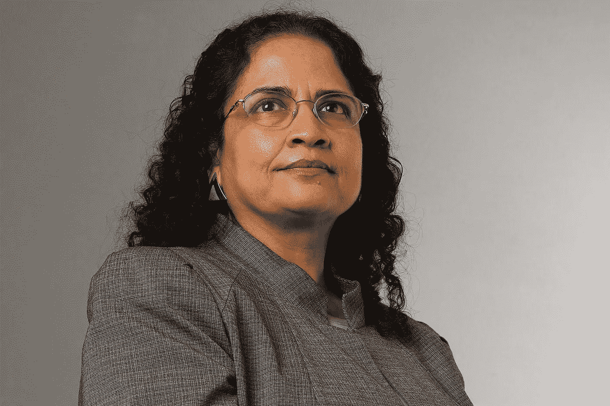
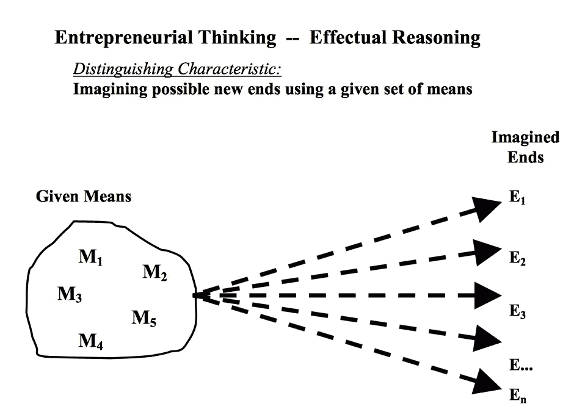
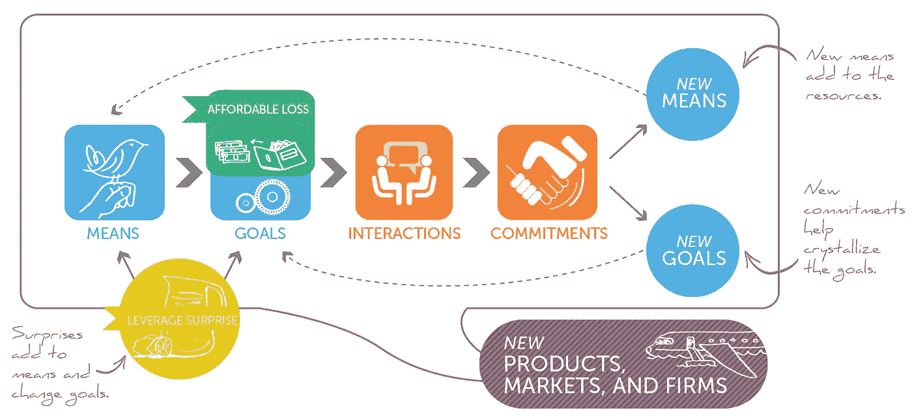

# 专家企业家如何思考

> 原文：<https://medium.com/hackernoon/how-expert-entrepreneurs-think-3245a8b39334>

有效创业的五个关键原则。

实现是描述成功企业家如何思考的一种方式。事实证明，成功的企业家看待世界的方式与其他人不同，通过研究这些差异，我们可以了解是什么让一些企业家更有可能成功。

除了是婚礼供应商市场[born&Blue](http://www.borrowedandblue.com)的联合创始人兼首席执行官，还是一名连续创业者之外，我还有幸在弗吉尼亚大学和科罗拉多大学博尔德分校担任创业学的兼职讲师。我写这篇文章是为了分享一些关于创业思维的重要研究，以及这项研究中出现的关键原则，它们构成了实现的基础。我希望我能提供一些有价值的见解，帮助其他创业者成功创业。

2003 年，我第一次被介绍到 Effectuation，当时我是弗吉尼亚大学达顿商学院的一名 MBA 学生。在我们第一年的战略课上，我们被分配了一份九页的阅读笔记，题目是 [*什么让企业家具有企业家精神？作者是萨拉斯·萨拉斯瓦西，效果器运动的主要思想家之一。这是我读过的第一部探索企业家如何不同思维的作品，这是一本严肃的书。*我的时刻。在这封信中，Saras 详细描述了在她开创性的创业研究中，她如何采访了 30 多位非常成功的企业家，他们建立了收入从 2 亿美元到 60 亿美元的公司，并让每位企业家在两个小时内完成了一个 17 页的问题集，其中涉及描述他们如何将相同的特定产品推向市场。她在观察这些专业企业家如何考虑创业，以及他们之间是否有任何共同点。](http://www.effectuation.org/sites/default/files/research_papers/what-makes-entrepreneurs-entrepreneurial-sarasvathy_0.pdf)

事实证明答案是肯定的。经过严格的分析，Saras 能够识别和提炼出一种新兴的创业方法——所有这些成功的企业家都分享的一种思考世界的方式——因此诞生了一个新的创业思想流派:有效化。

Saras Sarasvathy, one of the leading thinkers behind the Effectuation movement.

第二年，当我得知萨拉加入了达顿大学的教师队伍时，我激动不已，我也加入了她的班级。那是 14 年前——从那以后，我们一直是朋友和合作者。我认为她是我最重要的导师之一，我很感激她与我分享她的时间和智慧。

作为商学院的最新学科，企业家精神直到最近才成为一门可教授的课程，类似于金融、会计、管理、营销与传播、运营、定量分析和组织行为学。许多学校(和学生)仍然纠结于这样一个问题:“创业真的可以教吗？”及其推论，“企业家是天生的还是后天培养的？”

在发现效果之前，我承认我自己也不太确定。但是现在，我非常相信*有*个核心可教原则，一种创业方法——它们植根于实施原则。这些原则并不意味着是规定性的；相反，把它们看作是观察世界的一面镜子。它们对创业初期的创业者特别有帮助——或者像彼得·泰尔喜欢说的，当你专注于从 0 到 1 的时候。

那么“生效”到底是什么意思呢？

首先，让我们从什么是无效开始。因果关系，或者说因果推理，是今天驱动绝大多数管理思维的东西——这是我们被教导思考大多数问题的方式。我们有一个明确的目标，我们正在努力实现，我们必须决定在我们所掌握的各种选项中，哪一个能让我们最好地实现这个目标。在这种方法中，静态的是我们给定的方法和目标。我们被教导要“以目的为出发点”，并找出达到目的的最佳方式。

Source: [What Makes Entrepreneurs Entrepreneurial](http://www.effectuation.org/sites/default/files/research_papers/what-makes-entrepreneurs-entrepreneurial-sarasvathy_0.pdf), by Saras Sarasvathy

专家企业家的想法不同。他们审视自己所拥有的手段，无论这些手段是人、技术还是资源，并确定利用这些独特的手段可以实现什么样的潜在目标。此外，专家型企业家不会把他们的手段看作是静态的——他们会不断地寻求扩展他们所掌握的手段。专家企业家进行有效的推理——想象他们在自己控制的未来能够创造的所有可能性。

Source: [What Makes Entrepreneurs Entrepreneurial](http://www.effectuation.org/sites/default/files/research_papers/what-makes-entrepreneurs-entrepreneurial-sarasvathy_0.pdf), by Saras Sarasvathy

正是这种看待世界的根本不同的方式，让我们看到了实现的五个关键原则中的第一个。

# 原则 1:世界观——控制与预测

管理思想家，因果推理者，相信，“在我们可以预测未来的范围内，我们可以控制它，”并忙于专注于预测。因果推理者喜欢市场研究、金融模型和其他工具，这些工具通过帮助他们预测未知的未来来增加他们的控制感。

专家企业家，有效的推理者，有不同的想法。他们相信，“在我能控制未来的程度上，我不需要预测它。”专家企业家回避市场研究和长期财务预测，不会把他们宝贵的精力花在预测未来上。他们为什么要这么做？卓有成效的企业家植根于这样一种信念，即未来不是由他们发现或预测的，而是由他们创造的。卓有成效的企业家知道，只有他们自己才能创造自己的未来——这不是他们袖手旁观时发生在他们身上的事情。

许多企业家选择他们的道路是因为这种世界观，不管他们是否意识到这一点。他们想成为自己的老板，亲自掌握自己的命运。这种控制允许他们在他们想要的时间、地点、方式和对象上做他们想要的事情。他们是飞机上的飞行员，驾驶着飞机去任何他们想去的地方。

诚然，随着一项事业的发展，有时有效的推理是最好的方法，而有时因果推理更合适。专家企业家并不完全依赖有效的推理，而是能够在任何给定的时间点有效地利用这两种方法来满足其风险投资的需求。

因此，问题就变成了，“我们如何控制我们无法预测的未来？”这个很好地引出了我们的第二个实现原则——鸟在手。

# 原则 2:手段——手中有鸟

有效实施原则认为，有效的企业家从查看他们可支配的资源开始，以确定他们可以创造的各种未来(风险投资)，而不是在头脑中有一个预先确定的目标。具体来说，他们看三件事:*他们是谁*，*他们知道什么*，以及*他们知道谁*。如果一个企业家能有效地利用所有这三个因素，他们就能最大限度地提高其企业成功的可能性。

最近，我邀请艾伦·林(Allen Lim)来到我们在科罗拉多大学博尔德分校的创业执行课上，分享他的创业故事。艾伦是为高水平运动员服务的营养公司[斯克拉奇实验室](https://www.skratchlabs.com)的创始人。艾伦的祖父母冒着生命危险逃离共产主义中国后，他的家人从菲律宾移民到了美国。在很小的时候，艾伦就迷上了骑自行车，并在洛杉矶郊区的街道上骑着自行车度过了他的大部分青春时光。他的家庭没有多少钱，所以他会用米饼做自制小吃来维持他的骑行，并开始尝试各种自制的补水运动饮料配方，尝起来不恶心。艾伦将继续在科罗拉多大学博尔德分校获得运动生理学博士学位，并成为美国职业自行车运动员弗洛伊德·兰迪斯和兰斯·阿姆斯特朗的教练——在对自行车界出现的非法兴奋剂彻底失望后辞职。

失业，没有钱，也没有真正的计划，他和两个朋友开始了一个副业，向自行车界的朋友和同事出售他们在艾伦厨房配制的“秘密饮料组合”。艾伦非常关心帮助运动员在他们的比赛中发挥最佳水平:干净、健康、合法(我们是谁)。他对运动生理学也有深刻的理解，多年来一直在自制运动饮料(他所知道的)。他在业余和职业自行车界有许多朋友和同事(他认识这些人)。他利用手中的鸟原则，通过利用他所掌握的手段来启动一项他处于独特地位的风险投资。

Skratch Labs 完全靠自己创业，没有外部资金支持，现在是一个快速发展的全国性品牌，由 Whole Foods 和 REI 分销，每年产生数百万美元的收入。

艾伦是如何从 0 到 1 的？他开始利用他独特的手段。但是为了发展他的业务，他需要利用第三个原则——共同创造——来寻找新的利益相关者，帮助他的业务更上一层楼。

# 原则 3:共同创造——疯狂的被子

实现的第三个原则，共同创造(或疯狂的被子)，解决了专家企业家如何不断积累利益相关者，以帮助他们创造未来，同时减少不确定性。一般来说，卓有成效的企业家会以最短的路径将他们最初的产品或服务送到潜在客户手中。艾伦开始向他的朋友出售他的混合饮料。他最初的客户通过自我选择与他共同创建企业，成为他编织的“疯狂被子”的一部分。Allen 的早期客户分享了他们对产品的反馈，以现金的形式提供了资源，并通过他们对产品的鼓励和热情的话语提供了情感支持。

共同创造原则也适用于一家公司甚至还没有产品或服务出售的时候。卓有成效的企业家通过走出去并获得“预先承诺”来发展客户，这可能看起来像这样:

> 艾伦:我在考虑开发一种运动饮料。什么会让你有兴趣购买我的新产品？
> 
> 朋友:嗯，我觉得现在市面上的运动饮料含糖太多，而且在嘴里留下很蹩脚的余味。
> 
> 艾伦:好的，很好。所以如果我能创造出一种低糖又好喝的运动饮料，你会成为顾客吗？
> 
> 朋友:当然。
> 
> 艾伦:酷。你愿意为那杯饮料付多少钱？
> 
> 朋友:5 美元。
> 
> 艾伦:太棒了。所以我能在一周内回来和你分享我的想法吗？
> 
> 朋友:完全可以。

上面这个简单的例子展示了专家企业家如何“走出大楼”,并能够获得尚不存在的产品的预先承诺，同时了解人们正在寻找的功能以及他们愿意为新产品支付的价格。

共同创造原则不仅仅与获得客户有关。如果没有联合创始人、员工、分销合作伙伴和供应商，Allen 就无法发展 Skratch Labs。共同创造原则是一种方法，通过这种方法，艾伦允许新的利益相关者以他们感觉最舒服的承诺水平选择进入他的企业，同时降低他的风险并最小化现金支出。

这在实践中起作用的一个方法是，企业家提出一个简单的问题，“怎样才能让你成为我的企业的一部分？”这使得利益相关者基本上可以告诉企业家他们对企业的承诺水平，在他们“可承受的损失”的概念框架内，这很好地将我们带到了下一个关键的实现原则。

# 原则 4:可承受的损失——关注负面影响

实现的可承受损失原则详细说明了专家企业家如何专注于最大限度地减少他们的决策和行动的负面影响，从而降低风险和促进行动。

很多时候，企业家面临着所谓的“暴跌决策”。我真的准备好全力投入这个新项目了吗？通常情况下，创办一家新企业会令人望而生畏。企业家可能会决定是否辞去高薪工作，同时需要养家糊口，支付抵押贷款等等。冒险会让人觉得是一个高风险的提议。

专家型企业家专注于在风险投资失败的情况下最大限度地减少负面影响，或者确定他们的可承受损失。我们再来看看斯克拉奇实验室的早期。艾伦找到了两个朋友，他们有兴趣帮助他在早期启动他的业务。三位联合创始人都有其他工作。他们使用 Allen's kitchen 来开发和改进他们的食谱，他们使用当地的五金店来批量混合他们的产品，他们从最初的产品销售中获得所有的钱，并将其投入到公司中，确保花费的钱永远不会超过他们在银行中的存款。他们意识到他们真的输不起，所以他们对时间和金钱都很紧张。回想起来，斯克拉奇实验室的起源非常卑微——没有真正的大“暴跌”，因为艾伦将失败的负面影响降至最低。如果没有人购买他们的第一批产品会怎样？没什么大不了的——他们的损失不会超过几百美元，而且他们都还有日常工作可以依靠。

因此，如果你是一名企业家，你很难做出一个“仓促决定”，你怎么能从不同的角度看待事情呢？为了给你的企业一次机会，你愿意投资什么？你愿意失去什么？每周花 15 个小时在你的企业上工作 6 个月，在这个过程中投资 2000 美元怎么样？现在你已经算出了你可以承受的损失，你可以说，

> “*好吧，我打算在这 6 个月里每周工作 15 个小时，并投入 2000 美元，看看我是否能让这件事顺利进行。”*

以这种方式思考，你现在已经把创业的门槛降低到了你可以承受损失的程度，所以一点也不觉得害怕。跳下去！

# 原则 5:利用意外事件——柠檬水

实现的五个关键原则中的最后一个是杠杆或有事项原则，它专注于专家企业家如何利用风险创造过程中出现的不可避免的惊喜，并将它们转化为机会。

一个很好的例子来自史黛西的皮塔薯片的起源故事。早在 1996 年，Stacy Madison 厌倦了她的公司工作，决定追随她对食物的热情，在她的家乡波士顿启动了一个食品车。随着她的皮塔三明治推车越来越受欢迎，排起长队是很常见的。因此，斯泰西发挥了创意，把前一天晚上剩下的皮塔饼面包切碎，放在烤箱里烘烤，并在人们排队等候三明治时，把这些烤好的皮塔饼片分发给他们。

嗯，不用说，斯泰西的皮塔薯片非常受欢迎，这个“意外的惊喜”很快变成了更大的机遇——斯泰西的皮塔薯片就这样诞生了。7 年后，Stacy's Chips 实现了 6500 万美元的收入，雇佣了 300 名员工。她的三明治推车到此为止了！

在你创业的道路上总会有曲折。与专注于特定目标的因果思考者不同，专家型企业家利用这些快乐的意外事件，轻松重塑他们的创业方向，将这些惊喜转化为机遇。

# 把这一切联系在一起

好的——让我们把所有这些放在一起，用简单的话来总结影响。

卓有成效的企业家不会专注于预测将会发生什么，因为那超出了他们的控制。卓有成效的企业家反而专注于在他们控制范围内的事情，以创造自己的未来。

卓有成效的企业家着眼于他们是谁，他们知道什么，他们认识谁，来决定他们可以使用什么方法来开始新的冒险。

卓有成效的企业家会将选择与他们共同创造未来的利益相关者聚集在一起，为他们的企业和潜在的新目标增加新的手段。

卓有成效的企业家最大限度地减少“跳水”的负面影响，尽可能地降低前进的风险，这样他们就能有一个面向行动的方向。

卓有成效的企业家拥抱惊喜和意外，明白有时这些惊喜可以成为最大的机会。

这就是你想要的——快乐实现！

Source: [Effectuation.org](http://www.effectuation.org)

我希望你觉得这篇文章很有价值。如果你们有兴趣了解更多关于有效化的知识，我鼓励你们去看看 Saras 关于这个主题的 ted 演讲，买一本她合著的书:[有效的企业家精神](https://www.amazon.com/Effectual-Entrepreneurship-Stuart-Read/dp/1138923788/ref=pd_sbs_14_img_0?_encoding=UTF8&psc=1&refRID=QM9WGXXBAP7C782S03NV)，或者访问她创建的网站[有效行动协会](http://www.effectuation.org)。

> [黑客中午](http://bit.ly/Hackernoon)是黑客如何开始他们的下午。我们是 [@AMI](http://bit.ly/atAMIatAMI) 家庭的一员。我们现在[接受投稿](http://bit.ly/hackernoonsubmission)，并乐意[讨论广告&赞助](mailto:partners@amipublications.com)机会。
> 
> 如果你喜欢这个故事，我们推荐你阅读我们的[最新科技故事](http://bit.ly/hackernoonlatestt)和[趋势科技故事](https://hackernoon.com/trending)。直到下一次，不要把世界的现实想当然！

