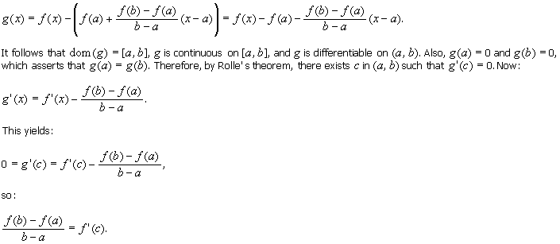
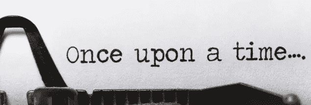

# 如何(不)记忆数学

> 原文：<https://medium.com/hackernoon/how-not-to-memorise-mathematics-98fef71aefcf>

## *作为说书人的数学家*

数学家是故事讲述者。有时这是显而易见的，比如查尔斯·道奇森，这位 19 世纪基督教会的数学研究员以他的文学作品而闻名——你知道他的别名刘易斯·卡罗尔。但是讲故事也是普通数学家的一种自然手段。

我的朋友 Ed 曾经告诉我，他花了一个下午的时间，在没有任何帮助的情况下，重建了实分析本科课程中的每一个证明。考虑到他在七年前就选修了这门课，并且其中五年没有正式练习数学，我感到很惊讶。惊讶于他在所有的活动中选择了这个活动来消磨他的下午，惊讶于他成功了。

数学证明可能会超过几页，并且通常看起来只是一个符号网。我只能勉强拼凑出那些证据的碎片；他恢复了每一个细节。艾德的记忆能力并不出名，所以我要求他做出解释。

The kind of proof that Ed is able to reel off from memory ([source](http://www.phengkimving.com/calc_of_one_real_var/05_app_of_the_der_part_1/05_01_the_mean_val_thrm.htm))

对于每一个证据，艾德回忆起的不超过几个关键观点，这些观点牢牢地印在他早期研究的长期记忆中。将这些想法作为路标，Ed 就能够依靠他对这些路标如何相互关联的理解来填充剩余的细节。

听艾德讲，每个证据都是一个故事。想想你最喜欢的小说或电影:你的回忆不取决于每一个场景或对话的细节，而是取决于你对人物、情节和转折的高层次理解。

我的短期记忆能力优于艾德——我会记住每个证据的每个细节，并在考试中重现它们。但是由于过于关注每个细节，我有时会忽略每个证据中的路标。这就是为什么我无法重现埃德的壮举:我的记忆太倾向于事实回忆，而埃德坚持关键想法之间的联系。

通过将对路标的回忆与将它们联系起来的能力相结合，艾德能够恢复证据。当我依靠纯粹的检索时，他能有效地解决问题，解决细节。埃德早期接触的证据留下了细节的痕迹，但正是他的理解深度让他在几年后完全重新捕捉到它们。

故事是组织思想的强大机制，以至于它们赢得了“心理特权”的标签。[艾德·库克是记忆大师(和我朋友的艾德不同)，他对故事如何帮助记忆有如下看法:](https://www.theguardian.com/lifeandstyle/2012/jan/15/story-lines-facts)

> “故事让学习联系变得更容易，因为它们让接下来发生的事情感觉是不可避免的。没有其他的，每一项似乎都是不完整的。通过这种方式，故事产生了背景和动力，它们带来了结束，告诉你的大脑什么时候结束。
> 
> 这项技术可以或多或少地应用于你想记住的任何形式的信息。在每种情况下，最好的办法是将这些项目编织成一个引人注目的故事线。这种叙述越是紧紧围绕现有的事实，让每个事实都感觉像是整体的一个直观部分，就越接近纯粹的理解。"

埃德·库克的建议同样适用于列出元素周期表、亨利八世的妻子和实分析的证据。数学可能是所有领域中最有特权的，因为它天生具有丰富的结构和模式。数学证明是作为结合起来的想法的集合而存在的。将它们编织成一个故事情节是一种自然的努力，因为每一个证据都表现为事件的逻辑顺序。

Not every maths story starts this way ([source](http://leonardoverse.com/how-a-story-idea-is-born/))

这些故事可能感觉抽象，被困在数学世界的细节中。这就是好的指导的来源；教育者的工作是提醒学生，想法不会凭空出现。每一个证据都应该带有一种必然性的感觉，这种感觉只有在路标被识别出来并且它们之间的关系被强调的时候才能感觉到。正如最好的故事以令人惊讶的发现让我们高兴一样，最令人满意和难忘的证据是那些将我们与曲折和转折联系在一起的证据。

将抽象的数学证明转化为有形的真实世界的故事只需要想象力。[这一值得称赞的尝试](http://chalkdustmagazine.com/features/proof-by-storytelling/)根据真实的人来构建涉及二项式表达式的代数证明，应该会给那些像我一样容易迷失在数学论证的技术细节中的人以启发。故事可以帮助我们在推动符号的过程中发展直觉。

但是讲故事也有黑暗的一面。将想法包装成连贯的故事情节是人的天性。问题是，我们把连贯性看得比准确性更重要，方便地插入缺失的细节以适应总体叙述，而没有停下来质疑它们的真实性。这就是数学推理，解释每一个假设和检查逻辑中的每一个跳跃的学科必须闪耀光芒的地方。逻辑和推理可以防止渗透到我们日常判断中的“叙述偏见”。

故事揭示了记忆和思考之间奇妙的相互作用。认知心理学家丹尼尔·威灵汉姆认为，记忆是思想的残余。这两篇专栏文章都印证了威灵汉姆的格言；他们回忆信息的能力是基于他们思考的能力。将信息视为一系列相互关联的想法。在[教育中，一个经常被忽视的事实是，相反的情况并不成立:思想并不总是记忆的残余。](https://hackernoon.com/tagged/education)[把信息当成一堆不相干的事实吞下去不会自动导致理解。](https://hackernoon.com/maths-students-are-trapped-in-searles-chinese-room-d5ab9eafbc51)事实上，过度关注事实记忆从长远来看只会伤害记忆，这种记忆本质上更具有联想性。这就是为什么真正的分析证明对我来说似乎总是“更长”:在没有路标的情况下，有更多的细节需要检索。

考虑二次公式。你还记得吗？如果你没有回忆起这些符号的每一个位置，那是情有可原的。然而，二次公式只不过是对*完成平方*的方法的概括。记住并理解这个单一的事实——这个路标——将允许你推导或“重新发现”一般公式。理解数学的大概念减轻了记忆每个细节的认知负担。

数学的真理可能是绝对的，但我们如何得出这些真理是一个教育学的问题。一个好的证明将会是一个引人注目的故事，锚定在路标上，充满惊喜，并由整合了故事关键元素的推理来控制。

数学是一种讲故事的行为，支持记忆和理解的双重目标。必须支持学生成为最终的故事讲述者。

我是一名研究数学家，后来成为了一名教育家，致力于数学、教育和创新的结合。

*上* [*推特*](https://twitter.com/fjmubeen) *或*[*LinkedIn*](https://uk.linkedin.com/in/junaidmubeen)*。*

如果你喜欢这篇文章，你可能想看看我的以下作品

 [## 当数学毁了你

### 推理是数学的语言

mystudentvoices.com](https://mystudentvoices.com/when-maths-screws-you-over-1df63dbccd68)  [## 数学系学生被困在塞尔的中文教室里

### 随着对强人工智能探索的展开，我们是否正在失去对人类智能的控制？

hackernoon.com](https://hackernoon.com/maths-students-are-trapped-in-searles-chinese-room-d5ab9eafbc51)  [## 你数学并不差，只是你看待数学的方式不对

### 数学中的心理表征

hackernoon.com](https://hackernoon.com/you-werent-bad-at-maths-you-just-weren-t-looking-at-it-the-right-way-7b11fb0a0982)