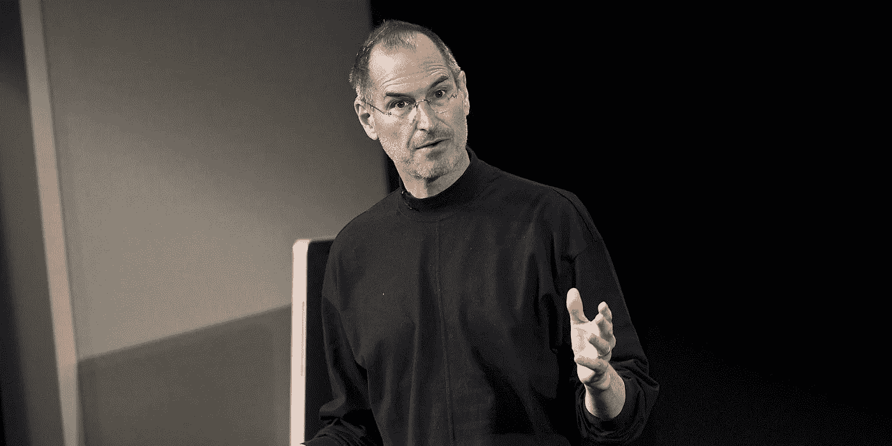
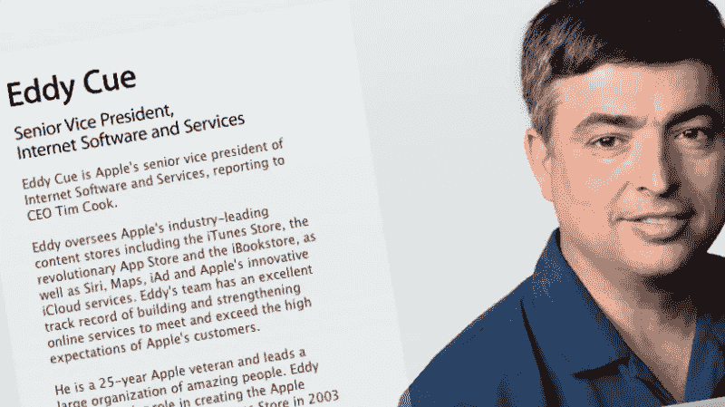
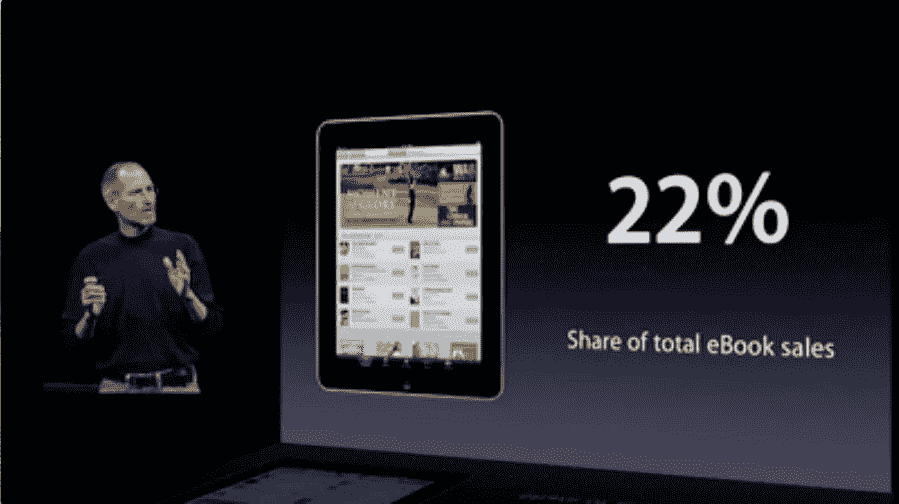

# 史蒂夫·乔布斯如何与詹姆斯·默多克谈判

> 原文：<https://medium.com/hackernoon/how-steve-jobs-negotiated-with-james-murdoch-715bfe8f85a0>

## 法庭文件揭示了已故苹果首席执行官如何在电子书定价上赢得新闻集团的支持。

美国政府针对苹果公司的价格垄断诉讼将于下月在纽约开庭审理。在开庭日期之前，[美国发布了电子邮件](https://www.documentcloud.org/documents/702951-email-exchange-between-steve-jobs-and-james.html)，声称显示苹果是“[的主谋](http://www.nytimes.com/2013/05/15/technology/us-now-paints-apple-as-ringmaster-in-its-lawsuit-on-e-book-price-fixing.html?_r=0)，与一些已经解决该案件的美国最大的出版商合谋设定虚高的电子书价格。

—这个故事帮助我在 [Waydev](https://waydev.co) 艰难地谈判，我希望它也能帮助你。

这些电子邮件大多是在诉讼的背景下阅读的，但它们也提供了苹果和新闻集团这两家强大公司的领导人之间高风险谈判的非凡视角。它们开始时相距甚远，但在五天的时间里，苹果当时的首席执行官史蒂夫·乔布斯成功地将新闻集团首席执行官鲁珀特·默多克的儿子拉到了自己的身边。

乔布斯是一个出了名的精明的谈判者，他总能赢得这类战斗。在图书出版商出现之前，有电影业。在此之前，音乐唱片公司。但是大多数谈判都被隐藏了起来。以下是上周发布的电子邮件以及一些背景情况；拼写和语法从原作中保留了下来。

**新闻集团的开场动作**

那是 2010 年 1 月 22 日，一个星期五的早上。苹果公司正准备在下周发布其最新产品，一款传闻已久的平板电脑。iPad 的部分吸引力应该是可以在其上消费的大量媒体，但美国最大的出版商之一哈珀柯林斯公司拒绝签署在苹果 iTunes 商店销售其电子书的协议。

苹果 iTunes 和 App Store 的负责人埃迪·库伊(Eddy Cue)拜访哈珀柯林斯及其母公司新闻集团(News Corp)的高管时，就涉及到了这些问题。哈珀柯林斯首席执行官布莱恩·莫瑞在当天晚些时候发给库伊的一封电子邮件中传达了那次会面的实质内容。它详细说明了出版商在谈判中的开价，离 iPad 发布还有五天时间。

> 艾迪，
> 
> 谢谢你今天早上再次光临。我们已经讨论了这个提议，我想确保你有一份哈珀柯林斯愿意在你的时间范围内完成的交易的概要。
> 
> 1.定价:我们需要在合同中规定的层级之外，根据每个标题灵活定价。我们将尽最大努力达到我们讨论的等级。
> 
> 2.最惠国待遇(最惠国待遇):如果哈珀柯林斯和苹果在某本书的消费价格上有分歧，哈珀柯林斯需要有能力通过其他支持更高价格的代理商提供该书。
> 
> 3.佣金:为了让经济学为我们和我们的作者服务，我们需要一个较低的新版本佣金。我们认为，30%的佣金将导致更多的作者要求推迟电子书的出版时间，这一结果对苹果或哈珀柯林斯来说是行不通的。
> 
> 4.新的发布窗口:我们需要在代理窗口上有灵活性。我们认为，如果一个或多个大型零售商不转向代理模式，这个窗口应该是 6 个月而不是 12 个月。
> 
> Leslie 将发给 Kevin 一份反映这些要点的合同，如果你希望在这些条款上取得进展的话。
> 
> 谢谢布莱恩

这些条款永远不会被苹果接受，苹果已经成功地与哈珀柯林斯的竞争对手签署了协议，如企鹅(培生的一个部门)和西蒙舒斯特(维亚康姆的一部分)。这些交易将允许苹果将新电子书的价格定在 12.99 美元——比亚马逊当时的典型价格高出 3 美元——并从每笔销售中抽取 30%的分成。

但是 HarperCollins 希望有自己定价的自由，并担心每本 12.99 美元的电子书会损害其在新 iPad 和 Kindle 上的销售。它也不想放弃 30%。为了支持其立场，新闻集团高管詹姆斯·默多克(James Murdoch)将默里的电子邮件转发给了苹果当时的首席执行官史蒂夫·乔布斯(Steve Jobs)，并附上了以下说明。那天还是星期五。

> 史蒂夫，
> 
> 谢谢你今天早些时候的电话，还有上周的时间。
> 
> 我与布莱恩·莫瑞和乔恩·米勒(时任新闻集团数字媒体负责人)谈过，布莱恩今天会给艾迪发一封短信。我想我现在能处理这件事了。简而言之——我们希望能够与苹果达成一些协议——但是有一些合理的担忧。
> 
> 经济学很简单。[亚马逊] Kindle 付给我们批发价 13 美元，售价 9.99。一位作者从一本精装书的销售中获得 4.2 美元，从 Kindle 电子书的销售中获得 3.3 美元。
> 
> [这封邮件的一部分被法院编辑了。]
> 
> 基本上——一本书的全部假设收益(不包括原材料和分销成本)归苹果公司所有，而不是出版商或作品的创作者。
> 
> 另一个大问题是阻碍之一。如果我们不能就一本书的合理价格达成一致，那么你的团队的提议将限制我们在其他地方出售这本书，即使价格更高。对我们来说，这只是一座太远的桥。
> 
> 此外，我们担心定价过高——许多电子书都是 9.99 美元。前六个月佣金较低(比如 10[%])的新发布窗口将使我们能够更好地为苹果客户服务。我们想做那件事。
> 
> 在布莱恩给艾迪的信中有更多的信息。我们概述了我们能做的交易。
> 
> 如果你愿意，周末任何时候都可以打电话或写信来讨论。
> 
> 我在英国(所以比加拿大早八个小时)。我家的电话号码被修改了。我定期检查电子邮件。
> 
> 史蒂夫，毫无疑问，在所有领域(电视、工作室、书籍和报纸)，我们更愿意与苹果合作。但是我们，以及与我们一起制作、写作、编辑和以其他方式制作这一切的合作伙伴，对公平定价有自己的看法，并且非常关心我们未来的灵活性。我希望我们能想出一个办法，如果不是现在或者赶在你们的发布会之前，那么也许在将来。
> 
> JRM 最好

**乔布斯在**挖人

乔布斯不愿意妥协。他在同一天给默多克发了这封回信，辩称亚马逊的定价不可持续，会让人们认为电子书很便宜。乔布斯还提醒默多克苹果的巨大影响力——“超过 1.2 亿的客户有信用卡记录。”他似乎在说，你需要我们胜过我们需要你。

> 詹姆斯，
> 
> 一些需要考虑的想法(如果我们能保守这个秘密，我会很感激):
> 
> 1.像亚马逊这样的公司以低于成本或没有合理利润的价格分销电子书的商业模式是不可持续的。随着电子书成为一个更大的业务，分销商将需要至少获得少量利润，你也会希望这样，以便他们投资于基础设施，营销等业务的未来。
> 
> 2.所有主要出版商都告诉我们，亚马逊新版本 9.99 美元的价格正在侵蚀客户对其产品的价值认知，他们不希望这种做法在新版本中继续下去。
> 
> 3.苹果公司提议给出一本书的成本收益，不包括原材料、分销、剩余、资本成本、坏账等。，给客户，而不是苹果。这就是为什么一个新版本的定价会是 12.99 美元，而不是 16.99 美元甚至更高。苹果不想从发行音乐、电影等产品中赚取更多的利润。
> 
> 4.每个新版本 9 美元应该代表出版商的毛利润中性商业模式。我们没有要求他们少赚钱。对于艺术家来说，给他们和现在一样的版税，给出版商一样的利润，就像给他们所有人发一封信，告诉他们你为电子书支付了更高的比例一样简单。他们不会难过。
> 
> 5.分析师估计，亚马逊在 18 个多月内售出了超过 100 万台 Kindles(亚马逊从未说过)。在发售的前几周，我们的新设备销量将超过所有 Kindles 的销量。如果你坚持使用亚马逊、索尼等。，你可能会坐在主流电子书革命的边缘。
> 
> 6.客户将需要一个端到端的解决方案，这意味着一个在线书店，可以携带书籍，用信用卡处理交易，并将书籍无缝地交付到他们的设备上。到目前为止，只有两家公司展示了交易量显著的在线商店——苹果和亚马逊。苹果的 iTunes 商店和 App Store 拥有超过 1.2 亿的信用卡客户，下载了超过 120 亿件产品。这是将电子书业务扩展成对出版商重要的东西所需的在线资产类型。
> 
> 所以，没错，每一个新版本的售价约为 9 美元，低于亚马逊目前支付的 12.5 美元左右。但目前的情况是不可持续的，也不是建立电子书业务的坚实基础。
> 
> [这封邮件的一部分被法院编辑了。]
> 
> 苹果是目前唯一一家有能力产生重大影响的公司，我们已经和 6 家大出版商中的 4 家签约了。一旦我们对第二梯队的出版商开放，我们将有大量的书籍提供。我们希望他们中有 HC。
> 
> 感谢您的倾听。
> 
> 史蒂夫(男子名)

**默多克开始弯腰**

第二天下午，也就是 1 月 23 日，默多克做出了回应。乔布斯明确表示苹果不会让步。默多克正要表示哈珀柯林斯会。他提出了两个可能的妥协方案，然后指出新闻集团和苹果正在多个方面进行谈判。“在接下来的几个月或几周内，是否值得全面考虑这些遗留问题能否得到解决？”默多克写道。iPad 发布还有四天。

> 史蒂夫，
> 
> 我认为问题的关键在于我们可以灵活地以你不喜欢的价格在其他地方提供产品。
> 
> 如果我们可以向您提供在您的定价结构( 50%)，这是否会让您感到足够舒适？
> 
> 我认为，我们更担心的是其他地方产品的绝对滞销，以及我们将定价权让给苹果，而不是我们对价格的实际讨价还价。
> 
> 我没有直接与慧聪分享这一点，所以这只是假设。但是，如果你愿意接受供应商可以利用其他渠道(价格不会对你不利)，并保证通过苹果获得大量产品，或许我可以与慧聪网达成一些共识。
> 
> 请让我知道。
> 
> 另一个问题:我们的团队现在有四个讨论领域(与我们的产品相关):书籍、美国视频、国际视频和报纸。在不同的成熟阶段，对我们来说，这些讨论都围绕着让我们的产品广泛可用的愿望，以及让您的产品和我们的产品对我们的客户更具吸引力。似乎我们在每一个问题上都遇到了“要么接受，要么放弃”的问题，可以预见的是，到目前为止，我们还没有真正建立起能够推动事情向前发展的伙伴关系。
> 
> 在接下来的几个月或几周内，是否值得全面考虑这些遗留问题能否得到解决？很明显，苹果已经成为一个吸引全球众多客户的平台。作为一家核心的创新公司，NWS(新闻集团)应该更多地与苹果合作，我认为苹果可以在全球范围内与 NWS 合作，比我们今天任何一方都要多。
> 
> JRM 最好

**乔布斯全力以赴**

随着默多克表示哈珀柯林斯愿意妥协，乔布斯施加了更大的压力。“在我看来，慧聪有以下选择，”他在第二天早上，即 1 月 24 日周日给默多克的回复中写道。乔布斯概述了三个严峻的选择。他说，接受我们的条件，否则祝亚马逊好运。“也许我错过了一些东西，但我看不到任何其他的选择，”乔布斯写道，几乎是在鼓励默多克抛弃苹果。“你呢？”

> 詹姆斯，
> 
> 我们的建议确实根据每本书的精装价格设定了电子书零售价格的上限。我们这样做的原因是，根据我们在网上销售大量内容的经验，我们认为定价高于 12.99 美元或 14.99 美元的电子书市场不可能成功。见鬼，亚马逊以 9.99 美元出售这些书，谁知道呢，也许他们是对的，我们甚至会在 12.99 美元失败。但是我们愿意按我们提出的价格试一试。我们不愿意尝试更高的价格，因为我们很确定我们都会失败。
> 
> 在我看来，慧聪有以下选择:
> 
> 1.和苹果一起，看看我们是否能在 12.99 美元和 14.99 美元之间创造一个真正的主流电子书市场。
> 
> 2.继续用亚马逊 9.99 美元。短期内你会赚更多的钱，但是中期内亚马逊会告诉你他们会支付你 9.99 美元的 70%。他们也有股东。
> 
> 3.从亚马逊拿回你的书。如果没有办法让顾客购买你的电子书，他们就会去偷。这将是盗版的开始，一旦开始，将无法停止。相信我，我亲眼见过这种事。
> 
> 也许我错过了什么，但我没有看到任何其他的选择。你知道吗？
> 
> 问候，
> 史蒂夫

## 周二，在 iPad 发布的前一天，哈珀柯林斯同意了苹果的条件。这位出版商的电子书与新平板电脑一起被收录在 1 月 27 日发布的 iBookstore 中，现已售出超过 1 亿部。

原文：<http://www.theatlantic.com/business/archive/2013/05/the-steve-jobs-emails-that-show-how-to-win-a-hard-nosed-negotiation/276136/>

> [黑客中午](http://bit.ly/Hackernoon)是黑客如何开始他们的下午。我们是 [@AMI](http://bit.ly/atAMIatAMI) 家庭的一员。我们现在[接受投稿](http://bit.ly/hackernoonsubmission)并乐意[讨论广告&赞助](mailto:partners@amipublications.com)机会。
> 
> 如果你喜欢这个故事，我们推荐你阅读我们的[最新科技故事](http://bit.ly/hackernoonlatestt)和[趋势科技故事](https://hackernoon.com/trending)。直到下一次，不要把世界的现实想当然！

